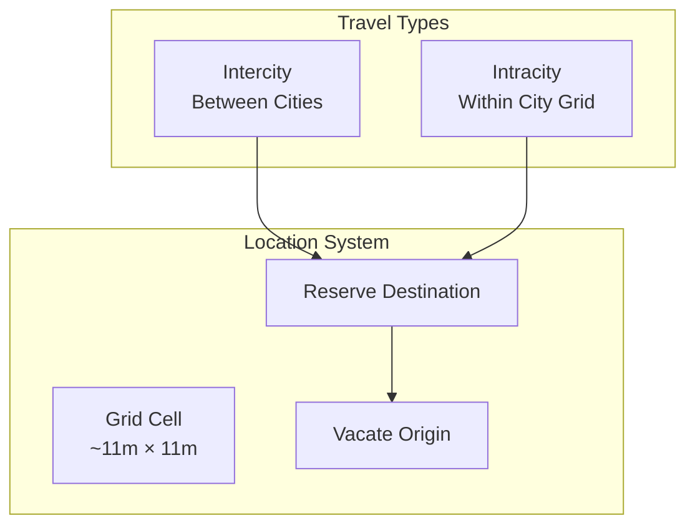
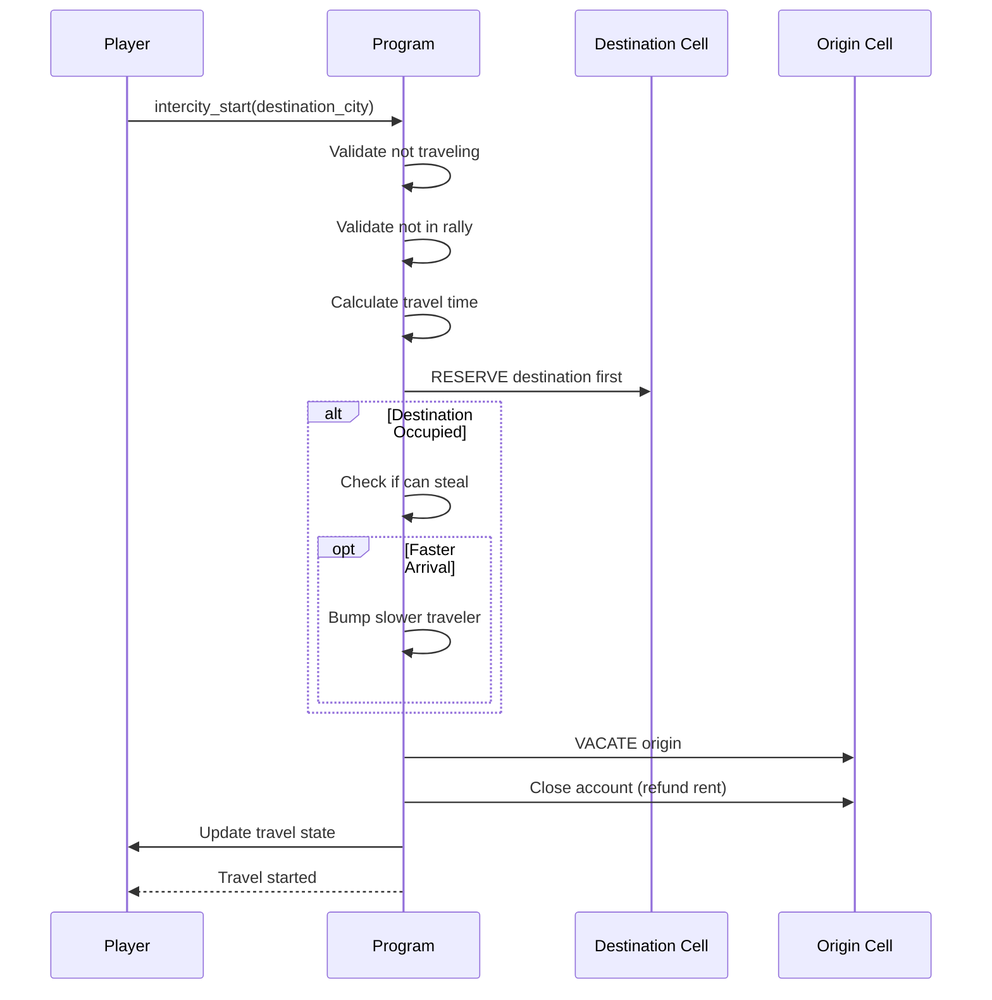
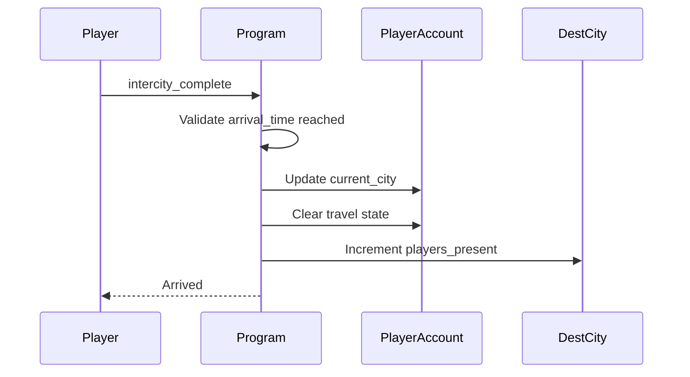
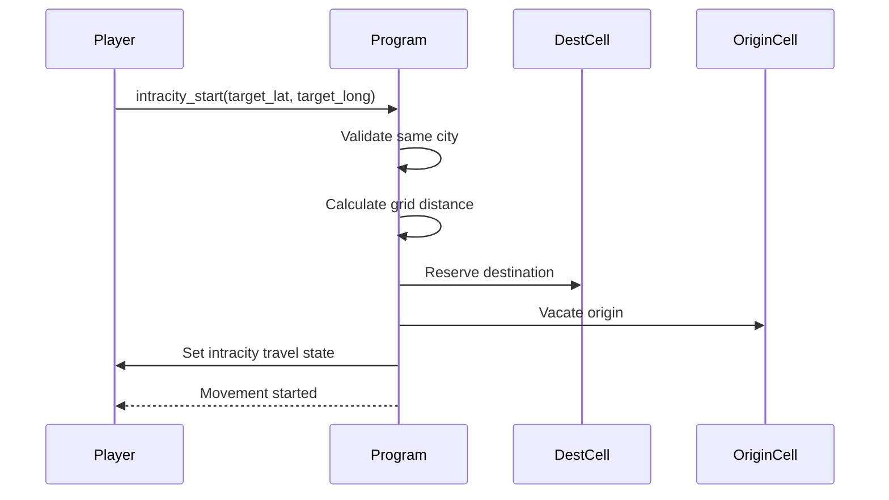
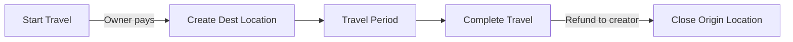

# Travel System

> Movement between and within cities, location reservation, and speed-based claiming.

## System Overview

The Travel System handles player movement across the game world. It uses a **grid-based location system** with ~11 meter cells and a **reservation-before-vacate** pattern to prevent race conditions.



## Instructions

| ID | Instruction | Description |
|----|-------------|-------------|
| 30 | `intercity_start` | Begin travel to another city |
| 31 | `intercity_complete` | Arrive at destination city |
| 32 | `intercity_cancel` | Cancel travel, return to origin |
| 33 | `intercity_teleport` | Instant travel (costs gems) |
| 34 | `speedup` | Speed up travel time |
| 40 | `intracity_start` | Move within city grid |
| 41 | `intracity_complete` | Arrive at grid cell |

[Source: processor/travel/](../../../programs/novus_mundus/src/processor/travel/)

---

## Grid System

### Cell Size

The world uses a grid where each cell is approximately **11 meters × 11 meters**:

```
Grid Precision: 10,000 (4 decimal places)
Cell Size: 0.0001 degrees ≈ 11.1 meters
```

### Coordinate Conversion

```rust
// Convert world coordinate to grid
grid_coord = round(world_coord × 10000)

// Convert grid back to world (cell center)
world_coord = grid_coord / 10000
```

### Adjacent Cells

Each cell has 8 adjacent neighbors:

```
┌───┬───┬───┐
│NW │ N │NE │
├───┼───┼───┤
│ W │ X │ E │
├───┼───┼───┤
│SW │ S │SE │
└───┴───┴───┘
```

---

## LocationAccount

Each occupied grid cell has a LocationAccount:

```
LocationAccount (92 bytes):
├── grid_lat: i32          // Grid latitude
├── grid_long: i32         // Grid longitude
├── city_id: u16           // Parent city
├── bump: u8               // PDA bump
├── occupant_type: u8      // 0=none, 1=player, 2=encounter
├── occupant: Pubkey       // Who/what occupies this cell
├── occupied_since: i64    // Arrival timestamp
├── location_creator: Pubkey // Receives rent refund
└── reserved_arrival_time: i64 // For traveling occupants
```

**Seeds:** `["location", city_id, grid_lat, grid_long]`

### Occupant Types

| Type | Value | Description |
|------|-------|-------------|
| None | 0 | Cell is empty |
| Player | 1 | Player occupies cell |
| Encounter | 2 | PvE enemy at location |

---

## Intercity Travel

### Starting Travel

**Instruction:** `30 - intercity_start`



### Reserve-Before-Vacate Pattern

The key innovation is **reserving the destination before vacating the origin**:

1. **Reserve Destination** - Claim the destination cell (or steal it)
2. **Vacate Origin** - Release the origin cell
3. **Update State** - Set player's travel state

This prevents race conditions where two players try to claim the same cell.

### Speed-Based Claiming

If a destination cell is occupied by a **traveling** player, a faster traveler can **steal** the reservation:

```
can_steal = destination.is_traveling &&
            my_arrival_time < destination.reserved_arrival_time
```

When stealing occurs:
1. Original traveler's journey is **reversed**
2. They travel back to their origin city
3. Return time = proportional to progress made

### Travel Time Calculation

```
distance_km = haversine(origin_lat, origin_long, dest_lat, dest_long)

base_speed_kmh = theme_travel_speed  // From game config

// Apply bonuses
subscription_bonus = tier_travel_speed_bonus_bps
research_bonus = research_travel_speed_bps  // From TravelSpeed research

effective_speed = base_speed × (1 + subscription_bonus/10000) × (1 + research_bonus/10000)

base_time_seconds = (distance_km / effective_speed) × 3600

// Apply time-of-day bonus
time_multiplier = get_time_multiplier(time_of_day, ActivityType::Traveling)
final_time = base_time_seconds / time_multiplier
```

### Completing Travel

**Instruction:** `31 - intercity_complete`



### Cancelling Travel

**Instruction:** `32 - intercity_cancel`

Returns player to origin city:

```
return_time = elapsed_time  // Takes as long to return as already traveled
```

### Teleportation

**Instruction:** `33 - intercity_teleport`

Instant travel for gems:

```
gem_cost = 500 + (distance_km × 10)  // Base + distance factor
```

---

## Intracity Travel

### Starting Movement

**Instruction:** `40 - intracity_start`

Move to a specific grid cell within the current city:



### Movement Speed

Intracity movement is much faster than intercity:

```
distance_meters = grid_distance × 11  // Each cell ≈ 11m
speed_mps = 5  // ~5 m/s walking speed
time_seconds = distance_meters / speed_mps
```

### Completing Movement

**Instruction:** `41 - intracity_complete`

Updates player's grid coordinates within the city.

---

## Travel State in PlayerAccount

```
PlayerAccount travel fields:
├── travel_type: u8           // 0=none, 1=intercity, 2=intracity
├── origin_city: u16          // Where travel started
├── destination_city: u16     // Where going
├── departure_time: i64       // When left
├── arrival_time: i64         // When arriving
├── travel_speed_locked: u16  // Effective speed (for cancel calc)
│
├── // Current location
├── current_city: u16
├── current_lat: f64          // Actual coordinates
└── current_long: f64
```

### Travel Type Enum

| Type | Value | Description |
|------|-------|-------------|
| None | 0 | Not traveling |
| Intercity | 1 | Between cities |
| Intracity | 2 | Within city |

---

## Time-of-Day Bonuses

Travel speed varies by time of day (based on location's longitude):

| Time of Day | Travel Multiplier |
|-------------|------------------|
| Morning (6-12) | 1.1x faster |
| Afternoon (12-18) | 1.0x normal |
| Evening (18-22) | 0.9x slower |
| Night (22-6) | 0.8x slowest |

This creates strategic timing decisions for long journeys.

---

## Travel Restrictions

Players cannot start travel when:

| Condition | Restriction |
|-----------|-------------|
| Already traveling | Must complete/cancel first |
| In active rally | Must leave rally first |
| On expedition | Must complete expedition first |
| Has reinforcements out | Must recall first |

---

## Speedup System

**Instruction:** `34 - speedup`

Reduce remaining travel time:

| Tier | Time Reduction | Cost |
|------|----------------|------|
| 1 | 50% | 50 gems/minute |
| 2 | 75% | 100 gems/minute |

```
remaining_minutes = (arrival_time - now) / 60
minutes_reduced = remaining_minutes × reduction_percent
gem_cost = minutes_reduced × gems_per_minute
```

---

## Encounter Blocking

Players **cannot travel to encounter-occupied cells**. They must attack from an adjacent cell:

```
if destination.occupant_type == ENCOUNTER {
    return Err(CellOccupied);
}
```

---

## Client Integration

### Check Travel Status

```javascript
function getTravelStatus(player) {
  if (player.travelType === 0) {
    return { status: 'stationary', city: player.currentCity };
  }

  const now = Date.now() / 1000;
  const remaining = player.arrivalTime - now;

  if (remaining <= 0) {
    return {
      status: 'arrived',
      canComplete: true,
      destination: player.destinationCity
    };
  }

  const total = player.arrivalTime - player.departureTime;
  const elapsed = now - player.departureTime;
  const progress = elapsed / total;

  return {
    status: 'traveling',
    type: player.travelType === 1 ? 'intercity' : 'intracity',
    origin: player.originCity,
    destination: player.destinationCity,
    progress: progress,
    remainingSeconds: remaining,
    canSpeedup: true,
    speedupCost: calculateSpeedupCost(remaining)
  };
}
```

### Calculate Travel Time

```javascript
function estimateTravelTime(origin, destination, player, gameEngine) {
  const distance = haversine(
    origin.latitude, origin.longitude,
    destination.latitude, destination.longitude
  );

  const baseSpeed = gameEngine.themeTravelSpeeds[gameEngine.currentTheme];

  // Apply bonuses
  const subBonus = gameEngine.subscriptionTiers[player.tier].travelSpeedBonusBps;
  const researchBonus = player.researchTravelSpeedBps || 0;

  const effectiveSpeed = baseSpeed *
    (1 + subBonus / 10000) *
    (1 + researchBonus / 10000);

  const baseTime = (distance / effectiveSpeed) * 3600;

  // Apply time-of-day
  const timeOfDay = getTimeOfDay(Date.now(), origin.longitude);
  const multiplier = getTravelMultiplier(timeOfDay);

  return Math.floor(baseTime / multiplier);
}
```

### Display Journey Progress

```javascript
function renderJourneyProgress(player) {
  const status = getTravelStatus(player);

  if (status.status === 'traveling') {
    const progressPercent = Math.floor(status.progress * 100);
    const eta = formatDuration(status.remainingSeconds);

    return `
      Traveling: ${status.origin} → ${status.destination}
      Progress: ${progressPercent}%
      ETA: ${eta}
      [Cancel] [Speedup: ${status.speedupCost} gems]
    `;
  }

  if (status.status === 'arrived') {
    return `
      Arrived at ${status.destination}!
      [Complete Journey]
    `;
  }

  return `At ${status.city}`;
}
```

---

## Account Rent Flow

Location accounts are created and destroyed dynamically:



- **Creation:** Owner pays rent when reserving destination
- **Refund:** Original creator receives rent when location is closed
- This enables rent-neutral location cycling

---

*Travel is the bridge between opportunities. Move wisely, time strategically, and you'll always be where the action is.*

---

Next: [Heroes](./heroes.md)
