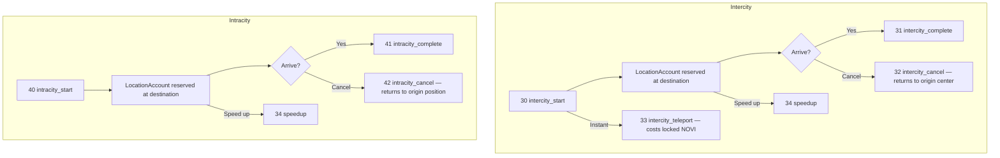
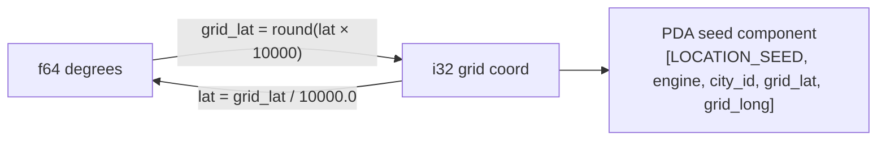
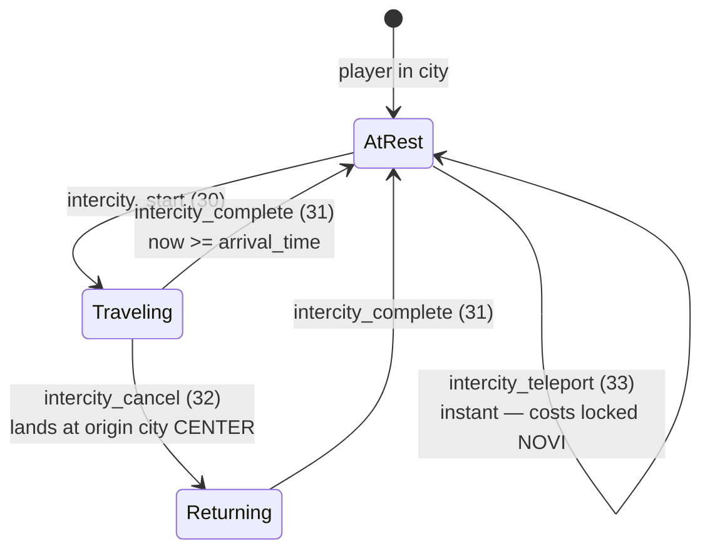
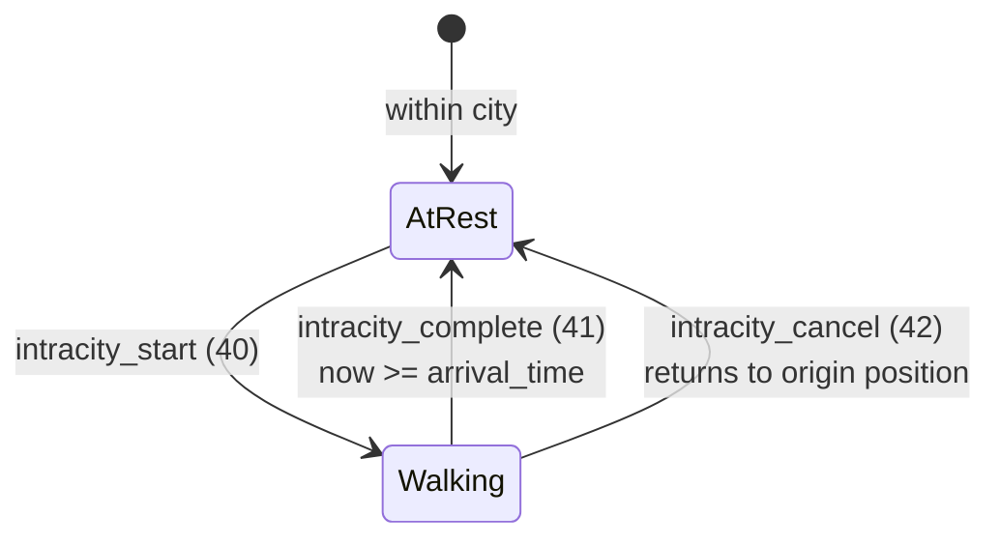

# Travel System

> GPS-coordinate movement between and within cities, with location cell reservation and speed-based displacement.

## Overview

Players occupy **grid cells** (≈11 m × 11 m at `GRID_PRECISION = 10000`) and must physically navigate the world using real-world coordinates. Two travel modes exist: **intercity** (between cities) and **intracity** (within the same city). Both modes use a reserve-first, vacate-second protocol to prevent race conditions. Stables (BuildingType `TransportBay`) is required for all travel.



## Instructions

| ID | Instruction | Description |
|----|-------------|-------------|
| 30 | `intercity_start` | Begin traveling to another city |
| 31 | `intercity_complete` | Arrive at destination city |
| 32 | `intercity_cancel` | Abort intercity travel; return to origin city center |
| 33 | `intercity_teleport` | Instant city jump (costs locked NOVI) |
| 34 | `speedup` | Reduce remaining travel time (gems) |
| 40 | `intracity_start` | Begin moving within the same city |
| 41 | `intracity_complete` | Arrive at destination coordinates |
| 42 | `intracity_cancel` | Abort intracity travel; return to origin position |

[Source: processor/travel/](../../../programs/novus_mundus/src/processor/travel/)

---

## Location Cell System

Every occupied entity (player or encounter) holds a `LocationAccount` PDA representing its grid cell.



```rust
pub struct LocationAccount {
    pub account_key: u8,           // 1  — AccountKey::Location
    pub game_engine: Address,      // 32 — kingdom scope
    pub grid_lat: i32,             // 4  — coordinate * 10000, rounded
    pub grid_long: i32,            // 4  — coordinate * 10000, rounded
    pub city_id: u16,              // 2
    pub bump: u8,                  // 1
    pub occupant_type: u8,         // 1  — 0=none, 1=player, 2=encounter
    pub occupant: Address,         // 32 — entity occupying this cell
    pub occupied_since: i64,       // 8
    pub location_creator: Address, // 32 — receives rent refund when account closes
    pub reserved_arrival_time: i64,// 8  — 0 if already arrived; > 0 while traveling
}
// Total: 92 bytes
// PDA: [LOCATION_SEED, game_engine, city_id_le2, grid_lat_le4, grid_long_le4]
```

**Coordinate precision:** `grid_lat = round(lat * 10000)` → ≈11 m per cell.

**Player coordinates** (`player.current_lat`, `player.current_long`) are `f64` degrees. Do **not** confuse with the `i32` grid coordinates stored in `LocationAccount`.

**Speed-based stealing:** if a challenger would arrive at an occupied cell before the current traveling occupant (`challenger_arrival_time < reserved_arrival_time`), the challenger can steal the reservation. The bumped player's travel is reversed; they must call cancel to finalize.

[Source: state/location.rs](../../../programs/novus_mundus/src/state/location.rs)

---

## Intercity Travel

### `intercity_start` (ID 30)

**Instruction data (10 bytes):**
```
[0..2]  destination_city_id: u16 (LE)
[2..6]  dest_grid_lat:        i32 (LE)  — destination cell in target city
[6..10] dest_grid_long:       i32 (LE)
```

**Guards:**
- Stables (TransportBay) building level ≥ 1
- Player not already traveling
- Player not in active rally
- `destination_city_id != player.current_city`
- Destination coordinates inside destination city radius
- Destination terrain is passable

**Protocol:**
1. Reserve destination cell (create or claim `LocationAccount`).
2. If cell occupied by a still-traveling player and challenger arrives sooner: bump that player, reverse their travel.
3. Close origin `LocationAccount` (rent refunded to owner).
4. Set `player.travel_type = Intercity`, `origin_city`, `destination_city`, `departure_time`, `arrival_time`, `travel_speed_locked`.
5. Persist `player.traveling_to_lat` / `player.traveling_to_long` from destination grid (needed for cancel to re-derive the reserved PDA).

**Speed formula:**
```
base_speed_kmh   = gameplay_config.theme_travel_speeds_kmh[current_theme]
subscription_bps = subscription_tiers[effective_tier].travel_speed_bonus_bps
effective_speed  = base_speed_kmh * (1 + subscription_bps / 10000)

base_travel_time = (distance_km / effective_speed) * 3600  // seconds
time_adjusted    = base_travel_time / time_of_day_travel_multiplier
travel_time      = time_adjusted * (10000 - stables_reduction_bps) / 10000
```

### Intercity Travel State



### `intercity_complete` (ID 31)

No instruction data.

**Guards:** `player.travel_type == Intercity` and `now >= player.arrival_time`.

**Actions:**
- Validates destination `LocationAccount` is owned by this player.
- Sets `player.current_city`, `current_lat`, `current_long` to reserved cell center.
- Clears travel fields (`travel_type = None`, `arrival_time = -1`).
- Increments destination city `players_present`.
- Grants XP for distance traveled (`XpAction::CompleteTravel { distance_km }`).
- Recalculates hero location-synergy buffs if heroes are locked (requires hero NFT + template accounts appended).

### `intercity_cancel` (ID 32)

No instruction data.

**Actions:**
1. Close destination `LocationAccount` (or skip if already stolen by another player).
2. Create a return `LocationAccount` at **origin city center** (`LocationAccount::to_grid(city.latitude/longitude)`).
3. Reverse travel: `destination_city = origin_city`, new `arrival_time = now + return_travel_time`.
4. Return travel time is proportional to progress made: `return_time = elapsed_fraction * total_duration`.
5. Increment `origin_city.players_present` (player is heading back).

> **Note:** Cancel always lands the player at the **origin city center**, not their exact pre-departure position. The occupied-cell at that center may already be taken; cancel will fail with `CellOccupied` if so.

[Source: processor/travel/intercity_start.rs](../../../programs/novus_mundus/src/processor/travel/intercity_start.rs)
[Source: processor/travel/intercity_cancel.rs](../../../programs/novus_mundus/src/processor/travel/intercity_cancel.rs)
[Source: processor/travel/intercity_complete.rs](../../../programs/novus_mundus/src/processor/travel/intercity_complete.rs)

---

## Intercity Teleport — `intercity_teleport` (ID 33)

Instant travel to another city. Lands at the **city center** grid cell.

**Instruction data (2 bytes):**
```
[0..2] destination_city_id: u16 (LE)
```

**Guards:**
- `EXT_INVENTORY` extension unlocked
- Stables (TransportBay) building level ≥ 10
- Not already traveling
- Not in active rally
- `player.locked_novi >= adjusted_cost`

**Cost formula:**
```
segments      = ceil(distance_km / 100)
base_cost     = gameplay_config.teleport_base_cost
              + gameplay_config.teleport_cost_per_100km * segments
adjusted_cost = base_cost * economic_config.cost_multiplier / 10000
```

Cost is deducted from **locked NOVI** (`player.locked_novi`), not gems or cash.

> **Old-docs trap:** Earlier documentation incorrectly stated teleport costs "gems". The Rust processor deducts `player.locked_novi` exclusively.

**Actions:**
- Vacates origin cell.
- Creates or claims destination city center `LocationAccount` (`reserved_arrival_time = 0` — already arrived).
- Sets `player.current_city`, `current_lat`, `current_long` immediately (no travel state set).
- Updates city player counts.
- Recalculates hero location-synergy buffs if heroes provided.

> **Known Issue (M-09):** There is no time-based cooldown between teleports. Economic throttling (locked NOVI cost + Stables Lv10 gate + EXT_INVENTORY) mitigates abuse but a true cooldown is not enforced. The code comment documents this as a TODO requiring a `last_teleport_at` field on `PlayerAccount`.

[Source: processor/travel/intercity_teleport.rs](../../../programs/novus_mundus/src/processor/travel/intercity_teleport.rs)

---

## Intracity Travel

### `intracity_start` (ID 40)

**Instruction data (16 bytes):**
```
[0..8]  destination_lat:  f64 (LE)
[8..16] destination_long: f64 (LE)
```

The destination is expressed as **float degrees**, not grid integers. The program converts to grid internally via `LocationAccount::to_grid(lat)`.

**Guards:**
- Stables (TransportBay) building level ≥ 1
- Not already traveling
- Not in active rally
- Destination within city bounds and on passable terrain

**Speed formula:**
```
base_speed    = gameplay_config.intracity_travel_speed_kmh   // from config, not the constant
subscription_bps = subscription_tiers[effective_tier].travel_speed_bonus_bps
effective_speed  = base_speed * (1 + subscription_bps / 10000)

base_time      = haversine(current, dest) / effective_speed * 3600
time_adjusted  = base_time / time_of_day_travel_multiplier
travel_time    = time_adjusted * (10000 - stables_reduction_bps) / 10000
```

> **Note:** The constant `INTRACITY_WALKING_SPEED_KMH = 5.0` exists in `constants.rs` but the processor reads `gameplay_config.intracity_travel_speed_kmh` from `GameEngine`. They may differ if the DAO has overridden the config.

**Actions:**
- Reserve destination cell (same steal logic as intercity).
- Close origin `LocationAccount`.
- Set `player.travel_type = Intracity`, `traveling_to_lat`, `traveling_to_long`, travel timestamps.

### Intracity Travel State



### `intracity_complete` (ID 41)

No instruction data. Guards: `travel_type == Intracity` and `now >= arrival_time`.

Updates `player.current_lat` / `current_long` to the reserved cell center. Clears travel fields. No XP granted for intracity travel.

### `intracity_cancel` (ID 42)

No instruction data.

Returns player to their **pre-departure position** (stores `traveling_to_lat/long` as the return target for the bumped-player case). Reserve a `LocationAccount` at the origin coordinates. Return travel time is proportional to progress made.

---

## Speed-Up Travel — `speedup` (ID 34)

Applies to both intercity and intracity travel.

**Instruction data (1 byte):**
```
[0] speedup_tier: u8   // 1 or 2 only
```

| Tier | Time Remaining After | Gem Cost Multiplier |
|------|---------------------|---------------------|
| 1 | 50% of remaining time | 1× |
| 2 | 25% of remaining time | 2× |

```
remaining_minutes = ceil((arrival_time - now) / 60)
gems_per_minute   = gameplay_config.gem_cost_per_minute_speedup
base_cost         = remaining_minutes * gems_per_minute
total_cost        = base_cost * tier_cost_multiplier (1 or 2)

new_remaining_seconds = remaining_seconds * time_multiplier (0.5 or 0.25)
player.arrival_time   = now + new_remaining_seconds
```

> **Note:** The destination `LocationAccount.reserved_arrival_time` is **not** updated by speedup. The location account retains the original estimated arrival. Clients should use `player.arrival_time` as the authoritative ETA.

[Source: processor/travel/speedup.rs](../../../programs/novus_mundus/src/processor/travel/speedup.rs)

---

## Distance & Coordinate Formulas

```
// Haversine great-circle distance (logic/location.rs)
a = sin²(Δlat/2) + cos(lat1) * cos(lat2) * sin²(Δlong/2)
c = 2 * asin(sqrt(a))
distance_km = 6371 * c

// Grid conversion
grid_lat  = round(lat  * 10000)   // i32
grid_long = round(long * 10000)   // i32
cell_center_lat  = grid_lat  / 10000.0
cell_center_long = grid_long / 10000.0
```

[Source: logic/location.rs](../../../programs/novus_mundus/src/logic/location.rs)

---

## Client Integration

```typescript
import {
  buildIntercityStartIx,
  buildIntercityTeleportIx,
  buildIntracityStartIx,
  buildSpeedupIx,
} from "@novus-mundus/sdk";

// Start intercity travel
const ix30 = buildIntercityStartIx({
  playerAccount: playerPDA,
  owner:         wallet.publicKey,
  originCity:    originCityPDA,
  destinationCity: destCityPDA,
  gameEngine:    gameEnginePDA,
  originLocation: originLocationPDA,
  destinationLocation: destLocationPDA,
  originCreatorRefund: wallet.publicKey,
  estateAccount: estatePDA,
  data: {
    destinationCityId: destCityId,    // u16
    destGridLat:       destGridLat,   // i32 = round(lat * 10000)
    destGridLong:      destGridLong,  // i32 = round(long * 10000)
  },
});

// Teleport (instant, costs locked NOVI)
const ix33 = buildIntercityTeleportIx({
  playerAccount: playerPDA,
  owner:         wallet.publicKey,
  originCity:    originCityPDA,
  destinationCity: destCityPDA,
  gameEngine:    gameEnginePDA,
  originLocation: originLocationPDA,
  destinationLocation: destLocationPDA,
  estateAccount: estatePDA,
  destinationCityId: destCityId,  // u16
});

// Speed up — tier 1 (50% time remaining)
const ix34 = buildSpeedupIx({
  playerAccount: playerPDA,
  owner:         wallet.publicKey,
  gameEngine:    gameEnginePDA,
  speedupTier:   1,
});
```

---

Next: [Heroes](./heroes.md)
