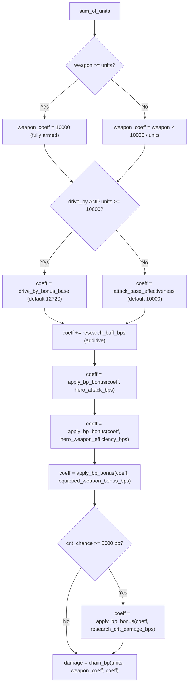
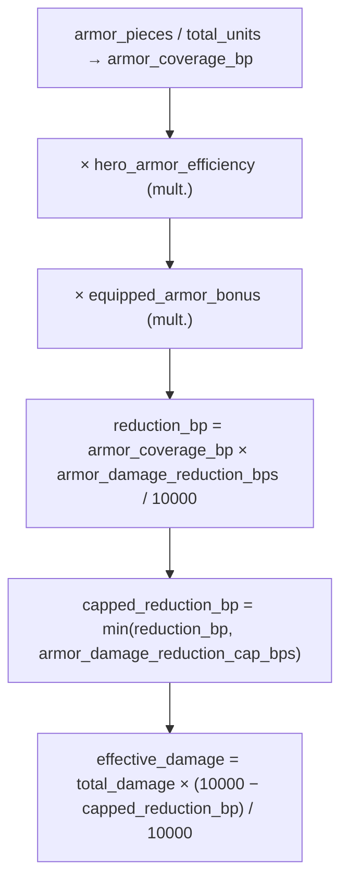
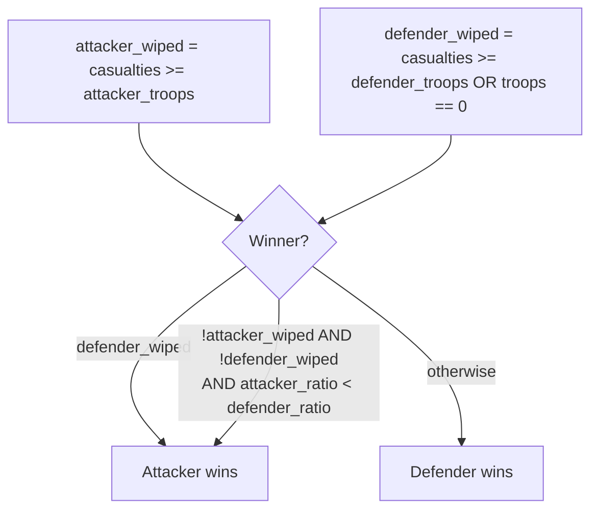
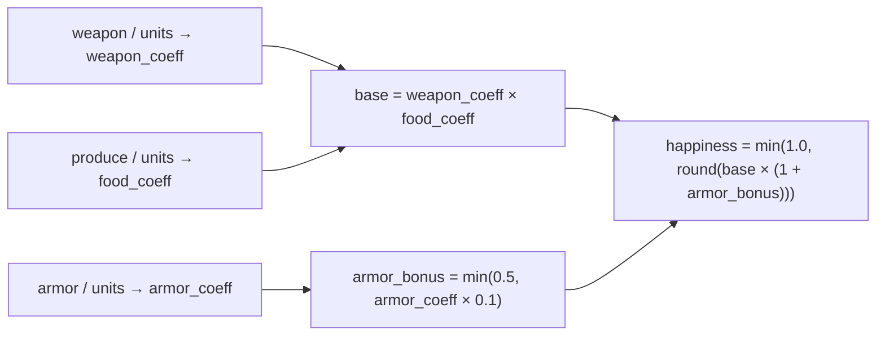
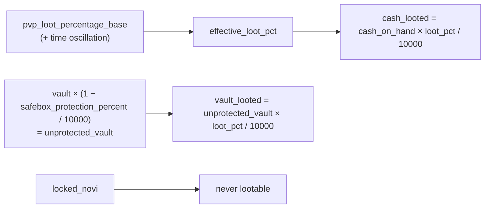
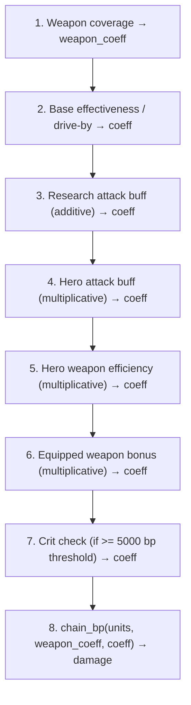

# Combat Math

> Full derivation of every damage formula, armor mechanic, weapon coverage coefficient,
> deterministic crit, unit loss distribution, abandonment, and weapon loot used by
> the Novus Mundus program.  All constants and field names are taken directly from Rust
> source; the `GameplayConfig` struct controls every tunable parameter at runtime via
> DAO governance.

---

## 1. Scope

| Function | File |
|---|---|
| `calculate_damage_output` | `logic/combat.rs` |
| `inflict_damage` | `logic/combat.rs` |
| `resolve_weapon_combat` | `logic/combat.rs` |
| `calculate_abandonment` | `logic/combat.rs` |
| `update_happiness_defensive` | `logic/combat.rs` |
| Safe-math primitives | `logic/safe_math.rs` |
| Config fields | `state/game_engine.rs` — `GameplayConfig` |

[Source: programs/novus_mundus/src/logic/combat.rs](../../../programs/novus_mundus/src/logic/combat.rs)

---

## 2. Safe-Math Primitives

All arithmetic in the program is done with these helpers — **no `u128`** anywhere.

| Helper | Formula | Notes |
|---|---|---|
| `apply_bp(v, m)` | `v × m / 10000` | `m` in basis points |
| `apply_bp_bonus(v, b)` | `v × (10000 + b) / 10000` | `b: u16` bonus bp |
| `apply_bp_penalty(v, p)` | `v × (10000 − p) / 10000` | `p: u16` penalty bp |
| `chain_bp(v, [m₁, m₂, …])` | sequential `apply_bp` each step | interleaves ×/÷ to stay in u64 |
| `mul_div(a, b, c)` | `a × b / c`; falls back to `(a/c)×b` if overflow | overflow-safe |

[Source: programs/novus_mundus/src/logic/safe_math.rs](../../../programs/novus_mundus/src/logic/safe_math.rs)

---

## 3. Damage Output — `calculate_damage_output`

### 3.1 Step-by-Step Pipeline



```
Input:  sum_of_units: u64
        weapon: u64
        drive_by: bool          (requires ≥10 000 units for the bonus to apply)
        gameplay_config fields  (all basis points unless noted)
        research_buff_bps: u16
        research_crit_chance_bps: u16
        research_crit_damage_bps: u16
        hero_attack_bps: u16
        hero_weapon_efficiency_bps: u16
        hero_crit_chance_bps: u16
        equipped_weapon_bonus_bps: u16

Output: damage: u64
```

#### Step 1 — Weapon Coverage Coefficient (`weapon_coeff`)

```
if weapon >= sum_of_units:
    weapon_coeff = 10000            // fully armed → 100 % efficiency

else:
    weapon_coeff = weapon × 10000 / sum_of_units   // proportional, no u128
```

Represents what fraction of units carry a weapon; a fully unarmed force deals 0 damage.

#### Step 2 — Base Effectiveness Coefficient (`coeff`)

```
if drive_by AND sum_of_units >= 10 000:
    coeff = gameplay_config.drive_by_bonus_base     // default 12720 (√φ = 1.272 ×)

else:
    coeff = gameplay_config.attack_base_effectiveness  // default 10000 (1.0 ×)
```

> Note: Time-of-day multipliers (longitude + unix clock) are applied **at the processor
> layer** (`attack_player.rs` / `attack_encounter.rs`), not inside this function.

#### Step 3 — Research Buff (additive)

```
coeff = coeff + research_buff_bps
```

Additive to the base; a 3000 bp research buff on a normal attack raises effectiveness
from 10000 to 13000 (1.30 ×).

#### Step 4 — Hero Attack Buff (multiplicative)

```
if hero_attack_bps > 0:
    coeff = apply_bp_bonus(coeff, hero_attack_bps)
    // coeff × (10000 + hero_attack_bps) / 10000
```

#### Step 5 — Hero Weapon Efficiency Buff (multiplicative)

```
if hero_weapon_efficiency_bps > 0:
    coeff = apply_bp_bonus(coeff, hero_weapon_efficiency_bps)
```

#### Step 6 — Equipped Weapon Bonus (multiplicative)

```
if equipped_weapon_bonus_bps > 0:
    coeff = apply_bp_bonus(coeff, equipped_weapon_bonus_bps)
```

#### Step 7 — Deterministic Crit

```
total_crit_chance = research_crit_chance_bps + hero_crit_chance_bps

if total_crit_chance >= 5000:                    // ≥50 % combined → always crit
    coeff = apply_bp_bonus(coeff, research_crit_damage_bps)
```

**Critical hits are skill-based, not probabilistic.** Investing enough in research and
hero crit chance crosses the 5000 bp threshold, guaranteeing every attack crits.
`research_crit_chance_bps` and `hero_crit_chance_bps` are additive toward the threshold.

#### Step 8 — Final Damage (`chain_bp`)

```
damage = chain_bp(sum_of_units, [weapon_coeff, coeff])
       = sum_of_units × weapon_coeff / 10000 × coeff / 10000
```

`chain_bp` interleaves multiplication and division so no intermediate value can exceed
`u64::MAX`.

### 3.2 Example

| Variable | Value |
|---|---|
| `sum_of_units` | 50 000 |
| `weapon` | 50 000 (fully armed) |
| `weapon_coeff` | 10000 |
| `drive_by` | false |
| Base coeff (`attack_base_effectiveness`) | 10000 |
| `research_buff_bps` | 2000 |
| coeff after research | 12000 |
| `hero_attack_bps` | 1000 (10 %) |
| coeff after hero | 13200 |
| `hero_weapon_efficiency_bps` | 500 (5 %) |
| coeff after weapon eff | 13860 |
| `equipped_weapon_bonus_bps` | 0 |
| `research_crit_chance_bps + hero_crit_chance_bps` | 4000 (< 5000, no crit) |
| Final damage | 50000 × 10000/10000 × 13860/10000 = **69 300** |

[Source: programs/novus_mundus/src/logic/combat.rs:330–399](../../../programs/novus_mundus/src/logic/combat.rs)

---

## 4. Armor & Damage Distribution — `inflict_damage`

### 4.1 Armor Coverage and Reduction



```
Input:  unit_1, unit_2, unit_3: u64   (defender's three unit tiers)
        armor_pieces: u64
        total_damage: f64
        gameplay_config.armor_damage_reduction_bps: u32   // e.g. 500 = 5 %/coverage point
        gameplay_config.armor_damage_reduction_cap_bps: u32 // e.g. 5000 = max 50 % reduction
        hero_armor_efficiency_bps: u16
        equipped_armor_bonus_bps: u16
```

```
total_units = unit_1 + unit_2 + unit_3

// Base armor coverage in basis points
armor_coverage_bp = armor_pieces × 10000 / total_units

// Hero armor efficiency (multiplicative)
if hero_armor_efficiency_bps > 0:
    armor_coverage_bp = apply_bp_bonus(armor_coverage_bp, hero_armor_efficiency_bps)

// Equipped armor bonus (multiplicative)
if equipped_armor_bonus_bps > 0:
    armor_coverage_bp = apply_bp_bonus(armor_coverage_bp, equipped_armor_bonus_bps)

// Damage reduction in basis points
reduction_bp = apply_bp(armor_coverage_bp, armor_damage_reduction_bps)
             = armor_coverage_bp × armor_damage_reduction_bps / 10000

// Cap the reduction
capped_reduction_bp = min(reduction_bp, armor_damage_reduction_cap_bps)

// Effective damage after armor
effective_damage = total_damage × (10000 − capped_reduction_bp) / 10000
```

> If `total_units == 0` or `armor_pieces == 0` then `effective_damage = total_damage`.

### 4.2 Damage Distribution

The `effective_damage` is split across the three unit tiers using config fractions
(stored as basis points; divided by 10000 to get the fractional share).

| Config field | Role | Default comment |
|---|---|---|
| `damage_unit_1_percent` | Share allocated to unit_1 (e.g. infantry) | e.g. 2000 = 20 % |
| `damage_unit_2_percent` | Share allocated to unit_2 (e.g. cavalry) | e.g. 3000 = 30 % |
| `damage_unit_3_percent` | Share allocated to unit_3 (e.g. artillery) | e.g. 5000 = 50 % |

```
pct_1 = damage_unit_1_percent / 10000.0
pct_2 = damage_unit_2_percent / 10000.0
pct_3 = damage_unit_3_percent / 10000.0

damage_1 = effective_damage × pct_1   (only if unit_1 > 0)
damage_2 = effective_damage × pct_2   (only if unit_2 > 0)
damage_3 = effective_damage × pct_3   (only if unit_3 > 0)
```

### 4.3 Redistribution When Unit Tiers Are Absent

When a defender has no units of a given tier, their damage share is redistributed to
surviving tiers using config fractions.

| Condition | Redistribution |
|---|---|
| `unit_1 == 0` | `damage_2 += eff × pct_1 × redis_unit1_to_unit2`<br>`damage_3 += eff × pct_1 × redis_unit1_to_unit3` |
| `unit_1 == 0 AND unit_2 == 0` | `damage_3 += effective_damage` (all to unit_3) |
| `unit_2 == 0 AND unit_3 == 0` | `damage_1 += effective_damage` (all to unit_1) |
| `unit_3 == 0` | `damage_1 += eff × pct_3 × redis_unit3_to_unit1`<br>`damage_2 += eff × pct_3 × redis_unit3_to_unit2` |

Redistribution config fields (basis points):

| Field | Example | Meaning |
|---|---|---|
| `damage_redistrib_unit1_to_unit2` | 4000 | 40 % of unit_1's share goes to unit_2 when unit_1 absent |
| `damage_redistrib_unit1_to_unit3` | 6000 | 60 % of unit_1's share goes to unit_3 when unit_1 absent |
| `damage_redistrib_unit3_to_unit1` | 3000 | 30 % of unit_3's share goes to unit_1 when unit_3 absent |
| `damage_redistrib_unit3_to_unit2` | 7000 | 70 % of unit_3's share goes to unit_2 when unit_3 absent |

### 4.4 Applying Casualties

```
unit_3 = unit_3 - floor(damage_3)     // saturating_sub
unit_2 = unit_2 - floor(damage_2)     // saturating_sub
unit_1 = unit_1 - floor(damage_1)     // saturating_sub

returns (unit_1, unit_2, unit_3)
```

The f64 damage values are truncated to u64 before subtraction; fractional casualties
are discarded.

[Source: programs/novus_mundus/src/logic/combat.rs:424–514](../../../programs/novus_mundus/src/logic/combat.rs)

---

## 5. Weapon Combat Resolution — `resolve_weapon_combat`

### 5.1 Constants

| Constant | Value | Role |
|---|---|---|
| `WEAPON_LOOT_RATE_BPS` | 6000 | 60 % of dropped enemy weapons looted by winner |
| `ARMORY_RAID_WITH_OPERATIVES_BPS` | 2500 | 25 % of stored weapons raided when defender has operatives |
| `ARMORY_RAID_UNDEFENDED_BPS` | 5000 | 50 % of stored weapons raided when no garrison |
| `DAMAGE_PER_SIEGE_WEAPON` | 500 | Units of damage that consume one siege weapon |
| `SIEGE_CAPTURE_RATE_BPS` | 8000 | 80 % of stored siege captured when defender fully wiped |

[Source: programs/novus_mundus/src/constants.rs](../../../programs/novus_mundus/src/constants.rs)

### 5.2 Winner Determination



```
attacker_wiped  = attacker_casualties >= attacker_troops
defender_wiped  = defender_casualties >= defender_troops OR defender_troops == 0

attacker_won = defender_wiped
               OR (NOT attacker_wiped AND NOT defender_wiped
                   AND attacker_loss_ratio < defender_loss_ratio)

// where loss_ratio = casualties × 10000 / total_troops
```

### 5.3 Siege Consumption

Siege weapons are consumed proportionally to damage dealt, **not** to casualties:

```
siege_consumed = min(attacker_weapons.siege,
                     attacker_damage_dealt / DAMAGE_PER_SIEGE_WEAPON)
                 // integer division, no remainder

attacker_siege_after_firing = attacker_weapons.siege - siege_consumed
```

### 5.4 Weapon Drops

Weapon drops are scaled by the casualty ratio of each side:

```
attacker_casualty_ratio_bps = min(10000, attacker_casualties × 10000 / attacker_troops)
defender_casualty_ratio_bps = min(10000, defender_casualties × 10000 / defender_troops)

attacker_dropped.melee  = attacker_weapons.melee  × attacker_casualty_ratio_bps / 10000
attacker_dropped.ranged = attacker_weapons.ranged × attacker_casualty_ratio_bps / 10000
attacker_dropped.siege  = attacker_siege_after_firing × attacker_casualty_ratio_bps / 10000

defender_dropped = defender_equipped_weapons × defender_casualty_ratio_bps / 10000
                   // (only when defender_troops > 0)
```

### 5.5 Attacker Win Outcome

```
// Loot from fallen garrison (normal combat)
if defender_troops > 0:
    looted = defender_dropped × WEAPON_LOOT_RATE_BPS / 10000   // 60 %

// Fallback: no garrison → raid armory directly
else:
    raid_rate = ARMORY_RAID_WITH_OPERATIVES_BPS  if has_operatives  // 25 %
              = ARMORY_RAID_UNDEFENDED_BPS       otherwise           // 50 %
    looted = defender_stored_weapons × raid_rate / 10000

// Siege bonus: capture stored siege if garrison fully wiped
siege_captured = defender_stored_weapons.siege × SIEGE_CAPTURE_RATE_BPS / 10000
                 (only when defender_wiped)

// Attacker returns home with:
attacker_weapons_returned.melee  = attacker_weapons.melee  - attacker_dropped.melee
attacker_weapons_returned.ranged = attacker_weapons.ranged - attacker_dropped.ranged
attacker_weapons_returned.siege  = attacker_siege_after_firing - attacker_dropped.siege

attacker_weapons_looted = { looted.melee, looted.ranged, looted.siege + siege_captured }
defender_weapons_looted = {}   // defender lost
```

### 5.6 Defender Win Outcome

```
looted_from_attacker = attacker_dropped × WEAPON_LOOT_RATE_BPS / 10000   // 60 %

// Attacker retrieves surviving weapons (nothing if fully wiped)
if attacker_wiped:
    attacker_weapons_returned = {}
else:
    attacker_weapons_returned.melee  = attacker_weapons.melee  - attacker_dropped.melee
    attacker_weapons_returned.ranged = attacker_weapons.ranged - attacker_dropped.ranged
    attacker_weapons_returned.siege  = attacker_siege_after_firing - attacker_dropped.siege

attacker_weapons_looted = {}
defender_weapons_looted = looted_from_attacker
```

### 5.7 Loot Rate Summary

| Scenario | Rate | Basis |
|---|---|---|
| Winner loots dropped enemy weapons | 60 % | `WEAPON_LOOT_RATE_BPS = 6000` |
| Armory raid (no garrison, with operatives) | 25 % | `ARMORY_RAID_WITH_OPERATIVES_BPS = 2500` |
| Armory raid (no garrison, no operatives) | 50 % | `ARMORY_RAID_UNDEFENDED_BPS = 5000` |
| Siege storage captured (garrison wiped) | 80 % | `SIEGE_CAPTURE_RATE_BPS = 8000` |

[Source: programs/novus_mundus/src/logic/combat.rs:83–212](../../../programs/novus_mundus/src/logic/combat.rs)

---

## 6. Abandonment — `calculate_abandonment`

Abandonment is entirely deterministic — no randomness.  The rate is selected by
happiness tier and applied to the total unit count.

### 6.1 Happiness Tier Selection

| Happiness | Config field | Example |
|---|---|---|
| ≥ 0.75 | `abandon_rate_happy` | 50 bp = 0.5 % |
| ≥ 0.50 | `abandon_rate_content` | 750 bp = 7.5 % |
| ≥ 0.25 | `abandon_rate_unhappy` | 80 bp = 0.8 % |
| < 0.25 | `abandon_rate_miserable` | 100 bp = 1.0 % |

> The example values in comments show `unhappy < content` — the config may be tuned
> such that `content` is intentionally higher than `unhappy` (e.g., medium happiness
> triggers more desertion than very-unhappy soldiers who remain loyal out of necessity).
> Actual values are DAO-controlled at runtime.

### 6.2 Formula

```
base_rate = abandon_rate_<tier>    // in basis points (u32)

abandoned = apply_bp(sum_of_units, base_rate)
          = sum_of_units × base_rate / 10000
```

[Source: programs/novus_mundus/src/logic/combat.rs:224–243](../../../programs/novus_mundus/src/logic/combat.rs)

---

## 7. Happiness — `update_happiness_defensive`

Defensive unit happiness drives the abandonment rate and is recalculated after every
supply change.



```
weapon_coeff = weapon / sum_of_units          // integer division (f32 cast)
food_coeff   = produce / sum_of_units
armor_coeff  = armor / sum_of_units

base_coeff   = weapon_coeff × food_coeff

// Armor morale bonus: +10 % per coverage point, capped at 50 %
armor_bonus  = min(0.5, armor_coeff × 0.1)

total_coeff  = base_coeff × (1.0 + armor_bonus)

happiness    = min(1.0, round(total_coeff))   // libm::roundf
```

A fully supplied garrison (`weapon == units`, `produce == units`) with no armor yields
`happiness = 1.0 × 1.0 × 1.0 = 1.0`.  Adding armor beyond 5 coverage points provides
no further happiness boost.

Operative happiness (`update_happiness_operative`) uses only `produce / sum_of_units`
rounded to the nearest integer, then clamped to 1.0.

[Source: programs/novus_mundus/src/logic/combat.rs:252–288](../../../programs/novus_mundus/src/logic/combat.rs)

---

## 8. Encounter Stamina Costs

PvE (encounter) attacks consume stamina from the attacker.  Costs are fixed constants
indexed by encounter level range.

```rust
pub const ENCOUNTER_STAMINA_COSTS: [u64; 6] = [10, 25, 50, 100, 250, 500];
```

Index 0 covers low-level encounters; index 5 covers the highest tier.

[Source: programs/novus_mundus/src/constants.rs](../../../programs/novus_mundus/src/constants.rs)

---

## 9. PvP Loot (Cash/Vault)

Cash loot from PvP is driven by `GameplayConfig` fields:



```
pvp_loot_percentage_base:   1000 bp  (10 % base)
pvp_loot_oscillation_amp:    500 bp  (±5 % time-based variance at processor layer)

unprotected_vault = vault × (10000 − safebox_protection_percent) / 10000
                  // safebox_protection_percent default 7500 = 75 % protected

cash_looted = unprotected_vault × effective_loot_pct / 10000
```

The effective loot percentage is computed at the processor layer using the base plus
a time-of-day oscillation.  Locked NOVI is **never** lootable regardless of safebox
settings.

[Source: programs/novus_mundus/src/state/game_engine.rs:444–447](../../../programs/novus_mundus/src/state/game_engine.rs)
[Source: programs/novus_mundus/src/processor/combat/attack_player.rs](../../../programs/novus_mundus/src/processor/combat/attack_player.rs)

---

## 10. Encounter Instant Cash (PvE)

When attacking a PvE encounter, the attacker earns instant cash equal to 7× the
actual damage dealt, plus siege weapons are consumed based on damage:

```
// a fixed 7× multiplier (inline literal in attack_encounter.rs, not a named constant)
instant_cash = actual_damage × 7

siege_consumed = ceil(actual_damage / DAMAGE_PER_SIEGE_WEAPON)
               = ceil(actual_damage / 500)
```

On encounter death an `EncounterDeathLoot` account is created; the encounter's
`LocationAccount` is closed.

[Source: programs/novus_mundus/src/processor/combat/attack_encounter.rs](../../../programs/novus_mundus/src/processor/combat/attack_encounter.rs)

---

## 11. Deployment Caps

Unit deployment into attacks is bounded by the vehicle constraint:

```
gameplay_config.vehicle_capacity: u64   // e.g. 5 units per vehicle

max_deployable = player.vehicles × vehicle_capacity
```

Additionally, for drive-by attacks the bonus applies **only** when
`sum_of_units >= 10 000`; below that threshold the drive-by flag has no effect and
normal attack effectiveness is used.

[Source: programs/novus_mundus/src/state/game_engine.rs:420](../../../programs/novus_mundus/src/state/game_engine.rs)

---

## 12. Encounter Stats Scaling

Encounter health and defense scale linearly with level:

```
health  = health_per_level × encounter.level
          // gameplay_config.health_per_level: u64 (e.g. 1000)

defense = defense_per_level × encounter.level   // in basis points
          // gameplay_config.defense_per_level: u32 (e.g. 50 = 0.5 %/level)
          // hard cap: min(computed_defense, 9000)   // 90 % max
```

Encounter loot scales exponentially with level:

```
loot = encounter_base_<resource>[rarity] × level^loot_level_scaling_exp / loot_level_scaling_divisor
       // gameplay_config.loot_level_scaling_exp: f32 (e.g. 1.5)
       // gameplay_config.loot_level_scaling_divisor: u32 (e.g. 10)
```

[Source: programs/novus_mundus/src/state/game_engine.rs:485–488](../../../programs/novus_mundus/src/state/game_engine.rs)
[Source: programs/novus_mundus/src/state/encounter.rs](../../../programs/novus_mundus/src/state/encounter.rs)

---

## 13. Complete Buff Stacking Reference



| Step | Buff Source | Stack Type | Applied to |
|---|---|---|---|
| 1 | Weapon coverage | Proportional ratio | Units → `weapon_coeff` |
| 2 | Base effectiveness / Drive-by | Config constant | `coeff` |
| 3 | Research attack buff | Additive bp | `coeff` |
| 4 | Hero attack buff | Multiplicative bp | `coeff` |
| 5 | Hero weapon efficiency buff | Multiplicative bp | `coeff` |
| 6 | Equipped weapon bonus | Multiplicative bp | `coeff` |
| 7 | Crit (if ≥5000 bp threshold) | Multiplicative bp | `coeff` |
| 8 | `chain_bp([weapon_coeff, coeff])` | Sequential apply | Final damage |

For armor/defense:

| Step | Source | Stack Type | Applied to |
|---|---|---|---|
| 1 | Raw armor pieces / total_units | Ratio | `armor_coverage_bp` |
| 2 | Hero armor efficiency | Multiplicative bp | `armor_coverage_bp` |
| 3 | Equipped armor bonus | Multiplicative bp | `armor_coverage_bp` |
| 4 | `armor_damage_reduction_bps` | Linear per coverage | `reduction_bp` |
| 5 | `armor_damage_reduction_cap_bps` | Hard cap | `capped_reduction_bp` |

---

Next: [Time Multipliers](./time-multipliers.md)
