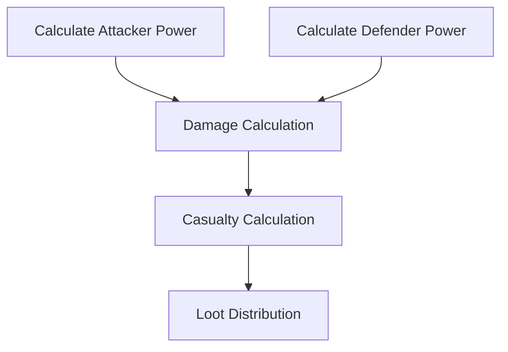
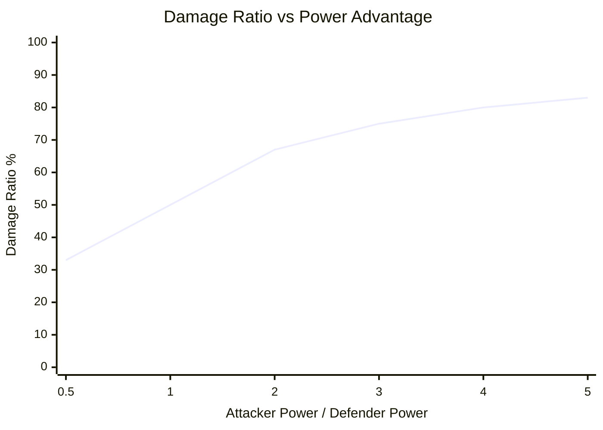

# Combat Math

> Damage calculations, casualty formulas, and loot distribution in Novus Mundus.

## Combat Resolution Overview

Combat in Novus Mundus is **fully deterministic** - no randomness is involved. Given identical inputs, the outcome is always the same.



---

## Power Calculation

### Base Power Formula

```
attack_power = Σ(unit_count × unit_attack_stat)
defense_power = Σ(unit_count × unit_defense_stat)
```

### Unit Stats

| Unit Type | Attack | Defense | HP |
|-----------|--------|---------|-----|
| T1 Operative | 10 | 5 | 100 |
| T2 Operative | 25 | 15 | 150 |
| T3 Operative | 50 | 30 | 200 |
| Melee Weapon | +20 | +5 | — |
| Ranged Weapon | +30 | 0 | — |
| Siege Weapon | +50 | 0 | — |
| Armor | 0 | +25 | — |
| Vehicle | +10 | +50 | — |

### Equipment Application

Equipment multiplies unit stats:
```
effective_attack = unit_attack × (1 + weapon_bonus/10000)
effective_defense = unit_defense × (1 + armor_bonus/10000)
```

### Buff Application

All buffs are applied multiplicatively in basis points:

```
final_attack = base_attack × (1 + hero_attack_bps/10000)
                          × (1 + research_attack_bps/10000)
                          × (1 + building_attack_bps/10000)
```

**Buff Sources:**
| Source | Typical Range |
|--------|---------------|
| Hero buffs | 500-50,000 bps |
| Research buffs | 100-2,000 bps |
| Building buffs | 100-5,000 bps |
| Equipment | 500-5,000 bps |

[Source: logic/combat.rs](../../../programs/novus_mundus/src/logic/combat.rs)

---

## Damage Formula

### The Core Formula

```
damage_ratio = attacker_power / (attacker_power + defender_power)
damage_dealt = attacker_power × damage_ratio
```

### Why This Formula?

This creates **diminishing returns** on power advantage:

| Power Ratio (A:D) | Damage Ratio | Damage vs Equal |
|-------------------|--------------|-----------------|
| 1:1 | 50% | 1.0x |
| 2:1 | 67% | 1.33x |
| 3:1 | 75% | 1.5x |
| 4:1 | 80% | 1.6x |
| 10:1 | 91% | 1.82x |

**Key insight:** A 4x power advantage only deals 1.6x damage, not 4x. This prevents overwhelming snowball effects.

### Visual Representation



---

## Casualty Calculation

### Casualty Rate

```
total_hp = Σ(unit_count × unit_hp)
casualty_rate = damage_received / total_hp
```

### Applying Casualties

Casualties are distributed proportionally:
```
unit_casualties = unit_count × casualty_rate
```

### Armor Reduction

Armor reduces casualties:
```
final_casualties = base_casualties × (1 - armor_reduction_bps/10000)
```

| Armor Level | Reduction |
|-------------|-----------|
| No armor | 0% |
| Light armor | 10% |
| Medium armor | 20% |
| Heavy armor | 35% |

### Example Combat

**Attacker:**
- 100 T1 Operatives (attack: 1,000, HP: 10,000)
- +20% attack buff (1,200 total)

**Defender:**
- 50 T2 Operatives (defense: 750, HP: 7,500)
- +10% defense buff (825 total)

**Calculation:**
```
damage_ratio = 1200 / (1200 + 825) = 59.3%
damage_to_defender = 1200 × 0.593 = 712

defender_casualty_rate = 712 / 7500 = 9.5%
defender_casualties = 50 × 0.095 = 4.75 → 4 T2 Operatives
```

---

## Loot Calculation

### Loot Percentage

Winners can loot a percentage of defender's resources:

```
power_ratio = attacker_power / (attacker_power + defender_power)
loot_percentage = min(MAX_LOOT_PCT, BASE_LOOT × power_ratio)
```

| Power Advantage | Loot % |
|-----------------|--------|
| Even (1:1) | 25% |
| 2:1 | 33% |
| 3:1 | 37.5% |
| 4:1 | 40% |
| Max | 50% |

### Lootable Resources

| Resource | Max Loot % | Notes |
|----------|------------|-------|
| Cash | 50% | Most lootable |
| Produce | 30% | Moderate |
| Unlocked NOVI | 20% | Hardest to loot |
| Gems | 0% | Never lootable |
| Fragments | 0% | Never lootable |

### Loot Formula

```
cash_looted = defender.cash × min(0.5, loot_percentage)
produce_looted = defender.produce × min(0.3, loot_percentage × 0.6)
novi_looted = defender.locked_novi × min(0.2, loot_percentage × 0.4)
```

[Source: processor/combat/attack_player.rs](../../../programs/novus_mundus/src/processor/combat/attack_player.rs)

---

## Rally Combat

### Combined Power

Rally power is the sum of all participants:

```
rally_attack = Σ participant_attack_power
rally_defense = Σ participant_defense_power
```

### City Defense

```
city_defense = base_defense + garrison_power + reinforcement_power
```

| City Level | Base Defense |
|------------|--------------|
| 1-3 | 10,000 |
| 4-6 | 50,000 |
| 7-9 | 200,000 |
| 10+ | 500,000+ |

### Loot Distribution

Loot is distributed by contribution:

```
player_share = player_power / rally_power
player_loot = total_loot × player_share
```

**Example:**
| Player | Power | Share | Loot |
|--------|-------|-------|------|
| Leader | 50,000 | 40% | 40,000 cash |
| A | 25,000 | 20% | 20,000 cash |
| B | 37,500 | 30% | 30,000 cash |
| C | 12,500 | 10% | 10,000 cash |
| **Total** | 125,000 | 100% | 100,000 cash |

[Source: processor/rally/execute.rs](../../../programs/novus_mundus/src/processor/rally/execute.rs)

---

## Encounter Combat

### Encounter Stats

| Tier | HP | Attack | Defense | Retaliation |
|------|-----|--------|---------|-------------|
| Common | 1,000 | 100 | 50 | 10% |
| Uncommon | 5,000 | 300 | 150 | 15% |
| Rare | 20,000 | 800 | 400 | 20% |
| Epic | 100,000 | 2,500 | 1,250 | 25% |

### Damage to Encounter

```
player_damage = player_attack × (player_attack / (player_attack + encounter_defense))
```

### Encounter Retaliation

Encounters fight back:
```
retaliation_damage = encounter_attack × retaliation_rate
player_casualties = retaliation_damage / player_total_hp
```

### Killing Blow

If player damage exceeds remaining HP:
- Encounter is defeated
- Full loot is granted
- Encounter account is closed
- Killer gets bonus rewards

[Source: processor/combat/attack_encounter.rs](../../../programs/novus_mundus/src/processor/combat/attack_encounter.rs)

---

## Critical Hits

### Critical Hit Chance

```
crit_chance = base_crit + hero_crit_bps / 10000
```

Base crit: 5%
Max crit: 25%

### Critical Damage

```
crit_multiplier = 1.5
damage_with_crit = base_damage × crit_multiplier
```

### Determining Crits (Deterministic)

Critical hits are determined by hashing:
```
hash = sha256(attacker_pubkey + defender_pubkey + timestamp)
is_crit = (hash[0] % 100) < (crit_chance × 100)
```

This is deterministic - same inputs always produce same crit result.

---

## Defensive Heroes

### Defensive Buff Application

When a player is attacked, their defensive heroes provide buffs:

```
defense_with_heroes = base_defense × (1 + defensive_hero_bps / 10000)
```

Defensive heroes only apply when **defending**, not attacking.

### Hero Assignment

| Sanctuary Level | Defensive Slots |
|-----------------|-----------------|
| 1-9 | 1 |
| 10-19 | 2 |
| 20 | 2 |

[Source: processor/hero/assign_defensive.rs](../../../programs/novus_mundus/src/processor/hero/assign_defensive.rs)

---

## Combat Summary Table

| Factor | Formula | Range |
|--------|---------|-------|
| Attack Power | Σ(units × stat × buffs) | 100 - 10M |
| Defense Power | Σ(units × stat × buffs) | 100 - 10M |
| Damage Ratio | A / (A + D) | 0% - 100% |
| Casualty Rate | Damage / Total HP | 0% - 100% |
| Loot Rate | min(50%, base × ratio) | 0% - 50% |
| Crit Chance | base + hero buff | 5% - 25% |
| Crit Damage | 1.5× | Fixed |

---

*Combat is chess, not dice. Study your enemy, calculate your odds, and strike with precision.*

---

Next: [Reference - Error Codes](../06-reference/error-codes.md)
