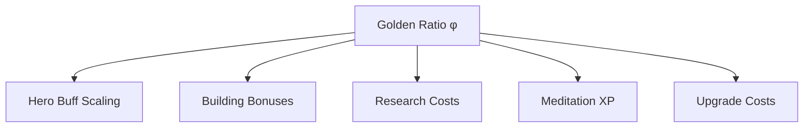
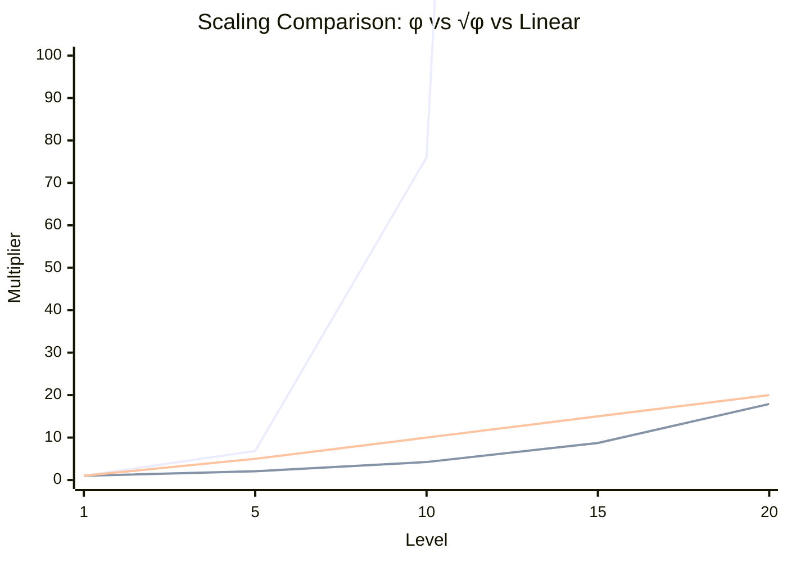

# Phi (φ) Scaling

> The Golden Ratio as the mathematical foundation of Novus Mundus progression.

## The Golden Ratio

The Golden Ratio (φ ≈ 1.618033988749895) appears throughout Novus Mundus as the basis for progression curves. This creates:

- **Aesthetically pleasing** growth curves
- **Balanced** progression that feels rewarding
- **Predictable** scaling for both players and designers

```
φ = (1 + √5) / 2 ≈ 1.618033988749895
√φ ≈ 1.272019649514069
```

## Where φ Appears



---

## Hero Buff Scaling

Hero buffs scale with level using **√φ**:

```
buff_at_level = base_bps × (√φ)^level
```

### Why √φ?

Using √φ instead of φ directly creates gentler curves:
- Level 10: ~7x multiplier (vs ~123x with φ)
- Level 50: ~150x multiplier (vs ~2.5 billion with φ)

This keeps high-level heroes powerful but not game-breaking.

### Growth Table

| Level | Multiplier | 500 base → |
|-------|------------|------------|
| 1 | 1.00× | 500 |
| 2 | 1.27× | 635 |
| 5 | 2.06× | 1,030 |
| 10 | 4.24× | 2,120 |
| 20 | 17.9× | 8,950 |
| 30 | 76.0× | 38,000 |
| 50 | 1,364× | 682,000 |
| 100 | 1,860,498× | 930M |

### Implementation

```rust
pub fn calculate_buff_at_level(base_bps: u64, level: u32) -> u64 {
    // √φ ≈ 1.272019649514069
    // Using fixed-point: 1272019 / 1000000
    let sqrt_phi_num: u64 = 1_272_019;
    let sqrt_phi_den: u64 = 1_000_000;

    let mut result = base_bps;
    for _ in 0..level {
        result = result * sqrt_phi_num / sqrt_phi_den;
    }
    result
}
```

[Source: logic/mod.rs](../../../programs/novus_mundus/src/logic/mod.rs)

---

## Building Bonus Scaling

Building bonuses scale with level using **φ directly**:

```
bonus_at_level = base_bonus × φ^(level-1)
```

### Growth Table

| Level | Multiplier | 100 base → |
|-------|------------|------------|
| 1 | 1.00× | 100 |
| 5 | 6.85× | 685 |
| 10 | 76.0× | 7,600 |
| 15 | 843× | 84,300 |
| 20 | 9,349× | 934,900 |

### Why φ for Buildings?

Buildings have:
- Hard cap at level 20
- Significant resource investment
- Long construction times

Using φ rewards this investment with dramatic bonuses at high levels.

### Implementation

```rust
pub const PHI_NUMER: u64 = 1_618_034;
pub const PHI_DENOM: u64 = 1_000_000;

pub fn phi_scale(base: u64, level: u8) -> u64 {
    if level == 0 { return 0; }

    let mut result = base;
    for _ in 1..level {
        result = result * PHI_NUMER / PHI_DENOM;
    }
    result
}
```

[Source: helpers/estate.rs](../../../programs/novus_mundus/src/helpers/estate.rs)

---

## Research Cost Scaling

Research costs scale with category and tier using φ:

```
cost = base_cost × φ^tier
```

| Category | Base Cost | Tier 5 Cost |
|----------|-----------|-------------|
| Basic | 1,000 | 11,090 |
| Intermediate | 5,000 | 55,450 |
| Advanced | 20,000 | 221,800 |
| Expert | 50,000 | 554,500 |

---

## Meditation XP Requirements

XP required for each meditation level:

```
xp_for_level = base_xp × φ^(level-1)
```

| Level | XP Required | Total XP |
|-------|-------------|----------|
| 1 | 100 | 100 |
| 5 | 685 | 1,755 |
| 10 | 7,600 | 19,750 |
| 20 | 935,000 | 2.43M |

### Diminishing Returns

Higher levels require exponentially more XP, creating natural plateaus where players feel accomplished while still having goals.

[Source: helpers/estate.rs](../../../programs/novus_mundus/src/helpers/estate.rs) - meditation formulas

---

## Upgrade Cost Scaling

Building upgrade costs follow φ progression:

```
upgrade_cost(level) = base_cost × φ^(level-1)
```

### Example: Mansion

| Level | NOVI Cost | Cash Cost | Time |
|-------|-----------|-----------|------|
| 1→2 | 1,000 | 500 | 5 min |
| 5→6 | 6,854 | 3,427 | 34 min |
| 10→11 | 76,013 | 38,006 | 6.3 hr |
| 15→16 | 843,468 | 421,734 | 70 hr |
| 19→20 | 6,765,201 | 3,382,600 | 564 hr |

---

## Visual Comparison



Legend:
- **Blue (φ^n)**: Building bonuses - dramatic growth
- **Orange (√φ^n)**: Hero buffs - moderate growth
- **Green (linear)**: Reference baseline

---

## Design Benefits

### 1. Psychological Appeal

The Golden Ratio appears in nature and art. Humans find φ-based proportions inherently satisfying.

### 2. Balanced Progression

- Early levels are achievable
- Mid levels feel meaningful
- Late levels are aspirational

### 3. Anti-Inflation

Exponential costs absorb currency that would otherwise cause inflation.

### 4. Predictable Math

Both designers and players can calculate expected values:
```
"Level 10 is roughly 75x level 1"
"Each 5 levels is about 10x stronger"
```

---

## Implementation Constants

Key constants in the codebase:

```rust
// Golden Ratio (φ)
pub const PHI_NUMER: u64 = 1_618_034;
pub const PHI_DENOM: u64 = 1_000_000;

// Square Root of φ (√φ)
pub const SQRT_PHI_NUMER: u64 = 1_272_019;
pub const SQRT_PHI_DENOM: u64 = 1_000_000;

// Basis points base
pub const BPS_BASE: u64 = 10_000;
```

[Source: constants.rs](../../../programs/novus_mundus/src/constants.rs)

---

## Practical Examples

### Hero Attack Buff

A hero with 500 base attack buff:
- Level 1: 500 bps (+5%)
- Level 10: 2,120 bps (+21.2%)
- Level 50: 682,000 bps (+6,820%)

### Academy Research Speed

Academy with 100 bps base bonus:
- Level 1: 100 bps (-1% time)
- Level 10: 7,600 bps (-76% time, capped at -75%)
- Level 20: Massively over cap

### Building Upgrade Cost

Sanctuary upgrade from level 10→11:
```
base_cost = 5,000 NOVI
φ^9 = 76.013
cost = 5,000 × 76.013 = 380,065 NOVI
```

---

*The Golden Ratio isn't just mathematics—it's the rhythm of growth that players feel even without seeing the formulas.*

---

Next: [Combat Math](./combat-math.md)
