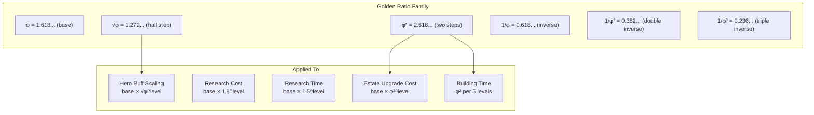
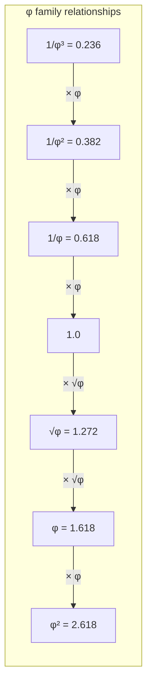
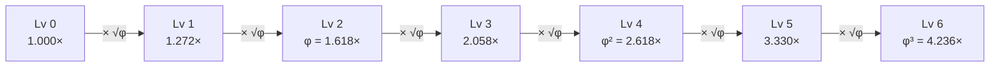
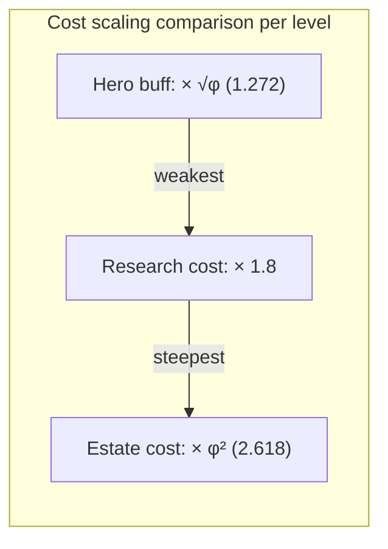
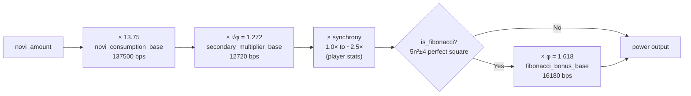
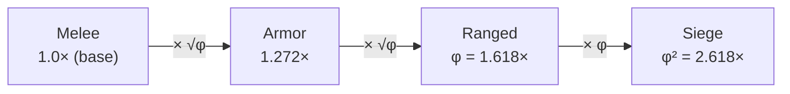

# Phi (φ) Scaling

> The golden ratio as the single mathematical foundation for all progression, cost, and buff scaling in Novus Mundus.

## Overview

Every scaling function in Novus Mundus uses the golden ratio family rather than arbitrary exponents or lookup tables. The result is a self-similar progression curve where relationships between tiers are always φ-multiples of each other.





## Golden Ratio Constants

All constants are `f64` stored in `constants.rs`. They use full irrational precision, converted to integers only at the final output step.

```rust
pub const PHI: f64            = 1.618033988749895;       // φ
pub const GOLDEN_ROOT: f64    = 1.2720196495140689;      // √φ
pub const PHI_SQUARED: f64    = 2.618033988749895;       // φ²
pub const PHI_INVERSE: f64    = 0.6180339887498949;      // 1/φ
pub const PHI_SQUARED_INVERSE: f64 = 0.3819660112501051; // 1/φ²
pub const PHI_CUBED_INVERSE: f64   = 0.2360679774997897; // 1/φ³
```

Key identities:
- `(√φ)² = φ` — every 2 levels equals one golden ratio multiplier
- `φ × (1/φ) = 1` — inverse relationships for diminishing returns
- `φ² = φ + 1` — self-similar scaling for legendary tiers

[Source: constants.rs](../../../programs/novus_mundus/src/constants.rs)

## Hero Buff Scaling

**Formula:** `buff(level) = base × √φ ^ level`

Implemented in `calculate_buff_at_level` → `golden_root_power`:

```rust
pub fn golden_root_power(n: u32) -> f64 {
    if n == 0 { return 1.0; }
    libm::pow(GOLDEN_ROOT, n as f64)
}

pub fn calculate_buff_at_level(base: u64, level: u32) -> u64 {
    let multiplier = golden_root_power(level);
    let result = base as f64 * multiplier;
    if result >= u64::MAX as f64 { u64::MAX } else { result as u64 }
}
```

**Progression table** (base = 1,000):

| Level | Multiplier | Buff Value |
|-------|-----------|------------|
| 0 | 1.000× | 1,000 |
| 1 | √φ = 1.272× | 1,272 |
| 2 | φ = 1.618× | 1,618 |
| 3 | φ√φ = 2.058× | 2,058 |
| 4 | φ² = 2.618× | 2,618 |
| 5 | φ²√φ = 3.330× | 3,330 |
| 6 | φ³ = 4.236× | 4,236 |
| 8 | φ⁴ = 6.854× | 6,854 |
| 10 | φ⁵ = 11.09× | 11,090 |
| 20 | φ¹⁰ = 122.99× | 122,990 |

Every 2 levels exactly multiplies the buff by φ. Every 10 levels multiplies by φ⁵ ≈ 11.09.



[Source: logic/golden_math.rs](../../../programs/novus_mundus/src/logic/golden_math.rs)

## Research Cost Scaling

**Formula:** `cost(level) = base_cost × 1.8 ^ level`

Implemented via `exp_growth` in `safe_math.rs`:

```rust
pub fn exp_growth(base: u64, numerator: u64, denominator: u64, iterations: u32) -> Option<u64> {
    let mut result = base;
    for _ in 0..iterations {
        result = result.checked_mul(numerator)?.checked_div(denominator)?;
    }
    Some(result)
}
// Called as: exp_growth(base_cost, 18, 10, level)
```

**Example** (base = 1,000 NOVI):

| Level | Cost |
|-------|------|
| 1 | 1,800 |
| 5 | 18,896 |
| 10 | 357,047 |
| 15 | 6,746,640 |
| 20 | 127,482,273 |

## Research Time Scaling

**Formula:** `time(level) = base_time × 1.5 ^ level`

Same `exp_growth` function: `exp_growth(base_time, 3, 2, level)`.

**Example** (base = 3,600 seconds = 1 hour):

| Level | Duration |
|-------|----------|
| 1 | 1.5h |
| 5 | 7.6h |
| 10 | 57.7h |
| 15 | 437h |
| 20 | 3,325h |

## Estate Upgrade Cost Scaling

**Formula:** `cost(level) = base_cost × φ² ^ level` = `base_cost × 2.618033... ^ level`

φ² = `PHI_SQUARED` = 2.618033988749895.

This is the steepest scaling in the game — each level costs 2.618× the previous, creating a strong soft cap on building levels.

**Example** (base = 100):

| Level | Cost |
|-------|------|
| 1 | 262 |
| 2 | 685 |
| 3 | 1,793 |
| 5 | 12,289 |
| 10 | 1,509,560 |



## Building Time Scaling

Building construction time scales by φ² per 5 levels. This creates the same exponential character as estate costs but on a coarser level band.

```
time_band(floor) = base_time × φ² ^ floor
where floor = (building_level - 1) / 5
```

## NOVI Consumption Scaling

The `consume_novi_logic` function applies three basis-point multipliers in sequence:



```
base_value = chain_bp(novi_amount, [
    novi_consumption_base,    // default: 137500 bp = 13.75×
    secondary_multiplier_base, // default: 12720  bp = √φ = 1.272×
    synchrony_bp,              // 1.0× to ~2.5× based on player stats
])

if is_fibonacci(novi_amount):
    power = apply_bp(base_value, fibonacci_bonus_base)  // default: 16180 bp = φ = 1.618×
else:
    power = base_value
```

**Default multiplier chain:** `13.75 × 1.272 × synchrony`. For a 1.0 synchrony player consuming 100 NOVI: `100 × 13.75 × 1.272 = 1,749` power.

**Fibonacci bonus:** Consuming a Fibonacci-number amount of NOVI applies an additional φ (1.618×) multiplier. The test `is_fibonacci(n)` uses:
```
n is Fibonacci ⟺ (5n² + 4) or (5n² - 4) is a perfect square
```
Computed in `u128` to prevent overflow. Fibonacci amounts: 1, 2, 3, 5, 8, 13, 21, 34, 55, 89, 144, 233, 377, 610, 987, 1597, 2584, ...

> **Note:** The Fibonacci bonus default is **φ = 1.618× (16180 bps)**, not √φ. Previous documentation that stated √φ as the Fibonacci bonus is incorrect.

[Source: logic/consume.rs](../../../programs/novus_mundus/src/logic/consume.rs)
[Source: logic/fibonacci.rs](../../../programs/novus_mundus/src/logic/fibonacci.rs)
[Source: state/game_engine.rs EconomicConfig](../../../programs/novus_mundus/src/state/game_engine.rs)

## Weapon Cost Ratios (φ-based)

Weapon costs in `EconomicConfig` are differentiated by φ ratios:

| Weapon Type | Cost Ratio | Approximate |
|-------------|-----------|-------------|
| Melee | 1.0× | base |
| Armor | √φ× | 1.272× |
| Ranged | φ× | 1.618× |
| Siege | φ²× | 2.618× |

Combat power in the Arena follows the same pattern: melee = 10, ranged = 16 ≈ φ×10, siege = 26 ≈ φ²×10.



## XP Level Progression

XP required to level up follows a 2.5× exponential:

```rust
xp_required_for_level(level) = 100.0 × 2.5^(level - 2)
```

| Level | XP Required |
|-------|-------------|
| 2 | 100 |
| 3 | 250 |
| 4 | 625 |
| 5 | 1,563 |
| 10 | 38,147 |
| 20 | 9,094,947 |

[Source: logic/progression.rs](../../../programs/novus_mundus/src/logic/progression.rs)

## Basis Points Arithmetic

All integer multiplications use the `safe_math` module which keeps calculations within `u64` without `u128`:

```rust
// apply_bp: value × multiplier_bp / 10000
fn apply_bp(value: u64, multiplier_bp: u64) -> Option<u64>

// chain_bp: apply multiple multipliers sequentially (interleaved ×/)
fn chain_bp(mut value: u64, multipliers_bp: &[u64]) -> Option<u64>

// exp_growth: base × (num/den)^iterations
fn exp_growth(base: u64, num: u64, den: u64, iter: u32) -> Option<u64>
```

The interleaved multiply/divide in `chain_bp` prevents intermediate overflow without needing `u128` — each step stays within the u64 range.

[Source: logic/safe_math.rs](../../../programs/novus_mundus/src/logic/safe_math.rs)
[Source: logic/golden_math.rs](../../../programs/novus_mundus/src/logic/golden_math.rs)
