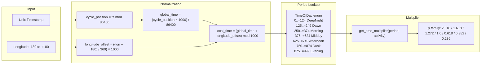
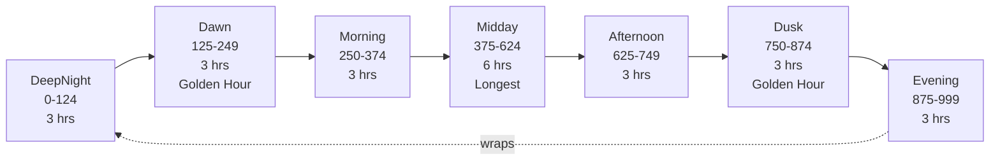
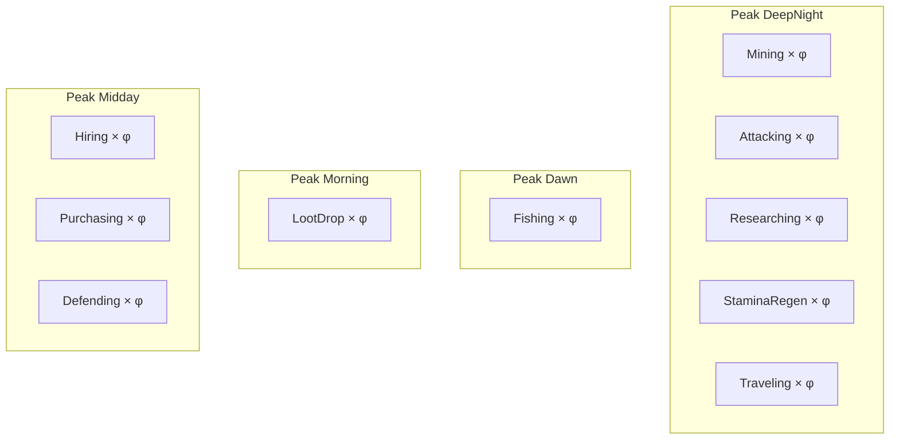
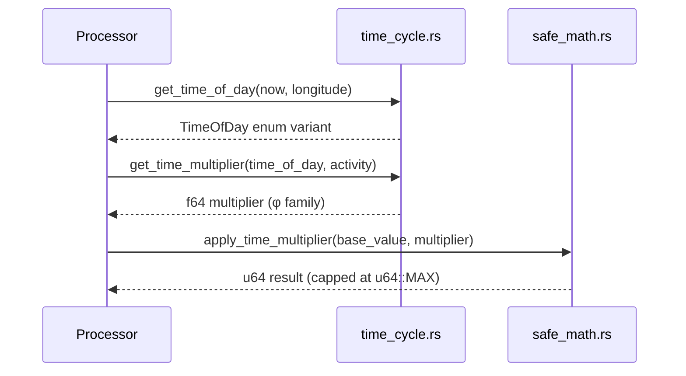
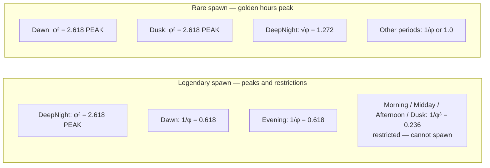

# Time Multipliers

> The 7-period day cycle and golden-ratio activity multipliers that modulate every gameplay action.

## Overview

Novus Mundus uses a **location-aware, deterministic day cycle** divided into 7 periods. Every economically or militarily significant action is modified by a multiplier drawn from the golden ratio family. The same timestamp and longitude always produce the same result — no hidden randomness.



## Golden Ratio Constants

All multipliers are exact values from `constants.rs`:

| Constant | Value | Symbol | Used For |
|----------|-------|--------|----------|
| `PHI` | 1.618033988749895 | φ | Strong bonus |
| `GOLDEN_ROOT` | 1.2720196495140689 | √φ | Moderate bonus |
| `PHI_SQUARED` | 2.618033988749895 | φ² | Legendary tier / golden hour |
| `PHI_INVERSE` | 0.6180339887498949 | 1/φ | Strong penalty |
| `PHI_SQUARED_INVERSE` | 0.3819660112501051 | 1/φ² | Epic day spawn penalty |
| `PHI_CUBED_INVERSE` | 0.2360679774997897 | 1/φ³ | Legendary day spawn penalty |

Key relationships: (√φ)² = φ, φ × (1/φ) = 1, φ² = φ + 1.

[Source: constants.rs](../../../programs/novus_mundus/src/constants.rs)

## Time Period Definitions

Implemented in `get_time_of_day` (`time_cycle.rs`):

| Period | Enum Value | local_time Range | Clock Equivalent |
|--------|-----------|-----------------|------------------|
| `DeepNight` | 0 | 0–124 | 00:00–03:00 |
| `Dawn` | 1 | 125–249 | 03:00–06:00 (Golden Hour) |
| `Morning` | 2 | 250–374 | 06:00–09:00 |
| `Midday` | 3 | 375–624 | 09:00–15:00 (longest period) |
| `Afternoon` | 4 | 625–749 | 15:00–18:00 |
| `Dusk` | 5 | 750–874 | 18:00–21:00 (Golden Hour) |
| `Evening` | 6 | 875–999 | 21:00–00:00 |

**Midday** spans 250 units (6 hours) — twice the length of other periods.

**Dawn and Dusk** are the golden hours. They trigger `is_golden_hour()` which affects encounter spawn weights and XP calculations.



## Activity Type Definitions

```rust
pub enum ActivityType {
    Hiring        = 0,   // Hire units
    Purchasing    = 1,   // Buy equipment
    Collecting    = 2,   // Cash collection
    Mining        = 3,   // Gem mining
    Fishing       = 4,   // Fishing / Farming
    Attacking     = 5,   // Offensive combat
    Defending     = 6,   // Defensive combat
    Traveling     = 7,   // Intercity travel
    Consuming     = 11,  // NOVI → Power conversion
    Researching   = 12,  // Research speed
    XPGain        = 13,  // XP earning
    StaminaRegen  = 14,  // Stamina regeneration
    LootDrop      = 15,  // Loot quality
}
```

Discriminants 8, 9, 10 are unused.

## Full Multiplier Table

`get_time_multiplier(time, activity)` — exact return values from code:

| Activity | DeepNight | Dawn | Morning | Midday | Afternoon | Dusk | Evening |
|----------|:---------:|:----:|:-------:|:------:|:---------:|:----:|:-------:|
| **Hiring** (0) | 1/φ | 1.0 | √φ | φ | √φ | 1.0 | 1/φ |
| **Purchasing** (1) | 1/φ | 1.0 | √φ | φ | √φ | 1.0 | 1/φ |
| **Collecting** (2) | 1/φ | 1.0 | 1.0 | 1.0 | 1.0 | 1.0 | 1/φ |
| **Mining** (3) | φ | 1.0 | 1.0 | 1.0 | 1.0 | 1.0 | 1.0 |
| **Fishing** (4) | 1.0 | φ | 1.0 | 1.0 | 1.0 | 1.0 | 1.0 |
| **Attacking** (5) | φ | √φ | 1.0 | 1.0 | 1.0 | 1.0 | 1.0 |
| **Defending** (6) | 1/φ | 1.0 | √φ | φ | √φ | 1.0 | 1.0 |
| **Traveling** (7) | φ | √φ | 1/φ | 1.0 | 1/φ | 1.0 | 1.0 |
| **Consuming** (11) | 1/φ | √φ | 1.0 | 1.0 | 1.0 | 1.0 | 1/φ |
| **Researching** (12) | φ | √φ | √φ | 1/φ | 1/φ | 1.0 | 1.0 |
| **XPGain** (13) | √φ | 1.0 | 1.0 | 1.0 | 1.0 | 1.0 | √φ |
| **StaminaRegen** (14) | φ | √φ | 1.0 | 1/φ | 1/φ | 1.0 | 1.0 |
| **LootDrop** (15) | √φ | 1.0 | φ | 1.0 | 1.0 | 1.0 | √φ |

Decimal equivalents for quick reference: φ = 1.618, √φ = 1.272, 1/φ = 0.618.

> **Note (Collecting at Dawn):** A test comment in `time_cycle.rs` (line 419) states that `Collecting` at `Dawn` should yield φ² (2.618×). The implementation does not implement this — `Dawn` hits the wildcard arm returning `1.0`. The table shows actual code behavior. The test assertion on line 421 would fail at runtime; this is a planned feature not yet coded.

> **Note (Researching Morning comment):** Code comment says `"1.0x - Normal study"` for Morning, but the implementation returns `GOLDEN_ROOT` (√φ = 1.272). Actual code value is shown in the table.

> **Note (LootDrop Morning comment):** Code comment says `"1.0x - Normal drops"` for Morning, but the implementation returns `PHI` (φ = 1.618). Actual code value is shown in the table.

[Source: logic/time_cycle.rs](../../../programs/novus_mundus/src/logic/time_cycle.rs)

## Best Times by Activity



## Application Pattern

All processors call the same two-step pattern:

```rust
// 1. Determine local time (location-aware)
let time_of_day = get_time_of_day(now, player.current_long);

// 2. Apply multiplier using integer math
let result = apply_time_multiplier(base_value, time_of_day, ActivityType::Hiring);
// internally: base_value as f64 * get_time_multiplier(time_of_day, activity) as u64
```

The conversion is: `apply_multiplier(base, multiplier)` → `(base as f64 * multiplier) as u64`, capped at `u64::MAX`.



## Encounter Spawn Weights by Time

Separate from activity multipliers, `get_rarity_spawn_weight(time, rarity)` governs how often each rarity spawns. These also use the φ family but are not clamped to 5 entries — they accept rarity 0–4:

| Rarity | DeepNight | Dawn | Morning | Midday | Afternoon | Dusk | Evening |
|--------|:---------:|:----:|:-------:|:------:|:---------:|:----:|:-------:|
| Common (0) | 1/φ | 1.0 | 1.0 | √φ | 1.0 | 1.0 | 1.0 |
| Uncommon (1) | 1/φ | 1.0 | φ | √φ | φ | 1.0 | 1/φ |
| Rare (2) | √φ | φ² | 1.0 | 1/φ | 1.0 | φ² | 1.0 |
| Epic (3) | φ | √φ | 1/φ | 1/φ² | 1/φ | √φ | √φ |
| Legendary (4) | φ² | 1/φ | 1/φ³ | 1/φ³ | 1/φ³ | 1/φ³ | 1/φ |



**Spawn restrictions** (`can_spawn_rarity_at_time`):
- Legendary (4): Only DeepNight, Dawn, Evening allowed
- Epic (3): Only DeepNight, Evening, Dawn, Dusk allowed
- Common/Uncommon/Rare: Unrestricted

[Source: logic/time_cycle.rs](../../../programs/novus_mundus/src/logic/time_cycle.rs)
