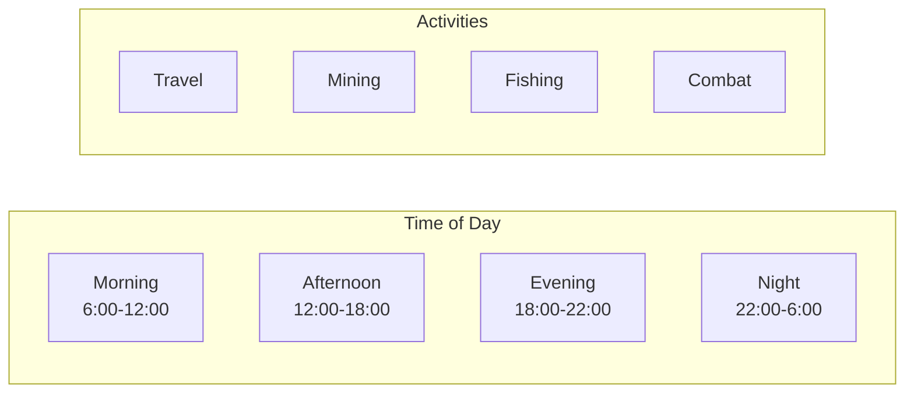

# Time Multipliers

> Time-of-day bonuses and duration calculations across game systems.

## Overview

Novus Mundus uses **time-of-day multipliers** to add strategic depth. Activities yield different results depending on when they're performed, based on the **local time** at the player's current location.



## Local Time Calculation

Time-of-day is calculated based on the player's **longitude**:

```rust
fn get_time_of_day(unix_timestamp: i64, longitude: f64) -> TimeOfDay {
    // Convert longitude to timezone offset (15° per hour)
    let timezone_offset_hours = longitude / 15.0;
    let offset_seconds = (timezone_offset_hours * 3600.0) as i64;

    // Get local time
    let local_timestamp = unix_timestamp + offset_seconds;
    let local_hour = ((local_timestamp % 86400) / 3600) as u8;

    match local_hour {
        6..=11 => TimeOfDay::Morning,
        12..=17 => TimeOfDay::Afternoon,
        18..=21 => TimeOfDay::Evening,
        _ => TimeOfDay::Night, // 22-5
    }
}
```

**Key Points:**
- Uses **real-world longitude** from city/location coordinates
- Provides **deterministic** results (same timestamp + location = same result)
- No randomness - purely strategic decision

---

## TimeOfDay Enum

```rust
#[repr(u8)]
pub enum TimeOfDay {
    Morning = 0,   // 6:00 - 11:59
    Afternoon = 1, // 12:00 - 17:59
    Evening = 2,   // 18:00 - 21:59
    Night = 3,     // 22:00 - 5:59
}
```

---

## Activity Multipliers

### Activity Types

```rust
#[repr(u8)]
pub enum ActivityType {
    Traveling = 0,
    Mining = 1,
    Fishing = 2,
    Combat = 3,
    Research = 4,
    Construction = 5,
    Collection = 6,
}
```

### Multiplier Table

| Activity | Morning | Afternoon | Evening | Night |
|----------|---------|-----------|---------|-------|
| **Traveling** | 1.1x | 1.0x | 0.9x | 0.8x |
| **Mining** | 1.0x | 1.1x | 1.0x | 1.2x |
| **Fishing** | 1.2x | 1.0x | 0.9x | 0.8x |
| **Combat** | 1.0x | 1.0x | 1.1x | 1.2x |
| **Research** | 1.1x | 1.0x | 0.9x | 0.9x |
| **Construction** | 1.0x | 1.1x | 1.0x | 0.9x |
| **Collection** | 1.1x | 1.0x | 1.1x | 0.8x |

### Multiplier Implementation

```rust
fn get_time_multiplier(time_of_day: TimeOfDay, activity: ActivityType) -> f64 {
    match activity {
        ActivityType::Traveling => match time_of_day {
            TimeOfDay::Morning => 1.1,
            TimeOfDay::Afternoon => 1.0,
            TimeOfDay::Evening => 0.9,
            TimeOfDay::Night => 0.8,
        },
        ActivityType::Mining => match time_of_day {
            TimeOfDay::Morning => 1.0,
            TimeOfDay::Afternoon => 1.1,
            TimeOfDay::Evening => 1.0,
            TimeOfDay::Night => 1.2,  // Night shift bonus!
        },
        ActivityType::Fishing => match time_of_day {
            TimeOfDay::Morning => 1.2,  // Dawn fishing!
            TimeOfDay::Afternoon => 1.0,
            TimeOfDay::Evening => 0.9,
            TimeOfDay::Night => 0.8,
        },
        // ... etc
    }
}
```

---

## Application Examples

### Travel Time

```rust
// Base travel time from distance
let base_travel_time = (distance_km / speed_kmh) * 3600.0;

// Get time-of-day at origin location
let time_of_day = get_time_of_day(now, origin_longitude);
let multiplier = get_time_multiplier(time_of_day, ActivityType::Traveling);

// Morning travel is faster (÷1.1), Night travel is slower (÷0.8)
let actual_travel_time = base_travel_time / multiplier;
```

**Example:**
- Base travel: 1 hour
- Morning (1.1x): 54 minutes 33 seconds
- Night (0.8x): 1 hour 15 minutes

### Mining Yields

```rust
let base_yield = operatives * base_gems_per_op_hour * duration_hours;

let time_of_day = get_time_of_day(expedition_start, player_longitude);
let multiplier = get_time_multiplier(time_of_day, ActivityType::Mining);

// Night mining gets 20% bonus!
let actual_yield = (base_yield as f64 * multiplier) as u64;
```

**Example:**
- Base yield: 100 gems
- Night shift (1.2x): 120 gems
- Morning (1.0x): 100 gems

### Fishing Yields

```rust
let base_produce = operatives * base_produce_per_op_hour * duration_hours;

let time_of_day = get_time_of_day(expedition_start, player_longitude);
let multiplier = get_time_multiplier(time_of_day, ActivityType::Fishing);

// Dawn fishing is most productive!
let actual_produce = (base_produce as f64 * multiplier) as u64;
```

**Example:**
- Base yield: 100 produce
- Morning (1.2x): 120 produce
- Night (0.8x): 80 produce

### Combat Damage

```rust
let base_damage = calculate_base_damage(attacker, defender);

let time_of_day = get_time_of_day(now, combat_longitude);
let multiplier = get_time_multiplier(time_of_day, ActivityType::Combat);

// Night raids deal more damage!
let actual_damage = (base_damage as f64 * multiplier) as u64;
```

---

## Duration Scaling Formulas

### Exponential Growth

Many systems use exponential scaling:

```rust
/// Calculate value with exponential growth
/// value = base × (multiplier/divisor)^level
fn exp_growth(base: u64, multiplier: u64, divisor: u64, level: u32) -> Option<u64> {
    let mut result = base;
    for _ in 0..level {
        result = result.checked_mul(multiplier)?;
        result = result.checked_div(divisor)?;
    }
    Some(result)
}
```

### Research Time

```
time(level) = base_time × 1.5^level

Example (base: 1 hour):
- Level 1: 1 hour
- Level 5: 7.6 hours
- Level 10: 57.7 hours
- Level 15: 437 hours
```

### Research Cost

```
cost(level) = base_cost × 1.8^level

Example (base: 1,000 NOVI):
- Level 1: 1,000
- Level 5: 18,895
- Level 10: 357,047
```

### Building Time

```
time(level) = base_time × φ^level

where φ = 1.618034 (golden ratio)

Example (base: 5 minutes):
- Level 1: 5 min
- Level 5: 22 min
- Level 10: 2.3 hours
- Level 20: 28 hours
```

### Building Cost

Same φ scaling as time:

```
cost(level) = base_cost × φ^level
```

---

## Speedup Calculations

### Time Reduction

```rust
fn calculate_speedup(remaining_time: i64, tier: u8) -> (i64, u64) {
    let reduction_percent = match tier {
        1 => 50,  // 50% reduction
        2 => 75,  // 75% reduction
        _ => 0,
    };

    let time_saved = remaining_time * reduction_percent / 100;
    let new_remaining = remaining_time - time_saved;

    (new_remaining, time_saved)
}
```

### Gem Cost

```rust
fn calculate_speedup_cost(remaining_seconds: i64, gems_per_minute: u64, tier: u8) -> u64 {
    let remaining_minutes = (remaining_seconds + 59) / 60; // Round up
    let tier_multiplier = match tier {
        1 => 1,
        2 => 2,
        _ => 1,
    };

    remaining_minutes as u64 * gems_per_minute * tier_multiplier
}
```

### Speedup Costs by System

| System | Base Cost/Min | Tier 1 | Tier 2 |
|--------|---------------|--------|--------|
| Expedition | 100 | 100/min (50%) | 200/min (75%) |
| Research | 50 | 50/min (50%) | 100/min (75%) |
| Travel | 50 | 50/min (50%) | 100/min (75%) |
| Rally | 75 | 75/min (50%) | 150/min (75%) |
| Reinforcement | 75 | 75/min (50%) | 150/min (75%) |
| Building | 100 | 100/min (50%) | 200/min (75%) |

---

## Cooldown Calculations

### Attack Cooldown

```rust
const COMBAT_COOLDOWN: i64 = 3600; // 1 hour

fn can_attack(last_attack: i64, now: i64, same_target: bool) -> bool {
    if !same_target {
        return true; // No cooldown for new targets
    }
    now >= last_attack + COMBAT_COOLDOWN
}
```

### Collection Cooldown

```rust
const COLLECTION_COOLDOWN: i64 = 7200; // 2 hours

fn can_collect(last_collection: i64, now: i64) -> bool {
    now >= last_collection + COLLECTION_COOLDOWN
}
```

### Daily Reset

```rust
fn is_new_day(last_action_timestamp: i64, now: i64) -> bool {
    let last_day = last_action_timestamp / 86400;
    let current_day = now / 86400;
    current_day > last_day
}
```

---

## Expedition Duration

### Mining Duration by Tier

| Tier | Duration | Base Yield |
|------|----------|------------|
| 0 | 1 hour | 10 gems/op |
| 1 | 2 hours | 18 gems/op |
| 2 | 4 hours | 30 gems/op |
| 3 | 8 hours | 50 gems/op |
| 4 | 16 hours | 80 gems/op |

### Fishing Duration by Tier

| Tier | Duration | Base Yield |
|------|----------|------------|
| 0 | 1 hour | 15 produce/op |
| 1 | 2 hours | 25 produce/op |
| 2 | 4 hours | 40 produce/op |
| 3 | 8 hours | 60 produce/op |
| 4 | 16 hours | 100 produce/op |

---

## Client Integration

### Display Time-of-Day Bonus

```javascript
function getTimeBonus(longitude, activityType) {
  const now = Date.now() / 1000;
  const timezoneOffset = longitude / 15; // hours
  const localTimestamp = now + (timezoneOffset * 3600);
  const localHour = Math.floor((localTimestamp % 86400) / 3600);

  let timeOfDay;
  if (localHour >= 6 && localHour < 12) timeOfDay = 'morning';
  else if (localHour >= 12 && localHour < 18) timeOfDay = 'afternoon';
  else if (localHour >= 18 && localHour < 22) timeOfDay = 'evening';
  else timeOfDay = 'night';

  const multiplier = getMultiplier(timeOfDay, activityType);

  return {
    timeOfDay,
    localHour,
    multiplier,
    bonusPercent: Math.round((multiplier - 1) * 100),
    isBonus: multiplier > 1.0
  };
}
```

### Show Optimal Times

```javascript
function getOptimalTimes(longitude, activityType) {
  const times = ['morning', 'afternoon', 'evening', 'night'];
  const multipliers = times.map(t => ({
    time: t,
    multiplier: getMultiplier(t, activityType)
  }));

  const best = multipliers.reduce((a, b) =>
    a.multiplier > b.multiplier ? a : b
  );

  return {
    optimal: best.time,
    bonus: Math.round((best.multiplier - 1) * 100),
    all: multipliers
  };
}
```

### Duration Preview

```javascript
function previewDuration(baseDuration, activityType, longitude) {
  const bonus = getTimeBonus(longitude, activityType);
  const actualDuration = baseDuration / bonus.multiplier;

  return {
    base: formatDuration(baseDuration),
    actual: formatDuration(actualDuration),
    saved: bonus.multiplier > 1 ? formatDuration(baseDuration - actualDuration) : null,
    bonus: bonus.bonusPercent > 0 ? `+${bonus.bonusPercent}%` : `${bonus.bonusPercent}%`
  };
}
```

---

*Time is your ally or enemy. Master the rhythms of day and night to maximize every action.*

---

Next: [Combat Math](./combat-math.md)
