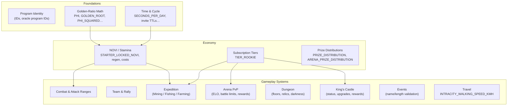

# Constants Reference

> Every compile-time constant in Novus Mundus — real values from source, grouped by system.

[Source: constants.rs](../../../programs/novus_mundus/src/constants.rs)

---

## Overview

Constants span 14 system families. The diagram below shows how they cluster — math foundations feed progression, economy constants drive gameplay loops, and each game system has its own tuning knobs.

---

## Program Identity

| Constant | Type | Value | Notes |
|----------|------|-------|-------|
| Program ID | `Address` | `J4DxMg1RfwRzjpZ3N6D1ULNjuwLHuhe6qLNeX9rYNz3V` | Declared in `lib.rs` via `declare_id!` |
| `NOVI_MINT_ADDRESS` | `[u8; 32]` | Derived at compile time | PDA of `["novi_mint"]`; computed by `const_crypto` |
| `NOVI_MINT_BUMP` | `u8` | Derived at compile time | Canonical bump for `NOVI_MINT_ADDRESS` |

---

## Oracle Program IDs

Used to verify oracle feed account ownership (prevents fake feed accounts).

| Constant | Value |
|----------|-------|
| `PYTH_PROGRAM_ID` | `pythWSnswVUd12oZpeFP8e9CVaEqJg25g1Vtc2biRsT` |
| `SWITCHBOARD_PROGRAM_ID` | `SBondMDrcV3K4kxZR1HNVT7osZxAHVHgYXL5Ze1oMUv` |

---

## Golden-Ratio Mathematics

All progression scaling in Novus Mundus is deterministic — no randomness. The golden-ratio family provides mathematically elegant multipliers. All values are `f64`.

| Constant | Value | Usage |
|----------|-------|-------|
| `PHI` | `1.618033988749895` | φ — Fibonacci bonuses, high-tier multipliers, rarity scaling |
| `GOLDEN_ROOT` | `1.2720196495140689` | √φ — base progression multiplier per level; every 2 levels = φ multiplier |
| `PHI_SQUARED` | `2.618033988749895` | φ² — legendary tier bonuses, major milestones |
| `PHI_INVERSE` | `0.6180339887498949` | 1/φ — base/low-tier values, diminishing returns, common rarity |
| `PHI_SQUARED_INVERSE` | `0.3819660112501051` | 1/φ² — strong penalties, rare day spawns for Epic |
| `PHI_CUBED_INVERSE` | `0.2360679774997897` | 1/φ³ — extreme penalties, near-impossible day spawns for Legendary |

---

## Time & Cycle Constants

| Constant | Type | Value | Meaning |
|----------|------|-------|---------|
| `SECONDS_PER_DAY` | `i64` | 86,400 | Seconds in one day |
| `SECONDS_PER_HOUR` | `i64` | 3,600 | Seconds in one hour |
| `TEAM_INVITE_EXPIRY` | `i64` | 604,800 | Team invite TTL (7 days) |
| `RESERVED_NOVI_VESTING_PERIOD` | `i64` | 604,800 | Reserved NOVI vesting lockup (7 days) |

---

## Economy / NOVI

| Constant | Type | Value | Meaning |
|----------|------|-------|---------|
| `STARTER_LOCKED_NOVI` | `u64` | 1,000,000 | Locked NOVI given to new players on onboarding |

### Event Prize Distribution

Applies to the global leaderboard event prize pool. Values are basis points; guaranteed to sum to exactly 10,000.

| Rank | Basis Points | Percentage |
|------|-------------|------------|
| 1 | 3,500 | 35% |
| 2 | 2,500 | 25% |
| 3 | 1,500 | 15% |
| 4 | 750 | 7.5% |
| 5 | 750 | 7.5% |
| 6–10 | 200 each | 2% each |

Constant: `PRIZE_DISTRIBUTION: [u16; 10]`

---

## Stamina System

| Constant | Type | Value | Meaning |
|----------|------|-------|---------|
| `STAMINA_REGEN_INTERVAL` | `i64` | 300 | Seconds to regenerate 1 stamina (5 minutes) |
| `MAX_STAMINA_BY_TIER` | `[u64; 4]` | `[100, 500, 1000, 10000]` | Max stamina per subscription tier: Rookie / Expert / Epic / Legendary |

### Encounter Stamina Costs

| Rarity | Stamina Cost |
|--------|-------------|
| Common | 10 |
| Uncommon | 25 |
| Rare | 50 |
| Epic | 100 |
| Legendary | 250 |
| WorldEvent | 500 |

Constant: `ENCOUNTER_STAMINA_COSTS: [u64; 6]`

---

## Subscription Tiers

| Constant | Type | Value | Meaning |
|----------|------|-------|---------|
| `TIER_ROOKIE` | `u8` | 0 | Rookie (base) tier identifier |

---

## Combat Constants

| Constant | Type | Value | Meaning |
|----------|------|-------|---------|
| `DEFENSIVE_UNIT_1_POWER` | `u64` | 10 | Combat power per Tier-1 defensive unit |
| `DEFENSIVE_UNIT_2_POWER` | `u64` | 25 | Combat power per Tier-2 defensive unit |
| `DEFENSIVE_UNIT_3_POWER` | `u64` | 60 | Combat power per Tier-3 defensive unit |
| `WEAPON_LOOT_RATE_BPS` | `u16` | 6,000 | 60% of dead enemy troops' weapons can be looted |
| `ARMORY_RAID_WITH_OPERATIVES_BPS` | `u16` | 2,500 | 25% armory raid rate when defender has operatives but no garrison |
| `ARMORY_RAID_UNDEFENDED_BPS` | `u16` | 5,000 | 50% armory raid rate when defender is completely undefended |
| `DAMAGE_PER_SIEGE_WEAPON` | `u64` | 500 | Damage dealt per siege weapon consumed |
| `SIEGE_CAPTURE_RATE_BPS` | `u16` | 8,000 | 80% of intact siege equipment in storage captured on full defeat |
| `MAX_REINFORCEMENT_RECEIVE` | `u64` | 10,000 | Maximum units receivable from all reinforcements combined |
| `RECOVERY_COST_DISCOUNT_BPS` | `u64` | 5,000 | Recovery cost is 50% of normal hire cost |

### Attack Ranges

| Constant | Type | Value | Meaning |
|----------|------|-------|---------|
| `ENCOUNTER_ATTACK_RANGE_METERS` | `f64` | 10.0 | Maximum range to attack an encounter (meters) |
| `PVP_ATTACK_RANGE_METERS` | `f64` | 15.0 | Maximum range for PvP combat (meters) |

---

## Events

| Constant | Type | Value | Meaning |
|----------|------|-------|---------|
| `MAX_EVENT_NAME_LENGTH` | `usize` | 64 | Maximum event name length in bytes |
| `MIN_EVENT_NAME_LENGTH` | `usize` | 3 | Minimum event name length in bytes |

---

## Travel

| Constant | Type | Value | Meaning |
|----------|------|-------|---------|
| `INTRACITY_WALKING_SPEED_KMH` | `f32` | 5.0 | Walking speed for intracity movement (km/h) |

---

## Team System

| Constant | Type | Value | Meaning |
|----------|------|-------|---------|
| `MAX_TEAM_MEMBERS_BY_TIER` | `[u8; 4]` | `[5, 10, 25, 50]` | Max team members per subscription tier: Rookie / Expert / Epic / Legendary |

---

## Rally System

| Constant | Type | Value | Meaning |
|----------|------|-------|---------|
| `DEFAULT_RALLY_RECRUITING_DURATION` | `i64` | 3,600 | Default recruiting window for a rally (1 hour) |
| `MIN_RALLY_PARTICIPANTS` | `u8` | 2 | Minimum participants required to execute a rally |

---

## Expedition System

### Expedition Types

| Constant | Type | Value |
|----------|------|-------|
| `EXPEDITION_MINING` | `u8` | 1 |
| `EXPEDITION_FISHING` | `u8` | 2 |
| `EXPEDITION_MAX_TIER` | `u8` | 4 |

### Mining Expeditions (tiers 0–4: Surface / Shallow / Deep / Volcanic / Abyssal)

| Constant | Values |
|----------|--------|
| `MINING_DURATION_HOURS: [u8; 5]` | `[1, 2, 4, 8, 16]` |
| `MINING_RARE_CHANCE_BPS: [u16; 5]` | `[100, 300, 500, 1000, 2000]` |
| `MINING_WORKSHOP_REQ: [u8; 5]` | `[1, 5, 10, 15, 20]` (Workshop building levels) |
| `MINING_NOVI_COST: [u64; 5]` | `[100, 500, 2000, 8000, 30000]` |
| `MINING_FRAGMENT_BONUS: [u64; 5]` | `[1, 3, 8, 20, 50]` |

### Fishing Expeditions (tiers 0–4: Shore / River / Lake / DeepSea / Abyss)

| Constant | Values |
|----------|--------|
| `FISHING_DURATION_HOURS: [u8; 5]` | `[1, 2, 4, 8, 16]` |
| `FISHING_RARE_CHANCE_BPS: [u16; 5]` | `[100, 300, 500, 1000, 2000]` |
| `FISHING_DOCK_REQ: [u8; 5]` | `[1, 5, 10, 15, 20]` (Dock building levels) |
| `FISHING_NOVI_COST: [u64; 5]` | `[100, 500, 2000, 8000, 30000]` |
| `FISHING_FRAGMENT_BONUS: [u64; 5]` | `[1, 2, 5, 12, 30]` |

### Farming Expeditions (tiers 0–4: Garden / Fields / Orchard / Plantation / Breadbasket)

| Constant | Values |
|----------|--------|
| `FARMING_DURATION_HOURS: [u8; 5]` | `[1, 2, 4, 8, 16]` |
| `FARMING_FARM_REQ: [u8; 5]` | `[1, 5, 10, 15, 20]` (Farm building levels) |
| `FARMING_NOVI_COST: [u64; 5]` | `[100, 500, 2000, 8000, 30000]` |

### Expedition Yield Modifiers

| Constant | Type | Value | Meaning |
|----------|------|-------|---------|
| `RARE_FIND_MULTIPLIER` | `u64` | 5 | 5× normal yield on a rare find |
| `PERFECT_SCORE_THRESHOLD` | `u8` | 80 | Average score threshold for perfect bonus |
| `PERFECT_EXPEDITION_BONUS_BPS` | `u16` | 2,500 | 25% extra yield on a perfect expedition |
| `OPERATIVE_TIER_1_MULTIPLIER_BPS` | `u64` | 10,000 | Tier-1 operative yield multiplier (1.0×) |
| `OPERATIVE_TIER_2_MULTIPLIER_BPS` | `u64` | 15,000 | Tier-2 operative yield multiplier (1.5×) |
| `OPERATIVE_TIER_3_MULTIPLIER_BPS` | `u64` | 20,000 | Tier-3 operative yield multiplier (2.0×) |

---

## Arena PvP System

### Season & Timing

| Constant | Type | Value | Meaning |
|----------|------|-------|---------|
| `ARENA_SEASON_DURATION` | `i64` | 604,800 | Arena season length (7 days) |
| `ARENA_CLAIM_DEADLINE` | `i64` | 2,592,000 | Claim window after season ends (30 days) |
| `ARENA_MATCH_EXPIRY_SECONDS` | `i64` | 300 | Match assignment expires after 5 minutes |

### Battle Limits

| Constant | Type | Value | Meaning |
|----------|------|-------|---------|
| `ARENA_MAX_DAILY_BATTLES` | `u8` | 10 | Max battles per player per rolling 24h window |
| `ARENA_MAX_BATTLES_PER_OPPONENT` | `u8` | 2 | Max battles vs. same opponent per day |
| `ARENA_MIN_BATTLES_FOR_DAILY_REWARD` | `u8` | 5 | Min battles needed to claim daily reward |

### ELO Rating

| Constant | Type | Value | Meaning |
|----------|------|-------|---------|
| `ARENA_STARTING_ELO` | `u32` | 1,000 | Starting ELO rating for new participants |
| `ARENA_ELO_K_FACTOR` | `u32` | 32 | ELO K-factor (rating change magnitude per match) |

### Points & Rewards

| Constant | Type | Value | Meaning |
|----------|------|-------|---------|
| `ARENA_BASE_WIN_POINTS` | `u64` | 100 | Base points awarded for a win |
| `ARENA_BASE_LOSS_POINTS` | `u64` | 20 | Base points awarded for a loss (participation) |
| `ARENA_DRAW_POINTS` | `u64` | 50 | Points for both players on a draw |
| `ARENA_UNDERDOG_BONUS_BPS` | `u64` | 500 | 5% bonus points per 10% power disadvantage |
| `ARENA_DAILY_BASE_REWARD` | `u64` | 1,000 | Base daily reward amount (100 NOVI; 1 decimal) |
| `ARENA_MIN_POINTS_FOR_LEADERBOARD` | `u64` | 500 | Minimum points to qualify for leaderboard |

### Combat Power

| Constant | Type | Value | Meaning |
|----------|------|-------|---------|
| `ARENA_MELEE_WEAPON_POWER` | `u64` | 10 | Melee weapon combat power |
| `ARENA_RANGED_WEAPON_POWER` | `u64` | 16 | Ranged weapon combat power (~φ ratio) |
| `ARENA_SIEGE_WEAPON_POWER` | `u64` | 26 | Siege weapon combat power (~φ² ratio) |
| `ARENA_ARMOR_POWER` | `u64` | 5 | Armor combat power contribution |

### Arena Prize Distribution

Applies to the seasonal arena leaderboard prize pool. Values are basis points; guaranteed to sum to exactly 10,000.

| Rank | Basis Points | Percentage |
|------|-------------|------------|
| 1 | 3,500 | 35% |
| 2 | 2,500 | 25% |
| 3 | 1,500 | 15% |
| 4 | 750 | 7.5% |
| 5 | 750 | 7.5% |
| 6–10 | 200 each | 2% each |

Constant: `ARENA_PRIZE_DISTRIBUTION: [u16; 10]`

---

## Dungeon System

### Timing & Limits

| Constant | Type | Value | Meaning |
|----------|------|-------|---------|
| `DUNGEON_MAX_MULTI_ATTACKS` | `u8` | 5 | Maximum attacks per multi-attack instruction |
| `DUNGEON_REST_HEAL_PERCENT` | `u8` | 20 | Percentage of units healed in a rest room |
| `DUNGEON_RESUME_GEM_COST` | `u64` | 500 | Base gem cost to resume a run from a checkpoint |

### Flee Penalties (basis points of accumulated rewards)

| Floor Range | Penalty BPS | Effective % |
|-------------|------------|-------------|
| Floors 1–3 | 7,000 | 70% |
| Floors 4–6 | 6,000 | 60% |
| Floors 7–9 | 5,000 | 50% |
| Floors 10+ | 4,000 | 40% |

Constant: `DUNGEON_FLEE_PENALTY_BPS: [u16; 4]`

### Room Multipliers

| Constant | Type | Value | Meaning |
|----------|------|-------|---------|
| `DUNGEON_TREASURE_LOOT_MULTIPLIER_BPS` | `u16` | 20,000 | Treasure room loot multiplier (2.0×) |
| `DUNGEON_TRAP_XP_BONUS_BPS` | `u16` | 15,000 | Trap room XP bonus (1.5×) |
| `DUNGEON_TRAP_DAMAGE_PERCENT` | `u8` | 10 | Trap room damage (% of current units HP) |

### Floor Reward Multipliers (1.2^floor, ×10,000 for precision)

| Floor | Multiplier BPS | Effective |
|-------|---------------|-----------|
| 1 | 10,000 | 1.0× |
| 2 | 12,000 | 1.2× |
| 3 | 14,400 | 1.44× |
| 4 | 17,280 | 1.728× |
| 5 | 20,736 | 2.074× |
| 6 | 24,883 | 2.488× |
| 7 | 29,860 | 2.986× |
| 8 | 35,832 | 3.583× |
| 9 | 42,998 | 4.300× |
| 10 | 51,598 | 5.160× |

Constant: `DUNGEON_FLOOR_MULTIPLIERS: [u32; 10]`

### Unit Combat Stats

| Tier | Power | Health |
|------|-------|--------|
| Tier 1 | 15 | 100 HP |
| Tier 2 | 35 | 250 HP |
| Tier 3 | 80 | 600 HP |

Constants: `DUNGEON_UNIT_POWER: [u64; 3]`, `DUNGEON_UNIT_HEALTH: [u64; 3]`

---

## Relic System (Dungeon)

### Synergy Tags

| Constant | Value | Tag |
|----------|-------|-----|
| `SYNERGY_OFFENSE` | 0 | Offense |
| `SYNERGY_DEFENSE` | 1 | Defense |
| `SYNERGY_CRIT` | 2 | Crit |
| `SYNERGY_SUSTAIN` | 3 | Sustain |
| `SYNERGY_DARKNESS` | 4 | Darkness |
| `SYNERGY_LOOT` | 5 | Loot |
| `SYNERGY_BOSS` | 6 | Boss |
| `SYNERGY_HERO` | 7 | Hero |
| `SYNERGY_META` | 8 | Meta |

### Relic Effects (index = relic ID)

| ID | Synergy | Effect BPS / Flag | Description |
|----|---------|------------------|-------------|
| 0 | Offense | 1,500 | +15% attack |
| 1 | Defense | 1,000 | +10% defense |
| 2 | Crit | 2,000 | +20% crit chance |
| 3 | Crit | 3,000 | +30% crit damage |
| 4 | Sustain | 500 | 5% lifesteal |
| 5 | Darkness | 3,000 | −30% darkness penalty |
| 6 | Loot | 2,500 | +25% loot |
| 7 | Boss | 1,500 | −15% boss power |
| 8 | Defense | 1,500 | +15% unit survival |
| 9 | Hero | 2,500 | +25% hero effectiveness |
| 10 | Loot | 1 (flag) | Guaranteed rare find |
| 11 | Sustain | 1 (flag) | One-time resurrection |
| 12 | Offense | 3,000 | +30% attack, +15% damage taken |
| 13 | Defense | 1 (flag) | Cannot be one-shot (min 1 unit) |
| 14 | Offense | 1,500 | 15% double-attack chance |
| 15 | Loot | 20,000 | 2× NOVI |
| 16 | Darkness | 1 (flag) | Immune to darkness crit penalty |
| 17 | Offense | 5,000 | +50% attack, −30% defense |
| 18 | Sustain | 4,000 | +40% attack at <50% units |
| 19 | Meta | 1 (flag) | +1 relic choice |

Constants: `RELIC_SYNERGY_TAGS: [u8; 20]`, `RELIC_EFFECTS: [u16; 20]`

### Synergy Set Bonuses

| Synergy | 2-Piece BPS | 3-Piece BPS (additive) |
|---------|------------|------------------------|
| Offense | 1,000 (+10% atk) | 2,500 (+25% atk total, +10% crit) |
| Defense | 1,500 (+15% def) | 3,000 (+30% def total, +10% unit health) |
| Crit | 1,500 (+15% crit dmg) | 4,000 (+40% crit dmg total, crits heal 2%) |
| Sustain | 500 (+5% lifesteal) | 1,000 (+10% lifesteal, +20% heal effectiveness) |
| Darkness | 2,000 (−20% darkness) | 10,000 (immune, 100% reduction) |
| Loot | 2,000 (+20% loot) | 5,000 (+50% loot total, +1 boss drop) |
| Boss | 1,000 (−10% boss power) | 2,500 (−25% boss power, +15% damage to boss) |
| Hero | 1,000 (+10% hero) | 2,000 (+20% hero total) |
| Meta | 0 | 0 |

Constants: `SYNERGY_2_BONUS_BPS: [u16; 9]`, `SYNERGY_3_BONUS_BPS: [u16; 9]`

---

## Darkness Mechanic (Dungeon)

| Constant | Type | Value | Meaning |
|----------|------|-------|---------|
| `DARKNESS_DAMAGE_PENALTY_PER_FLOOR_BPS` | `u16` | 50 | 0.5% damage penalty per floor (applied all floors) |
| `DARKNESS_CRIT_PENALTY_START_FLOOR` | `u8` | 4 | Darkness crit penalty begins at floor 4 |
| `DARKNESS_CRIT_PENALTY_PER_FLOOR_BPS` | `u16` | 30 | 0.3% crit penalty per floor above floor 4 |
| `DARKNESS_DEFENSE_PENALTY_START_FLOOR` | `u8` | 7 | Darkness defense penalty begins at floor 7 |
| `DARKNESS_DEFENSE_PENALTY_PER_FLOOR_BPS` | `u16` | 20 | 0.2% defense penalty per floor above floor 7 |
| `DARKNESS_ENEMY_BUFF_START_FLOOR` | `u8` | 10 | Enemy darkness buff begins at floor 10 |
| `DARKNESS_ENEMY_BUFF_PER_FLOOR_BPS` | `u16` | 50 | 0.5% enemy buff per floor above floor 10 |

---

## King's Castle System

### Timing & Status

| Constant | Type | Value | Meaning |
|----------|------|-------|---------|
| `CASTLE_CONTEST_DURATION` | `i64` | 7,200 | Contest period length (2 hours) |
| `CASTLE_PROTECTION_DURATION` | `i64` | 864,000 | Protection period after claiming (10 days) |
| `MAX_CASTLES_PER_KING` | `u8` | 5 | Maximum castles a single king can rule |
| `CASTLE_ATTACK_RANGE_METERS` | `f64` | 50.0 | Must be within 50 m to attack a castle |

### Castle Status Values

| Constant | Value | Meaning |
|----------|-------|---------|
| `CASTLE_STATUS_VACANT` | 0 | No king |
| `CASTLE_STATUS_CONTEST` | 1 | Contest period active |
| `CASTLE_STATUS_PROTECTED` | 2 | In post-claim protection |
| `CASTLE_STATUS_VULNERABLE` | 3 | Can be attacked |
| `CASTLE_STATUS_TRANSITIONING` | 4 | Ownership transitioning |

### Castle Upgrade Types

| Constant | Value | Upgrade |
|----------|-------|---------|
| `CASTLE_UPGRADE_FORTIFICATION` | 1 | Fortification (+5% defense/level, uncapped) |
| `CASTLE_UPGRADE_TREASURY` | 2 | Treasury (cap: level 20, +200% bonus rewards) |
| `CASTLE_UPGRADE_CHAMBERS` | 3 | Chambers (cap: level 5 → 5 court slots) |
| `CASTLE_UPGRADE_WATCHTOWER` | 4 | Watchtower (cap: level 15, +150% early warning) |
| `CASTLE_UPGRADE_ARMORY` | 5 | Armory (+3% defense quality/level, uncapped) |

### Max Upgrade Levels

| Constant | Value | Meaning |
|----------|-------|---------|
| `MAX_FORTIFICATION_LEVEL` | 255 | Uncapped (economics provide natural soft cap) |
| `MAX_TREASURY_LEVEL` | 20 | Hard cap |
| `MAX_CHAMBERS_LEVEL` | 5 | Hard cap |
| `MAX_WATCHTOWER_LEVEL` | 15 | Hard cap |
| `MAX_ARMORY_LEVEL` | 255 | Uncapped |

### Castle Tier Multipliers

| Tier | Name | Multiplier BPS | Effective |
|------|------|---------------|-----------|
| 0 | Outpost | 2,500 | 0.25× |
| 1 | Keep | 5,000 | 0.5× |
| 2 | Stronghold | 10,000 | 1.0× |
| 3 | Fortress | 15,000 | 1.5× |
| 4 | Citadel | 20,000 | 2.0× |

Constant: `CASTLE_TIER_MULTIPLIER_BPS: [u16; 5]`

### Garrison Capacity by King's Subscription Tier

| Tier | Max Garrison |
|------|-------------|
| Rookie | 5 |
| Expert | 10 |
| Epic | 15 |
| Legendary | 25 |

Constant: `GARRISON_CAP_BY_TIER: [u8; 4]`

### Castle Daily Rewards

> These are defaults at 1.0× tier multiplier. Actual amounts scale by `CASTLE_TIER_MULTIPLIER_BPS`.

| Constant | Type | Value | Meaning |
|----------|------|-------|---------|
| `KING_NOVI_PER_DAY` | `u64` | 500,000 | NOVI per day for the king |
| `KING_CASH_PER_DAY` | `u64` | 10,000,000 | Cash per day for the king |
| `COURT_NOVI_PER_DAY` | `u64` | 50,000 | NOVI per day per court member |
| `COURT_CASH_PER_DAY` | `u64` | 1,000,000 | Cash per day per court member |
| `MEMBER_NOVI_PER_DAY` | `u64` | 5,000 | NOVI per day for team members |
| `MEMBER_CASH_PER_DAY` | `u64` | 500,000 | Cash per day for team members |
| `KING_LOOT_CUT_BPS` | `u16` | 1,500 | King receives 15% of combat loot from garrison |

---

Next: [Seeds](./seeds.md)
