# Error Codes

> Complete `GameError` enum reference — every variant, exact decimal code, and meaning.

Error codes start at **6000** (`GamePaused`). The enum is `#[repr(u32)]` and converts to `ProgramError::Custom(code)`. All codes are decimal.

[Source: error.rs](../../../programs/novus_mundus/src/error.rs)

---

## Overview

The 426 error variants are grouped into numeric ranges by system. Use the map below to orient quickly — each band corresponds to one section in this document.

```mermaid
%%{init: {"theme": "base", "themeVariables": {"primaryColor": "#1e293b", "primaryTextColor": "#f8fafc", "primaryBorderColor": "#475569", "lineColor": "#64748b", "secondaryColor": "#0f172a", "tertiaryColor": "#0f172a"}}}%%
gantt
    title Error Code Ranges
    dateFormat  X
    axisFormat  %s

    section General
    6000–6017 General          : 6000, 18
    section Player
    6100–6127 Player           : 6100, 28
    section Team
    6200–6234 Team             : 6200, 35
    section Rally
    6300–6321 Rally            : 6300, 22
    section Location
    6400–6415 Location         : 6400, 16
    section City & Travel
    6420–6430 City & Travel    : 6420, 11
    section Encounter
    6500–6515 Encounter        : 6500, 16
    section Event
    6600–6612 Event            : 6600, 13
    section Subscription
    6700–6706 Subscription     : 6700, 7
    section Minting
    6800–6815 Minting          : 6800, 16
    section DAO
    6900–6904 Governance       : 6900, 5
    section Fibonacci
    7000–7001 Fibonacci        : 7000, 2
    section Combat
    7100–7104 Combat           : 7100, 5
    section Strat Combat
    7110–7117 Strategic Combat : 7110, 8
    section Reinforcement
    7150–7157 Reinforcement    : 7150, 8
    section Rally Strat
    7170–7181 Rally Strategic  : 7170, 12
    section Transfer
    7200–7209 Transfer         : 7200, 10
    section Cleanup
    7300–7301 Cleanup          : 7300, 2
    section Encounter Loot
    7400–7404 Encounter Loot   : 7400, 5
    section Research
    7500–7556 Research         : 7500, 57
    section Shop
    7600–7618 Shop             : 7600, 19
    section Estate
    7700–7739 Estate           : 7700, 40
    section Forge
    7740–7743 Forge            : 7740, 4
    section Hero
    7760–7775 Hero             : 7760, 16
    section Expedition
    7800–7812 Expedition       : 7800, 13
    section Arena
    7900–7930 Arena PvP        : 7900, 31
    section Dungeon
    8000–8017 Dungeon          : 8000, 18
    section Castle
    8100–8136 Castle           : 8100, 37
    section Discriminator
    8200 Discriminator         : 8200, 1
```

---

## General Errors (6000–6017)

| Code | Variant | Meaning |
|------|---------|---------|
| 6000 | `GamePaused` | Game is globally paused |
| 6001 | `Unauthorized` | Signer is not the authorized account owner |
| 6002 | `InvalidTimestamp` | Timestamp is out of expected range |
| 6003 | `MathOverflow` | Arithmetic overflow in calculation |
| 6004 | `InvalidAccount` | Account address does not match expected PDA |
| 6005 | `DaoRequired` | Operation requires DAO authority |
| 6006 | `InsufficientBalance` | Account balance too low for operation |
| 6007 | `InvalidParameter` | Instruction parameter out of valid range |
| 6008 | `ExceedsMaxCap` | Value exceeds the configured maximum cap |
| 6009 | `AccountFrozen` | Account is frozen and cannot be used |
| 6010 | `InvalidPDA` | PDA derivation does not match provided account |
| 6011 | `MissingRequiredAccount` | A required account was not provided |
| 6012 | `FeatureLocked` | Feature has not been unlocked yet |
| 6013 | `InvalidKingdomId` | Kingdom ID is out of valid range |
| 6014 | `KingdomMismatch` | Accounts belong to different kingdoms |
| 6015 | `KingdomRegistrationClosed` | Kingdom is no longer accepting new players |
| 6016 | `KingdomNotStarted` | Kingdom has not started yet |
| 6017 | `CrossKingdomNotAllowed` | Cross-kingdom operation is not permitted |

---

## Player Errors (6100–6127)

| Code | Variant | Meaning |
|------|---------|---------|
| 6100 | `PlayerAlreadyExists` | Player account for this wallet already exists |
| 6101 | `PlayerNotFound` | Player account does not exist |
| 6102 | `InsufficientLockedNovi` | Not enough locked NOVI for operation |
| 6103 | `InsufficientCash` | Not enough cash |
| 6104 | `InsufficientWeapons` | Not enough weapons for operation |
| 6105 | `InsufficientProduce` | Not enough produce |
| 6106 | `InsufficientVehicles` | Not enough vehicles |
| 6107 | `InsufficientUnits` | Not enough units deployed/available |
| 6108 | `InsufficientPower` | Not enough combat power |
| 6109 | `PlayerTraveling` | Player is currently traveling (intercity) |
| 6110 | `PlayerNotAtLocation` | Player is not at the required location |
| 6111 | `TooManyActiveRallies` | Player has too many active rallies |
| 6112 | `RallyCreationLimitReached` | Player hit their rally creation limit |
| 6113 | `PlayerInactive` | Player account is marked inactive |
| 6114 | `InsufficientSubscriptionTier` | Operation requires a higher subscription tier |
| 6115 | `InsufficientLevel` | Player level too low for operation |
| 6116 | `CannotAttackSelf` | Player cannot attack their own account |
| 6117 | `TargetHasImmunity` | Target player has immunity active |
| 6118 | `TargetIsProtected` | Target has new-player protection active |
| 6119 | `NetworthOutOfRange` | Net-worth difference exceeds PvP range |
| 6120 | `ClaimCooldownActive` | Claim cooldown has not expired |
| 6121 | `NothingToClaim` | No rewards available to claim |
| 6122 | `AccountTooNew` | Account is too new for this operation |
| 6123 | `HappinessTooLow` | City happiness is too low |
| 6124 | `MaxUnitsReached` | Player is at unit capacity |
| 6125 | `InsufficientFragments` | Not enough hero fragments |
| 6126 | `MaxPlayersReached` | Kingdom player cap reached |
| 6127 | `UserAccountNotCreated` | Must create user account before player account |

---

## Team Errors (6200–6234)

| Code | Variant | Meaning |
|------|---------|---------|
| 6200 | `TeamNameTaken` | Team name is already in use |
| 6201 | `TeamNotFound` | Team account does not exist |
| 6202 | `TeamFull` | Team is at member capacity |
| 6203 | `NotTeamMember` | Player is not a member of this team |
| 6204 | `NotTeamLeader` | Player is not the team leader |
| 6205 | `InsufficientTeamPermissions` | Player's role lacks the required permission |
| 6206 | `AlreadyInTeam` | Player is already in a team |
| 6207 | `NotInTeam` | Player is not in any team |
| 6208 | `CannotLeaveAsLeader` | Leader must transfer leadership before leaving |
| 6209 | `InviteNotFound` | Team invite account does not exist |
| 6210 | `InviteExpired` | Team invite has expired |
| 6211 | `AlreadyInvited` | Player has already been invited |
| 6212 | `InviteOnlyTeam` | Team only accepts members via invite |
| 6213 | `DoesNotMeetTeamRequirements` | Player does not meet team join requirements |
| 6214 | `TeamNameTooLong` | Team name exceeds character limit |
| 6215 | `InsufficientTeamTreasury` | Team treasury has insufficient funds |
| 6216 | `CannotKickLeader` | Cannot kick the team leader |
| 6217 | `TooManyPendingInvites` | Team has too many pending invites |
| 6218 | `NewLeaderNotMember` | Transfer target is not a team member |
| 6219 | `TeamDisbanded` | Team has been disbanded |
| 6220 | `TeamNotPublic` | Team is not open to public join |
| 6221 | `LevelTooLow` | Player level too low for team requirement |
| 6222 | `SlotOccupied` | Member slot is already occupied |
| 6223 | `NotSlotOwner` | Caller does not own this member slot |
| 6224 | `TreasuryWithdrawExceedsLimit` | Amount exceeds instant limit or daily cap |
| 6225 | `TreasuryRequestPending` | Member already has a pending treasury request |
| 6226 | `TreasuryRequestNotFound` | No pending treasury request found |
| 6227 | `TreasuryRequestNotExecutable` | Cooldown period has not yet passed |
| 6228 | `TreasuryRequestExpired` | Request has expired (older than 7 days) |
| 6229 | `CannotPromoteToHigherRank` | Cannot promote to a rank equal to or higher than own |
| 6230 | `CannotDemoteHigherRank` | Cannot demote a member of higher rank |
| 6231 | `AlreadyAtRank` | Member is already at the target rank |
| 6232 | `InvalidCooldownHours` | Cooldown hours value is out of valid range |
| 6233 | `TeamHasDomain` | Must remove domain before disbanding |
| 6234 | `TeamHasMembers` | Must kick all members before disbanding |

---

## Rally Errors (6300–6321)

| Code | Variant | Meaning |
|------|---------|---------|
| 6300 | `RallyNotFound` | Rally account does not exist |
| 6301 | `RallyNotRecruiting` | Rally is not in the recruiting phase |
| 6302 | `RecruitingPeriodEnded` | Rally recruiting window has closed |
| 6303 | `RallyFull` | Rally is at participant capacity |
| 6304 | `AlreadyInRally` | Player is already in this rally |
| 6305 | `NotInRally` | Player is not in this rally |
| 6306 | `ContributionTooLow` | Contribution falls below minimum threshold |
| 6307 | `RallyNotReadyToExecute` | Rally conditions for execution are not met |
| 6308 | `RallyAlreadyExecuted` | Rally has already been executed |
| 6309 | `NotRallyCreator` | Caller is not the rally creator |
| 6310 | `CannotCancelRally` | Rally cannot be cancelled in current state |
| 6311 | `RallyLootAlreadyClaimed` | Loot from this rally has already been claimed |
| 6312 | `RallyNotCompleted` | Rally has not completed yet |
| 6313 | `RallyFailed` | Rally failed and rewards are unavailable |
| 6314 | `CreatorCannotLeaveRally` | Creator cannot leave their own rally |
| 6315 | `ExceedsAvailableResources` | Contribution exceeds available resources |
| 6316 | `ExceedsMaxContribution` | Contribution exceeds the maximum allowed |
| 6317 | `NotEnoughParticipants` | Rally does not have enough participants |
| 6318 | `InvalidRallyTarget` | Rally target account is invalid |
| 6319 | `MissingRallyParticipantAccount` | Rally participant account was not provided |
| 6320 | `InvalidRallyParticipantAccount` | Rally participant account is invalid |
| 6321 | `InActiveRally` | Player is currently in an active rally |

---

## Location Errors (6400–6415)

| Code | Variant | Meaning |
|------|---------|---------|
| 6400 | `InvalidLatitude` | Latitude coordinate is out of valid range |
| 6401 | `InvalidLongitude` | Longitude coordinate is out of valid range |
| 6402 | `LocationAlreadyClaimed` | Location is already claimed by another player |
| 6403 | `LocationNotClaimed` | Location has not been claimed |
| 6404 | `NotLocationClaimer` | Caller did not claim this location |
| 6405 | `LocationClaimExpired` | Location claim has expired |
| 6406 | `CustomNameTooLong` | Custom name exceeds character limit |
| 6407 | `TooManyActiveEncounters` | Maximum active encounters at this location |
| 6408 | `TooManyPlayersPresent` | Too many players at this location |
| 6409 | `TeleportDistanceTooGreat` | Teleport destination exceeds maximum distance |
| 6410 | `InsufficientTeleportFunds` | Not enough funds to teleport |
| 6411 | `OutOfRange` | Target is out of attack/interaction range |
| 6412 | `CityEncounterLimitReached` | City has reached its encounter spawn limit |
| 6413 | `CellOccupied` | Grid cell is already occupied |
| 6414 | `CellNotOccupied` | Grid cell has no occupant |
| 6415 | `NotCellOccupant` | Caller does not occupy this cell |

---

## City & Travel Errors (6420–6430)

| Code | Variant | Meaning |
|------|---------|---------|
| 6420 | `CityNotFound` | City account does not exist |
| 6421 | `PlayersNotInSameCity` | Players are in different cities |
| 6422 | `InvalidLocationForCity` | Coordinates are not valid for city placement |
| 6423 | `PlayerNotInCity` | Player is not currently in a city |
| 6424 | `TravelNotComplete` | Travel duration has not elapsed |
| 6425 | `NotTraveling` | Player is not currently traveling |
| 6426 | `AlreadyTraveling` | Player is already in transit |
| 6427 | `DestinationOutsideCity` | Destination is outside the city boundary |
| 6428 | `InvalidCityId` | City ID is out of valid range |
| 6429 | `WrongCity` | Player is in the wrong city for this operation |
| 6430 | `TerrainImpassable` | Destination cell is water or mountain |

---

## Encounter Errors (6500–6515)

| Code | Variant | Meaning |
|------|---------|---------|
| 6500 | `EncounterNotFound` | Encounter account does not exist |
| 6501 | `EncounterDead` | Encounter has been defeated |
| 6502 | `EncounterDespawned` | Encounter has expired and despawned |
| 6503 | `EncounterFull` | Encounter has reached its attacker limit |
| 6504 | `NotEligibleForEncounter` | Player does not meet encounter eligibility |
| 6505 | `EncounterRequiresSubscription` | Encounter requires a subscription tier |
| 6506 | `EncounterInviteOnly` | Encounter is private (invite-only) |
| 6507 | `TeamNotInvited` | Player's team was not invited to this encounter |
| 6508 | `AlreadyAttackedEncounter` | Player has already attacked this encounter |
| 6509 | `EncounterRewardsAlreadyClaimed` | Encounter rewards have already been claimed |
| 6510 | `NotEncounterAttacker` | Player did not attack this encounter |
| 6511 | `EncounterLootDepleted` | Encounter loot pool is exhausted |
| 6512 | `NotSelectedForRandomEncounter` | Player was not selected for random encounter |
| 6513 | `InsufficientStamina` | Not enough stamina to attack |
| 6514 | `WrongTimeForEncounter` | Legendary/Epic encounters only spawn at specific times |
| 6515 | `EncounterStillActive` | Cleanup attempted before `despawn_at` + cleanup grace period |

---

## Event Errors (6600–6612)

| Code | Variant | Meaning |
|------|---------|---------|
| 6600 | `EventNotFound` | Event account does not exist |
| 6601 | `EventNotStarted` | Event has not started yet |
| 6602 | `EventEnded` | Event has ended |
| 6603 | `EventCancelled` | Event has been cancelled |
| 6604 | `NotEligibleForEvent` | Player does not meet event requirements |
| 6605 | `EventPrizeAlreadyClaimed` | Event prize has already been claimed |
| 6606 | `NotEventWinner` | Player did not place in prize-winning positions |
| 6607 | `EventNotCompleted` | Event has not been finalized yet |
| 6608 | `EventNameTooLong` | Event name exceeds 64-character limit |
| 6609 | `EventDescriptionTooLong` | Event description exceeds character limit |
| 6610 | `EventRequiresVerification` | Event requires additional verification |
| 6611 | `TransferRatioTooHigh` | NOVI transfer ratio exceeds event maximum |
| 6612 | `NotInEvent` | Player is not a participant in this event |

---

## Subscription Errors (6700–6706)

| Code | Variant | Meaning |
|------|---------|---------|
| 6700 | `InvalidSubscriptionTier` | Tier value is not a valid subscription tier |
| 6701 | `InsufficientSubscriptionPayment` | Payment amount is below the required subscription cost |
| 6702 | `CannotDowngradeSubscription` | Subscription cannot be downgraded while active |
| 6703 | `AlreadyAtSubscriptionTier` | Player is already at the target tier |
| 6704 | `SubscriptionExpired` | Subscription has expired |
| 6705 | `VestingPeriodNotComplete` | 7-day vesting period has not elapsed |
| 6706 | `NoReservedNoviToWithdraw` | No reserved NOVI available to withdraw |

---

## Minting Errors (6800–6815)

| Code | Variant | Meaning |
|------|---------|---------|
| 6800 | `InvalidMint` | Mint account is not the expected NOVI mint |
| 6801 | `MintingDisabled` | NOVI minting has been disabled by DAO |
| 6802 | `BurnAmountTooLow` | Burn amount is below minimum required |
| 6803 | `ExceedsMaxMintPerBurn` | Requested mint amount exceeds the per-burn maximum |
| 6804 | `MintAuthorityMismatch` | Mint authority does not match expected PDA |
| 6805 | `BurnFailed` | Token burn instruction failed |
| 6806 | `MintFailed` | Token mint instruction failed |
| 6807 | `InvalidTokenAccount` | Token account is invalid or not owned by player |
| 6808 | `OracleOverflow` | Oracle price computation overflowed |
| 6809 | `OracleUnavailable` | Oracle feed account is unavailable |
| 6810 | `OraclePriceStale` | Oracle price data is too old |
| 6811 | `OracleConfidenceTooWide` | Oracle confidence interval exceeds threshold |
| 6812 | `TokenNotAllowed` | Token mint is not on the allowed-token list |
| 6813 | `DepositAmountZero` | `deposit_novi` rejected `amount == 0` (or amount rounded entirely to fee) |
| 6814 | `DepositSourceNotWalletOwned` | `deposit_novi` source ATA is not wallet-owned |
| 6815 | `DepositReservedAtaMismatch` | `deposit_novi` reserved ATA is not owned by the UserAccount PDA |

---

## Governance / DAO Errors (6900–6904)

| Code | Variant | Meaning |
|------|---------|---------|
| 6900 | `ProposalNotFound` | Governance proposal account does not exist |
| 6901 | `ProposalNotPassed` | Proposal has not passed the vote |
| 6902 | `ProposalExpired` | Proposal has expired |
| 6903 | `NotAuthorizedByDao` | Action requires DAO proposal authorization |
| 6904 | `InvalidGovernanceAccount` | Governance account is invalid |

---

## Fibonacci Errors (7000–7001)

| Code | Variant | Meaning |
|------|---------|---------|
| 7000 | `NotFibonacciNumber` | Value is not a Fibonacci number |
| 7001 | `FibonacciBonusFailed` | Fibonacci bonus calculation failed |

---

## Combat Errors (7100–7104)

| Code | Variant | Meaning |
|------|---------|---------|
| 7100 | `InsufficientAttackPower` | Attacker has insufficient combat power |
| 7101 | `InsufficientTargetResources` | Target has no resources to loot |
| 7102 | `AttackFailed` | Attack instruction failed unexpectedly |
| 7103 | `DefenseCalculationFailed` | Defense calculation failed |
| 7104 | `DamageCalculationFailed` | Damage calculation failed |

---

## Strategic Combat Errors (7110–7117)

| Code | Variant | Meaning |
|------|---------|---------|
| 7110 | `NoDefensiveUnits` | Player has no defensive units to deploy |
| 7111 | `FallbackModeActivated` | Informational: operatives are defending (not a hard failure) |
| 7112 | `AlreadyDeployingToTarget` | Already have an active deployment to this target |
| 7113 | `NoFreeDeploymentSlot` | All deployment slots are in use |
| 7114 | `ExceedsMaxDeployment` | Trying to deploy more units than allowed |
| 7115 | `DeploymentNotArrived` | Deployment has not arrived at destination yet |
| 7116 | `DeploymentAlreadyCompleted` | Deployment has already been processed |
| 7117 | `NotReturningYet` | Trying to process return before departure |

---

## Reinforcement Errors (7150–7157)

| Code | Variant | Meaning |
|------|---------|---------|
| 7150 | `NotOnSameTeam` | Can only reinforce teammates |
| 7151 | `MilitaryLogisticsRequired` | Research must unlock reinforcements first |
| 7152 | `NoFreeReinforcementSlot` | Receiver has no available reinforcement slots |
| 7153 | `ExceedsMaxSendAmount` | Trying to send more units than allowed |
| 7154 | `ReinforcementNotActive` | Reinforcement is not in active state |
| 7155 | `HeroAlreadyInRally` | Hero is committed to another rally |
| 7156 | `ReinforcementAlreadyExists` | Already reinforcing this player |
| 7157 | `ReceiverCapacityFull` | Receiver cannot accept more reinforcements |

---

## Rally Strategic Errors (7170–7181)

| Code | Variant | Meaning |
|------|---------|---------|
| 7170 | `RallyNotGathering` | Rally is not in the gathering phase |
| 7171 | `RallyNotMarching` | Rally is not in the marching phase |
| 7172 | `RallyNotReturning` | Rally is not in the returning phase |
| 7173 | `ParticipantNotArrived` | Participant has not arrived at the rally point |
| 7174 | `ParticipantAlreadyArrived` | Participant is already marked as arrived |
| 7175 | `ParticipantNotIncluded` | Participant was not included in the march |
| 7176 | `ParticipantAlreadyReturned` | Participant has already returned home |
| 7177 | `LateJoinerCannotJoin` | Missed the `gather_at` deadline |
| 7178 | `RallyCannotBeClosed` | Not all participants have returned |
| 7179 | `NotRallyParticipant` | Caller is not a participant in this rally |
| 7180 | `CannotSpeedupOtherReturn` | Only the participant can speed up their own return |
| 7181 | `ReturnNotComplete` | Return journey has not completed yet |

---

## Transfer Errors (7200–7209)

| Code | Variant | Meaning |
|------|---------|---------|
| 7200 | `TransferExceedsMaximum` | Transfer amount exceeds the maximum allowed |
| 7201 | `CannotTransferToSelf` | Cannot transfer to own account |
| 7202 | `TransferRatioExceedsLimit` | Transfer ratio exceeds the configured limit |
| 7203 | `TransfersDisabledForTier` | Transfers are disabled for this subscription tier |
| 7204 | `DailyTransferLimitExceeded` | Daily transfer volume limit exceeded |
| 7205 | `DailyTransferCountExceeded` | Daily transfer count limit exceeded |
| 7206 | `NotOnTeam` | Player is not on a team |
| 7207 | `NotSameTeam` | Players are not on the same team |
| 7208 | `InvalidTeam` | Team account is invalid |
| 7209 | `InvalidAmount` | Transfer amount is zero or otherwise invalid |

---

## Inactive Account Cleanup Errors (7300–7301)

| Code | Variant | Meaning |
|------|---------|---------|
| 7300 | `AccountNotInactive` | Account does not meet inactivity threshold |
| 7301 | `CannotCleanupActiveAccount` | Account is still active and cannot be cleaned up |

---

## Encounter Level / Loot Errors (7400–7404)

| Code | Variant | Meaning |
|------|---------|---------|
| 7400 | `EncounterLevelMismatch` | Encounter level does not match expected range |
| 7401 | `EncounterDefenseTooHigh` | Encounter defense power is too high for attacker |
| 7402 | `AlreadyClaimed` | Loot or reward has already been claimed |
| 7403 | `LootExpired` | Loot account has expired (30-day window) |
| 7404 | `NotExpired` | Account has not expired yet (cleanup too early) |

---

## Research Errors (7500–7556)

| Code | Variant | Meaning |
|------|---------|---------|
| 7500 | `ResearchNotFound` | Research progress account does not exist |
| 7501 | `ResearchAlreadyActive` | A research is already in progress |
| 7502 | `ResearchNotActive` | No research is currently in progress |
| 7503 | `ResearchNotComplete` | Research duration has not elapsed |
| 7504 | `ResearchPrerequisiteNotMet` | Prerequisite research node not at required level |
| 7505 | `ResearchMaxLevelReached` | Research node is already at maximum level |
| 7506 | `ResearchTemplateInactive` | Research template has been disabled by DAO |
| 7507 | `InsufficientGems` | Not enough gems for speedup |
| 7550 | `ResearchNotUnlocked` | Must start research first (extension prerequisite) |
| 7551 | `HeroesNotUnlocked` | Must lock a hero first (extension prerequisite) |
| 7552 | `InventoryNotUnlocked` | Must use shop first (extension prerequisite) |
| 7553 | `RallyNotUnlocked` | Must join or create a rally first |
| 7554 | `TeamNotUnlocked` | Must join or create a team first |
| 7555 | `CosmeticsNotUnlocked` | Must purchase a cosmetic first |
| 7556 | `ExtensionPrerequisiteNotMet` | Generic extension prerequisite failure |

---

## Shop Errors (7600–7618)

| Code | Variant | Meaning |
|------|---------|---------|
| 7600 | `InvalidTreasury` | Treasury account is not the expected PDA |
| 7601 | `ItemNotAvailable` | Shop item is not available for purchase |
| 7602 | `InsufficientStock` | Item is out of stock |
| 7603 | `PaymentTypeNotSupported` | Payment token type is not supported |
| 7604 | `NotOwner` | Caller does not own the item |
| 7605 | `PurchaseLimitReached` | Player has reached the per-item purchase limit |
| 7606 | `DailyLimitReached` | Player's daily purchase limit reached |
| 7607 | `InsufficientFunds` | Funds are insufficient for this purchase |
| 7608 | `BundleNotActive` | Bundle is not currently active |
| 7609 | `SaleNotActive` | Sale is not currently active |
| 7610 | `SaleEnded` | Sale period has ended |
| 7611 | `SaleSoldOut` | Sale inventory is exhausted |
| 7612 | `InventoryFull` | Player inventory is at capacity |
| 7613 | `MaxSlotsReached` | Maximum inventory slots reached |
| 7614 | `InventoryNeedsExpansion` | Inventory must be expanded before adding items |
| 7615 | `AccountNotInitialized` | Required account has not been initialized |
| 7616 | `AccountAlreadyExists` | Account has already been created |
| 7617 | `DailyCapExceeded` | Daily cap for this operation has been exceeded |
| 7618 | `SlippageExceeded` | Price slippage exceeds the maximum tolerance |

---

## Estate System Errors (7700–7739)

| Code | Variant | Meaning |
|------|---------|---------|
| 7700 | `EstateNotFound` | Estate account does not exist |
| 7701 | `EstateAlreadyExists` | Estate account already exists for this player |
| 7702 | `BuildingRequired` | A specific building is required for this operation |
| 7703 | `BuildingLevelInsufficient` | Building is not at required level |
| 7704 | `BuildingNotActive` | Building is not active |
| 7705 | `BuildingSlotFull` | All building slots on the estate are occupied |
| 7706 | `BuildingAlreadyExists` | This building type is already on the estate |
| 7707 | `BuildingUnderConstruction` | Building is currently being constructed |
| 7708 | `ConstructionNotComplete` | Construction timer has not expired |
| 7709 | `InsufficientEstatePlots` | Not enough estate plots for this building |
| 7710 | `EstateLevelInsufficient` | Estate level is too low |
| 7711 | `MansionRequired` | Mansion building required |
| 7712 | `BarracksRequired` | Barracks building required |
| 7713 | `WorkshopRequired` | Workshop building required |
| 7714 | `VaultRequired` | Vault building required |
| 7715 | `DockRequired` | Dock building required (for fishing) |
| 7716 | `ForgeRequired` | Forge building required |
| 7717 | `MarketRequired` | Market building required |
| 7718 | `AcademyRequired` | Academy building required |
| 7719 | `ArenaRequired` | Arena building required |
| 7720 | `MeditationChamberRequired` | Meditation Chamber building required |
| 7721 | `ObservatoryRequired` | Observatory building required |
| 7722 | `TreasuryRequired` | Treasury building required |
| 7723 | `CitadelRequired` | Citadel building required |
| 7724 | `MaxHeroesLocked` | Player has reached the hero locking cap |
| 7725 | `HeroLevelCapReached` | Hero is at the level cap for current Sanctuary |
| 7726 | `CraftingInProgress` | A craft is already in progress |
| 7727 | `NoCraftingInProgress` | No craft is currently in progress |
| 7728 | `CraftNotComplete` | Craft has not finished yet |
| 7729 | `MasteryLevelInsufficient` | Mastery level is too low for this operation |
| 7730 | `InsufficientMaterials` | Not enough materials for crafting |
| 7731 | `AlreadyClaimedToday` | Daily reward already claimed today |
| 7732 | `DailyActivityNotAvailable` | Daily activity is not available |
| 7733 | `DailyWindowExpired` | All time windows for today have passed |
| 7734 | `WrongTimeWindow` | Building's mini-game not available in current time window |
| 7735 | `CampRequired` | Camp building required (operative hiring) |
| 7736 | `MineRequired` | Mine building required (mining) |
| 7737 | `FarmRequired` | Farm building required (farming) |
| 7738 | `TransportBayRequired` | TransportBay building required (travel) |
| 7739 | `InfirmaryRequired` | Infirmary building required |

---

## Staged Tempering (Forge) Errors (7740–7743)

| Code | Variant | Meaning |
|------|---------|---------|
| 7740 | `StrikeTooEarly` | Metal not ready — strike window has not opened yet |
| 7741 | `CraftWindowMissed` | Metal cooled — strike window closed; craft failed |
| 7742 | `InvalidQualityTier` | Cannot craft Common tier (tier 0 is invalid) |
| 7743 | `InsufficientCraftedItems` | Player does not have this crafted item to equip |

---

## Hero & Meditation Errors (7760–7775)

| Code | Variant | Meaning |
|------|---------|---------|
| 7760 | `HeroAlreadyMeditating` | A hero is already meditating |
| 7761 | `HeroNotMeditating` | No hero is currently meditating |
| 7762 | `HeroNotInSlot` | No hero in the specified active-heroes slot |
| 7763 | `HeroMismatch` | Hero account does not match expected hero |
| 7764 | `HeroLocked` | Hero is locked (already in use elsewhere) |
| 7765 | `HeroAtMeditationCap` | Hero is at meditation cap; must use fragments |
| 7766 | `WrongCityForMeditation` | Hero requires meditation in its specific origin city |
| 7767 | `HeroCollectionExists` | Hero collection account already created |
| 7768 | `HeroAlreadyMintedByPlayer` | Player already minted this template (receipt PDA exists) |
| 7769 | `HeroIsLocked` | Cannot burn a hero that is in an active slot |
| 7770 | `HeroNotOwnedByCaller` | NFT owner does not match signer |
| 7771 | `SupplyCapCannotDecrease` | Supply cap can only be increased, not decreased |
| 7772 | `HeroAbilityNotConfigured` | Template has no active ability |
| 7773 | `HeroAbilityOnCooldown` | Cooldown has not elapsed since last use |
| 7774 | `HeroAbilityInvalidKind` | Unknown ability kind in template |
| 7775 | `HeroAbilityBadParams` | Ability params out of range (e.g., zero amount) |

---

## Expedition System Errors (7800–7812)

| Code | Variant | Meaning |
|------|---------|---------|
| 7800 | `ExpeditionInProgress` | Already on an expedition |
| 7801 | `NoExpeditionInProgress` | No active expedition to claim or strike |
| 7802 | `ExpeditionNotComplete` | Expedition duration has not elapsed |
| 7803 | `InvalidExpeditionType` | Must be Mining (1) or Fishing (2) |
| 7804 | `InvalidExpeditionTier` | Tier must be 0–4 |
| 7805 | `InsufficientOperatives` | Not enough available operatives |
| 7806 | `WorkshopLevelTooLow` | Workshop level insufficient for the requested mining tier |
| 7807 | `PlayerLevelTooLow` | Player level insufficient for the requested fishing tier |
| 7808 | `ExpeditionStrikeLimitReached` | Already performed the maximum strikes for this expedition |
| 7809 | `ExpeditionStrikeNotReady` | Strike window not open yet (1 per hour) |
| 7810 | `MiningNotUnlocked` | Player has not unlocked mining (`has_mining = false`) |
| 7811 | `FishingNotUnlocked` | Player has not unlocked fishing (`has_fishing = false`) |
| 7812 | `ExpeditionAlreadyComplete` | Expedition is complete; claim instead of striking |

---

## Arena PvP Errors (7900–7930)

| Code | Variant | Meaning |
|------|---------|---------|
| 7900 | `ArenaSeasonNotActive` | Season is not in Active status |
| 7901 | `ArenaSeasonExpired` | Season has ended |
| 7902 | `ArenaSeasonNotFinalized` | Season must be finalized before this operation |
| 7903 | `ArenaCannotChallengeYourself` | Cannot challenge yourself |
| 7904 | `ArenaNotInSeason` | Player is not registered for this season |
| 7905 | `ArenaOpponentNotInSeason` | Opponent is not registered for this season |
| 7907 | `ArenaDailyBattleLimitReached` | Maximum 10 battles per rolling 24 hours |
| 7908 | `ArenaOpponentCooldownActive` | Maximum 2 battles vs. same opponent per 24 hours |
| 7909 | `ArenaHeroAccountRequired` | Hero account required when loadout has arena hero set |
| 7910 | `ArenaHeroMismatch` | Hero account does not match loadout |
| 7911 | `ArenaHeroLocked` | Hero is locked (in use elsewhere) |
| 7912 | `ArenaMatchExpired` | Match assignment expired (>5 minutes) |
| 7913 | `ArenaMatchTimestampInvalid` | Match timestamp is in the future |
| 7914 | `ArenaMatchAlreadyUsed` | Match ID already used (replay attack) |
| 7915 | `ArenaDailyRewardAlreadyClaimed` | Daily reward already claimed today |
| 7916 | `ArenaMinBattlesNotMet` | Need minimum battles to claim daily reward |
| 7917 | `ArenaDailyPoolExhausted` | Daily prize pool is exhausted for today |
| 7918 | `ArenaMasterRewardAlreadyClaimed` | Master reward already claimed |
| 7919 | `ArenaNotOnLeaderboard` | Player is not on the leaderboard |
| 7920 | `ArenaClaimDeadlinePassed` | 30-day claim deadline has passed |
| 7921 | `ArenaSeasonAlreadyExists` | Season account already exists |
| 7922 | `ArenaSeasonNotPending` | Season must be in Pending status for this operation |
| 7923 | `ArenaLoadoutAlreadyExists` | Loadout account already exists |
| 7927 | `ArenaUnclaimedRedistributionTooEarly` | Cannot redistribute before claim deadline |
| 7928 | `ArenaNoUnclaimedPrizes` | No unclaimed prizes to redistribute |
| 7929 | `ArenaSeasonAlreadyActive` | Season is already active |
| 7930 | `ArenaParticipantAlreadyExists` | Already joined this season |

> **Note:** Codes 7906 and 7924–7926 were removed; loadout validation is now inline.

---

## Dungeon System Errors (8000–8017)

| Code | Variant | Meaning |
|------|---------|---------|
| 8000 | `DungeonNotActive` | Dungeon run is not in Active state |
| 8001 | `DungeonStillActive` | Cannot claim — run is still active |
| 8002 | `DungeonNotFailed` | Cannot resume — run did not fail |
| 8003 | `DungeonAlreadyEnded` | Run already completed, failed, or fled |
| 8004 | `InvalidRoomType` | Room type does not match expected action |
| 8005 | `NotCombatRoom` | Attack requires a combat room |
| 8006 | `NotAwaitingRelic` | Not in relic selection phase |
| 8007 | `InvalidRelicId` | Relic ID out of range (0–19) |
| 8008 | `RelicAlreadyOwned` | Player already has this relic |
| 8009 | `EnemyAlreadyDead` | Cannot attack a dead enemy |
| 8010 | `NoCheckpoint` | No checkpoint to resume from |
| 8011 | `DungeonRunExists` | Player already has an active dungeon run |
| 8012 | `DungeonEntryRequired` | DungeonEntry building is required |
| 8013 | `InvalidRelicChoice` | Chosen relic is not among the offered options |
| 8014 | `NotOnLeaderboard` | Player is not on the dungeon leaderboard |
| 8015 | `LeaderboardPrizeAlreadyClaimed` | Leaderboard prize has already been claimed |
| 8016 | `LeaderboardWeekNotEnded` | Cannot claim prize for the current or future week |
| 8017 | `DungeonTimeLimitExceeded` | Dungeon run exceeded the time limit |

---

## Castle System Errors (8100–8136)

| Code | Variant | Meaning |
|------|---------|---------|
| 8100 | `CastleNotFound` | Castle account does not exist |
| 8101 | `CastleNotVacant` | Castle already has a king |
| 8102 | `CastleInContest` | Castle is in contest period |
| 8103 | `CastleProtected` | Castle is in protection period |
| 8104 | `CastleTransitioning` | Castle is transitioning ownership |
| 8105 | `CastleNotAttackable` | Castle cannot be attacked in current state |
| 8106 | `NotKing` | Player is not the castle king |
| 8107 | `NotOnKingsTeam` | Player is not on the king's team |
| 8108 | `MaxCastlesReached` | King already rules the maximum number of castles |
| 8109 | `KingRegistryNotFound` | King registry account does not exist |
| 8110 | `CastleUpgradeInProgress` | An upgrade is already in progress |
| 8111 | `CastleNoUpgradeInProgress` | No upgrade to cancel |
| 8112 | `CastleUpgradeLevelMax` | Already at maximum upgrade level |
| 8113 | `InvalidUpgradeType` | Invalid upgrade type specified |
| 8114 | `CastleNeedsChambersUpgrade` | Need Chambers upgrade for more court positions |
| 8115 | `CourtPositionTaken` | Court position is already filled |
| 8116 | `CourtPositionVacant` | Court position is vacant (cannot dismiss) |
| 8117 | `NotCourtMember` | Player is not in court (cannot resign) |
| 8118 | `AlreadyInCourt` | Player already holds a court position |
| 8119 | `KingCannotHoldCourt` | King cannot hold their own court position |
| 8120 | `GarrisonFull` | Castle garrison is at capacity |
| 8121 | `AlreadyInGarrison` | Player is already in this garrison |
| 8122 | `NotInGarrison` | Player is not in this garrison |
| 8123 | `GarrisonNoLoot` | No loot to claim from garrison |
| 8124 | `GarrisonLootAlreadyClaimed` | Garrison loot already claimed |
| 8125 | `CastleIneligible` | Player does not meet castle eligibility requirements |
| 8126 | `NoRewardsToClaim` | No castle rewards available to claim |
| 8127 | `CourtAppointmentCooldown` | Court appointment cooldown is active |
| 8128 | `TransitionNotComplete` | Castle transition has not completed yet |
| 8129 | `InvalidCastleTier` | Invalid castle tier specified |
| 8130 | `CastleTierNoGarrison` | Castle tier does not support garrison |
| 8131 | `CastleTierNoCourt` | Castle tier does not support court |
| 8132 | `HeroAlreadyInGarrison` | Hero is already committed to a garrison |
| 8133 | `CastleAlreadyExists` | Castle with this ID already exists |
| 8134 | `InvalidCastleStatus` | Castle status does not support this transition |
| 8135 | `ContestNotEnded` | Contest period has not ended yet |
| 8136 | `CastleUpgradeNotReady` | Upgrade timer has not expired yet |

---

## Account Discriminator Errors (8200)

| Code | Variant | Meaning |
|------|---------|---------|
| 8200 | `InvalidAccountKey` | Account discriminator byte (byte 0) does not match expected `AccountKey` |

---

Next: [Constants](./constants.md)
