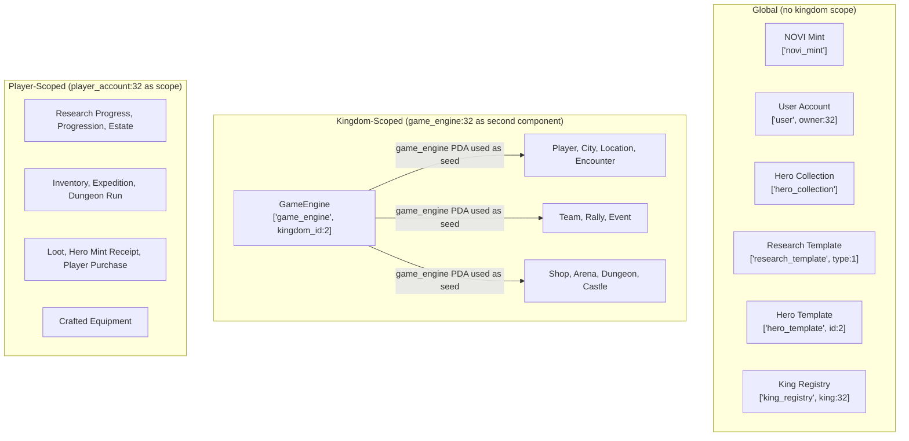
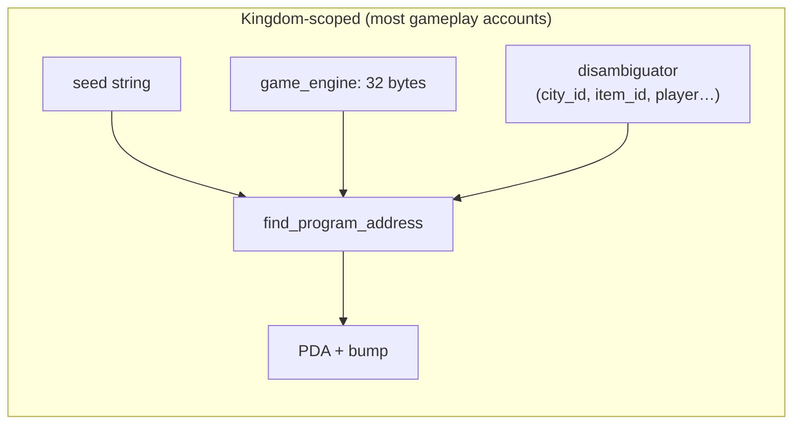
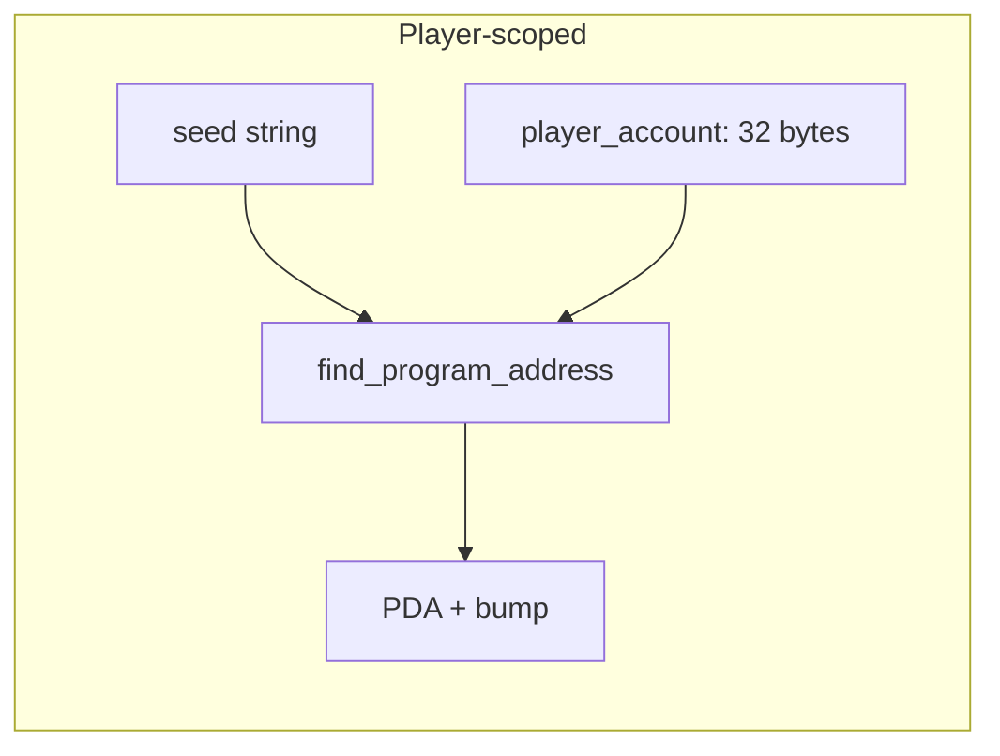
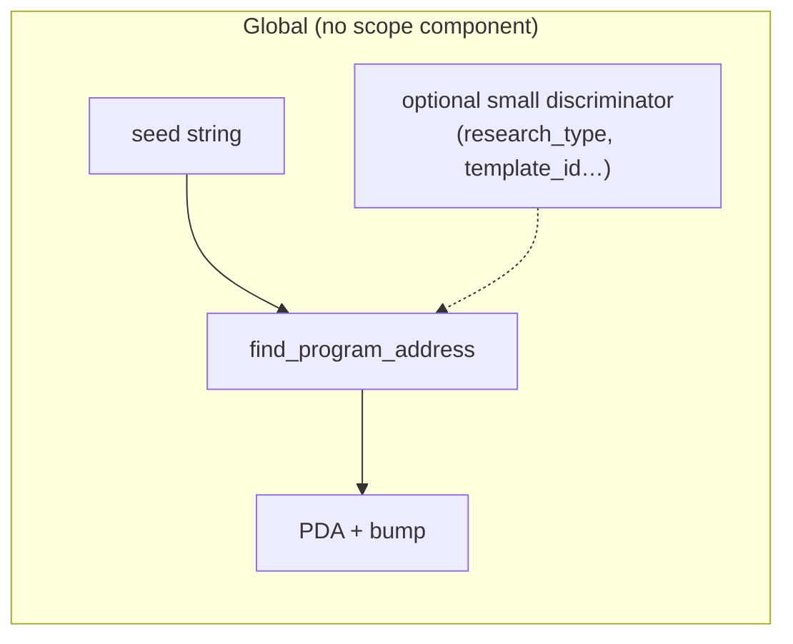

# PDA Seeds Reference

> Every Program Derived Address used in Novus Mundus — seed arrays, component widths, and deriving source.

All PDAs use `find_program_address` / `create_program_address` with the program ID `J4DxMg1RfwRzjpZ3N6D1ULNjuwLHuhe6qLNeX9rYNz3V`. Byte widths are listed per component. The bump byte is never part of the `find_program_address` input — it is appended only in `create_program_address` calls.

[Source: constants.rs](../../../programs/novus_mundus/src/constants.rs) — seed string constants  
[Source: state/](../../../programs/novus_mundus/src/state/) — `derive_pda` implementations

---

## Overview

PDAs in Novus Mundus fall into three scoping tiers. Understanding which tier an account belongs to tells you immediately what seed components are required to derive it.

### How seeds compose

Each PDA is a deterministic hash of its seed array plus the program ID. The diagram below shows the pattern for the three most common layouts:

Multi-kingdom note: nearly every gameplay PDA includes `game_engine` (the kingdom's `GameEngine` PDA, a 32-byte `Address`) as a scope component. Only program-global or player-owned PDAs omit it.

---

## Core & Global Accounts

These accounts are program-global (no `game_engine` scoping).

| Account | Seed String Constant | Full Seed Array | Deriving Source |
|---------|---------------------|-----------------|-----------------|
| **NOVI Mint** | `NOVI_MINT_SEED = "novi_mint"` | `["novi_mint"]` | Compile-time (`const_crypto`); also `find_program_address` at runtime |
| **User Account** | `USER_SEED = "user"` | `["user", owner: 32 bytes]` | `state/player.rs` `UserAccount::derive_pda` |
| **Hero Collection** | `HERO_COLLECTION_SEED = "hero_collection"` | `["hero_collection"]` | `processor/hero/create_collection.rs` (global singleton) |
| **Research Template** | `RESEARCH_TEMPLATE_SEED = "research_template"` | `["research_template", research_type: 1 byte (u8)]` | `state/research.rs` `ResearchTemplate::derive_pda` |
| **Building Template** | `BUILDING_TEMPLATE_SEED = "building_template"` | `["building_template", building_type: 1 byte (u8)]` | `state/building_template.rs` `BuildingTemplate::derive_pda` |
| **Oracle Quote** | `ORACLE_QUOTE_SEED = "oracle_quote"` | `["oracle_quote", switchboard_queue: 32 bytes]` | `state/oracle_quote.rs` `OracleQuotePda::derive_pda` |
| **Hero Template** | `HERO_TEMPLATE_SEED = "hero_template"` | `["hero_template", template_id: 2 bytes (u16 LE)]` | `state/hero.rs` `HeroTemplate::derive_pda` |
| **King Registry** | `KING_REGISTRY_SEED = "king_registry"` | `["king_registry", king: 32 bytes]` | `state/castle.rs` `KingRegistry::derive_pda` |

---

## Kingdom-Scoped Accounts

These PDAs include `game_engine` (the kingdom `GameEngine` PDA, 32 bytes) as the second component, providing per-kingdom namespacing.

### Game Engine

| Account | Seed String Constant | Full Seed Array | Deriving Source |
|---------|---------------------|-----------------|-----------------|
| **GameEngine** | `GAME_ENGINE_SEED = "game_engine"` | `["game_engine", kingdom_id: 2 bytes (u16 LE)]` | `state/game_engine.rs` `GameEngine::derive_pda` |

### Player Accounts

| Account | Seed String Constant | Full Seed Array | Deriving Source |
|---------|---------------------|-----------------|-----------------|
| **Player Account** | `PLAYER_SEED = "player"` | `["player", game_engine: 32 bytes, owner: 32 bytes]` | `state/player.rs` `PlayerAccount::derive_pda` |

### City & Location

| Account | Seed String Constant | Full Seed Array | Deriving Source |
|---------|---------------------|-----------------|-----------------|
| **City** | `CITY_SEED = "city"` | `["city", game_engine: 32 bytes, city_id: 2 bytes (u16 LE)]` | `state/city.rs` `CityAccount::derive_pda` |
| **Location** | `LOCATION_SEED = "location"` | `["location", game_engine: 32 bytes, city_id: 2 bytes (u16 LE), grid_lat: 4 bytes (i32 LE), grid_long: 4 bytes (i32 LE)]` | `state/location.rs` `LocationAccount::derive_pda` |
| **Encounter** | `ENCOUNTER_SEED = "encounter"` | `["encounter", game_engine: 32 bytes, city_id: 2 bytes (u16 LE), encounter_id: 8 bytes (u64 LE)]` | `state/encounter.rs` `EncounterAccount::derive_pda` |

### Team System

| Account | Seed String Constant | Full Seed Array | Deriving Source |
|---------|---------------------|-----------------|-----------------|
| **Team** | `TEAM_SEED = "team"` | `["team", game_engine: 32 bytes, team_id: 8 bytes (u64 LE)]` | `state/team.rs` `TeamAccount::derive_pda` |
| **Team Member Slot** | `TEAM_SLOT_SEED = "team_slot"` | `["team_slot", team: 32 bytes, slot_index: 2 bytes (u16 LE)]` | `state/team.rs` `TeamMemberSlot::derive_pda` |
| **Team Invite** | `TEAM_INVITE_SEED = "team_invite"` | `["team_invite", team: 32 bytes, invitee: 32 bytes]` | `state/team.rs` `TeamInviteAccount::derive_pda` |
| **Treasury Request** | `TREASURY_REQUEST_SEED = "treasury_request"` | `["treasury_request", team: 32 bytes, requester: 32 bytes]` | `state/team.rs` `TreasuryRequest::derive_pda` |

### Rally System

| Account | Seed String Constant | Full Seed Array | Deriving Source |
|---------|---------------------|-----------------|-----------------|
| **Rally** | `RALLY_SEED = "rally"` | `["rally", game_engine: 32 bytes, creator: 32 bytes, rally_id: 8 bytes (u64 LE)]` | `state/rally.rs` `RallyAccount::derive_pda` |
| **Rally Participant** | `RALLY_PARTICIPANT_SEED = "rally_participant"` | `["rally_participant", game_engine: 32 bytes, rally_creator: 32 bytes, rally_id: 8 bytes (u64 LE), participant: 32 bytes]` | `state/rally.rs` `RallyParticipantAccount::derive_pda` |

### Events

| Account | Seed String Constant | Full Seed Array | Deriving Source |
|---------|---------------------|-----------------|-----------------|
| **Event** | `EVENT_SEED = "event"` | `["event", game_engine: 32 bytes, event_id: 8 bytes (u64 LE)]` | `state/event.rs` `EventAccount::derive_pda` |
| **Event Participation** | `EVENT_PARTICIPATION_SEED = "event_participation"` | `["event_participation", game_engine: 32 bytes, event_id: 8 bytes (u64 LE), player_owner: 32 bytes]` | `state/event.rs` `EventParticipationAccount::derive_pda` |

> The seed string is `"event_participation"` — not `"participation"`.

### Shop System

| Account | Seed String Constant | Full Seed Array | Deriving Source |
|---------|---------------------|-----------------|-----------------|
| **Shop Config** | `SHOP_CONFIG_SEED = "shop_config"` | `["shop_config", game_engine: 32 bytes]` | `state/shop.rs` `ShopConfig::derive_pda` |
| **Shop Item** | `SHOP_ITEM_SEED = "shop_item"` | `["shop_item", game_engine: 32 bytes, item_id: 4 bytes (u32 LE)]` | `state/shop.rs` `ShopItem::derive_pda` |
| **Bundle** | `BUNDLE_SEED = "bundle"` | `["bundle", game_engine: 32 bytes, bundle_id: 4 bytes (u32 LE)]` | `state/shop.rs` `ShopBundle::derive_pda` |
| **Daily Deal** | `DAILY_DEAL_SEED = "daily_deal"` | `["daily_deal", game_engine: 32 bytes, slot_index: 1 byte (u8)]` | `state/shop.rs` `DailyDeal::derive_pda` |
| **Flash Sale** | `FLASH_SALE_SEED = "flash_sale"` | `["flash_sale", game_engine: 32 bytes, sale_id: 8 bytes (u64 LE)]` | `state/shop.rs` `FlashSale::derive_pda` |
| **Weekly Sale** | `WEEKLY_SALE_SEED = "weekly_sale"` | `["weekly_sale", game_engine: 32 bytes, week_number: 8 bytes (u64 LE)]` | `state/shop.rs` `WeeklySale::derive_pda` |
| **Seasonal Sale** | `SEASONAL_SALE_SEED = "seasonal_sale"` | `["seasonal_sale", game_engine: 32 bytes, event: 32 bytes]` | `state/shop.rs` `SeasonalSale::derive_pda` |
| **DAO Promotion** | `DAO_PROMOTION_SEED = "dao_promo"` | `["dao_promo", game_engine: 32 bytes, proposal_id: 8 bytes (u64 LE)]` | `state/shop.rs` `DaoPromotion::derive_pda` |
| **Allowed Token** | `ALLOWED_TOKEN_SEED = "allowed_token"` | `["allowed_token", game_engine: 32 bytes, token_mint: 32 bytes]` | `state/shop.rs` `AllowedToken::derive_pda` |

### Arena PvP System

| Account | Seed String Constant | Full Seed Array | Deriving Source |
|---------|---------------------|-----------------|-----------------|
| **Arena Season** | `ARENA_SEASON_SEED = "arena_season"` | `["arena_season", game_engine: 32 bytes, season_id: 4 bytes (u32 LE)]` | `state/arena.rs` `ArenaSeason::derive_pda` |
| **Arena Participant** | `ARENA_PARTICIPANT_SEED = "arena_participant"` | `["arena_participant", game_engine: 32 bytes, season_id: 4 bytes (u32 LE), player: 32 bytes]` | `state/arena.rs` `ArenaParticipant::derive_pda` |
| **Arena Loadout** | `ARENA_LOADOUT_SEED = "arena_loadout"` | `["arena_loadout", game_engine: 32 bytes, player: 32 bytes]` | `state/arena.rs` `ArenaLoadout::derive_pda` |

### Dungeon System

| Account | Seed String Constant | Full Seed Array | Deriving Source |
|---------|---------------------|-----------------|-----------------|
| **Dungeon Template** | `DUNGEON_TEMPLATE_SEED = "dungeon_template"` | `["dungeon_template", dungeon_id: 2 bytes (u16 LE)]` | `state/dungeon.rs` `DungeonTemplate::derive_pda` |
| **Dungeon Leaderboard** | `DUNGEON_LEADERBOARD_SEED = "dungeon_leaderboard"` | `["dungeon_leaderboard", game_engine: 32 bytes, dungeon_id: 2 bytes (u16 LE), week_number: 2 bytes (u16 LE)]` | `state/dungeon.rs` `DungeonLeaderboard::derive_pda` |

### Castle System

| Account | Seed String Constant | Full Seed Array | Deriving Source |
|---------|---------------------|-----------------|-----------------|
| **Castle** | `CASTLE_SEED = "castle"` | `["castle", game_engine: 32 bytes, city_id: 2 bytes (u16 LE), castle_id: 2 bytes (u16 LE)]` | `state/castle.rs` `CastleAccount::derive_pda` |
| **Court Position** | `COURT_SEED = "court"` | `["court", castle: 32 bytes, position_type: 1 byte (u8)]` | `state/castle.rs` `CourtPosition::derive_pda` |
| **Team Castle Reward** | `TEAM_CASTLE_REWARD_SEED = "team_castle_reward"` | `["team_castle_reward", castle: 32 bytes, member: 32 bytes]` | `state/castle.rs` `TeamCastleRewardAccount::derive_pda` |

---

## Player-Scoped Accounts

These PDAs use the player's `PlayerAccount` PDA (32 bytes) rather than `game_engine` as the scope component.

| Account | Seed String Constant | Full Seed Array | Deriving Source |
|---------|---------------------|-----------------|-----------------|
| **Research Progress** | `RESEARCH_SEED = "research"` | `["research", player_account: 32 bytes]` | `state/research.rs` `ResearchProgress::derive_pda` |
| **Progression** | `PROGRESSION_SEED = "progression"` | `["progression", player_account: 32 bytes]` | `state/progression.rs` `ProgressionAccount::derive_pda` |
| **Estate** | `ESTATE_SEED = "estate"` | `["estate", player_account: 32 bytes]` | `state/estate.rs` `EstateAccount::derive_pda` |
| **Inventory** | `INVENTORY_SEED = "inventory"` | `["inventory", player_account: 32 bytes]` | `state/inventory.rs` `Inventory::derive_pda` |
| **Expedition** | `EXPEDITION_SEED = "expedition"` | `["expedition", player_account: 32 bytes]` | `state/expedition.rs` `ExpeditionAccount::derive_pda` |
| **Dungeon Run** | `DUNGEON_RUN_SEED = "dungeon_run"` | `["dungeon_run", player_account: 32 bytes]` | `state/dungeon.rs` `DungeonRun::derive_pda` |
| **Hero Mint Receipt** | `HERO_MINT_RECEIPT_SEED = "hero_mint_receipt"` | `["hero_mint_receipt", player_account: 32 bytes, template_id: 2 bytes (u16 LE)]` | `processor/hero/mint.rs` |
| **Loot Account** | `LOOT_SEED = "loot"` | `["loot", player_account: 32 bytes, loot_id: 8 bytes (u64 LE)]` | `state/loot.rs` `LootAccount::derive_pda` |
| **Player Purchase** | `PLAYER_PURCHASE_SEED = "player_purchase"` | `["player_purchase", player_account: 32 bytes, item_id: 4 bytes (u32 LE)]` | `state/shop.rs` `PlayerPurchase::derive_pda` |
| **Crafted Equipment** | (inline `b"crafted_equipment"`) | `["crafted_equipment", owner_wallet: 32 bytes]` | `state/estate.rs` `CraftedEquipmentAccount::derive_pda` |

---

## Strategic Combat Accounts

These use `game_engine` for kingdom scope plus participant and target addresses.

| Account | Seed String Constant | Full Seed Array | Deriving Source |
|---------|---------------------|-----------------|-----------------|
| **Reinforcement** | `REINFORCEMENT_SEED = "reinforcement"` | `["reinforcement", game_engine: 32 bytes, sender: 32 bytes, destination: 32 bytes]` | `state/reinforcement.rs` `ReinforcementAccount::derive_player_pda` |
| **Garrison (reinforcement)** | `GARRISON_SEED = "garrison"` | `["garrison", game_engine: 32 bytes, sender: 32 bytes, castle: 32 bytes]` | `state/reinforcement.rs` `ReinforcementAccount::derive_castle_pda` |
| **Garrison (castle contribution)** | `GARRISON_SEED = "garrison"` | `["garrison", castle: 32 bytes, contributor: 32 bytes]` | `state/castle.rs` `GarrisonContributionAccount::derive_pda` |

> `GARRISON_SEED` is used in two distinct contexts with different component layouts: the reinforcement context scopes by `game_engine` + `sender` + `castle`, while the castle contribution context scopes by `castle` + `contributor`.

---

## All Seed String Constants (Summary)

| Constant | Seed String |
|----------|-------------|
| `GAME_ENGINE_SEED` | `"game_engine"` |
| `NOVI_MINT_SEED` | `"novi_mint"` |
| `PLAYER_SEED` | `"player"` |
| `USER_SEED` | `"user"` |
| `CITY_SEED` | `"city"` |
| `TEAM_SEED` | `"team"` |
| `TEAM_SLOT_SEED` | `"team_slot"` |
| `TEAM_INVITE_SEED` | `"team_invite"` |
| `TREASURY_REQUEST_SEED` | `"treasury_request"` |
| `LOCATION_SEED` | `"location"` |
| `RALLY_SEED` | `"rally"` |
| `RALLY_PARTICIPANT_SEED` | `"rally_participant"` |
| `REINFORCEMENT_SEED` | `"reinforcement"` |
| `GARRISON_SEED` | `"garrison"` |
| `ENCOUNTER_SEED` | `"encounter"` |
| `EVENT_SEED` | `"event"` |
| `EVENT_PARTICIPATION_SEED` | `"event_participation"` |
| `PROGRESSION_SEED` | `"progression"` |
| `LOOT_SEED` | `"loot"` |
| `RESEARCH_SEED` | `"research"` |
| `RESEARCH_TEMPLATE_SEED` | `"research_template"` |
| `BUILDING_TEMPLATE_SEED` | `"building_template"` |
| `HERO_TEMPLATE_SEED` | `"hero_template"` |
| `HERO_COLLECTION_SEED` | `"hero_collection"` |
| `HERO_MINT_RECEIPT_SEED` | `"hero_mint_receipt"` |
| `SHOP_CONFIG_SEED` | `"shop_config"` |
| `SHOP_ITEM_SEED` | `"shop_item"` |
| `BUNDLE_SEED` | `"bundle"` |
| `DAILY_DEAL_SEED` | `"daily_deal"` |
| `FLASH_SALE_SEED` | `"flash_sale"` |
| `WEEKLY_SALE_SEED` | `"weekly_sale"` |
| `SEASONAL_SALE_SEED` | `"seasonal_sale"` |
| `DAO_PROMOTION_SEED` | `"dao_promo"` |
| `PLAYER_PURCHASE_SEED` | `"player_purchase"` |
| `INVENTORY_SEED` | `"inventory"` |
| `ALLOWED_TOKEN_SEED` | `"allowed_token"` |
| `ORACLE_QUOTE_SEED` | `"oracle_quote"` |
| `ESTATE_SEED` | `"estate"` |
| `EXPEDITION_SEED` | `"expedition"` |
| `ARENA_SEASON_SEED` | `"arena_season"` |
| `ARENA_PARTICIPANT_SEED` | `"arena_participant"` |
| `ARENA_LOADOUT_SEED` | `"arena_loadout"` |
| `DUNGEON_TEMPLATE_SEED` | `"dungeon_template"` |
| `DUNGEON_RUN_SEED` | `"dungeon_run"` |
| `DUNGEON_LEADERBOARD_SEED` | `"dungeon_leaderboard"` |
| `CASTLE_SEED` | `"castle"` |
| `COURT_SEED` | `"court"` |
| `KING_REGISTRY_SEED` | `"king_registry"` |
| `TEAM_CASTLE_REWARD_SEED` | `"team_castle_reward"` |
| (inline) | `"crafted_equipment"` |
