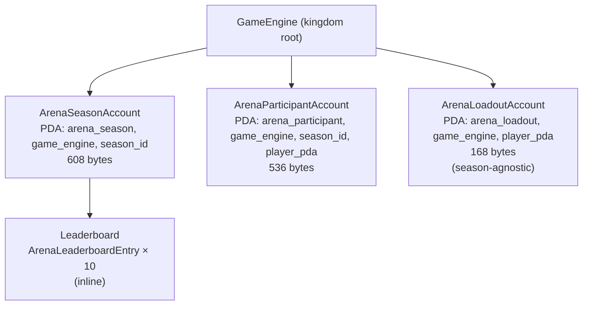
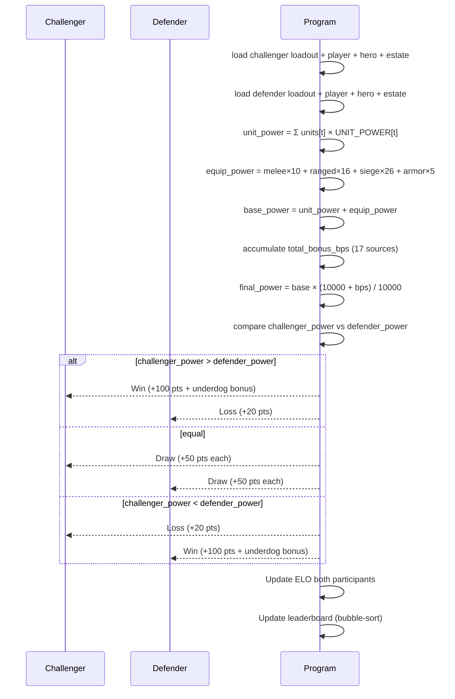
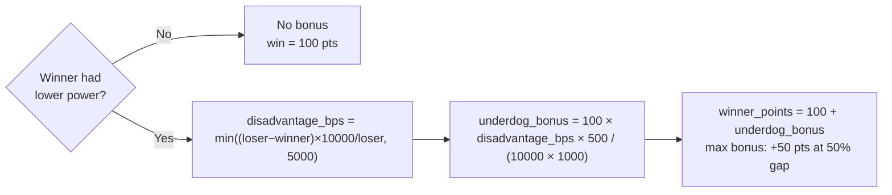
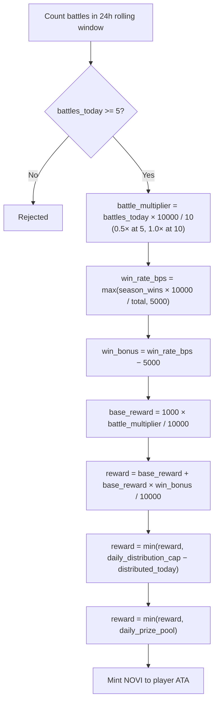
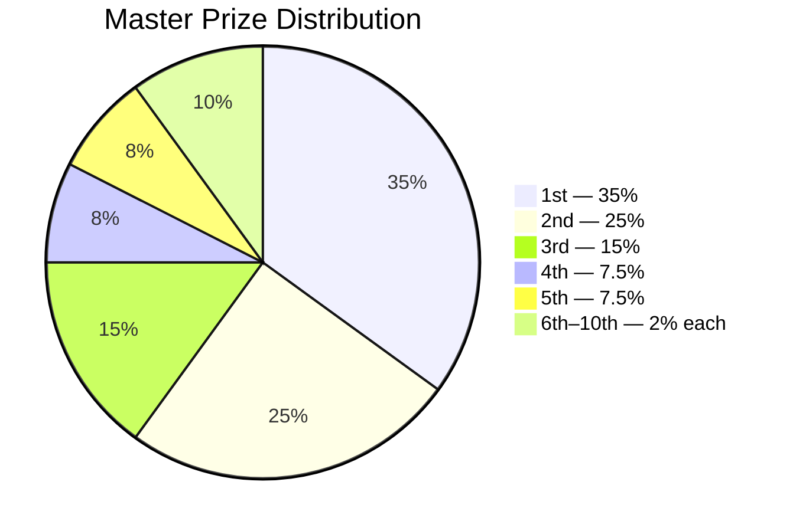
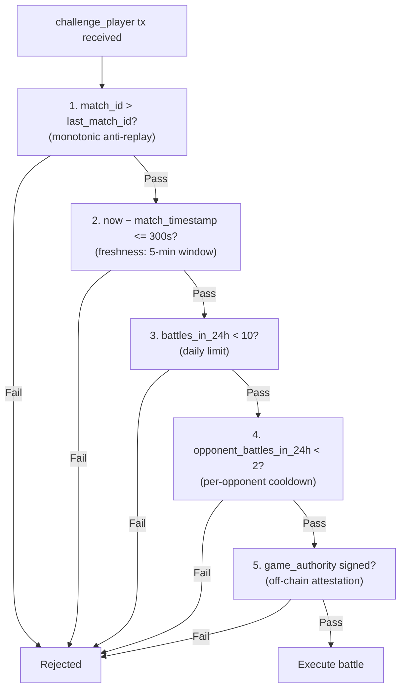
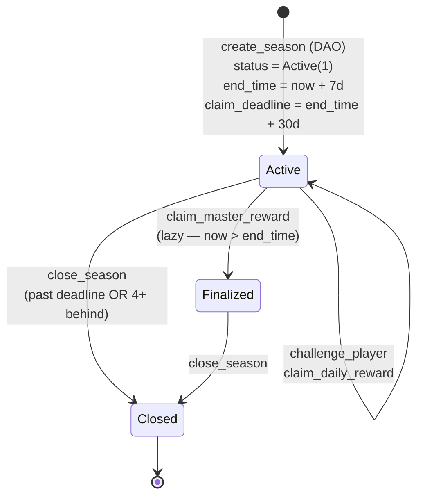

# Arena PvP System — Technical Reference

> On-chain specification for Novus Mundus Arena: accounts, instruction schemas, ELO math, prize distribution, and anti-replay.

---

## Table of Contents

1. [Architecture Overview](#architecture-overview)
2. [Account Structures](#account-structures)
3. [Instruction Reference](#instruction-reference)
4. [Combat & Power Formula](#combat--power-formula)
5. [ELO Rating System](#elo-rating-system)
6. [Points System](#points-system)
7. [Reward Mechanics](#reward-mechanics)
8. [Anti-Replay Mechanisms](#anti-replay-mechanisms)
9. [Season Lifecycle](#season-lifecycle)

---

## Architecture Overview

The Arena system consists of three on-chain account types and seven instructions. All accounts are **kingdom-scoped** via the `game_engine` PDA. There are no stored battle records — combat is fully resolved within a single `challenge_player` transaction.



```
GameEngine (kingdom root)
├── ArenaSeasonAccount  [PDA: arena_season, game_engine, season_id]
│   └── Leaderboard [ArenaLeaderboardEntry × 10]  (inline)
├── ArenaParticipantAccount  [PDA: arena_participant, game_engine, season_id, player_pda]
└── ArenaLoadoutAccount  [PDA: arena_loadout, game_engine, player_pda]
```

Key design decisions:
- **Stateless combat:** No battle account is created; ELO and points update in-place.
- **Off-chain matchmaking:** `game_authority` co-signs every `challenge_player` to attest the match is legitimate.
- **Loadout trust:** Loadouts are not validated against current assets at update time; power is computed from whatever values are stored. Players are responsible for keeping loadouts accurate.
- **Permissionless rewards:** Both `claim_daily_reward` and `claim_master_reward` are permissionless — anyone can invoke them for any player.

---

## Account Structures

### ArenaSeasonAccount

**Size:** 608 bytes (compile-time verified)
**PDA seeds:** `[b"arena_season", game_engine, season_id.to_le_bytes()]`

```rust
#[repr(C)]
pub struct ArenaSeasonAccount {
    pub account_key:                u8,         // 1  — AccountKey::ArenaSeason
    // Identity
    pub game_engine:                Address,    // 32 — kingdom
    pub season_id:                  u32,        // 4
    pub city_id:                    u16,        // 2  — 0 = kingdom-wide
    pub authority:                  Address,    // 32 — DAO; receives rent on close
    // Timing
    pub start_time:                 i64,        // 8
    pub end_time:                   i64,        // 8  — start + 7 days
    pub claim_deadline:             i64,        // 8  — end + 30 days
    pub status:                     u8,         // 1  — ArenaStatus enum
    // Leaderboard
    pub leaderboard:                [ArenaLeaderboardEntry; 10], // 400
    pub leaderboard_count:          u8,         // 1
    pub leaderboard_claimed:        [bool; 10], // 10
    // Prize pool
    pub master_prize_pool:          u64,        // 8
    pub daily_prize_pool:           u64,        // 8
    pub daily_distribution_cap:     u64,        // 8
    pub distributed_today:          u64,        // 8
    pub last_distribution_day:      u32,        // 4
    pub _padding1:                  [u8; 4],    // 4
    pub prize_remaining:            u64,        // 8
    // Thresholds
    pub min_level_required:         u8,         // 1
    pub _padding2:                  [u8; 7],    // 7
    pub min_points_for_leaderboard: u64,        // 8  — default 500
    pub total_battles:              u64,        // 8
    pub bump:                       u8,         // 1
    pub _reserved:                  [u8; 7],    // 7
}

// inline entry — 40 bytes each
#[repr(C)]
pub struct ArenaLeaderboardEntry {
    pub player:       Address, // 32
    pub total_points: u64,     // 8
}
```

**ArenaStatus:**
```rust
#[repr(u8)]
pub enum ArenaStatus {
    Pending = 0,              // unused; seasons start Active
    Active = 1,
    Finalized = 2,
    RewardsDistributed = 3,
}
```

### ArenaParticipantAccount

**Size:** 536 bytes (compile-time verified)
**PDA seeds:** `[b"arena_participant", game_engine, season_id.to_le_bytes(), player_account_pda]`

> The fourth seed is the **PlayerAccount PDA** (derived from `[b"player", game_engine, owner_wallet]`), not the owner wallet itself.

```rust
#[repr(C)]
pub struct ArenaParticipantAccount {
    pub account_key:              u8,
    // Identity
    pub game_engine:              Address,    // 32
    pub player:                   Address,    // 32 — PlayerAccount PDA
    pub season_id:                u32,
    // Battle tracking (circular buffer)
    pub battle_timestamps:        [i64; 10],  // 80 — last 10 battle times
    pub battle_opponents:         [Address; 10], // 320 — corresponding opponents
    pub battle_index:             u8,         // next write pos (mod 10)
    // Matchmaking
    pub last_match_id:            u64,        // anti-replay; must increase
    pub daily_reward_claimed_day: u32,
    // Rating
    pub elo_rating:               u32,        // starts ARENA_STARTING_ELO=1000
    // Statistics
    pub total_points:             u64,        // season cumulative (never negative)
    pub wins:                     u32,
    pub losses:                   u32,
    // Claim tracking
    pub master_reward_claimed:    bool,
    pub bump:                     u8,
    pub _reserved:                [u8; 17],
}
```

### ArenaLoadoutAccount

**Size:** 168 bytes (compile-time verified)
**PDA seeds:** `[b"arena_loadout", game_engine, player_account_pda]`

Reusable across seasons. Created once on `join_season` if it does not already exist.

```rust
#[repr(C)]
pub struct ArenaLoadoutAccount {
    pub account_key:     u8,
    pub game_engine:     Address,    // 32
    pub player:          Address,    // 32 — PlayerAccount PDA
    pub bump:            u8,
    pub arena_hero:      Address,    // 32 — NFT mint; default pubkey = no hero
    pub defensive_units: [u64; 3],  // 24 — tier 1/2/3
    pub melee_weapons:   u64,
    pub ranged_weapons:  u64,
    pub siege_weapons:   u64,
    pub armor_pieces:    u64,
    pub _reserved:       [u8; 7],
}
```

---

## Instruction Reference

### 230 — `create_season`

**Signers:** `authority` (must be `game_engine.game_authority`)
**Accounts:**

| Index | Flag | Account |
|-------|------|---------|
| 0 | WRITE | `arena_season` — ArenaSeasonAccount PDA (created) |
| 1 | SIGNER, WRITE | `authority` — pays rent |
| 2 | — | `game_engine` — GameEngine PDA |
| 3 | — | `system_program` |

**Instruction data (29 bytes):**
```
[0..4]   season_id:              u32 LE
[4..12]  master_prize_pool:      u64 LE
[12..20] daily_prize_pool:       u64 LE
[20..28] daily_distribution_cap: u64 LE
[28]     min_level_required:     u8
```

Season starts immediately in `Active` status. `end_time = now + 604800` (7 days). `claim_deadline = end_time + 2592000` (30 days).

---

### 231 — `join_season`

**Signers:** `player_authority`
**Accounts:**

| Index | Flag | Account |
|-------|------|---------|
| 0 | WRITE | `arena_season` |
| 1 | WRITE | `participant_account` — ArenaParticipantAccount (created) |
| 2 | WRITE | `loadout_account` — ArenaLoadoutAccount (created if absent) |
| 3 | — | `player_account` — PlayerAccount |
| 4 | SIGNER, WRITE | `player_authority` — pays rent |
| 5 | — | `system_program` |

**Instruction data (4 bytes):** `season_id: u32 LE`

Guards: season `Active` and `now < end_time`; player level ≥ `min_level_required`; participant does not already exist.

---

### 232 — `update_loadout`

**Signers:** `player_authority`
**Accounts:**

| Index | Flag | Account |
|-------|------|---------|
| 0 | WRITE | `loadout_account` — ArenaLoadoutAccount |
| 1 | SIGNER | `player_authority` |

**Instruction data (88 bytes):**
```
[0..32]  arena_hero:          Address (pubkey; default = no hero)
[32..40] defensive_units[0]:  u64 LE  (tier 1)
[40..48] defensive_units[1]:  u64 LE  (tier 2)
[48..56] defensive_units[2]:  u64 LE  (tier 3)
[56..64] melee_weapons:       u64 LE
[64..72] ranged_weapons:       u64 LE
[72..80] siege_weapons:        u64 LE
[80..88] armor_pieces:         u64 LE
```

No asset validation — values are trusted and used as-is in `challenge_player`.

---

### 233 — `challenge_player`

**Signers:** `challenger_authority`, `game_authority`
**Accounts:**

| Index | Flag | Account |
|-------|------|---------|
| 0 | SIGNER | `challenger_authority` — challenger wallet |
| 1 | SIGNER | `game_authority` — attests match legitimacy |
| 2 | — | `game_engine` — GameEngine PDA |
| 3 | — | `challenger_player` — challenger PlayerAccount |
| 4 | WRITE | `challenger_participant` — challenger ArenaParticipantAccount |
| 5 | — | `challenger_loadout` — challenger ArenaLoadoutAccount |
| 6 | — | `challenger_hero` — hero NFT (or any account if no hero) |
| 7 | — | `challenger_estate` — EstateAccount (or any if no estate) |
| 8 | — | `defender_player` — defender PlayerAccount |
| 9 | WRITE | `defender_participant` — defender ArenaParticipantAccount |
| 10 | — | `defender_loadout` — defender ArenaLoadoutAccount |
| 11 | — | `defender_hero` — hero NFT (or any if no hero) |
| 12 | — | `defender_estate` — EstateAccount (or any if no estate) |
| 13 | WRITE | `arena_season` — ArenaSeasonAccount |

**Instruction data (20 bytes):**
```
[0..8]   match_id:        u64 LE  — unique per-match ID from matchmaker
[8..16]  match_timestamp: i64 LE  — when match was assigned
[16..20] season_id:       u32 LE
```

---

### 234 — `claim_daily_reward`

**Signers:** none (permissionless)
**Accounts:**

| Index | Flag | Account |
|-------|------|---------|
| 0 | WRITE | `participant_account` |
| 1 | WRITE | `arena_season` |
| 2 | WRITE | `player_account` |
| 3 | — | `player_owner` |
| 4 | WRITE | `player_novi_ata` — must be owned by PlayerAccount PDA |
| 5 | WRITE | `novi_mint` |
| 6 | — | `game_engine` |
| 7 | — | `token_program` |

**Instruction data (4 bytes):** `season_id: u32 LE`

---

### 235 — `claim_master_reward`

**Signers:** none (permissionless)
**Accounts:** identical layout to `claim_daily_reward` (8 accounts, same order)

**Instruction data (4 bytes):** `season_id: u32 LE`

Auto-finalizes season if `Active` and `now > end_time`.

---

### 236 — `close_season`

**Signers:** none (permissionless)
**Accounts:**

| Index | Flag | Account |
|-------|------|---------|
| 0 | WRITE | `arena_season` — closed; rent transferred |
| 1 | — | `city_account` — CityAccount PDA |
| 2 | WRITE | `season_authority` — must match `season.authority` |

**Instruction data (6 bytes):**
```
[0..4] season_id: u32 LE
[4..6] city_id:   u16 LE
```

Unlock conditions (either suffices):
- `now > season.claim_deadline`
- `city.arena_season_id − season.season_id ≥ 4`

---

## Combat & Power Formula

### Base Power

```
DEFENSIVE_UNIT_POWER = [10, 25, 60]   // tier 1 / 2 / 3
WEAPON_POWER         = melee×10 + ranged×16 + siege×26 + armor×5

unit_power  = Σ (defensive_units[t] × DEFENSIVE_UNIT_POWER[t])
base_power  = unit_power + WEAPON_POWER
```

### Bonus Accumulation

```
total_bonus_bps =
    player.research_attack_bps()           +  // from ResearchProgress
    player.research_defense_bps()          +
    player.hero_attack_bps()               +  // cached from active heroes
    player.hero_defense_bps()             +
    player.hero_weapon_efficiency_bps()   +
    player.hero_armor_efficiency_bps()    +
    Σ player.slot_location_bonus_at(i) for i in 0..3 +
    player.blessed_hero_bonus_bps()       +
    player.equipped_weapon_bonus_bps()    +
    player.equipped_armor_bonus_bps()     +
    arena_hero_attack_bps                 +  // from NFT attribute parsing
    arena_hero_defense_bps                +  //   (BuffStat::AttackPower + DefensePower)
    estate.attack_bps                     +
    estate.defense_bps                    +
    estate.pvp_damage_bps                 +
    estate.unit_effectiveness_bps         +
    estate.arena_damage_bps
```

### Final Power

```
final_power = base_power × (10000 + total_bonus_bps) / 10000
```

**Winner:** `challenger_power > defender_power`. Draw if equal.



---

## ELO Rating System

Constants:
```
ARENA_STARTING_ELO = 1000
ARENA_ELO_K_FACTOR = 32
ELO_FLOOR          = 100
```

### Expected Score (lookup table)

```
diff = defender_elo − challenger_elo (signed)

challenger_expected_score =
    |diff| ≤ 50        → 50
    50 < |diff| ≤ 100  → 36 (if diff > 0, i.e. defender stronger) else 64
    100 < |diff| ≤ 200 → 24 / 76
    200 < |diff| ≤ 300 → 15 / 85
    |diff| > 300       → 9  / 91

defender_expected_score = 100 − challenger_expected_score
```

### Delta Calculation

```
actual_score = 100 (win), 50 (draw), 0 (loss)

delta   = K_FACTOR × (actual − expected) / 100
new_elo = max(old_elo + delta, ELO_FLOOR)
```

Example (1000 vs 1000, challenger wins):
```
expected = 50, actual = 100
delta    = 32 × (100 − 50) / 100 = +16
new_elo  = 1016
```

---

## Points System

### Base Points

```
ARENA_BASE_WIN_POINTS  = 100
ARENA_BASE_LOSS_POINTS = 20
ARENA_DRAW_POINTS      = 50
```

### Underdog Bonus

Applied when the winner had **lower** power than the loser:



```
disadvantage_bps = min(
    (loser_power − winner_power) × 10000 / loser_power,
    5000
)

ARENA_UNDERDOG_BONUS_BPS = 500  // 5% per 10% disadvantage

underdog_bonus = base_win_points × disadvantage_bps × ARENA_UNDERDOG_BONUS_BPS
                 / (10000 × 1000)

winner_points  = base_win_points + underdog_bonus
loser_points   = ARENA_BASE_LOSS_POINTS
```

Maximum bonus: +50% of base win points when `disadvantage_bps = 5000`.

### Leaderboard Eligibility

Minimum 500 `total_points` to appear on the leaderboard. Leaderboard is updated after every `challenge_player` call for both participants via an in-place bubble-sort.

---

## Reward Mechanics

### Daily Reward Calculation



```rust
// Constants
ARENA_MIN_BATTLES_FOR_DAILY_REWARD = 5
ARENA_MAX_DAILY_BATTLES            = 10
ARENA_DAILY_BASE_REWARD            = 1000  // = 100 NOVI (1 decimal place)

// Step 1: Battle multiplier (0.5× at 5 battles, 1.0× at 10)
battle_multiplier = battles_today × 10000 / 10

// Step 2: Win rate from SEASON CUMULATIVE stats
total_battles = season_wins + season_losses
if total_battles == 0:
    win_rate_bps = 5000
else:
    win_rate_bps = max(season_wins × 10000 / total_battles, 5000)

// Step 3: Win bonus (0–5000 bps above the 50% neutral)
win_bonus = win_rate_bps − 5000

// Step 4: Apply multipliers
base_reward   = ARENA_DAILY_BASE_REWARD × battle_multiplier / 10000
win_bonus_amt = base_reward × win_bonus / 10000
reward        = base_reward + win_bonus_amt

// Step 5: Cap
reward = min(reward, daily_distribution_cap − distributed_today)
reward = min(reward, daily_prize_pool)
```

### Prize Distribution (Master + Leaderboard)

Both arena master rewards and dungeon leaderboard prizes use the same distribution:

```
ARENA_PRIZE_DISTRIBUTION = [3500, 2500, 1500, 750, 750, 200, 200, 200, 200, 200]
// Sum = 10000 bps (compile-time verified)

reward[rank] = prize_pool × ARENA_PRIZE_DISTRIBUTION[rank_0indexed] / 10000
```



| Rank | Distribution (bps) | Percentage |
|------|--------------------|------------|
| 1 | 3500 | 35.0% |
| 2 | 2500 | 25.0% |
| 3 | 1500 | 15.0% |
| 4 | 750 | 7.5% |
| 5 | 750 | 7.5% |
| 6 | 200 | 2.0% |
| 7 | 200 | 2.0% |
| 8 | 200 | 2.0% |
| 9 | 200 | 2.0% |
| 10 | 200 | 2.0% |

Rewards are minted as NOVI tokens directly to the player's ATA, and also added to `player.locked_novi`.

---

## Anti-Replay Mechanisms



The arena implements three independent anti-replay layers:

### 1. Match ID Monotonicity

Every `challenge_player` call must include a `match_id: u64` that is **strictly greater** than `participant.last_match_id`. The value is written on success.

```
guard: match_id > challenger_participant.last_match_id
action: challenger_participant.last_match_id = match_id
```

This prevents the same match result from being submitted twice.

### 2. Match Timestamp Freshness

```
ARENA_MATCH_EXPIRY_SECONDS = 300  // 5 minutes

guard: now − match_timestamp ≤ 300
guard: match_timestamp ≤ now
```

Stale match assignments (older than 5 minutes) are rejected, limiting the window for front-running or delayed submission.

### 3. Rolling 24-Hour Battle Window

A circular buffer of 10 timestamps prevents more than 10 battles per player per day and more than 2 battles against the same opponent per day.

```
ARENA_MAX_DAILY_BATTLES         = 10
ARENA_MAX_BATTLES_PER_OPPONENT  = 2
Window                          = 86400 seconds (24 hours)

// Battle count check
count_battles_in_window(now, 86400) >= 10  → ArenaDailyBattleLimitReached

// Opponent cooldown check
count_opponent_in_window(&defender_pda, now, 86400) >= 2  → ArenaOpponentCooldownActive
```

### 4. Game Authority Signature

`game_authority` must co-sign every `challenge_player`. Its address is verified against `game_engine.game_authority`. This prevents players from fabricating their own match results.

### 5. Daily Reward Guard

```
guard: participant.daily_reward_claimed_day != today
guard: battles_in_window >= ARENA_MIN_BATTLES_FOR_DAILY_REWARD (5)
action: participant.daily_reward_claimed_day = today
```

### 6. Master Reward Guards

Double-guarded by two independent flags:
```
participant.master_reward_claimed == false  → check passes, set true
season.leaderboard_claimed[rank] == false   → check passes, set true
```

---

## Season Lifecycle



### Timing Constants

```
ARENA_SEASON_DURATION  = 7  × 86400 = 604,800 s  (7 days)
ARENA_CLAIM_DEADLINE   = 30 × 86400 = 2,592,000 s (30 days)

end_time      = start_time + ARENA_SEASON_DURATION
claim_deadline = end_time + ARENA_CLAIM_DEADLINE
```

### Close Conditions

Any caller may invoke `close_season` when either condition is met:
1. `now > claim_deadline` (30 days after season end)
2. `city.arena_season_id − season.season_id ≥ 4` (season is 4+ behind current)

Rent (lamports of the 608-byte account) is transferred to `season.authority`.

---

[Source: state/arena.rs](../../programs/novus_mundus/src/state/arena.rs)
[Source: processor/arena/](../../programs/novus_mundus/src/processor/arena/)
[Source: constants.rs (ARENA_* constants)](../../programs/novus_mundus/src/constants.rs)
