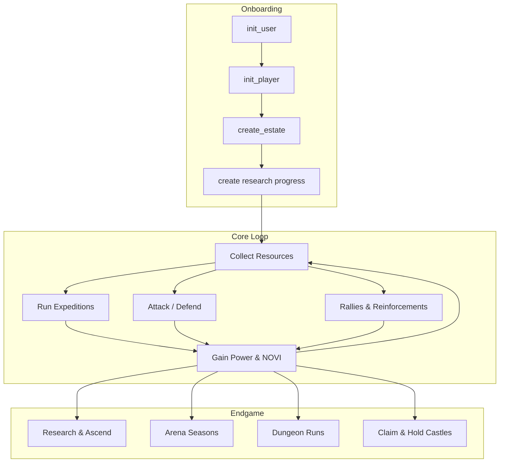
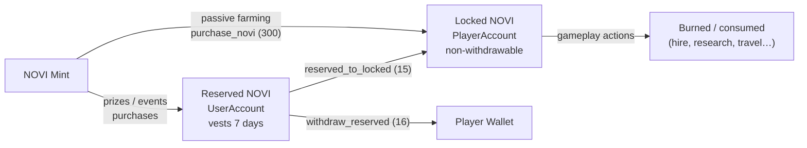
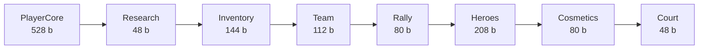
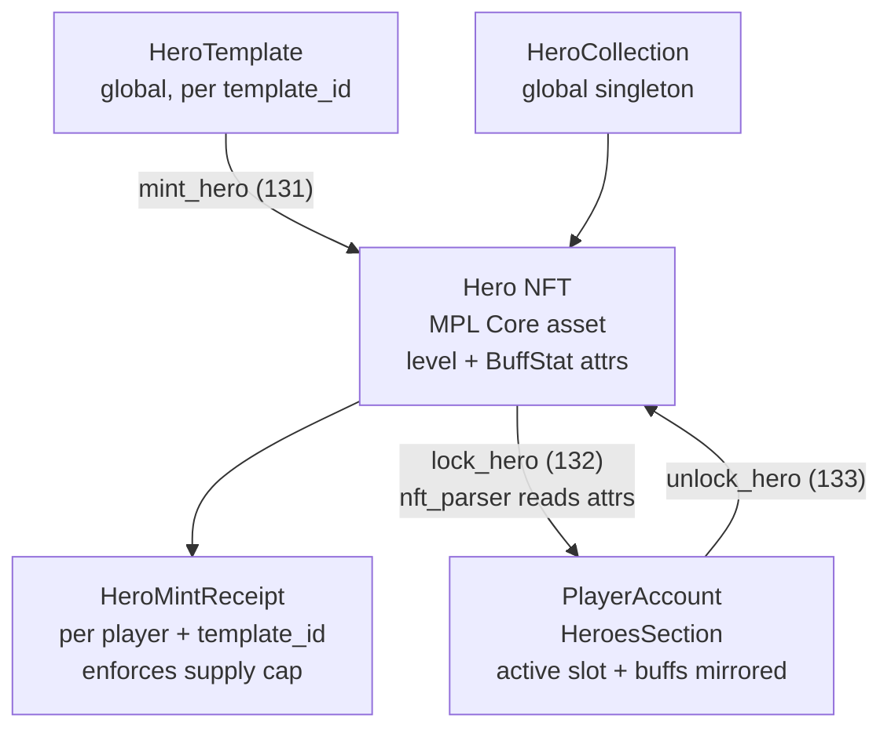
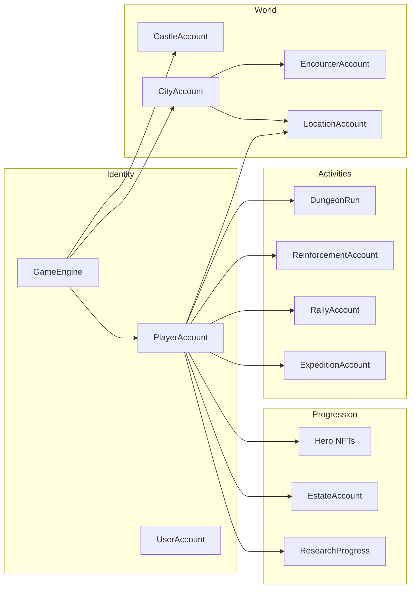

# Novus Mundus On-Chain Documentation

> A complete guide to the Novus Mundus Solana program — architecture, game systems, formulas, and integration patterns.

## What is Novus Mundus?

Novus Mundus ("New World") is a fully on-chain, **multi-kingdom strategy MMO** built on Solana. Players build estates, command MPL Core hero NFTs, research technologies, wage deterministic combat, and compete for territory across a persistent world. Every action — combat, crafting, travel, governance — is a Solana transaction.

The program spans **189 instructions across 27 systems** (~285 Rust files) and is built on the **Pinocchio** framework — `#![no_std]`, no Anchor, manual serialization, `repr(C)` accounts, and 2-byte `u16` little-endian instruction discriminants.

## Design Philosophy

### 1. Multi-Kingdom

Every gameplay account is scoped to a `GameEngine` PDA keyed by `kingdom_id` (`["game_engine", kingdom_id]`). Multiple kingdoms run side-by-side with independent state. Only the NOVI mint (`["novi_mint"]`) and a few global registries are shared across kingdoms.

### 2. Deterministic Golden-Ratio Math

Core systems are deterministic — multipliers come from the golden-ratio family (φ ≈ 1.618, √φ ≈ 1.272, φ² ≈ 2.618, and inverses). There is **no on-chain RNG**. The handful of skill/luck moments (dungeon crits, forge strikes, expedition strikes, estate mini-games, arena outcomes) are verified off-chain and co-signed by the trusted `game_authority`.

### 3. Dual-Token Economy

- **Locked NOVI** (`PlayerAccount.locked_novi`) — gameplay fuel, burned to act, **non-withdrawable**.
- **Reserved NOVI** (`UserAccount.reserved_novi`) — earned from prizes/events/purchases, **withdrawable after a 7-day vesting period**.

Passive farming only ever produces locked NOVI you cannot cash out; reserved NOVI must be earned through competition.

### 4. Progressive Unlocking

`PlayerAccount` grows on demand: a `PlayerCore` (528 bytes) plus up to 7 extension sections (Research → Inventory → Team → Rally → Heroes → Cosmetics → Court) appended as features unlock. Players discover mechanics as they progress.

### 5. Heroes as MPL Core NFTs

Heroes are **MPL Core assets**, not program-owned accounts. The program keeps `HeroTemplate`, a shared `HeroCollection`, and per-player `HeroMintReceipt` accounts, and reads/writes hero level and buffs as NFT attributes — making heroes portable and tradeable.

### 6. Time as a Resource

Travel, research, construction, expeditions, crafting, and reinforcements all take real time. Time gates create pacing and strategic decisions; gems can speed them up.

## System Overview

Account relationships at a glance — the `GameEngine` defines a kingdom, and the `PlayerAccount` is the hub that every player-owned subsystem hangs off:

## Documentation Structure

### [01 - Architecture](./01-architecture/)
Program structure, account types, and instruction routing.
- [Overview](./01-architecture/overview.md) — module layout, dispatch model, design patterns
- [Accounts](./01-architecture/accounts.md) — all 49 account types, PDA seeds, sizes
- [Instruction Map](./01-architecture/instruction-map.md) — complete reference of all 189 instructions

### [02 - Player Journey](./02-player-journey/)
- [Onboarding](./02-player-journey/onboarding.md) — account creation and first steps
- [Progression Gates](./02-player-journey/progression-gates.md) — the extension unlock system
- [Daily Loop](./02-player-journey/daily-loop.md) — a typical player session

### [03 - Economy](./03-economy/)
- [Currencies](./03-economy/currencies.md) — NOVI, gems, fragments, cash, produce
- [Resource Flow](./03-economy/resource-flow.md) — sources, sinks, and circulation
- [Time Value](./03-economy/time-value.md) — time-of-day cycle and activity multipliers

### [04 - Systems](./04-systems/)
The 17 individual game systems, in player-progression order.
- [Combat](./04-systems/combat.md) — deterministic PvP and PvE
- [Travel](./04-systems/travel.md) — intercity, intracity, teleport
- [Heroes](./04-systems/heroes.md) — MPL Core hero NFTs, buffs, burning
- [Research](./04-systems/research.md) — technology tree and ascension
- [Estates](./04-systems/estates.md) — 19 buildings and land management
- [Expeditions](./04-systems/expeditions.md) — mining and fishing
- [Forge](./04-systems/forge.md) — staged-tempering equipment crafting
- [Sanctuary](./04-systems/sanctuary.md) — hero meditation
- [Rallies](./04-systems/rallies.md) — coordinated group attacks
- [Reinforcements](./04-systems/reinforcements.md) — sending troops to allies and castles
- [Teams](./04-systems/teams.md) — guilds, treasury governance
- [Events](./04-systems/events.md) — competitive leaderboard events
- [Shop](./04-systems/shop.md) — items, bundles, sales, NOVI purchase
- [Subscription](./04-systems/subscription.md) — the four paid tiers
- [Arena](./04-systems/arena.md) — seasonal PvP with ELO
- [Dungeon](./04-systems/dungeon.md) — The Catacombs roguelike PvE
- [Castle](./04-systems/castle.md) — King's Castle territorial control

### [05 - Formulas](./05-formulas/)
- [Phi Scaling](./05-formulas/phi-scaling.md) — the golden-ratio progression curves
- [Combat Math](./05-formulas/combat-math.md) — the full damage and casualty pipeline
- [Time Multipliers](./05-formulas/time-multipliers.md) — the 7-period day cycle

### [06 - Reference](./06-reference/)
- [Error Codes](./06-reference/error-codes.md) — all `GameError` variants (codes 6000–8200)
- [Constants](./06-reference/constants.md) — game balance constants
- [Seeds](./06-reference/seeds.md) — every PDA seed pattern

### [ARENA_PVP.md](./ARENA_PVP.md)
A standalone, in-depth technical reference for the Arena PvP system (accounts, instruction account-lists, ELO math, prize distribution).

## Quick Links

| Topic | Source |
|-------|--------|
| Program entry / dispatch | [lib.rs](../../programs/novus_mundus/src/lib.rs) |
| Player state | [state/player.rs](../../programs/novus_mundus/src/state/player.rs) |
| Game engine + sub-configs | [state/game_engine.rs](../../programs/novus_mundus/src/state/game_engine.rs) |
| Combat logic | [logic/combat.rs](../../programs/novus_mundus/src/logic/combat.rs) |
| Golden-ratio math | [logic/golden_math.rs](../../programs/novus_mundus/src/logic/golden_math.rs) |
| Constants | [constants.rs](../../programs/novus_mundus/src/constants.rs) |
| Errors | [error.rs](../../programs/novus_mundus/src/error.rs) |

## For Client Developers

1. Start with the [Instruction Map](./01-architecture/instruction-map.md) for available actions and discriminants.
2. Read [Accounts](./01-architecture/accounts.md) and [Seeds](./06-reference/seeds.md) to derive PDAs and fetch data.
3. Follow the [Player Journey](./02-player-journey/) for the user flow.
4. Handle failures with the [Error Codes](./06-reference/error-codes.md) reference.

The TypeScript SDK at `sdks/novus-mundus-ts/` mirrors the program with instruction builders, state parsers, and calculators, and is the most directly usable integration surface.

## For Protocol Developers

1. Understand the [Architecture Overview](./01-architecture/overview.md).
2. Study [Phi Scaling](./05-formulas/phi-scaling.md) to keep balance consistent.
3. Follow the patterns in the [Systems](./04-systems/) docs.
4. Keep this documentation in sync with the source — it is generated from, and verified against, the Rust code.

---

*This documentation reflects the current state of the Novus Mundus program (post-Pinocchio migration, multi-kingdom). The Rust source is always the ultimate source of truth.*
