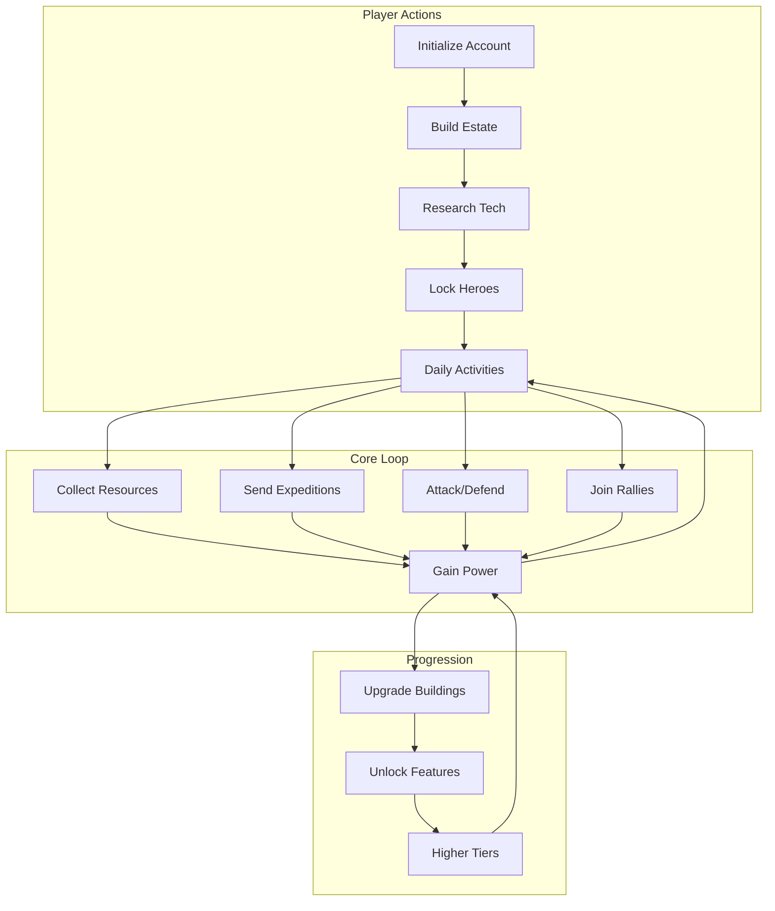
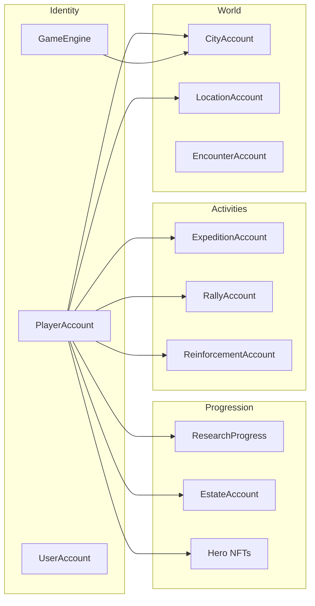

# Novus Mundus On-Chain Documentation

> A comprehensive guide to the Novus Mundus Solana program architecture, game systems, and integration patterns.

## What is Novus Mundus?

Novus Mundus ("New World") is a fully on-chain strategy game built on Solana. Players build estates, command heroes, research technologies, and compete for resources across a persistent world. Every action - from combat to crafting - is executed as a Solana transaction, creating a trustless and transparent gaming experience.



## Design Philosophy

### 1. Progressive Unlocking

Features unlock through a gated extension system. Players don't see everything at once - they discover new mechanics as they progress:

```
Account Created → Research Started → Heroes Unlocked → Rally Access → ...
```

### 2. Time as Currency

Nearly every meaningful action involves time:
- **Travel** between cities takes real time based on distance
- **Research** completes over hours/days
- **Expeditions** lock operatives for their duration
- **Buildings** require construction time

This creates natural pacing and strategic decision-making.

### 3. The Golden Ratio (φ)

The mathematical constant φ (1.618...) appears throughout the game's formulas:
- Hero buff scaling: `base × (√φ)^level`
- Building bonuses grow by φ per level
- Research costs follow φ-based curves

This creates aesthetically pleasing and balanced progression curves.

### 4. NFT-Only Heroes

Hero state lives entirely in MPL Core NFT attributes - not in program accounts. The on-chain program reads from and writes to the NFT, making heroes truly portable and tradeable.

## System Overview



## Documentation Structure

### [01 - Architecture](./01-architecture/)
Deep dive into program structure, account types, and instruction routing.
- [Overview](./01-architecture/overview.md) - Module layout and design patterns
- [Accounts](./01-architecture/accounts.md) - All PDA types and their relationships
- [Instruction Map](./01-architecture/instruction-map.md) - Complete instruction reference

### [02 - Player Journey](./02-player-journey/)
How players progress through the game from first transaction to endgame.
- [Onboarding](./02-player-journey/onboarding.md) - Account creation and first steps
- [Progression Gates](./02-player-journey/progression-gates.md) - The extension unlock system
- [Daily Loop](./02-player-journey/daily-loop.md) - Typical player session activities

### [03 - Economy](./03-economy/)
Currencies, resources, and the economic model.
- [Currencies](./03-economy/currencies.md) - NOVI, gems, fragments, cash, produce
- [Resource Flow](./03-economy/resource-flow.md) - Sources, sinks, and circulation
- [Time Value](./03-economy/time-value.md) - How time gates create economic value

### [04 - Systems](./04-systems/)
Individual game systems explained in depth.
- [Combat](./04-systems/combat.md) - PvP attacks and encounter battles
- [Travel](./04-systems/travel.md) - Movement across the world
- [Heroes](./04-systems/heroes.md) - NFT heroes, buffs, and affinities
- [Research](./04-systems/research.md) - Technology tree and unlocks
- [Estates](./04-systems/estates.md) - Buildings and land management
- [Expeditions](./04-systems/expeditions.md) - Mining and fishing activities
- [Rallies](./04-systems/rallies.md) - Group attacks on cities
- [Reinforcements](./04-systems/reinforcements.md) - Sending troops to allies
- [Forge](./04-systems/forge.md) - Equipment crafting
- [Teams](./04-systems/teams.md) - Guild/clan system
- [Events](./04-systems/events.md) - Competitions and prizes
- [Shop](./04-systems/shop.md) - In-game purchases

### [05 - Formulas](./05-formulas/)
Mathematical foundations of game balance.
- [Phi Scaling](./05-formulas/phi-scaling.md) - Golden ratio in progression
- [Combat Math](./05-formulas/combat-math.md) - Damage and casualty calculations
- [Time Multipliers](./05-formulas/time-multipliers.md) - Duration and bonus formulas

### [06 - Reference](./06-reference/)
Quick-lookup technical reference.
- [Error Codes](./06-reference/error-codes.md) - All GameError variants
- [Constants](./06-reference/constants.md) - Important game constants
- [Seeds](./06-reference/seeds.md) - PDA seed patterns

## Quick Links

| Topic | Description | Source |
|-------|-------------|--------|
| Program Entry | Instruction dispatch | [lib.rs](../../programs/novus_mundus/src/lib.rs) |
| Player State | Main player account | [state/player.rs](../../programs/novus_mundus/src/state/player.rs) |
| Hero System | NFT-based heroes | [state/hero.rs](../../programs/novus_mundus/src/state/hero.rs) |
| Combat Logic | Damage formulas | [logic/combat.rs](../../programs/novus_mundus/src/logic/combat.rs) |
| Estate System | Building mechanics | [state/estate.rs](../../programs/novus_mundus/src/state/estate.rs) |

## For Client Developers

If you're building a frontend or integration:

1. Start with [Instruction Map](./01-architecture/instruction-map.md) to understand available actions
2. Read [Accounts](./01-architecture/accounts.md) to know what data to fetch
3. Check [Player Journey](./02-player-journey/) to understand the user flow
4. Reference [Error Codes](./06-reference/error-codes.md) for handling failures

## For Protocol Developers

If you're modifying the on-chain program:

1. Understand the [Architecture Overview](./01-architecture/overview.md) first
2. Study [Phi Scaling](./05-formulas/phi-scaling.md) to maintain balance consistency
3. Follow existing patterns in [Systems](./04-systems/) documentation
4. Keep this documentation updated with your changes

---

*This documentation reflects the current state of the Novus Mundus program. For the latest changes, always refer to the source code.*
