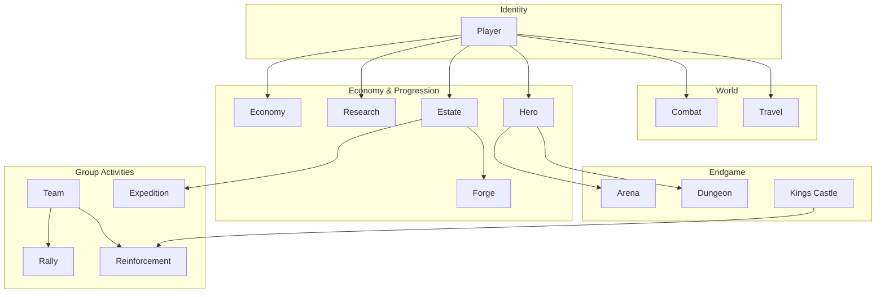
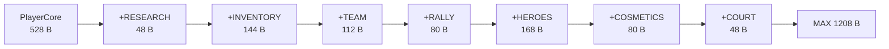
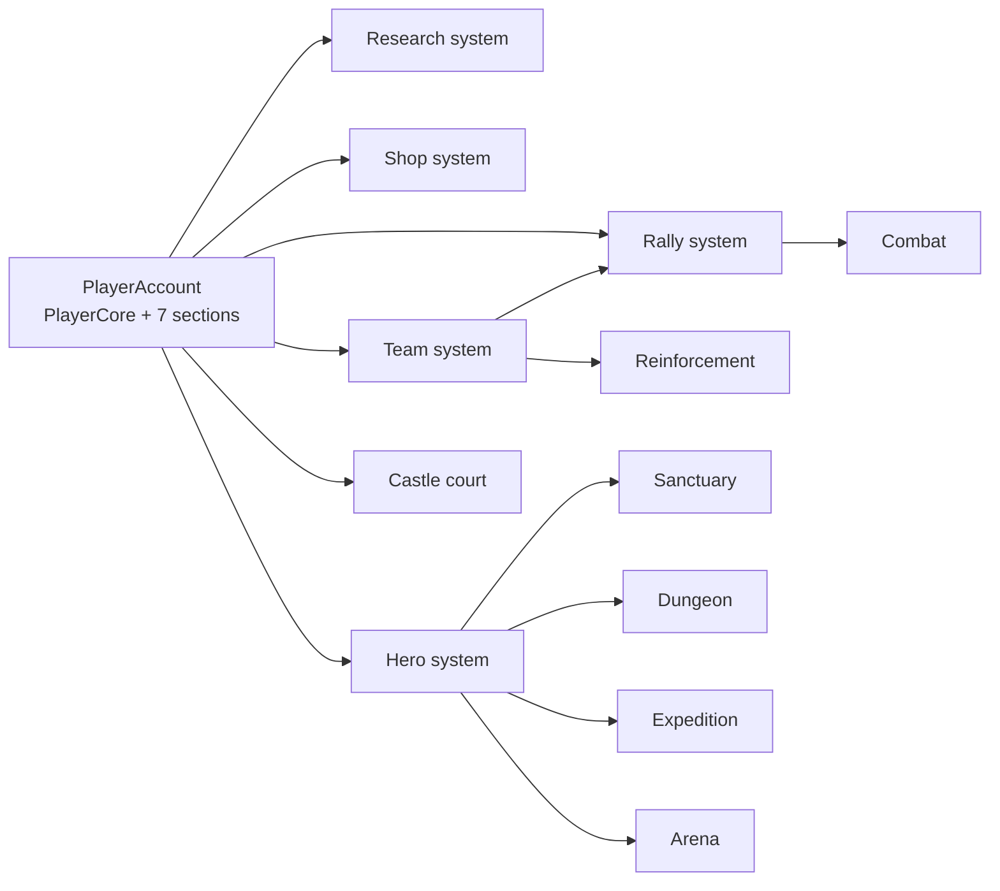

# Novus Mundus State Machines

State machine documentation for the stateful game systems — lifecycles, transitions, guards, and invariants.

## Systems Overview

| System | File | Description |
|--------|------|-------------|
| [Player](./player.md) | `player.md` | Core account, extension sections, progression |
| [Combat](./combat.md) | `combat.md` | PvE encounters and PvP attacks |
| [Travel](./travel.md) | `travel.md` | Intercity / intracity movement |
| [Economy](./economy.md) | `economy.md` | NOVI flows, hiring, collection, transfers |
| [Research](./research.md) | `research.md` | Tech-tree progression and ascension |
| [Hero](./hero.md) | `hero.md` | Hero NFT ownership, locking, leveling |
| [Estate](./estate.md) | `estate.md` | Building construction and upgrades |
| [Forge](./forge.md) | `forge.md` | Staged-tempering equipment crafting |
| [Expedition](./expedition.md) | `expedition.md` | Mining and fishing expeditions |
| [Rally](./rally.md) | `rally.md` | Group combat coordination |
| [Reinforcement](./reinforcement.md) | `reinforcement.md` | Teammate and garrison support |
| [Team](./team.md) | `team.md` | Team membership and treasury governance |
| [Arena](./arena.md) | `arena.md` | Seasonal PvP competition |
| [Dungeon](./dungeon.md) | `dungeon.md` | Roguelike PvE dungeon runs |
| [Kings Castle](./kings_castle.md) | `kings_castle.md` | Territorial control system |

> Systems without a meaningful lifecycle of their own (Shop, Subscription, Event, Sanctuary, Name) are documented in [`docs/onchain/04-systems/`](../onchain/04-systems/), each with a lifecycle section.



## Architecture Principles

### 1. PDA-Based State

Every account is a Program Derived Address with deterministic seeds. Nearly all gameplay PDAs are kingdom-scoped (`game_engine` is a seed component). See [seeds.md](../onchain/06-reference/seeds.md).

### 2. Temporary vs Persistent Accounts

**Temporary** (created on start, closed on completion): `ExpeditionAccount`, `DungeonRun`, `RallyParticipant`, `ReinforcementAccount`, `EventParticipation`, `LootAccount`, `TeamInvite`, `TreasuryRequest`.

**Persistent** (never closed by gameplay): `GameEngine`, `PlayerAccount`, `UserAccount`, `EstateAccount`, `TeamAccount`, `KingRegistry`, `ResearchProgress`, `CraftedEquipmentAccount`.

### 3. Status Enums

Systems with a lifecycle store a `u8` status enum, e.g.:

```rust
#[repr(u8)]
pub enum CastleStatus {
    Vacant = 0, Contest = 1, Protected = 2, Vulnerable = 3, Transitioning = 4,
}
```

### 4. PlayerAccount Extension System

`PlayerAccount` is `PlayerCore` plus up to 7 extension sections, appended via `realloc` as features unlock. Sizes (from `state/player.rs`):

```
CORE (528 B)
  → +RESEARCH  (48 B)   EXT_RESEARCH  = 0x01
  → +INVENTORY (144 B)  EXT_INVENTORY = 0x04
  → +TEAM      (112 B)  EXT_TEAM      = 0x10
  → +RALLY     (80 B)   EXT_RALLY     = 0x08
  → +HEROES    (208 B)  EXT_HEROES    = 0x02
  → +COSMETICS (80 B)   EXT_COSMETICS = 0x20
  → +COURT     (48 B)   EXT_COURT     = 0x40
MAX_SIZE = 1248 B
```

Sections are appended in the order above; an earlier section must exist before a later one is added.



### 5. Golden-Ratio Scaling

Deterministic progression using the φ family (`f64` constants in `constants.rs`):
- `PHI = 1.618033988749895` — high-tier multipliers
- `GOLDEN_ROOT = 1.2720196495140689` (√φ) — per-level progression
- `PHI_SQUARED = 2.618033988749895` — major bonuses / upgrade cost scaling
- `PHI_INVERSE = 0.618...` — diminishing returns / penalties

### 6. Basis Points

All percentages are integer basis points: `10000 = 100%`, `1500 = 15%`, `250 = 2.5%`.

## State Machine Notation

```
┌────────────┐
│   State    │      a state
└────────────┘

──────────────>     normal transition (instruction)
═════════════>      automatic / time-based transition
- - - - - - ->      conditional / optional transition
```

Each transition is documented as:

```
Trigger: instruction_name (discriminant)
Guards:
  - precondition
Actions:
  - state effect
```

## Cross-System Dependencies

The `PlayerAccount` is the integration hub. Each extension section is unlocked by — and gates access to — a subsystem; subsystems then depend on one another at runtime.



```
PLAYER ACCOUNT  —  PlayerCore + 7 extension sections (unlocked in order)
│
├─ RESEARCH  section ──→ Research system ──→ combat & encounter buff bonuses
├─ INVENTORY section ──→ Shop system ────────  purchased items land here
├─ TEAM      section ──→ Team system ───────→ Rally · Reinforcement
├─ RALLY     section ──→ Rally system ──────→ Combat (coordinated attacks)
├─ HEROES    section ──→ Hero system ───────→ Sanctuary · Dungeon · Expedition · Arena
├─ COSMETICS section ──→ Shop system ────────  cosmetic items
└─ COURT     section ──→ Castle system ──────  court appointments
```

**Estate buildings** gate further subsystems:

| Building | Unlocks | Building | Unlocks |
|----------|---------|----------|---------|
| Forge | Forge crafting | MeditationChamber | Sanctuary meditation |
| DungeonEntry | Dungeon runs | Mine / Dock | Expedition (mining / fishing) |
| Arena | Arena participation | TransportBay | Travel speed / teleport |
| Academy | Research speed bonus | Treasury | Dungeon NOVI bonus |

**Castle** ties together Combat (`attack_castle`), Reinforcement (garrison support), and Team.

**World layer** (kingdom-scoped, shared geometry): City / Location grid, Encounter spawns, Travel.

## Instruction Discriminant Ranges

| Range | System |
|-------|--------|
| 0–8 | Initialization |
| 10–14, 17–19 | Economy |
| 15–16 | Token operations |
| 20–21 | Combat |
| 30–34 | Travel — intercity |
| 40–42 | Travel — intracity |
| 50–59 | Team (core) |
| 60–67 | Rally |
| 70 | Encounter |
| 71 | Loot |
| 80–83 | Events |
| 90 | Progression |
| 100–102 | Subscription |
| 110–115 | Name |
| 120–127 | Research |
| 130–136 | Hero |
| 137–139 | Sanctuary |
| 140–159 | Shop |
| 160–169 | Estate |
| 180–184 | Forge |
| 190–195 | Reinforcement |
| 200–204 | Expedition |
| 210–221 | Team (extended) |
| 230–236 | Arena |
| 250–260 | Dungeon |
| 270–290 | Castle |
| 300 | Purchase NOVI |
| 310–311 | Hero burn / supply cap |

Full per-instruction detail: [instruction-map.md](../onchain/01-architecture/instruction-map.md).
