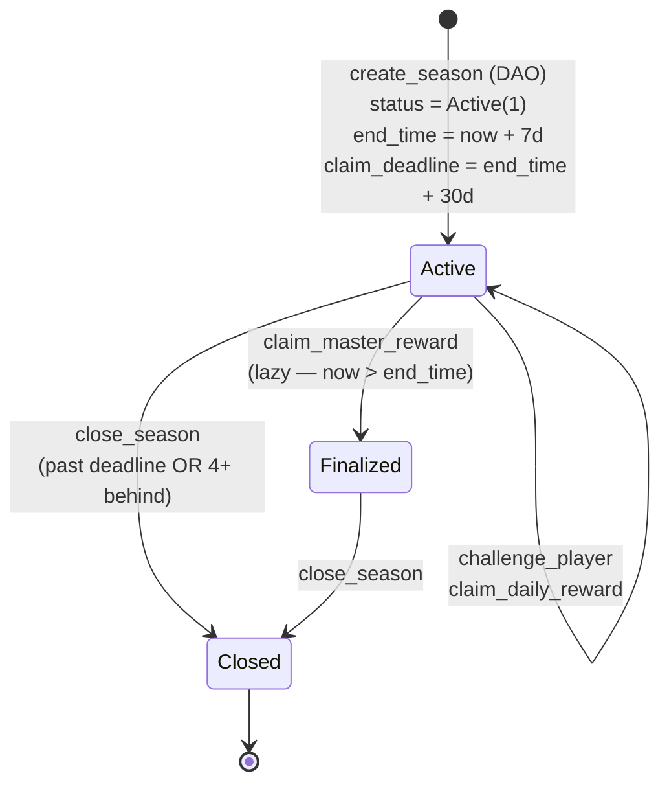
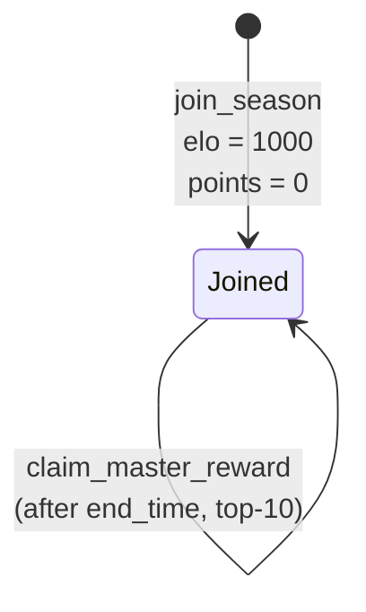
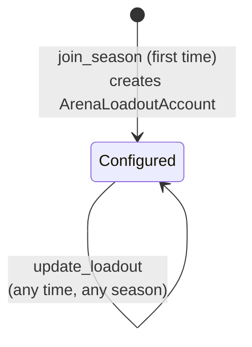

# Arena State Machine

## Overview

The Arena system manages two concurrent lifecycles: the **season lifecycle** (global per kingdom) and the **participant lifecycle** (per-player per-season). There is no separate "battle account" — combat is fully resolved in one transaction and state is updated in-place on the participant and season accounts.

---

## 1. Season Lifecycle

### States

| State | Value | Description |
|-------|-------|-------------|
| `Pending` | 0 | Reserved; not used — seasons start `Active` |
| `Active` | 1 | Battles open; daily rewards claimable |
| `Finalized` | 2 | Past `end_time`; master rewards open |
| `RewardsDistributed` | 3 | Informational; no further on-chain gate |
| `Closed` | — | Account closed; no ArenaSeasonAccount on-chain |

### State Diagram



ASCII reference:

```
                create_season (DAO)
                       │
                       ▼
            ┌─────────────────────┐
            │       Active        │  ◄── challenge_player (battles)
            │   (now < end_time)  │  ◄── claim_daily_reward
            └─────────┬───────────┘
                      │
          ┌───────────┴────────────────────────┐
          │                                    │
          │ claim_master_reward                │ close_season
          │ (lazy, now > end_time)             │ (past deadline OR 4+ behind)
          ▼                                    ▼
┌──────────────────────┐            ┌──────────────────────┐
│      Finalized       │            │       CLOSED         │
│ (master claims open) │            │   (account gone)     │
└─────────┬────────────┘            └──────────────────────┘
          │
          │ close_season
          ▼
┌──────────────────────┐
│       CLOSED         │
│   (account gone)     │
└──────────────────────┘
```

### Transitions

#### `[*] → Active`
```
Trigger: create_season (instruction 230)
Guards:
  - Caller is game_engine.game_authority
  - ArenaSeasonAccount PDA does not already exist
Actions:
  - Create ArenaSeasonAccount (608 bytes)
  - Set status = Active (1)
  - Set start_time = now
  - Set end_time = now + 604800 (7 days)
  - Set claim_deadline = end_time + 2592000 (30 days)
  - Initialize leaderboard, prize pools, thresholds
  - Emit KingdomArenaSeasonStarted
```

> Triggered by the DAO (`game_authority`) directly, or for the recurring weekly cadence by the off-chain arena crank (`cli/lib/cranks/arena.ts`), which creates season N+1 once season N passes `end_time`.

#### `Active → Finalized`
```
Trigger: claim_master_reward (instruction 235), lazy transition
Guards:
  - season.status == Active
  - now > season.end_time
Actions:
  - season.status = Finalized (2)
  - Emit ArenaSeasonFinalized
  - (master reward calculation proceeds in same instruction)
```

#### `Active|Finalized → Closed`
```
Trigger: close_season (instruction 236)
Guards:
  - season_authority == season.authority
  - EITHER: now > season.claim_deadline
  - OR:     city.arena_season_id − season.season_id >= 4
Actions:
  - Close ArenaSeasonAccount
  - Transfer rent lamports to season.authority
```

---

## 2. Participant Lifecycle

Each participant account tracks ELO, points, battle history, and reward claims for one player in one season.

### States

| State | Description |
|-------|-------------|
| `NonExistent` | No ArenaParticipantAccount exists for this player/season |
| `Joined` | Participant account exists; battles and rewards can occur |
| `Closed` | Run closed; participant account can be manually closed |

### State Diagram



ASCII reference:

```
                    join_season
┌─────────────┐  ──────────────►  ┌──────────────────────────────────┐
│ NonExistent │                   │             Joined               │
└─────────────┘                   │                                  │
                                  │  ◄─── challenge_player           │
                                  │  ◄─── claim_daily_reward         │
                                  │  ◄─── claim_master_reward        │
                                  └──────────────────────────────────┘
```

### Transitions

#### `NonExistent → Joined`
```
Trigger: join_season (instruction 231)
Guards:
  - season.status == Active
  - now < season.end_time
  - player.level >= season.min_level_required
  - ArenaParticipantAccount does not already exist
Actions:
  - Create ArenaParticipantAccount (536 bytes)
  - Set elo_rating = 1000
  - Set total_points = 0, wins = 0, losses = 0
  - Create ArenaLoadoutAccount (168 bytes) if absent
  - Emit ArenaPlayerJoined
```

#### `Joined: challenge_player`
```
Trigger: challenge_player (instruction 233)
Guards:
  - Both challenger_authority and game_authority sign
  - season.status == Active and now < season.end_time
  - match_id > participant.last_match_id  (anti-replay)
  - now − match_timestamp <= 300  (freshness)
  - match_timestamp <= now
  - challenger != defender (not self-challenge)
  - count_battles_in_window(now, 86400) < 10
  - count_opponent_in_window(defender, now, 86400) < 2
  - If loadout.arena_hero set: hero NFT key must match; NFT must be valid
Actions:
  - calculate_arena_power(challenger), calculate_arena_power(defender)
    (each loadout field clamped to min(loadout, owned); phantom-army guard)
  - Determine winner (higher power wins; equal = draw)
  - Update ELO (K=32, lookup-table expected score)
  - Award points (win=100+bonus, loss=20, draw=50)
  - challenger_participant.last_match_id = match_id
  - record_battle() on both participants (circular buffer)
  - season.total_battles += 1
  - season.update_leaderboard(challenger, defender)
  - Emit ArenaBattleResolved
```

#### `Joined: claim_daily_reward`
```
Trigger: claim_daily_reward (instruction 234)
Guards:
  - season.status == Active
  - participant.daily_reward_claimed_day != today
  - count_battles_in_window(now, 86400) >= 5
  - daily pool not exhausted (distributed_today < daily_distribution_cap)
Actions:
  - participant.daily_reward_claimed_day = today
  - Compute reward (battle_mult × win_rate_mult × base)
  - Cap to pool remainder
  - season.distributed_today += reward
  - season.daily_prize_pool -= reward
  - Mint NOVI to player ATA; player.locked_novi += reward
  - Emit ArenaDailyRewardClaimed (includes battles_fought + unique_opponents)
```

#### `Joined: claim_master_reward`
```
Trigger: claim_master_reward (instruction 235)
Guards:
  - season.status >= Finalized (or auto-finalizes if Active + now > end_time)
  - now <= season.claim_deadline
  - participant.master_reward_claimed == false
  - player is on leaderboard (find_player_rank returns Some)
  - season.leaderboard_claimed[rank] == false
Actions:
  - participant.master_reward_claimed = true
  - season.leaderboard_claimed[rank] = true
  - Compute reward = master_prize_pool × ARENA_PRIZE_DISTRIBUTION[rank] / 10000
  - season.prize_remaining -= reward
  - Mint NOVI to player ATA; player.locked_novi += reward
  - Emit ArenaSeasonFinalized (if this call performed the lazy Active->Finalized)
  - Emit ArenaMasterRewardClaimed
```

---

## 3. Loadout Lifecycle



ASCII reference:

```
                    join_season (first time)
┌─────────────┐  ──────────────────────────►  ┌───────────────────────┐
│ NonExistent │                               │      Configured       │
└─────────────┘                               │                       │
                   update_loadout             │  hero, units, weapons │
                   (any time)                 │                       │
                                              └───────────────────────┘
```

`ArenaLoadoutAccount` is season-agnostic and persists across seasons. No transition to "closed"; players may re-use loadouts indefinitely. Configure-time values are not validated; at battle time each field is clamped to `min(loadout, owned)` in `calculate_arena_power`, so an over-stated loadout contributes only what the player owns.

---

## 4. Account Structure

### ArenaSeasonAccount (608 bytes)

```rust
#[repr(C)]
pub struct ArenaSeasonAccount {
    pub account_key:                u8,
    pub game_engine:                Address,
    pub season_id:                  u32,
    pub city_id:                    u16,
    pub authority:                  Address,
    pub start_time:                 i64,
    pub end_time:                   i64,
    pub claim_deadline:             i64,
    pub status:                     u8,   // ArenaStatus: Pending=0, Active=1, Finalized=2, RewardsDistributed=3
    pub leaderboard:                [ArenaLeaderboardEntry; 10],
    pub leaderboard_count:          u8,
    pub leaderboard_claimed:        [bool; 10],
    pub master_prize_pool:          u64,
    pub daily_prize_pool:           u64,
    pub daily_distribution_cap:     u64,
    pub distributed_today:          u64,
    pub last_distribution_day:      u32,
    pub _padding1:                  [u8; 4],
    pub prize_remaining:            u64,
    pub min_level_required:         u8,
    pub _padding2:                  [u8; 7],
    pub min_points_for_leaderboard: u64,
    pub total_battles:              u64,
    pub bump:                       u8,
    pub _reserved:                  [u8; 7],
}
```

**PDA:** `["arena_season", game_engine, season_id:u32 LE]`

### ArenaParticipantAccount (536 bytes)

```rust
#[repr(C)]
pub struct ArenaParticipantAccount {
    pub account_key:              u8,
    pub game_engine:              Address,
    pub player:                   Address,  // PlayerAccount PDA
    pub season_id:                u32,
    pub battle_timestamps:        [i64; 10],
    pub battle_opponents:         [Address; 10],
    pub battle_index:             u8,
    pub last_match_id:            u64,
    pub daily_reward_claimed_day: u32,
    pub elo_rating:               u32,     // floor 100; starts 1000
    pub total_points:             u64,
    pub wins:                     u32,
    pub losses:                   u32,
    pub master_reward_claimed:    bool,
    pub bump:                     u8,
    pub _reserved:                [u8; 17],
}
```

**PDA:** `["arena_participant", game_engine, season_id:u32 LE, player_account_pda]`

### ArenaLoadoutAccount (168 bytes)

```rust
#[repr(C)]
pub struct ArenaLoadoutAccount {
    pub account_key:     u8,
    pub game_engine:     Address,
    pub player:          Address,  // PlayerAccount PDA
    pub bump:            u8,
    pub arena_hero:      Address,
    pub defensive_units: [u64; 3],
    pub melee_weapons:   u64,
    pub ranged_weapons:  u64,
    pub siege_weapons:   u64,
    pub armor_pieces:    u64,
    pub _reserved:       [u8; 7],
}
```

**PDA:** `["arena_loadout", game_engine, player_account_pda]`

---

## 5. Invariants

```
1. season.end_time == season.start_time + 604800
2. season.claim_deadline == season.end_time + 2592000
3. season.status ∈ {0, 1, 2, 3}
4. season.leaderboard_count ∈ [0, 10]
5. For all i: leaderboard[i].total_points >= min_points_for_leaderboard (500 default)
6. Σ ARENA_PRIZE_DISTRIBUTION == 10000 (compile-time verified)
7. participant.elo_rating >= 100 (ELO floor)
8. participant.last_match_id is monotonically non-decreasing
9. participant.master_reward_claimed == true → season.leaderboard_claimed[rank] == true
10. Daily reward can only be claimed once per calendar day (UTC day = now / 86400)
11. Master reward can only be claimed after season.end_time has passed
12. close_season can only happen after claim_deadline OR 4+ seasons behind
13. ArenaLoadoutAccount is per-kingdom (not per-season); one per player per kingdom
14. All account PDAs include game_engine as a seed → kingdom isolation guaranteed
```
