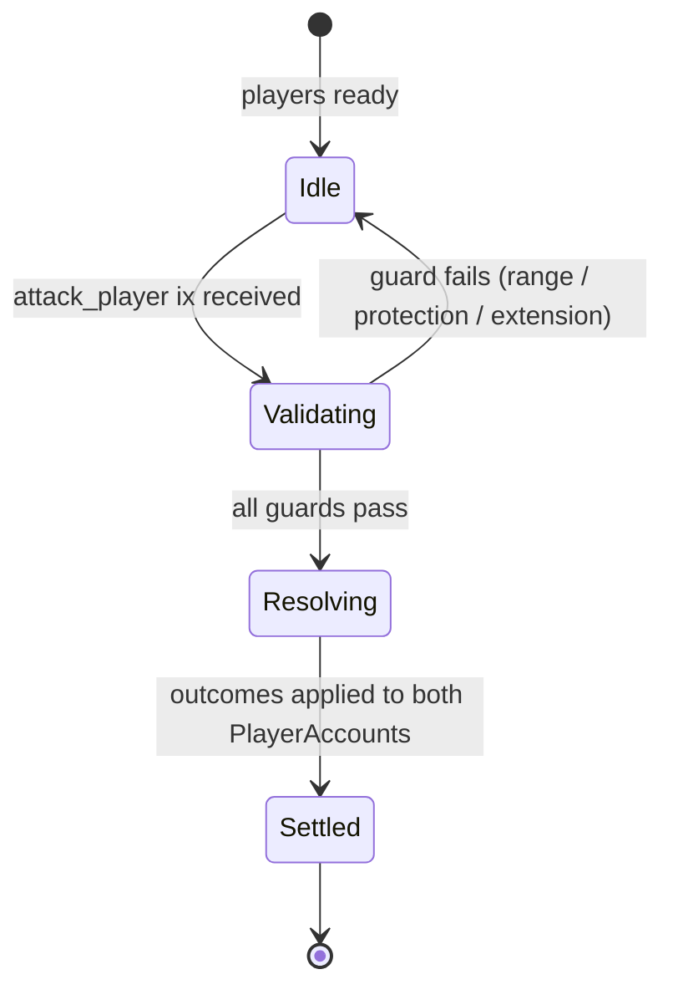
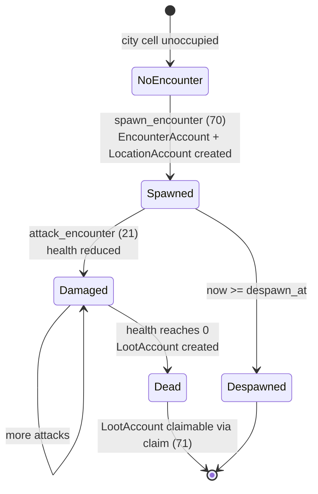

# Combat System State Machine

> Formal state transitions, account structures, invariants, and instruction dispatch for
> the PvP, PvE (encounter), and encounter-spawn subsystems.

---

## 1. Instruction Table

| Discriminant | Instruction | System |
|---|---|---|
| 20 | `attack_player` | PvP |
| 21 | `attack_encounter` | PvE |
| 70 | `spawn_encounter` | Encounter management |
| 71 | `claim_encounter` | Encounter management |

[Source: programs/novus_mundus/src/lib.rs](../../programs/novus_mundus/src/lib.rs)

---

## 2. PvP State Machine — `attack_player` (discriminant 20)



### States (ASCII reference)

```
        ┌─────────────────────────────────────────────────────────┐
        │                   IDLE                                  │
        │  Player has troops / weapons / vault ready              │
        └───────────────┬─────────────────────────────────────────┘
                        │  attack_player ix
                        ▼
        ┌─────────────────────────────────────────────────────────┐
        │               VALIDATING                                │
        │  • EXT_RESEARCH flag set                                │
        │  • Attacker not in new-player protection window         │
        │  • Haversine distance ≤ 15.0 m (PVP_ATTACK_RANGE_METERS)│
        │  • Defender not in new-player protection window         │
        └───────────────┬─────────────────────────────────────────┘
                        │
                        ▼
        ┌─────────────────────────────────────────────────────────┐
        │               RESOLVING                                 │
        │  • calculate_damage_output (attacker → defender)        │
        │  • calculate_damage_output (defender → attacker)        │
        │  • inflict_damage on both sides                         │
        │  • Loot vault (safebox-protected fraction excluded)      │
        │  • Operative attrition (only if garrison_wiped)         │
        │  • resolve_weapon_combat                                │
        │  • Update happiness + abandonment on both sides         │
        └───────────────┬─────────────────────────────────────────┘
                        │
                        ▼
        ┌─────────────────────────────────────────────────────────┐
        │               SETTLED                                   │
        │  PlayerAccount(attacker) updated                        │
        │  PlayerAccount(defender) updated                        │
        │  Stats counters incremented on both sides               │
        └─────────────────────────────────────────────────────────┘
```

### Trigger

```
Instruction 20 (attack_player)
  Data layout: [drive_by: u8]   (1 byte)
```

### Guards

| Guard | Error if violated |
|---|---|
| `player.extensions & EXT_RESEARCH != 0` | Extension not unlocked |
| `now >= attacker.new_player_protection_until` | Attacker under protection |
| `now >= defender.new_player_protection_until` | Defender under protection |
| `distance(attacker_pos, defender_pos) <= 15.0 m` | Out of range |
| `attacker.defensive_unit_1/2/3 > 0` | No troops to commit |

### Actions

1. Compute attacker damage output (with drive-by coeff if `drive_by == 1` and attacker
   has ≥ 10 000 units).
2. Compute defender damage output (always normal coeff; no drive-by for defenders).
3. `inflict_damage` on defender troops using attacker damage.
4. `inflict_damage` on attacker troops using defender damage.
5. Determine winner (proportional casualty comparison).
6. Loot vault:
   ```
   unprotected = vault × (10000 − safebox_protection_percent) / 10000
   looted      = unprotected × effective_loot_pct / 10000
   ```
   Locked NOVI is **never** lootable.
7. Attacker wins → apply operative attrition **only** if `garrison_wiped`.
8. `resolve_weapon_combat` → distribute weapon outcomes.
9. Update `happiness_defensive` on both sides.
10. `calculate_abandonment` → decrement units.
11. Increment `total_attacks` / `total_defenses` lifetime counters.

### Account Structure

| # | Account | Writable | Notes |
|---|---|---|---|
| 0 | `game_engine` | no | Kingdom PDA |
| 1 | `attacker` (PlayerCore) | yes | Signer wallet → derives player PDA |
| 2 | `defender` (PlayerCore) | yes | Target player PDA |

[Source: programs/novus_mundus/src/processor/combat/attack_player.rs](../../programs/novus_mundus/src/processor/combat/attack_player.rs)

---

## 3. PvE State Machine — `attack_encounter` (discriminant 21)

```mermaid
stateDiagram-v2
    [*] --> EncounterExists : spawn_encounter creates EncounterAccount
    EncounterExists --> Validating : attack_encounter ix
    Validating --> EncounterExists : guard fails
    Validating --> Resolving : all guards pass
    Resolving --> Damaged : encounter.health > 0
    Resolving --> Dead : encounter.health == 0
    Damaged --> EncounterExists : attacker added to list
    Dead --> [*] : LootAccount created; accounts closed
```



### States (ASCII reference)

```
        ┌─────────────────────────────────────────────────────────┐
        │                   ENCOUNTER EXISTS                      │
        │  EncounterAccount: health > 0, within despawn_at        │
        └───────────────┬─────────────────────────────────────────┘
                        │  attack_encounter ix
                        ▼
        ┌─────────────────────────────────────────────────────────┐
        │               VALIDATING                                │
        │  • Player has defensive units (NOT operatives)          │
        │  • Player level within ±max_encounter_level_diff        │
        │  • Haversine distance ≤ 10.0 m (ENCOUNTER_ATTACK_RANGE) │
        │  • Encounter not despawned (now < despawn_at)           │
        │  • Player has stamina ≥ tier cost                       │
        │  • Player has NOT already attacked this encounter        │
        └───────────────┬─────────────────────────────────────────┘
                        │
                        ▼
        ┌─────────────────────────────────────────────────────────┐
        │               RESOLVING                                 │
        │  • calculate_damage_output (player's defensive units)   │
        │  • Deduct encounter.health                              │
        │  • instant_cash = actual_damage × 7                     │
        │  • siege_consumed = ceil(actual_damage / 500)           │
        │  • Deduct stamina                                       │
        │  • Add player to attacker list                          │
        └─────────────────┬───────────────────────────────────────┘
                          │
           ┌──────────────┴──────────────────────┐
           │ health > 0                           │ health == 0
           ▼                                     ▼
     ┌─────────────┐                   ┌──────────────────────────┐
     │  DAMAGED    │                   │    ENCOUNTER DIED        │
     │  health -= d│                   │  • LootAccount created   │
     │  attacker   │                   │  • XP granted to all     │
     │  added      │                   │    attackers (by share)  │
     └─────────────┘                   │  • LocationAccount closed │
                                       │  • EncounterAccount closed│
                                       └──────────────────────────┘
```

### Trigger

```
Instruction 21 (attack_encounter)
  Data layout: [encounter_id: u64 LE]   (8 bytes)
```

### Guards

| Guard | Error if violated |
|---|---|
| Player has `defensive_unit_1/2/3` (NOT operatives) | Wrong unit type |
| `abs(player.level - encounter.level) <= max_encounter_level_diff` | Level gap too large |
| `distance(player_pos, encounter_pos) <= 10.0 m` | Out of range |
| `now < encounter.despawn_at` | Encounter expired |
| `player.encounter_stamina >= ENCOUNTER_STAMINA_COSTS[level_tier]` | Insufficient stamina |
| Player pubkey not in attacker list | Already attacked this encounter |

### Actions

1. `calculate_damage_output` using defensive units, research buffs, hero buffs.
2. Clamp damage by remaining encounter health.
3. `player.cash_on_hand += actual_damage × 7`
4. `player.siege_weapons -= ceil(actual_damage / 500)` (saturating)
5. `player.encounter_stamina -= stamina_cost`
6. Append player pubkey to `encounter.attacker_list`.
7. `encounter.health -= actual_damage`
8. If `encounter.health == 0`:
   - Create `LootAccount` with scaled rewards (by rarity, level).
   - Grant XP to each attacker proportional to damage share.
   - Close `encounter.LocationAccount` (rent to creator).
   - Close `EncounterAccount`.

### Account Structure

| # | Account | Writable | Notes |
|---|---|---|---|
| 0 | `game_engine` | no | Kingdom PDA |
| 1 | `player` (PlayerCore) | yes | Signer wallet |
| 2 | `encounter` (EncounterAccount) | yes | Dynamic-size; PDA `[ENCOUNTER_SEED, engine, city_id_le2, id_le8]` |
| 3 | `location` (LocationAccount) | yes | Present only when encounter dies |
| 4 | `loot` (LootAccount) | yes | Initialized only when encounter dies |

[Source: programs/novus_mundus/src/processor/combat/attack_encounter.rs](../../programs/novus_mundus/src/processor/combat/attack_encounter.rs)

---

## 4. Encounter Lifecycle State Machine



### 4.1 Spawn — `spawn_encounter` (discriminant 70)

```
        ┌─────────────────────────────────────────────────────────┐
        │                  NO ENCOUNTER                           │
        │  LocationAccount at target cell: unoccupied             │
        └───────────────┬─────────────────────────────────────────┘
                        │  spawn_encounter ix
                        ▼
        ┌─────────────────────────────────────────────────────────┐
        │               VALIDATING                                │
        │  • Target cell is passable terrain                      │
        │  • Target cell is unoccupied                            │
        │  • Spawn mode (player vs authority):                    │
        │    - Player spawn: type ∈ {Common, Uncommon, Rare}      │
        │      level = clamp(player.level, city_min, city_max)    │
        │    - Auto-spawn (game_engine.authority):                 │
        │      any type; level = golden-ratio distribution        │
        └───────────────┬─────────────────────────────────────────┘
                        │
                        ▼
        ┌─────────────────────────────────────────────────────────┐
        │               SPAWNED                                   │
        │  EncounterAccount created at PDA                        │
        │  LocationAccount created (occupant_type = 2)            │
        │  health = health_per_level × level                      │
        │  defense = min(defense_per_level × level, 9000)         │
        └─────────────────────────────────────────────────────────┘
```

**Trigger / Data layout:**

```
Instruction 70 (spawn_encounter)
  Data: [encounter_type: u8, grid_lat: i32 LE, grid_long: i32 LE]   (9 bytes)
```

### 4.2 Claim — `claim_encounter` (discriminant 71)

The `claim_encounter` instruction is used to finalize loot after an encounter dies
and its `LootAccount` has been created.

---

## 5. EncounterAccount Structure

```rust
// Fixed header; attacker list appended inline after header
// BASE_LEN + attacker_count * 32 bytes total
pub struct EncounterAccount {
    pub account_key:   u8,       // AccountKey::Encounter
    pub game_engine:   Address,  // 32 — kingdom
    pub id:            u64,      // unique encounter ID
    pub city_id:       u16,
    pub level:         u8,       // 1–100
    pub rarity:        u8,       // 0=Common … 4=Legendary
    pub _padding0:     [u8; 4],
    pub location_lat:  f64,
    pub location_long: f64,
    pub spawned_at:    i64,
    pub despawn_at:    i64,
    pub health:        u64,
    pub max_health:    u64,
    pub defense:       u32,      // basis points; hard cap 9000 (90 %)
    pub _padding1:     [u8; 4],
    pub attacker_count: u8,      // actual attackers so far
    pub bump:          u8,
    pub _padding2:     [u8; 6],
    // [Address; attacker_count] appended after this header
}
```

PDA seeds: `[ENCOUNTER_SEED, game_engine, city_id_le2, encounter_id_le8]`

[Source: programs/novus_mundus/src/state/encounter.rs](../../programs/novus_mundus/src/state/encounter.rs)

---

## 6. Invariants

| ID | Invariant |
|---|---|
| C-01 | `attacker.extensions & EXT_RESEARCH` must be set for PvP (`attack_player`). |
| C-02 | Only defensive units (`defensive_unit_1/2/3`) count for PvE attacks; operative units are excluded. |
| C-03 | PvP attack range ≤ 15.0 m; PvE attack range ≤ 10.0 m. |
| C-04 | Encounter defense is hard-capped at 9000 bp (90 %). |
| C-05 | Locked NOVI is **never** lootable in PvP. |
| C-06 | Vault loot is bounded by `(1 − safebox_protection_percent / 10000)` of `cash_in_vault`. |
| C-07 | Operative attrition in PvP applies **only** when the defender's garrison is completely wiped. |
| C-08 | Each player can attack a given encounter at most once (enforced by attacker list). |
| C-09 | Player-spawned encounters are limited to Common / Uncommon / Rare rarity. |
| C-10 | Critical hits are deterministic: fire when `research_crit_chance + hero_crit_chance >= 5000 bp`. |
| C-11 | Drive-by bonus applies only when attacker has ≥ 10 000 units. |
