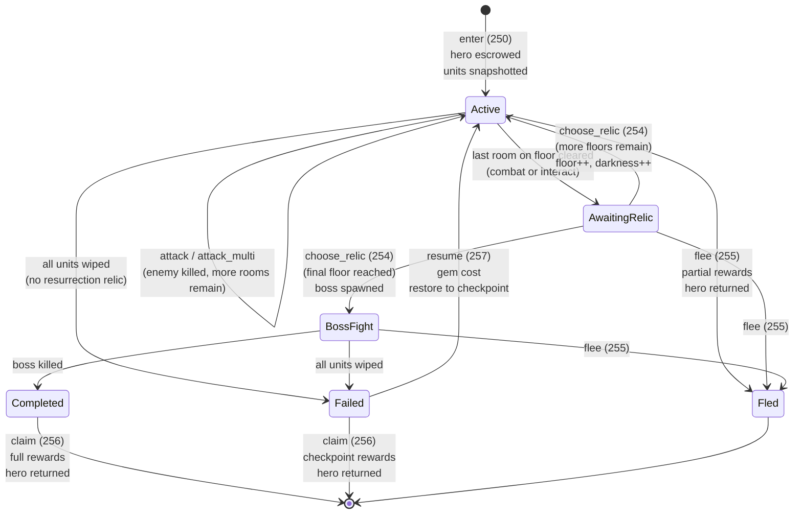
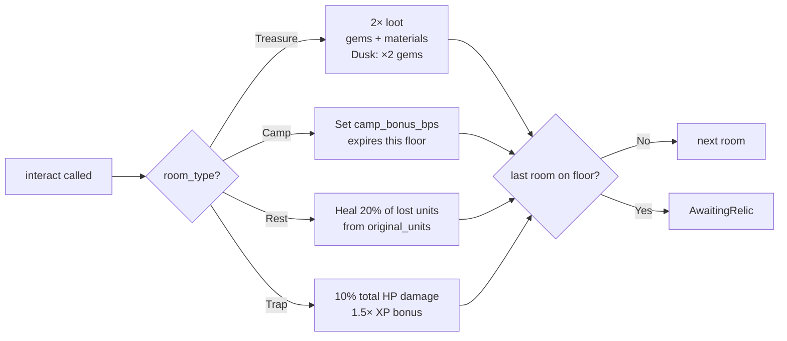

# Dungeon State Machine

## Overview

A dungeon run is a single-player session represented by one `DungeonRun` PDA account. The run transitions through combat, non-combat, and relic-selection states floor by floor. The champion hero NFT is held in escrow for the entire run. Two terminal paths exist: success (claim full rewards) and failure (checkpoint rewards only, or flee for partial).

---

## 1. Run Lifecycle

### States

| Value | Name | Description |
|-------|------|-------------|
| 0 | `Active` | In a room; combat or interaction pending |
| 1 | `AwaitingRelic` | Floor cleared; relic selection required before next floor |
| 2 | `BossFight` | On the final floor boss; uses attack instructions |
| 3 | `Completed` | Boss killed on final floor; awaiting `claim` |
| 4 | `Failed` | All units wiped; awaiting `claim` or `resume` |
| 5 | `Fled` | `flee` was called; run closed immediately |

### State Diagram



ASCII reference:

```
                                    enter (250)
               ┌──────────────────────────────────────────────────────┐
               │              Active (status=0)                       │
               │         room_type ∈ {Combat, Treasure, Camp,         │
               │                       Rest, Trap}                    │
               └──┬──────────────────────┬────────────────────────────┘
                  │                      │
         attack / │                      │ interact (253)
      attack_multi│                      │ (non-combat rooms)
          (251/252│)                     │
                  │                      │
                  ▼                      ▼
         ┌──────────────┐       floor complete (final room)?
         │ Enemy alive? │                │
         └──────┬───────┘        No ─── ┤ ──── Yes
                │                       │           │
                │ Enemy dead            ▼           ▼
                │              ┌──────────────┐    ┌──────────────────┐
                │              │  auto-advance│    │  AwaitingRelic   │
                │              │  next room   │    │   (status=1)     │
                │              └──────────────┘    └────────┬─────────┘
                │                                           │
                │  (floor complete)                 choose_relic (254)
                │                                           │
                ▼                                           │
       ┌──────────────────┐                    ┌───────────┴──────────────┐
       │  AwaitingRelic   │                    │ More floors remaining?    │
       │   (status=1)     │                    └───────────┬──────────────┘
       └────────┬─────────┘                               │
                │ choose_relic (254)               Yes ───┤──── No (final floor)
                │                                  │              │
                ▼                                  ▼              ▼
       ┌────────────────┐                 ┌──────────────┐  ┌───────────────┐
       │ floor ++        │                 │   Active     │  │  BossFight   │
       └────────────────┘                 │  (status=0)  │  │  (status=2)  │
                                          └──────────────┘  └──────┬────────┘
                                                                    │
                                                             Boss dies
                                                                    │
                                                                    ▼
                                                          ┌──────────────────┐
                                                          │   Completed      │
                                                          │   (status=3)     │
                                                          └────────┬─────────┘
                                                                   │
                                                              claim (256)
                                                                   │
                                                                   ▼
                                                            ┌────────────┐
                                                            │  CLOSED    │
                                                            │(hero back) │
                                                            └────────────┘

At any Active/AwaitingRelic/BossFight state:
    ─── flee (255) ───► Fled (status=5) → DungeonRun closed, hero returned
    ─── units wiped in attack ──► Failed (status=4)
                                         │
                                   has checkpoint?
                                    Yes │         No
                                        │          │
                              resume (257)     claim (256)
                                        │      (checkpoint rewards)
                                        ▼
                                 Active (status=0)
                                 (next floor after checkpoint)
```

---

## 2. Transitions

### `[*] → Active`
```
Trigger: enter (instruction 250)
Guards:
  - player.level >= template.min_player_level
  - player.encounter_stamina >= template.stamina_cost
  - Estate has DungeonEntry building >= template.required_building_level
  - player total defensive units > 0
  - player not traveling or in rally
  - DungeonRun account has 0 lamports (no existing run)
  - Hero NFT.owner == player wallet
Actions:
  - Create DungeonRun PDA (["dungeon_run", player_account_pda])
  - Transfer hero NFT to DungeonRun PDA via MPL Core TransferV1
  - Deduct encounter_stamina
  - Snapshot remaining_units from player.defensive_unit_{1,2,3}
  - Snapshot remaining_weapons from player.{melee,ranged,siege}_weapons
  - Store original_units (for resurrection relic and resume capping)
  - Snapshot xp_building_bonus_bps (Academy: 5%/level, max 25%)
  - Snapshot novi_building_bonus_bps (Treasury: 5%/level, max 25%)
  - Set time_period (Dawn/Day/Dusk/Night from UTC timestamp)
  - Set dungeon_theme, hero_specialization
  - Initialize floor=1, room=1, status=Active, darkness_level=0
  - Spawn first enemy if room_type is Combat
  - Emit DungeonEntered
```

### `Active → Active` (within-floor combat advance)
```
Trigger: attack / attack_multi (251/252) — enemy killed, more rooms remain
Guards:
  - owner and game_authority both sign
  - status.is_active() — Active or BossFight
  - room_type == Combat
  - enemy_health > 0 at start
  - time limit not exceeded (if set)
Actions:
  - Combat round(s): player damage → enemy; enemy counterattack → units
  - Apply crits, double-strike, lifesteal, boss wrath, guardian, darkness
  - If units wiped: check resurrection relic (id 11); else Failed
  - If enemy health == 0 and floor NOT complete:
    - current_room += 1
    - room_type = next_room_type (from instruction data, signed by game_authority)
    - Spawn next enemy if Combat
    - pending_xp += room_xp (×2 if attack_count estimate accurate)
    - pending_materials += (1 + floor/2)
```

### `Active → AwaitingRelic` (floor complete)
```
Trigger: attack or interact — last room on floor cleared
Guards: same as above
Actions:
  - pending_novi += floor_novi (floor_multiplier / 10000 × base, ×2 if relic 15)
  - status = AwaitingRelic (1)
  - If is_checkpoint(current_floor): snapshot checkpoint_xp/novi/gems; last_checkpoint = floor
  - Emit DungeonFloorCompleted
```

### `Active → Failed`
```
Trigger: attack — all units wiped, no resurrection relic
Guards: run.is_wiped() == true
Actions:
  - status = Failed (4)
  - Emit DungeonFailed
  (hero remains in escrow; run account open until claim or resume)
```

### `AwaitingRelic → Active`
```
Trigger: choose_relic (instruction 254)
Guards:
  - owner and game_authority both sign
  - status == AwaitingRelic (1)
  - relic_id < 20
  - chosen relic is one of the 3 (or 4) offered options (validated by game_authority sig)
  - player does not already have this relic
  - More floors remain (current_floor < total_floors)
Actions:
  - relic_mask |= (1 << relic_id); relics_collected += 1
  - current_floor += 1; current_room = 1
  - darkness_level = current_floor
  - Clear camp buff
  - status = Active (0)
  - Spawn first enemy if next room_type is Combat
  - Emit DungeonRelicChosen
```

### `AwaitingRelic → BossFight`
```
Trigger: choose_relic — final floor
Guards: current_floor >= template.total_floors (after increment)
Actions:
  - Same relic actions as above
  - Spawn boss: power = get_boss_power(floor); HP = power × 20
  - enemy_defense = 2000 + floor × 200
  - is_boss = true
  - status = BossFight (2)
  - Emit DungeonBossFight
```

### `BossFight → Completed`
```
Trigger: attack — boss killed on final floor
Guards: is_boss == true; current_floor == total_floors; enemy_health → 0
Actions:
  - status = Completed (3)
  - (pending rewards accumulated during run preserved)
```

### `Completed|Failed → Closed`
```
Trigger: claim (instruction 256)
Guards:
  - status ∈ {Completed (3), Failed (4)}
Actions (Completed):
  - Grant pending_xp, pending_novi, pending_gems, pending_materials
  - Apply Academy (XP) and Treasury (NOVI) building bonuses
  - Apply Night time bonus (+25% NOVI)
  - Submit score to leaderboard (optional leaderboard account at index 7)
Actions (Failed):
  - Grant checkpoint_xp, checkpoint_novi, checkpoint_gems only (no materials)
Both paths:
  - Transfer hero NFT back to owner via MPL Core (DungeonRun PDA signs)
  - Close DungeonRun account (rent returned to owner)
  - Emit DungeonCompleted
```

### `Active|AwaitingRelic|BossFight → Closed`
```
Trigger: flee (instruction 255)
Guards:
  - status.is_ended() == false  (Active, AwaitingRelic, or BossFight)
Actions:
  - penalty_bps = get_flee_penalty_bps(current_floor)
    = [7000, 6000, 5000, 4000] for floors [1-3, 4-6, 7-9, 10+]
  - xp   = pending_xp   × penalty_bps / 10000
  - novi = pending_novi  × penalty_bps / 10000
  - gems = pending_gems  × penalty_bps / 10000
  - Grant rewards to player
  - Transfer hero NFT back to owner (DungeonRun PDA signs)
  - Close DungeonRun account (rent to owner)
  - Emit DungeonFled
```

> **Note on penalty_bps semantics:** The values [7000, 6000, 5000, 4000] are the **retention fractions** (70%/60%/50%/40% of rewards kept), not the penalty. Floor 1–3 loses 30%, not 70%.

### `Failed → Active` (resume)
```
Trigger: resume (instruction 257)
Guards:
  - status == Failed (4)
  - last_checkpoint > 0 (checkpoint exists)
  - player.gems >= 500 + (last_checkpoint × 100)
Actions:
  - Deduct gem cost
  - current_floor = last_checkpoint + 1; current_room = 1
  - status = Active (0)
  - pending_xp/novi/gems = checkpoint_xp/novi/gems (reset to checkpoint)
  - remaining_units = min(current_player_units, original_units)  [cap at entry snapshot]
  - remaining_weapons = current player melee/ranged/siege values
  - Reset enemy state, boss wrath, camp buff, darkness level
  - resume_count += 1
  - Spawn first room enemy if Combat
  - Emit DungeonResumed
```

---

## 3. Non-Combat Room Interactions

### Interact (instruction 253) — room_type ∈ {Treasure, Camp, Rest, Trap}

Both `owner` and `game_authority` sign.



```
Treasure:
  - base_gems = 50 × current_floor
  - Apply DUNGEON_TREASURE_LOOT_MULTIPLIER_BPS (20000 = 2×)
  - Apply relic 6 loot bonus, LOOT synergy
  - Apply Dusk time-of-day gem bonus (×2 in treasure rooms at Dusk)
  - Apply Scout loot bonus (+15%)
  - Apply relic 10 guarantee (+50% gems/materials)
  - materials = 5 + (floor × 2), same bonus chain

Camp:
  - run.camp_bonus_bps = camp_bonus_bps (from instruction data, signed by game_authority)
  - run.camp_expires_floor = current_floor
  - (buff applies only during current floor's combat)

Rest:
  - Heal DUNGEON_REST_HEAL_PERCENT (20%) of lost units (uses original_units stored at entry)

Trap:
  - trap_damage = total_unit_hp × DUNGEON_TRAP_DAMAGE_PERCENT (10%) / 100
  - Apply damage to units (tier 1 first)
  - XP = base_xp × DUNGEON_TRAP_XP_BONUS_BPS (15000 = 1.5×)
```

Floor complete check follows the same path as combat (AwaitingRelic if last room).

---

## 4. Account Structure

### DungeonRun

**PDA:** `["dungeon_run", player_account_pda]`

```rust
#[repr(C)]
pub struct DungeonRun {
    pub account_key:          u8,
    pub player:               Address,  // PlayerAccount PDA
    pub hero_mint:            Address,  // escrowed NFT mint
    pub dungeon_id:           u16,
    pub status:               u8,       // DungeonStatus enum (0–5)
    pub current_floor:        u8,       // 1-indexed
    pub current_room:         u8,       // 1-indexed
    pub room_type:            u8,       // RoomType enum (0–4)
    pub last_checkpoint:      u8,       // 0 if none
    pub bump:                 u8,
    pub enemy_health:         u64,
    pub enemy_max_health:     u64,
    pub enemy_power:          u32,
    pub enemy_defense:        u16,      // basis points
    pub is_boss:              bool,
    pub time_period:          u8,       // 0=Dawn, 1=Day, 2=Dusk, 3=Night
    pub dungeon_theme:        u8,       // 0=Radiant, 1=Fast, 2=Darkness, 3=Armored
    pub hero_specialization:  u8,       // 0=Warrior, 1=Guardian, 2=Scout, 3=Tactician
    pub _spec_padding:        u8,
    pub boss_wrath:           u8,       // 0–100 percent HP lost
    pub boss_ability_active:  bool,
    pub boss_ability_counter: u8,
    pub _boss_padding:        [u8; 3],
    pub boss_shield:          u64,
    pub remaining_units:      [u64; 3], // tier 1/2/3 (decremented on damage)
    pub original_units:       [u64; 3], // immutable entry snapshot
    pub remaining_weapons:    [u64; 3], // melee/ranged/siege
    pub relic_mask:           u32,      // bitmask, relic ID = bit position
    pub synergy_mask:         u8,       // active synergy bitmask (computed)
    pub darkness_level:       u8,
    pub darkness_mitigation:  u16,
    pub pending_xp:           u64,
    pub pending_novi:         u64,
    pub pending_gems:         u64,
    pub pending_materials:    u32,
    pub _padding2:            [u8; 4],
    pub checkpoint_xp:        u64,
    pub checkpoint_novi:      u64,
    pub checkpoint_gems:      u64,
    pub total_damage_dealt:   u64,
    pub total_damage_taken:   u64,
    pub enemies_killed:       u16,
    pub relics_collected:     u8,
    pub rooms_cleared:        u8,
    pub _padding3:            [u8; 4],
    pub started_at:           i64,
    pub camp_bonus_bps:       u16,
    pub camp_expires_floor:   u8,
    pub resume_count:         u8,
    pub xp_building_bonus_bps:  u16,   // Academy: 5%/level, cap 25%
    pub novi_building_bonus_bps: u16,  // Treasury: 5%/level, cap 25%
}
```

### DungeonTemplate

**PDA:** `["dungeon_template", dungeon_id:u16 LE]`
DAO-created, read-only during runs. See [`processor/dungeon/create_template.rs`](../../programs/novus_mundus/src/processor/dungeon/create_template.rs) for the full field layout.

### DungeonLeaderboard

**PDA:** `["dungeon_leaderboard", game_engine, dungeon_id:u16 LE, week_number:u16 LE]`
Kingdom-scoped; reset weekly. `week_number = unix_timestamp / 604800`.

---

## 5. Invariants

```
1. Exactly one DungeonRun per player at a time (second enter fails if lamports > 0)
2. run.player == player_account PDA (not wallet)
3. status ∈ {0, 1, 2, 3, 4, 5}
4. status.is_active() ↔ status ∈ {Active(0), BossFight(2)}
5. status.is_ended() ↔ status ∈ {Completed(3), Failed(4), Fled(5)}
6. Hero NFT is in DungeonRun PDA escrow ↔ run account is open
7. Hero NFT is returned to owner ↔ run account is closed (claim or flee)
8. original_units is never modified after enter (resurrection and resume capping reference it)
9. resume_count monotonically increases; no maximum
10. checkpoint_xp/novi/gems ≤ pending_xp/novi/gems (checkpoints are snapshots, not separate)
11. relic_mask has at most 20 set bits (relics 0–19); duplicates rejected on choose_relic
12. current_floor ∈ [1, template.total_floors]
13. darkness_level == current_floor (set in choose_relic on floor advance)
14. Flee penalty_bps is a RETENTION fraction (70/60/50/40%), not a loss fraction
15. DungeonLeaderboard week_number is u16 (not u32); overflows after ~1257 years
```
