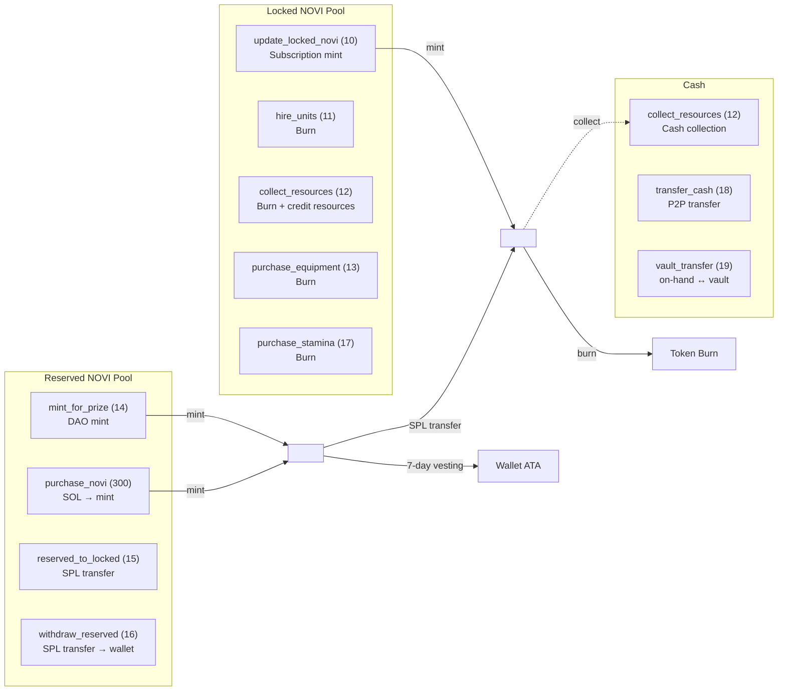
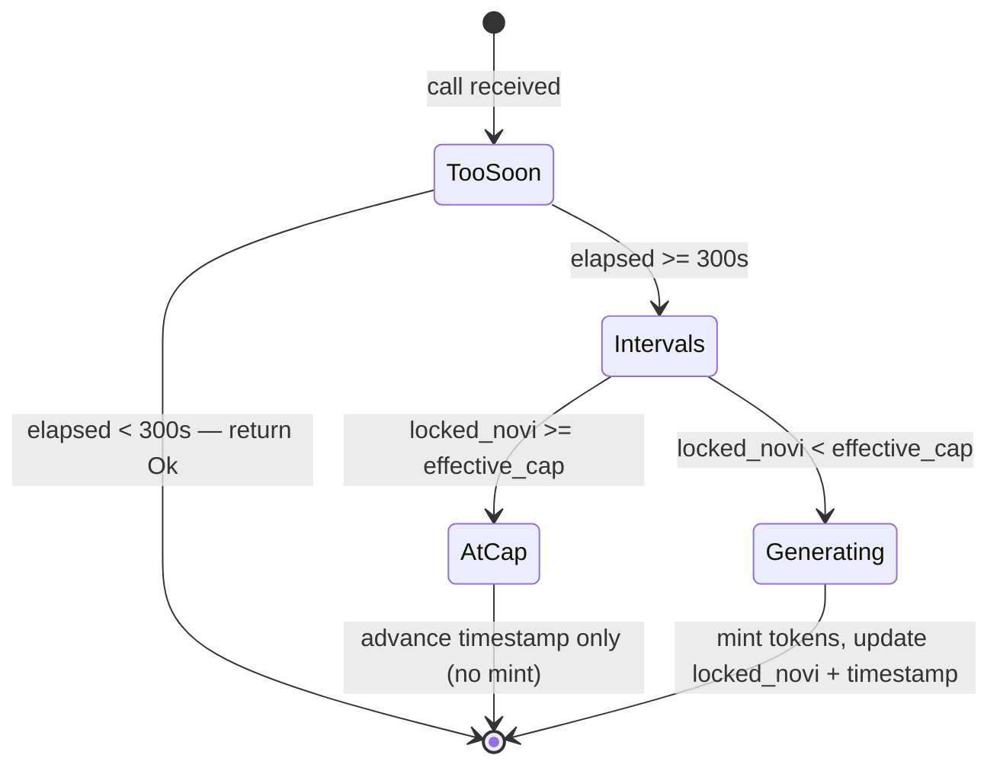
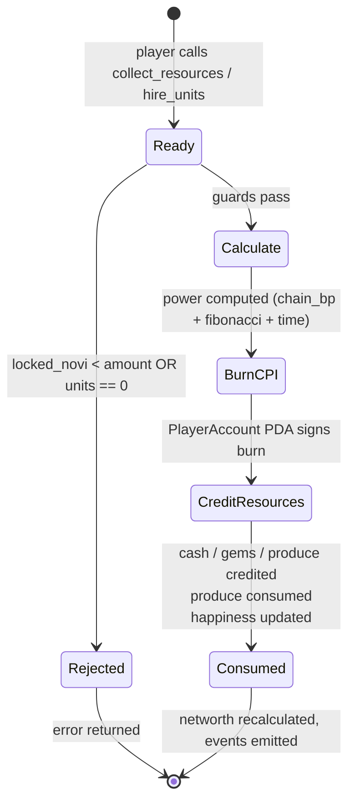
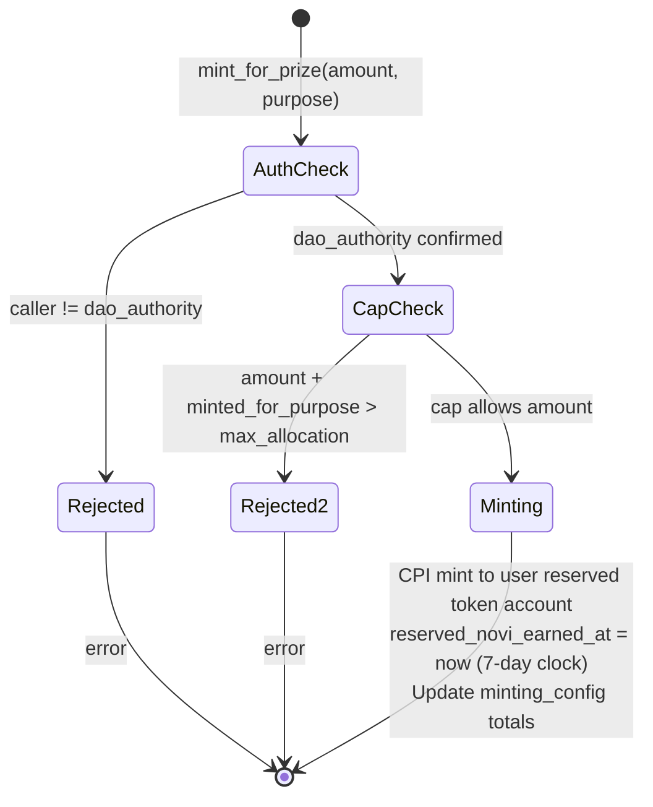
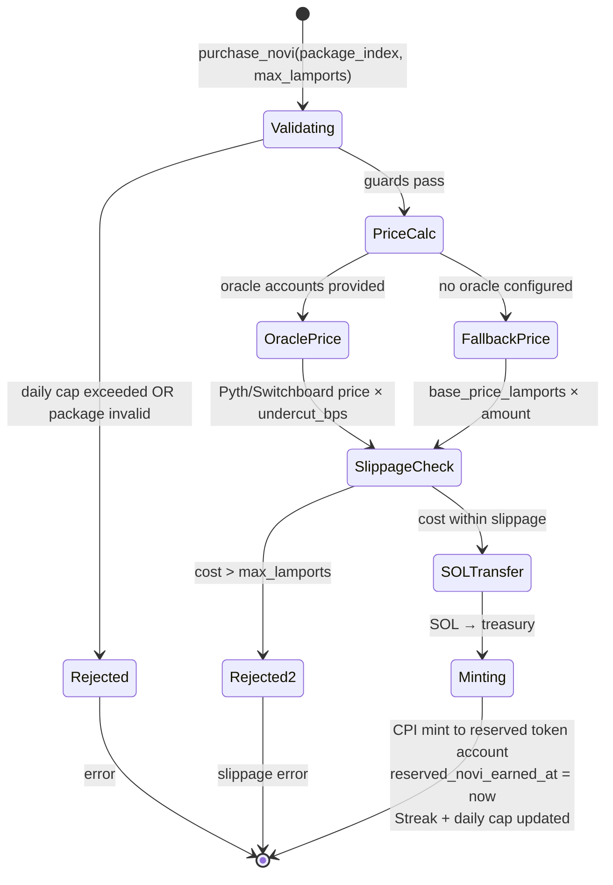
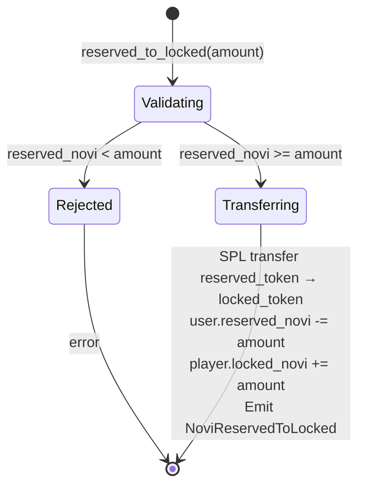
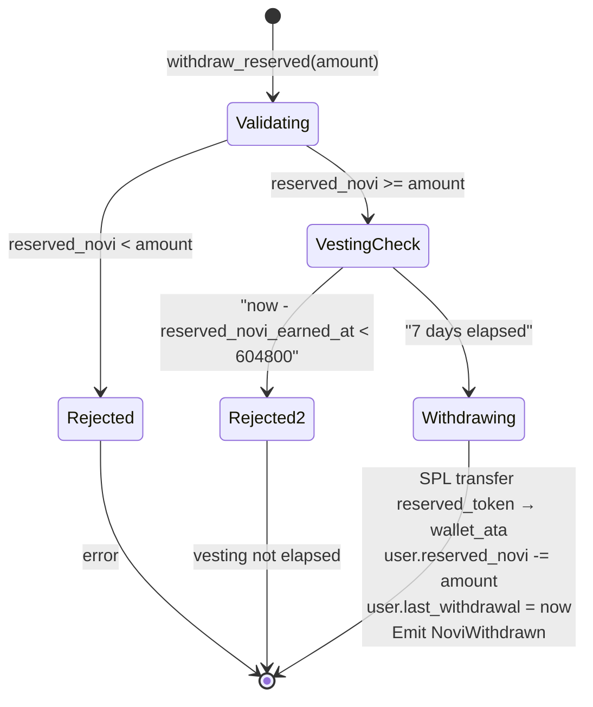
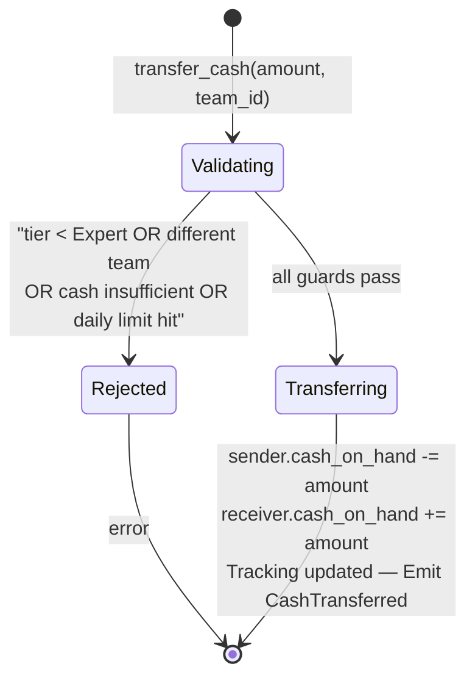
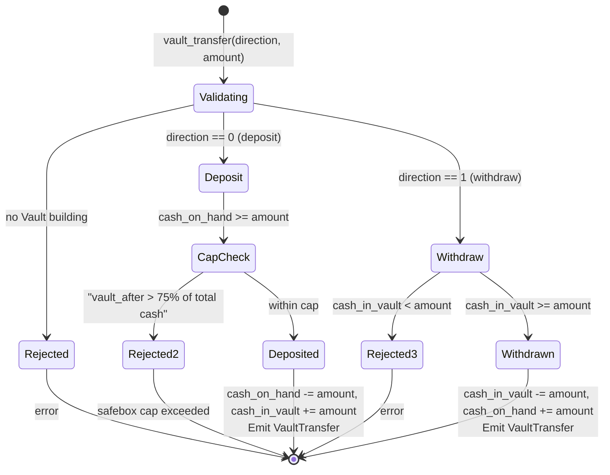

# Economy State Machine

## Overview

The economy instructions manage the two NOVI token pools (locked and reserved), cash, gems, produce, and stamina. Each instruction follows a strict guard/action pattern. This document describes the state transitions, currency flows, and invariants as they exist in the deployed Rust program.



---

## 1. Locked NOVI Generation (`update_locked_novi`, discriminant 10)

### States

| State | Description |
|-------|-------------|
| `Generating` | `locked_novi < effective_cap` and interval has passed |
| `AtCap` | `locked_novi >= effective_cap` — timestamp advances, no mint |
| `TooSoon` | Less than 300 seconds since last update — no-op return `Ok(())` |

### State Diagram



ASCII reference:
```
         now - last_updated < 300s
  ┌──────────────────────────────────────────────────┐
  │                                                  │
  ▼                                                  │
start ────> TooSoon ─────────────────────────────> return Ok
              │
              │ >= 300s elapsed
              ▼
           intervals = elapsed / 300
              │
              ├─── locked_novi >= cap ──> AtCap ──> update timestamp, return Ok
              │
              └─── locked_novi < cap ───> Generating ──> mint tokens, update state
```

### Transition: Generating

```
Trigger: update_locked_novi call
Guards:
  - owner is signer
  - player.owner == owner
  - user.owner == owner
  - now - last_updated_tokens_at >= 300 seconds
  - locked_novi < effective_cap
  - token account owned by PlayerAccount PDA
Actions:
  - intervals = (now - last_updated_tokens_at) / 300
  - generation_rate = subscription_tiers[effective_tier].generation_multiplier
  - effective_cap = tier.max_locked_novi × (10000 + vault_bonus_bps) / 10000
  - tokens = min(intervals × generation_rate, effective_cap - locked_novi)
  - player.locked_novi += tokens (capped)
  - player.last_updated_tokens_at = now
  - CPI: GameEngine PDA signs mint_to(player_token_account, tokens)
  - Emit NoviLocked
```

### Transition: AtCap (no mint)

```
Trigger: update_locked_novi call with locked_novi >= effective_cap
Guards: (same as Generating)
Actions:
  - player.last_updated_tokens_at = now  (prevents time banking)
  - No mint CPI
```

---

## 2. NOVI Consumption (`collect_resources`, discriminant 12; `hire_units`, discriminant 11)

### States

| State | Description |
|-------|-------------|
| `Ready` | Player has sufficient locked NOVI and operative units |
| `Consumed` | NOVI burned, resources credited |

### State Diagram



ASCII reference:
```
  Ready
    │
    │ validate (locked_novi >= amount, units > 0, feature unlocked)
    ▼
  Calculate
    │  power = chain_bp(amount, [base_mult, secondary_mult, synchrony_bp])
    │  if is_fibonacci(amount): power = apply_bp(power, fibonacci_bonus_bp)
    │  power = apply_time_multiplier(power, time_of_day, Consuming)
    ▼
  Burn CPI
    │  PlayerAccount PDA signs burn_tokens(amount)
    │  player.locked_novi -= amount
    ▼
  Credit Resources
    │  Cash/Gems/Produce += output (type-dependent)
    │  consume produce (1 per operative unit)
    │  update happiness_operative
    ▼
  Consumed ──> update networth, emit ResourcesCollected
```

### collect_resources Transition Detail

```
Trigger: collect_resources(novi_amount, collection_type)
Guards:
  - owner is signer
  - player.locked_novi >= novi_amount
  - total_operative_units > 0
  - player not traveling
  - collection_type feature unlocked (Mining: has_mining(), Fishing: has_fishing())
  - required building present (Mine lv1 for Mining, Dock lv1 for Fishing, Farm lv1 for Farming)
Actions (in order):
  1. synchrony = calculate_synchrony(player, gameplay_config, subscription_tiers, now)
  2. base_power = consume_novi_logic(novi_amount, synchrony, economic_config)
  3. power = apply_time_multiplier(base_power, time_of_day, ActivityType::Consuming)
  4. base_output = power × unit_multipliers (type-specific formula)
  5. terrain_bonus (optional city account): multiply output by (10000 + terrain_bps) / 10000
  6. time_adjusted = apply_time_multiplier(base_output, time_of_day, type_activity)
  7. observatory_bonus: multiply by (10000 + observatory_bps) / 10000
  8. consume_produce: player.produce -= min(total_operative, player.produce)
  9. update_happiness_operative based on remaining produce
  10. calculate_abandonment and remove units if happiness low
  11. player.locked_novi -= novi_amount
  12. CPI: PlayerAccount PDA signs burn_tokens(novi_amount)
  13. Credit output to player (cash / gems / produce)
  14. Apply research_collection_bonus_bps, hero buffs, building bonuses
  15. Award fragments if has_fragment_drops()
  16. XP: grant_xp_with_time_bonus
  17. calculate_networth
  18. Update event scores (optional)
  19. Emit ResourcesCollected, XpGained, optional PlayerLeveledUp
```

### Output Formulas by Collection Type

```
Cash:
  cash_from_op1 = op1 × 10 × power
  cash_from_op2 = op2 × 8 × power
  cash_from_op3 = op3 × 5 × power
  base_output   = sum of above

Mining (Gems):
  unit_factor = op1×3 + op2×2 + op3×1
  base_output = sqrt_product(unit_factor, power)   // u64 safe sqrt

Fishing (Produce):
  unit_factor = op1×5 + op2×4 + op3×3
  base_output = pow_three_quarters(sqrt_product(unit_factor, power)) × 3

Farming (Produce):
  unit_factor = op1×5 + op2×4 + op3×3
  base_output = pow_three_quarters(sqrt_product(unit_factor, power)) × 3
```

### hire_units Transition Detail

```
Trigger: hire_units(unit_type, novi_amount)
Guards:
  - owner is signer
  - player.locked_novi >= novi_amount
  - unit_type valid (0-5)
  - required estate building present and at minimum level for unit_type
Actions:
  1. synchrony = calculate_synchrony(...)
  2. power = consume_novi_logic(novi_amount, synchrony, economic_config)
  3. units_with_time_bonus = apply_time_multiplier(units, time_of_day, ActivityType::Hiring)
  4. player.locked_novi -= novi_amount
  5. CPI: PlayerAccount PDA signs burn_tokens(novi_amount)
  6. player.{unit_type} += units_with_time_bonus
  7. update_happiness_defensive
  8. calculate_networth
  9. Emit UnitsHired
```

---

## 3. Equipment Purchase (`purchase_equipment`, discriminant 13)

```
Trigger: purchase_equipment(equipment_type, novi_amount)
Guards:
  - owner is signer
  - player.locked_novi >= novi_amount
  - equipment_type valid
  - required building present
Actions:
  - cost = base_cost × cost_multiplier / 10000
  - player.locked_novi -= cost
  - CPI: PlayerAccount PDA signs burn_tokens(cost)
  - player.{equipment_field} += quantity
  - calculate_networth
```

---

## 4. Stamina Purchase (`purchase_stamina`, discriminant 17)

```mermaid
stateDiagram-v2
    [*] --> Validating : purchase_stamina(amount)
    Validating --> Rejected : locked_novi < novi_cost
    Rejected --> [*] : error
    Validating --> Burning : locked_novi sufficient
    Burning --> Credited : CPI burn; locked_novi -= cost
    Credited --> [*] : encounter_stamina = min(stamina + amount, max_stamina)<br/>Emit StaminaPurchased
```

```
Trigger: purchase_stamina(stamina_amount)
Guards:
  - owner is signer
  - player.locked_novi >= novi_cost
Actions:
  - adjusted_cost = stamina_cost × cost_multiplier / 10000
  - novi_cost = stamina_amount × adjusted_cost
  - CPI: PlayerAccount PDA signs burn_tokens(novi_cost)
  - player.locked_novi -= novi_cost
  - player.encounter_stamina = min(encounter_stamina + stamina_amount, max_encounter_stamina)
  - Emit StaminaPurchased
```

---

## 5. Prize Minting (`mint_for_prize`, discriminant 14)



```
Trigger: mint_for_prize(amount, purpose)  [DAO only]
Guards:
  - dao_authority is signer
  - dao_authority == game_engine.authority
  - purpose valid (0-6)
  - amount + minted_for_{purpose} <= max_{purpose}_allocation
  - total_minted + amount <= max_supply_cap
  - recipient_user token account owned by UserAccount PDA
Actions:
  - CPI: GameEngine PDA signs mint_to(user_token_account, amount)
  - game_engine.minting_config.minted_for_{purpose} += amount
  - game_engine.minting_config.total_minted += amount
  - user.reserved_novi += amount
  - user.reserved_novi_earned_at = now  (7-day vesting clock starts)
```

> **Atomicity Note (Audit M-17):** Per-purpose cap checks are not atomic across multiple instructions in one transaction. DAO must issue one `mint_for_prize` per transaction.

---

## 6. NOVI Purchase (`purchase_novi`, discriminant 300)



```
Trigger: purchase_novi(package_index, max_lamports)
Guards:
  - buyer is signer
  - package_index in [0, 4]
  - game_engine not paused
  - daily purchase total + base_amount <= daily_cap[subscription_tier]
  - cost_lamports <= max_lamports  (slippage check)
  - reserved_token_account owned by UserAccount PDA
Actions:
  1. subscription_tier = player.get_effective_tier(now)
  2. streak_day = consecutive_day_calculation(user)
  3. base_amount = novi_purchase_config.novi_purchase_amounts[package_index]
  4. total_bonus_bps = bulk_bonus + sub_bonus + streak_bonus
  5. bonus_amount = base_amount × total_bonus_bps / 10000
  6. total_novi = base_amount + bonus_amount
  7. cost_lamports = oracle_price OR fallback_price; apply undercut_bps
  8. Transfer SOL: buyer → treasury
  9. CPI: GameEngine PDA signs mint_to(reserved_token_account, total_novi)
  10. user.reserved_novi += total_novi
  11. user.reserved_novi_earned_at = now
  12. user.novi_purchase_streak, novi_last_purchase_day, novi_purchased_today updated
  13. Emit NoviPurchased
```

Pricing:
- Oracle configured + accounts provided → Pyth or Switchboard price × 10^8, divided by SOL price, then `apply_bp_penalty(price, undercut_bps)`
- Oracle configured + accounts missing → `ProgramError::NotEnoughAccountKeys`
- No oracle configured → `base_amount × novi_base_price_lamports`

---

## 7. Reserved → Locked Transfer (`reserved_to_locked`, discriminant 15)



```
Trigger: reserved_to_locked(amount)
Guards:
  - owner is signer
  - user.owner == owner
  - player.owner == owner
  - user.reserved_novi >= amount
Actions:
  - CPI: UserAccount PDA signs spl_transfer(reserved_token → locked_token, amount)
    [NOTE: SPL transfer, not burn — total supply unchanged]
  - user.reserved_novi -= amount
  - player.locked_novi += amount
  - player.total_locked_novi_acquired += amount
  - Emit NoviReservedToLocked
```

This is **one-way and permanent**.

---

## 8. Withdraw Reserved (`withdraw_reserved`, discriminant 16)



```
Trigger: withdraw_reserved(amount)
Guards:
  - owner is signer
  - user.owner == owner
  - user.reserved_novi >= amount
  - now - user.reserved_novi_earned_at >= 604800  (7-day vesting)
Actions:
  - CPI: UserAccount PDA signs spl_transfer(reserved_token → wallet_ata, amount)
    [NOTE: SPL transfer, not mint — total supply unchanged]
  - user.reserved_novi -= amount
  - user.last_withdrawal = now
  - Emit NoviWithdrawn
```

---

## 9. Cash Transfer (`transfer_cash`, discriminant 18)



```
Trigger: transfer_cash(amount, team_id)
Guards:
  - sender is signer
  - both sender and receiver on same team (TeamAccount PDA verification)
  - sender subscription_tier >= 1 (Expert+)
  - sender account age >= min_account_age_for_events
  - receiver account age >= min_account_age_for_events
  - sender.cash_on_hand >= amount
  - daily_sent + amount <= tier_daily_limit (with Vault building bonus)
  - daily_count < max_daily_transfer_count
Actions:
  - sender.cash_on_hand -= amount
  - receiver.cash_on_hand += amount
  - sender total_sent tracking updated
  - receiver total_received tracking updated
  - Emit CashTransferred
```

---

## 10. Vault Transfer (`vault_transfer`, discriminant 19)



```
Trigger: vault_transfer(direction, amount)
Guards:
  - owner is signer
  - Vault building present (require_vault check)
  - direction in {0=deposit, 1=withdraw}
  - deposit: sender.cash_on_hand >= amount
  - deposit: total_vault_after <= safebox_protection_percent × total_cash / 10000
  - withdraw: cash_in_vault >= amount
Actions:
  direction 0 (deposit):
    - player.cash_on_hand -= amount
    - player.cash_in_vault += amount (capped by safebox limit)
  direction 1 (withdraw):
    - player.cash_in_vault -= amount
    - player.cash_on_hand += amount
  - Emit VaultTransfer
```

---

## Account Structure

```rust
// Locked NOVI host
#[repr(C)]
pub struct PlayerCore {
    pub account_key: u8,
    pub game_engine: Address,              // Kingdom scope
    pub owner: Address,                    // Wallet pubkey
    pub bump: u8,
    // ...
    pub locked_novi: u64,                  // Gameplay fuel (non-withdrawable)
    pub last_updated_tokens_at: i64,       // Generation timestamp
    // ...
    pub cash_on_hand: u64,
    pub cash_in_vault: u64,
    pub subscription_tier: u8,
    pub subscription_end: i64,
    // ...
}
// PDA seeds: [b"player", game_engine_pubkey, owner_pubkey]

// Reserved NOVI host
#[repr(C)]
pub struct UserAccount {
    pub account_key: u8,
    pub owner: Address,                    // Wallet pubkey
    pub player: Address,
    pub bump: u8,
    pub _padding1: [u8; 7],
    pub reserved_novi: u64,               // Withdrawable earnings
    pub reserved_novi_earned_at: i64,     // Vesting clock (7 days)
    pub total_events_participated: u64,
    pub total_events_won: u64,
    pub total_reserved_earned: u64,
    pub last_withdrawal: i64,
    pub novi_purchase_streak: u16,
    pub novi_last_purchase_day: u32,
    pub novi_purchased_today: u64,
    pub _padding2: [u8; 2],
}
// PDA seeds: [b"user", owner_pubkey]
```

---

## Invariants

```
1. PlayerAccount.locked_novi reflects the balance of the player's locked token account
   (kept in sync by all mint and burn CPIs)

2. UserAccount.reserved_novi reflects the balance of the user's reserved token account
   (kept in sync by all mint and transfer CPIs)

3. reserved_novi is on UserAccount, never on PlayerAccount

4. Locked NOVI: token account owner = PlayerAccount PDA (not the wallet)
   Reserved NOVI: token account owner = UserAccount PDA (not the wallet)

5. Minting instructions: update_locked_novi (→ locked), mint_for_prize (→ reserved),
   purchase_novi (→ reserved). No other instructions mint NOVI.

6. Burning instructions: hire_units, collect_resources, purchase_equipment,
   purchase_stamina. All burn from the locked token account.
   reserved_to_locked is an SPL transfer (NOT a burn).
   withdraw_reserved is an SPL transfer (NOT a mint).

7. player.locked_novi <= effective_cap at the end of every update_locked_novi call

8. Stamina regen: 1 per STAMINA_REGEN_INTERVAL (300s), modified by time-of-day
   (DeepNight = φ×, Dawn = √φ×, Midday = 1/φ×, Afternoon = 1/φ×)

9. Fibonacci bonus (16180 bps = φ = 1.618×) applies when is_fibonacci(novi_amount)
   uses 5n²±4 perfect-square test in u128

10. Networth does NOT include locked_novi or gems or buildings —
    only units, weapons, armor, produce, vehicles, and cash

11. Reserved NOVI vesting: withdraw requires now - reserved_novi_earned_at >= 604800s
    reserved_novi_earned_at resets on every mint (mint_for_prize, purchase_novi)

12. cost_multiplier (EconomicConfig) applies to all purchase-type burns:
    actual_cost = base_cost × cost_multiplier / 10000

13. Synchrony is always >= 1.0 (base 10000 bps + non-negative bonuses)
```

[Source: processor/economy/](../../programs/novus_mundus/src/processor/economy/)
[Source: processor/token/](../../programs/novus_mundus/src/processor/token/)
[Source: processor/shop/purchase_novi.rs](../../programs/novus_mundus/src/processor/shop/purchase_novi.rs)
[Source: logic/consume.rs](../../programs/novus_mundus/src/logic/consume.rs)
[Source: logic/calculations.rs](../../programs/novus_mundus/src/logic/calculations.rs)
[Source: logic/fibonacci.rs](../../programs/novus_mundus/src/logic/fibonacci.rs)
[Source: logic/safe_math.rs](../../programs/novus_mundus/src/logic/safe_math.rs)
[Source: state/game_engine.rs](../../programs/novus_mundus/src/state/game_engine.rs)
[Source: state/player.rs](../../programs/novus_mundus/src/state/player.rs)
[Source: constants.rs](../../programs/novus_mundus/src/constants.rs)
