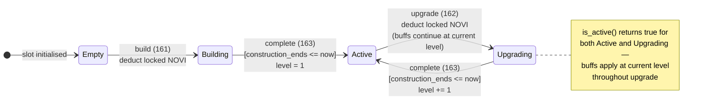
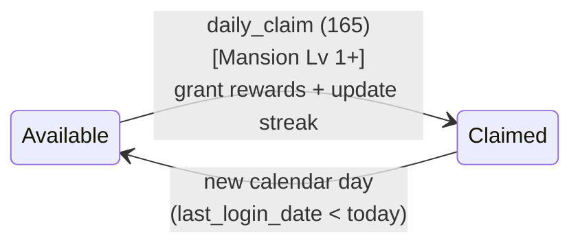
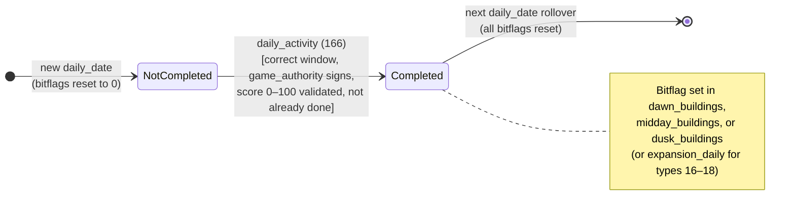
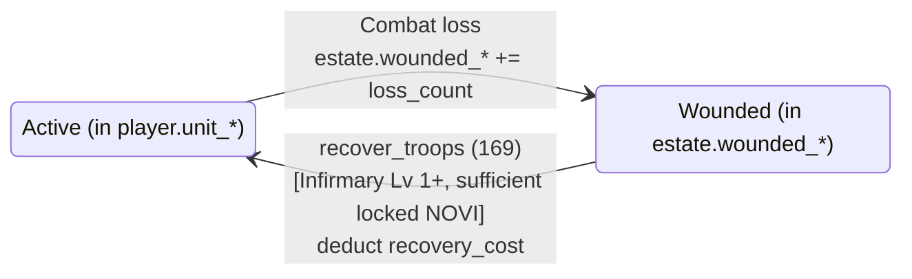

# Estate System State Machine

## Overview

The Estate system manages each player's personal city of buildings. Buildings progress through construction states (Empty → Building → Active → Upgrading → Active) and power a daily activity loop. Land is expanded via purchasable plots. Wounded units accumulate on the estate and can be recovered through the Infirmary.

---

## 1. Building Slot Lifecycle

### States

| State | Value | Description |
|-------|:-----:|-------------|
| `Empty` | 0 | Slot has no building; available for construction |
| `Building` | 1 | Under initial construction; no buff provided yet |
| `Active` | 2 | Fully operational; provides passive buffs |
| `Upgrading` | 3 | Being upgraded; still provides buffs at current level |

### State Diagram



ASCII reference:
```
             build (161)
┌──────────┐ ──────────────> ┌──────────────┐
│          │                 │              │
│  Empty   │                 │   Building   │
│          │                 │              │
└──────────┘                 └──────┬───────┘
                                    │ complete (163)
                                    │ [construction_ends <= now]
                                    ▼
                             ┌──────────────┐
              upgrade (162)  │              │  complete (163)
              ─────────────> │    Active    │ <─────────────────
                             │              │  [construction_ends <= now]
                             └──────┬───────┘
                                    │
                                    │ upgrade (162)
                                    ▼
                             ┌──────────────┐
                             │              │
                             │  Upgrading   │
                             │ (buffs at    │
                             │ current lvl) │
                             └──────────────┘
```

### Transitions

#### `Empty` → `Building`
```
Trigger: build (instruction 161)
Guards:
  - Slot index is within current_slots (plots_owned × 4)
  - Slot status == Empty
  - building_type ∈ [0, 18]
  - required_estate_level(building_type) <= estate_level  [currently 0 for all]
  - Sufficient locked NOVI for base_construction_cost
Actions:
  - Deduct base_cost NOVI from player.locked_novi
  - Set slot.building_type = building_type
  - Set slot.status = Building (1)
  - Set slot.construction_started = now
  - Set slot.construction_ends = now + base_construction_time
  - Increment estate.total_buildings
```

#### `Building` → `Active`
```
Trigger: complete (instruction 163)
Guards:
  - slot.status == Building (1)
  - now >= slot.construction_ends
Actions:
  - Set slot.status = Active (2)
  - Set slot.level = 1
  - Recalculate estate cached passive buffs
  - Emit EstateConstructionComplete
```

#### `Active` → `Upgrading`
```
Trigger: upgrade (instruction 162)
Guards:
  - slot.status == Active (2)
  - slot.level < 20
  - Sufficient locked NOVI for upgrade_cost(slot.level)
Actions:
  - Deduct upgrade_cost from player.locked_novi
  - Set slot.status = Upgrading (3)
  - Set slot.construction_started = now
  - Set slot.construction_ends = now + calculate_construction_time()
  - slot.total_novi_invested += upgrade_cost
```

#### `Upgrading` → `Active`
```
Trigger: complete (instruction 163)
Guards:
  - slot.status == Upgrading (3)
  - now >= slot.construction_ends
Actions:
  - Set slot.status = Active (2)
  - Increment slot.level by 1
  - estate.estate_level = sum of all slot.level values
  - Recalculate estate cached passive buffs
  - Emit EstateBuildingUpgraded
```

---

## 2. Speedup System

```mermaid
flowchart TD
    SUP[speedup (168)] --> CHK1{status in<br/>Building/Upgrading?}
    CHK1 -->|No| ERR1[Rejected]
    CHK1 -->|Yes| CHK2{construction_ends<br/>> now?}
    CHK2 -->|No| ERR2[Already finishable]
    CHK2 -->|Yes| CHK3{Sufficient<br/>gems?}
    CHK3 -->|No| ERR3[Rejected]
    CHK3 -->|Yes| ACT["Deduct gems<br/>Adjust construction_starts backward"]
    ACT --> DONE{construction_ends<br/><= now now?}
    DONE -->|Yes| READY["Immediately eligible<br/>for complete (163)"]
    DONE -->|No| WAIT["Timer shortened<br/>wait for complete"]
```

```
Trigger: speedup (instruction 168)
Guards:
  - slot.status ∈ {Building, Upgrading}
  - slot.construction_ends > now
  - Sufficient player.gems
Actions:
  - Deduct gems from player
  - Adjust slot.construction_starts backward
    (effectively reduces construction_ends - now)
  - May reduce construction_ends below now (immediate completion eligible)
```

---

## 3. Plot Expansion

### States

| plots_owned | Usable Slots | Max Buildings |
|:-----------:|:------------:|:-------------:|
| 1 | 4 | 4 |
| 2 | 8 | 8 |
| 3 | 12 | 12 |
| 4 | 16 | 16 |
| 5 | 20 | 20 (max) |

### Transition: Buy Plot
```
Trigger: buy_plot (instruction 164)
Guards:
  - plots_owned < 5
  - Sufficient locked NOVI for next_plot_cost()
  - Estate account has been reallocated to hold 4 more BuildingSlot entries
Actions:
  - Deduct next_plot_cost from player.locked_novi
  - Increment plots_owned by 1
  - current_slots = plots_owned × 4
  - New BuildingSlot entries initialized to EMPTY
  - Emit PlotPurchased
```

Plot costs (NOVI): Plot 2 → 100,000; Plot 3 → ~262,180; Plot 4 → ~685,848; Plot 5 → ~1,793,989.

---

## 4. Daily Login Claim

### States

| State | Description |
|-------|-------------|
| `Available` | `last_login_date < current_day` — player has not claimed today |
| `Claimed` | `last_login_date == current_day` — already claimed today |



ASCII reference:
```
                      new calendar day
┌──────────┐ ────────────────────────────> ┌───────────┐
│          │                               │           │
│ Claimed  │                               │ Available │
│          │                               │           │
└──────────┘ <──────────────────────────── └───────────┘
                 daily_claim (165)
```

### Transition: `Available` → `Claimed`
```
Trigger: daily_claim (instruction 165)
Guards:
  - Mansion building exists and is_active() and level >= 1
  - last_login_date < current_day_number (now / 86400)
Actions:
  - Update last_login_date = current_day
  - Check streak continuity:
    - If current_day == last_login_date + 1: login_streak += 1
    - Else: login_streak = 1 (streak broken)
  - If login_streak > longest_login_streak: update longest
  - If login_streak >= 180 and permanent_bonus_bps == 0: permanent_bonus_bps = 500
  - Calculate streak_multiplier_bps
  - Calculate mansion_bonus: mansion_level × 500 bps
  - Apply rewards: materials, locked_novi, xp
  - Apply one-time milestone rewards at streaks 7, 14, 30, 60, 90, 180
  - Update estate.last_activity = now
  - Emit EstateDailyClaimed
```

---

## 5. Daily Activity Mini-Game

### Time Windows (relative to `dawn_timestamp`)

```
dawn_timestamp set on first daily action
│
├── 0 h ─────────────────── 3 h   → Dawn window
│                  (gap 3–4 h accepts Dawn buildings)
├── 4 h ─────────────────── 8 h   → Midday window
│                  (gap 8–9 h accepts Midday buildings)
├── 9 h ─────────────────── 16 h  → Dusk window
│
└── 16 h+                         → Expired
```

### Completion States (per building per window per day)



ASCII reference:
```
┌───────────────┐    daily_activity(166)    ┌───────────────┐
│  Not Completed│ ─────────────────────────>│   Completed   │
│  (bitflag=0)  │   [correct window,        │  (bitflag=1)  │
└───────────────┘    not already done,       └───────────────┘
                     game_authority signs,
                     score validated]
                                        reset at next daily_date rollover ▲
```

Completion is tracked via bitflags:
- Buildings 0–15: `dawn_buildings`, `midday_buildings`, `dusk_buildings` (u16 bitfield, bit N = BuildingType N)
- Buildings 16–18: `expansion_daily` (u8 bitfield, bit 0 = type 16, bit 1 = type 17, bit 2 = type 18)

### Transition: `Not Completed` → `Completed`
```
Trigger: daily_activity (instruction 166)
Guards:
  - game_authority is signer (game server validates score)
  - owner is signer
  - Building exists in estate and is_active()
  - current_window != Expired
  - building_type is allowed in current_window
  - Building not already completed in this window (bitflag check)
Actions:
  - If new day: reset all daily tracking fields
  - Grant score-proportional reward (see building reward table)
  - Set completion bitflag for building in appropriate window
  - Check if entire window is now complete (windows_completed |= flag)
  - Update estate.last_activity = now
```

---

## 6. Material Conversion

### Transition: Convert Materials
```
Trigger: convert_materials (instruction 167)
Guards:
  - Workshop exists, is_active(), level >= required level for from_tier
    (Lv 1 for Common→Uncommon, Lv 5 for Uncommon→Rare, Lv 10 for Rare→Epic, Lv 15 for Epic→Legendary)
  - from_tier ∈ [0, 3]
  - conversions >= 1
  - player has conversions × 100 of from_tier materials
Actions:
  - Deduct conversions × 100 of from_tier materials
  - Add conversions × 20 of to_tier materials (5:1 ratio)
```

---

## 7. Wounded Unit Recovery

### State Diagram



ASCII reference:
```
Unit enters wounded state          Infirmary Lv 1+ present
(from combat loss) ──────────────> estate.wounded_* counter incremented

recover_troops (169)
[Infirmary Lv 1+, sufficient locked_novi]
──────────────────────────────────────>
  estate.wounded_* -= amount
  player.unit_* += amount
  player.locked_novi -= recovery_cost
```

### Transition: Recover Troops
```
Trigger: recover_troops (instruction 169)
Guards:
  - Infirmary exists and is_active() and level >= 1
  - amount <= estate.get_wounded_*(unit_type) [matching unit type field]
  - player.locked_novi >= total_recovery_cost
Actions:
  - Deduct total_recovery_cost from player.locked_novi
  - Add amount to player.unit_* field
  - Subtract amount from estate.wounded_* field (via [u8;4] accessors)
  - Emit TroopsRecovered
```

Recovery cost formula:
```
base    = unit_hire_cost × 5000 bps / 10000  (50%)
lvl_adj = base × (10000 - infirmary_level × 25) / 10000
daily   = lvl_adj × (10000 - estate.infirmary_recovery_daily_bps) / 10000
total   = max(daily, 1) × amount
```

---

## 8. Account Structure

```rust
pub struct EstateAccount {
    pub account_key: u8,
    pub owner: Address,              // player wallet
    pub city_id: u16,
    pub bump: u8,
    pub estate_level: u8,            // sum of all building levels
    pub plots_owned: u8,             // 1–5
    pub total_buildings: u8,
    pub current_slots: u8,           // plots_owned × 4

    // Cached passive buffs (u16 each, basis points)
    pub attack_bps: u16,
    pub defense_bps: u16,
    pub resource_gen_bps: u16,
    pub xp_gain_bps: u16,
    pub storage_bps: u16,
    pub training_speed_bps: u16,
    pub research_speed_bps: u16,
    pub craft_success_bps: u16,
    pub trade_discount_bps: u16,
    pub novi_cap_bonus_bps: u16,
    pub loot_bonus_bps: u16,
    pub prize_bonus_bps: u16,
    pub rally_capacity_bonus_bps: u16,
    pub pvp_damage_bps: u16,

    // Daily tracking
    pub last_login_date: u16,
    pub login_streak: u16,
    pub longest_login_streak: u16,
    pub permanent_bonus_bps: u16,    // 500 after 180-day streak
    pub daily_date: u16,
    pub dawn_timestamp: i64,
    pub windows_completed: u8,       // 0b00000DML
    pub dawn_buildings: u16,
    pub midday_buildings: u16,
    pub dusk_buildings: u16,

    // Daily active buffs (reset each day)
    pub unit_effectiveness_bps: u16,
    pub mastery_bonus_bps: u16,
    pub arena_damage_bps: u16,
    pub daily_loot_bonus_bps: u16,
    pub market_discount_bps: u16,
    pub blessed_hero: Address,
    pub citadel_stance: u8,

    pub created_at: i64,
    pub last_activity: i64,

    // Expansion building daily buffs
    pub camp_discount_bps: u16,
    pub stables_speed_bps: u16,
    pub infirmary_recovery_daily_bps: u16,
    pub expansion_daily: u8,

    // Wounded counters (u32 stored as [u8;4] for alignment)
    pub wounded_def_1: [u8; 4],
    pub wounded_def_2: [u8; 4],
    pub wounded_def_3: [u8; 4],
    pub wounded_op_1: [u8; 4],
    pub wounded_op_2: [u8; 4],
    pub wounded_op_3: [u8; 4],

    // MUST BE LAST — expandable, 36 bytes each
    pub buildings: [BuildingSlot; 20],
}
```

PDA: `[ESTATE_SEED, player_account_pda]` (player PDA, not wallet)

Initial allocation: `INITIAL_LEN = HEADER_SIZE + 4 × 36 bytes = HEADER_SIZE + 144 bytes`.

[Source: state/estate.rs](../../programs/novus_mundus/src/state/estate.rs)

---

## 9. Invariants

```
1. plots_owned ∈ [1, 5]
2. current_slots = plots_owned × 4
3. total_buildings <= current_slots
4. estate_level = ∑ slot.level for all non-empty slots
5. buildings[i].status == Empty implies buildings[i].level == 0
6. buildings[i].is_active() = (status == Active OR status == Upgrading)
7. A building in Upgrading state provides buffs at its CURRENT (pre-upgrade) level
8. login_streak resets to 1 on a missed day; cannot go to 0 except before any claim
9. permanent_bonus_bps is set exactly once at streak >= 180; never decremented
10. Dawn, Midday, Dusk bitflags and expansion_daily reset to 0 on new daily_date
11. wounded_* counters are u32 values stored as [u8;4] little-endian
12. recover_troops cannot recover more units than the wounded_* counter for that unit type
13. Building slots beyond current_slots MUST NOT be used
14. Account data length = HEADER_SIZE + current_slots × 36 bytes
```
