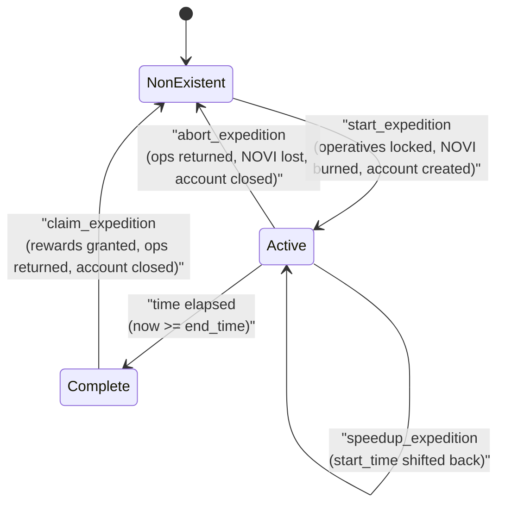
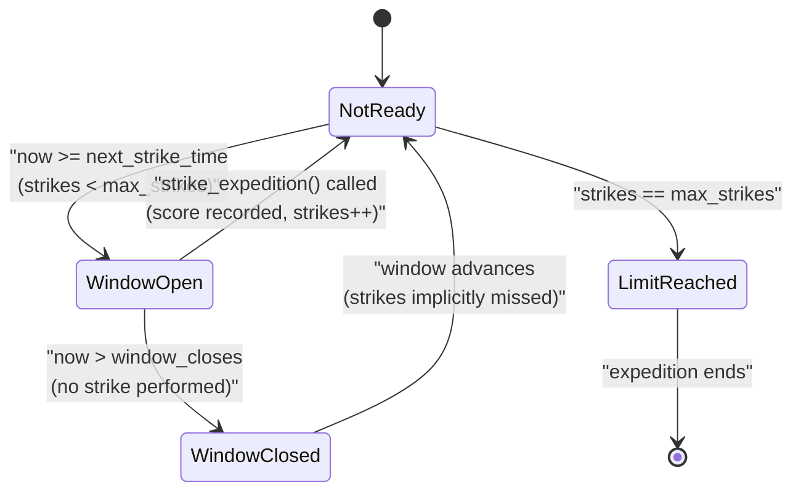
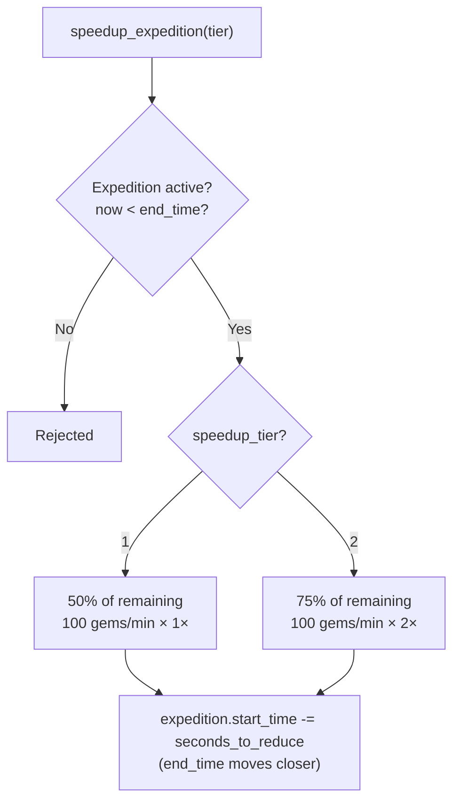
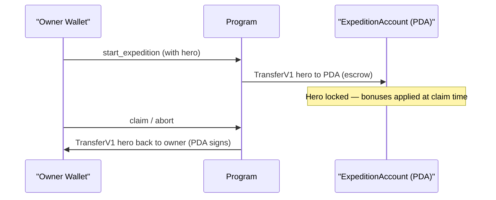

# Expedition System State Machine

## Overview

The Expedition system handles mining and fishing expeditions where players send operatives to gather resources over time. Expeditions are temporary activities that lock resources and optionally include hero NFTs for bonus yields.



---

## 1. Expedition Lifecycle

### States

| State | Description |
|-------|-------------|
| `NonExistent` | No ExpeditionAccount for this player |
| `Active` | Expedition in progress, operatives locked |
| `Complete` | Duration elapsed, ready to claim |

### State Diagram (ASCII reference)

```
┌────────────────┐  start_expedition  ┌────────────────┐
│                │ ─────────────────> │                │
│  NonExistent   │                    │     Active     │
│                │                    │                │
└────────────────┘                    └───────┬────────┘
       ▲                                      │
       │                                      │ time elapsed
       │                                      ▼
       │                              ┌────────────────┐
       │                              │                │
       │ claim_expedition             │    Complete    │
       │ abort_expedition             │                │
       └──────────────────────────────└────────────────┘
```

### Transitions

#### `NonExistent` → `Active`
```
Trigger: start_expedition
Guards:
  - Player not traveling
  - Has required research (has_mining OR has_fishing)
  - Has required building level:
    - Mining: Mine at MINING_WORKSHOP_REQ[tier]   (BuildingType::Mine = 14)
    - Fishing: Dock at FISHING_DOCK_REQ[tier]     (BuildingType::Dock = 4)
  - tier <= EXPEDITION_MAX_TIER (4)
  - Sufficient locked NOVI for cost
  - At least 1 operative committed
  - Sufficient operatives of each type
Actions:
  - Create ExpeditionAccount PDA: [EXPEDITION_SEED, owner]
  - Deduct locked NOVI (MINING_NOVI_COST or FISHING_NOVI_COST)
  - Lock operatives (deduct from player)
  - If hero provided:
    - Transfer hero NFT to expedition PDA (escrow)
    - Clear from active_heroes slot if applicable
  - Set expedition_type, tier, city_id, start_time
  - Emit ExpeditionStarted
```

#### `Active` → `Complete` (Automatic)
```
Trigger: Time passage
Guards:
  - now >= expedition.end_time()
Actions:
  - Expedition becomes claimable
  - No state field change (computed)
```

#### `Complete` → `NonExistent`
```
Trigger: claim_expedition
Guards:
  - now >= expedition.end_time()
Actions:
  - Calculate base yield:
    - weighted_ops = op1×1.0 + op2×1.5 + op3×2.0
    - Apply diminishing returns above max_operatives
    - yield = weighted_ops × hours × rate_per_tier / 100
  - Apply bonuses (multiplicative):
    1. Time-of-day bonus
    2. Research collection bonus
    3. Hero buffs (hero_collection_rate_bps or hero_produce_generation_bps)
    4. Strike score bonus (if avg_score >= 80, +25%)
    5. Hero affinity bonus (if has MiningAffinity or FishingAffinity)
    6. Origin city bonus (+25% if affinity + origin match)
  - Check rare find (deterministic):
    - seed = (start_time / 3600) % 10000
    - if seed < (base_rare_chance + observatory_bonus): 5× multiplier
  - Grant rewards (gems OR produce) + fragments
  - Return locked operatives to player
  - If hero was escrowed:
    - Transfer hero NFT back to owner (PDA signs)
  - Close ExpeditionAccount (refund rent)
  - Emit ExpeditionClaimed
```

---

## 2. Strike System (Phase 2)



### States

| State | Description |
|-------|-------------|
| `NotReady` | Strike window hasn't opened yet |
| `WindowOpen` | Player can perform a strike |
| `WindowClosed` | Missed the window |
| `LimitReached` | Max strikes already performed |

### State Diagram (ASCII reference)

```
                     ┌──────────────────────────────────────────┐
                     │                                          │
    ┌────────────────▼───┐  window opens  ┌────────────────────┐│
    │                    │ ─────────────> │                    ││
    │     NotReady       │                │    WindowOpen      ││
    │ (waiting for time) │                │ (player can strike)││
    └────────────────────┘                └─────────┬──────────┘│
                                                    │           │
                                     strike         │           │
                                     performed      │           │
                                                    ▼           │
                                          ┌────────────────────┐│
                                          │  Next Strike       │─┘
                                          │  Scheduled         │
                                          └────────────────────┘
                                                    │
                                     max_strikes    │
                                     reached        │
                                                    ▼
                                          ┌────────────────────┐
                                          │   LimitReached     │
                                          └────────────────────┘
```

### Strike Window Timing
```
window_opens = start_time + (strikes × SECONDS_PER_HOUR)
window_closes = window_opens + 1 hour (approximately)
max_strikes = duration_hours (1 per hour of expedition)
```

### Transitions

#### `NotReady` → `WindowOpen`
```
Trigger: Time passage
Guards:
  - now >= next_strike_time()
  - strikes < max_strikes()
Actions:
  - Strike window becomes available
```

#### `WindowOpen` → `NotReady` (success) / `WindowClosed` (failure)
```
Trigger: strike_expedition (or time passage)
Guards:
  - For strike: now within window, game_authority co-signs
  - For miss: now > window_closes
Actions:
  - On strike:
    - Record score (0-100, validated by game server)
    - strikes += 1
    - score += strike_score
    - Emit ExpeditionStrike
  - On miss:
    - Window passes, no score recorded
    - strikes += 1 (implicitly, window timing advances)
```

---

## 3. Abort Expedition

### Transition

#### `Active` → `NonExistent`
```
Trigger: abort_expedition
Guards:
  - Expedition exists
  - Owner is signer
Actions:
  - Return locked operatives to player (NO penalty)
  - NOVI cost is NOT refunded (burnt as penalty)
  - If hero was escrowed:
    - Transfer hero NFT back to owner
  - Close ExpeditionAccount (refund rent)
  - Emit ExpeditionAborted
```

---

## 4. Speedup Expedition



### Effect

```
Trigger: speedup_expedition
Guards:
  - Expedition exists and not complete (now < end_time)
  - Remaining time > 0
  - player.gems >= gem_cost
  - Valid speedup_tier (1 or 2)
Actions:
  - Tier 1: reduces remaining time by 50%, cost_multiplier = 1×
  - Tier 2: reduces remaining time by 75%, cost_multiplier = 2×
  - seconds_to_reduce = remaining_seconds × time_reduction_bps / 10000
  - minutes_to_reduce = ceil(seconds_to_reduce / 60)  (min 1)
  - gem_cost = minutes_to_reduce × 100 gems/min × cost_multiplier
    (EXPEDITION_SPEEDUP_GEMS_PER_MINUTE = 100)
  - player.gems -= gem_cost
  - expedition.start_time -= seconds_to_reduce  (moves end_time closer)
  - Emit ExpeditionSpeedup
```

---

## 5. Expedition Types & Tiers

### Mining Expedition

| Tier | Name | Mine Lv Req | Duration | NOVI Cost | Rare Chance | Fragments |
|------|------|-------------|----------|-----------|-------------|-----------|
| 0 | Surface | 1 | 1h | 100 | 1% (100 bps) | 1 |
| 1 | Shallow | 5 | 2h | 500 | 3% (300 bps) | 3 |
| 2 | Deep | 10 | 4h | 2,000 | 5% (500 bps) | 8 |
| 3 | Volcanic | 15 | 8h | 8,000 | 10% (1000 bps) | 20 |
| 4 | Abyssal | 20 | 16h | 30,000 | 20% (2000 bps) | 50 |

Gem yield rate per operative per hour is loaded from `GameEngine.economic_config.mining_gems_per_op_hour[tier]` (kingdom-configurable).

### Fishing Expedition

| Tier | Name | Dock Lv Req | Duration | NOVI Cost | Rare Chance | Fragments |
|------|------|-------------|----------|-----------|-------------|-----------|
| 0 | Shore | 1 | 1h | 100 | 1% (100 bps) | 1 |
| 1 | River | 5 | 2h | 500 | 3% (300 bps) | 2 |
| 2 | Lake | 10 | 4h | 2,000 | 5% (500 bps) | 5 |
| 3 | DeepSea | 15 | 8h | 8,000 | 10% (1000 bps) | 12 |
| 4 | Abyss | 20 | 16h | 30,000 | 20% (2000 bps) | 30 |

Produce yield rate per operative per hour is loaded from `GameEngine.economic_config.fishing_produce_per_op_hour[tier]` (kingdom-configurable).

> **Note:** The building gate for mining is the **Mine** building (`BuildingType::Mine = 14`), not the Workshop. The gate for fishing is the **Dock** (`BuildingType::Dock = 4`).

---

## 6. Operative Tier Multipliers

| Tier | Multiplier | Effect |
|------|------------|--------|
| 1 | 1.0× (10000 bps) | Base yield |
| 2 | 1.5× (15000 bps) | +50% yield |
| 3 | 2.0× (20000 bps) | +100% yield |

---

## 7. Hero Integration



### Hero Escrow Flow (ASCII reference)
```
┌──────────┐  start w/hero  ┌──────────────┐  claim/abort  ┌──────────┐
│  Owner   │ ─────────────> │ ExpeditionPDA │ ────────────> │  Owner   │
│  Wallet  │   TransferV1   │   (Escrow)    │   TransferV1  │  Wallet  │
└──────────┘                └──────────────┘   (PDA signs) └──────────┘
```

### Hero Bonuses
- **MiningAffinity** (stat 17): Bonus % to mining yield
- **FishingAffinity** (stat 18): Bonus % to fishing yield
- **Origin City Bonus**: +25% if hero's origin city matches expedition location AND has affinity

---

## 8. Account Structure

### ExpeditionAccount (112 bytes)
```rust
pub struct ExpeditionAccount {
    pub account_key: u8,             // 1  - AccountKey::Expedition = 33
    pub player: Address,             // 32 - Owner wallet pubkey
    pub hero_mint: Address,          // 32 - Escrowed hero (NULL_PUBKEY if none)
    pub expedition_type: u8,         // 1  - Mining(1) or Fishing(2)
    pub tier: u8,                    // 1  - 0-4
    pub strikes: u8,                 // 1  - Strikes performed
    pub bump: u8,                    // 1  - PDA bump
    pub score: u16,                  // 2  - Accumulated strike score
    pub city_id: u16,                // 2  - Expedition location (origin bonus check)
    pub start_time: i64,             // 8  - When started
    pub operative_unit_1: u64,       // 8  - Tier 1 ops locked
    pub operative_unit_2: u64,       // 8  - Tier 2 ops locked
    pub operative_unit_3: u64,       // 8  - Tier 3 ops locked
}
// compile-time assert: size == 112
```

### PDA Derivation
```
Seeds: [EXPEDITION_SEED, player_pubkey]
```

---

## 9. Invariants

```
1. Only one expedition per player at a time
2. expedition.player == owner wallet pubkey
3. expedition_type ∈ {1=Mining, 2=Fishing}
4. tier ∈ [0, 4]
5. strikes <= max_strikes()
6. score <= strikes × 100
7. Operatives locked are returned on claim or abort
8. Hero (if escrowed) is returned on claim or abort
9. NOVI cost is NOT refunded on abort — it is burned as a penalty; only operatives/hero are returned
```
