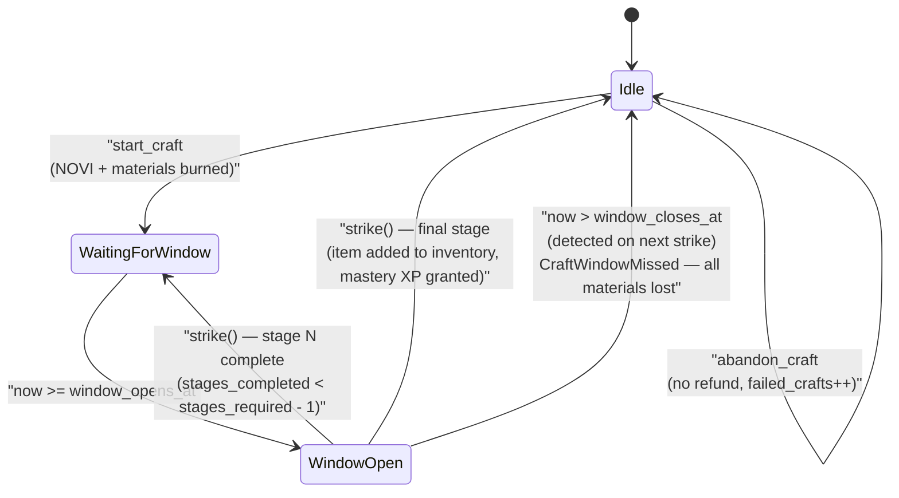
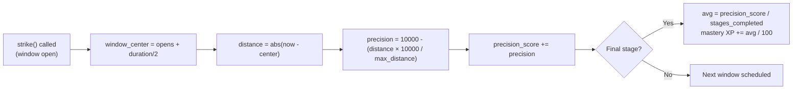

# Forge State Machine

## Overview

The Forge system uses **Staged Tempering** — a skill-based crafting mechanic where the player must call `strike` within a precise time window for each tempering stage. Missing any window fails the entire craft with no refund. The final strike auto-completes the craft — there is no separate completion instruction.



---

## 1. Craft Lifecycle

### States

| State | Description |
|-------|-------------|
| `Idle` | No active craft (`active_craft_equipment == 255`) |
| `WaitingForWindow` | Craft started, waiting for next stage window to open |
| `WindowOpen` | Player can call `strike` right now |
| `Failed` | Window was missed; craft cleared on next `strike` call |

### State Diagram (ASCII reference)

```
┌──────────┐  start_craft    ┌──────────────────┐
│          │ ──────────────> │                  │
│   Idle   │                 │  WaitingForWindow│
│          │                 │  (stage 1 queued)│
└──────────┘                 └────────┬─────────┘
     ▲                                │ now >= window_opens_at
     │                                ▼
     │                       ┌──────────────────┐
     │  all stages done       │                  │
     │ <──────────────────── │   WindowOpen     │
     │  (auto-complete)       │                  │
     │                        └─────┬────────────┘
     │                              │ strike called within window
     │                              │ stages_completed < stages_required
     │                              ▼
     │                       ┌──────────────────┐
     │                       │  WaitingForWindow│
     │                       │  (next stage)    │
     │                       └──────────────────┘
     │
     │   abandon_craft                window_closes_at passed
     └── <─────────────────────────── (detected on next strike call)
         (materials lost)              → Failed → cleared
```

### Transitions

#### `Idle` → `WaitingForWindow`
```
Trigger: start_craft(equipment_type, quality_tier)
Guards:
  - active_craft_equipment == 255 (no craft in progress)
  - Forge building exists and is active, level >= quality_tier.required_forge_level()
    - Refined: Lv 1, Superior: Lv 5, Elite: Lv 8, Masterwork: Lv 12
    - Legendary: Lv 16, Mythic: Lv 18, Divine: Lv 20
  - quality_tier != Common (0)
  - player.locked_novi >= quality_tier.novi_cost()
  - player.inventory >= quality_tier.material_cost()
Actions:
  - Burn NOVI from player token account
  - Deduct materials from player inventory
  - crafted.active_craft_equipment = equipment_type
  - crafted.target_tier = quality_tier
  - crafted.stages_required = calculate_stages_required(quality_tier, forge_level)
  - crafted.current_stage = 1
  - crafted.stages_completed = 0
  - crafted.window_opens_at  = now + stage_interval_secs(quality_tier)
  - crafted.window_closes_at = window_opens_at + calculate_window_duration(quality_tier, forge_level)
  - crafted.craft_started_at = now
  - crafted.precision_score = 0
  - crafted.total_novi_spent += novi_cost
  - Emit CraftStarted
```

#### `WaitingForWindow` → `WindowOpen` (Automatic)
```
Trigger: Time passage
Guards:
  - now >= window_opens_at
  - now <= window_closes_at
Actions:
  - Strike window becomes available (no state change needed)
```

#### `WindowOpen` → `WaitingForWindow` (stage success, more stages remain)
```
Trigger: strike()
Guards:
  - active_craft_equipment != 255
  - now >= window_opens_at AND now <= window_closes_at
  - stages_completed < stages_required - 1
Actions:
  - precision = calculate_precision(now)    // 0-10000
  - precision_score += precision
  - stages_completed++
  - current_stage++
  - window_opens_at  = now + stage_interval_secs(quality_tier)
  - window_closes_at = window_opens_at + calculate_window_duration(quality_tier, forge_level)
  - Emit CraftStrike
```

#### `WindowOpen` → `Idle` (final stage — auto-complete)
```
Trigger: strike()
Guards:
  - active_craft_equipment != 255
  - now within window
  - stages_completed >= stages_required - 1  (this is the last stage)
Actions:
  - precision_score += precision
  - stages_completed++
  - Add 1 to quality_counts[equipment_type].counts[quality_tier]
  - successful_crafts++
  - total_crafts++
  - clear_craft()                            // reset all active craft fields
  - Grant Forge mastery XP to BuildingSlot  // see Mastery XP section
  - Emit CraftCompleted
```

#### `WindowOpen` (or any) → `Idle` (window missed — detected on next strike)
```
Trigger: strike() called after window_closes_at
Guards:
  - active_craft_equipment != 255
  - now > window_closes_at
Actions:
  - failed_crafts++
  - total_crafts++
  - clear_craft()
  - Return Err(CraftWindowMissed)
```

#### Any → `Idle` (abandon)
```
Trigger: abandon_craft()
Guards:
  - active_craft_equipment != 255
Actions:
  - failed_crafts++
  - total_crafts++
  - clear_craft()
  - Emit CraftAbandoned
  (NO refund of NOVI or materials)
```

---

## 2. Stage Parameters

### Stages Required (base values, Forge Lv 0)

| Tier | Base Stages | Forge Lv 5 | Forge Lv 10 | Forge Lv 20 |
|------|-------------|------------|-------------|-------------|
| Refined (1) | 1 | 1 | 1 | 1 |
| Superior (2) | 2 | 1 | 1 | 1 |
| Elite (3) | 3 | 2 | 2 | 1 |
| Masterwork (4) | 5 | 4 | 3 | 1 |
| Legendary (5) | 8 | 7 | 6 | 4 |
| Mythic (6) | 11 | 10 | 9 | 7 |
| Divine (7) | 13 | 12 | 11 | 9 |

Formula: `max(1, base_stages - forge_level / 5)`

### Window Duration (`base + base × forge_level × 5 / 100`, cap +100%)

| Tier | Base Window | Forge Lv 10 (+50%) | Forge Lv 20 (+100%) |
|------|------------|-------------------|---------------------|
| Refined | 3600s (1h) | 5400s | 7200s |
| Superior | 1800s | 2700s | 3600s |
| Elite | 900s | 1350s | 1800s |
| Masterwork | 300s | 450s | 600s |
| Legendary | 120s | 180s | 240s |
| Mythic | 90s | 135s | 180s |
| Divine | 60s | 90s | 120s |

### Stage Intervals (fixed, not affected by Forge level)

| Tier | Interval Between Stages |
|------|------------------------|
| Refined | 60s |
| Superior | 50s |
| Elite | 40s |
| Masterwork | 30s |
| Legendary | 25s |
| Mythic | 20s |
| Divine | 15s |

---

## 3. Precision Scoring



Each strike records:
```rust
let window_center = window_opens_at + (window_duration / 2);
let distance_from_center = (now - window_center).abs();
let max_distance = window_duration / 2;
let precision = 10000 - (distance_from_center × 10000 / max_distance);
precision_score += precision.max(0);
```

Average precision at completion:
```rust
let avg_precision = precision_score / stages_completed;
```

Used for mastery XP bonus: `+avg_precision / 100` XP.

---

## 4. Equip State

After successful crafting, items sit in `quality_counts`. The `equip` instruction sets the active tier for a given slot:

```
Trigger: equip(equipment_type, quality_tier)
Guards:
  - quality_tier in [0, 7]
  - if quality_tier > 0: crafted.has_crafted_item(equipment_type, quality_tier) == true
Actions:
  - active_[melee/ranged/siege/armor]_tier = quality_tier
  - player.equipped_weapon_bonus_bps = sum of tier_to_bonus_bps() for all 3 weapon slots
  - player.equipped_armor_bonus_bps = tier_to_bonus_bps(active_armor_tier)
  - Emit ItemEquipped
```

Passing `quality_tier = 0` unequips the slot (bonus drops to 0).

---

## 5. Account Structure

### CraftedEquipmentAccount

```rust
#[repr(C)]
pub struct CraftedEquipmentAccount {
    pub owner: Address,                   // 32

    pub melee_weapons: QualityCounts,     // 32 — [u32; 8] counts per tier
    pub ranged_weapons: QualityCounts,    // 32
    pub siege_weapons: QualityCounts,     // 32
    pub armor: QualityCounts,             // 32

    pub active_craft_equipment: u8,       // 255 = idle
    pub target_tier: u8,
    pub stages_required: u8,
    pub current_stage: u8,
    pub stages_completed: u8,
    pub window_opens_at: i64,
    pub window_closes_at: i64,
    pub craft_started_at: i64,
    pub precision_score: u16,

    pub total_crafts: u32,
    pub successful_crafts: u32,
    pub failed_crafts: u32,
    pub total_novi_spent: u64,

    pub active_melee_tier: u8,
    pub active_ranged_tier: u8,
    pub active_siege_tier: u8,
    pub active_armor_tier: u8,

    pub bump: u8,
    pub _padding: [u8; 3],
}
// Seeds: ["crafted_equipment", owner_wallet]
// AccountKey::ForgeSession = 46
```

[Source: state/estate.rs](../../programs/novus_mundus/src/state/estate.rs)

---

## 6. Mastery XP Formula

```
base_xp    = tier_base_mastery_xp[quality_tier]
             (Refined=10, Superior=25, Elite=50, Masterwork=100,
              Legendary=200, Mythic=400, Divine=800)
prec_bonus = avg_precision / 100
raw_xp     = base_xp + prec_bonus
final_xp   = apply_bp_bonus(raw_xp, estate.mastery_bonus_bps)  // daily mini-game bonus

Forge.mastery_xp += final_xp
while mastery_xp >= 100 × (mastery_level+1)² and mastery_level < 100:
    mastery_xp -= threshold
    mastery_level++
```

---

## 7. Invariants

```
1. At most one craft active at a time (active_craft_equipment == 255 when idle)
2. stages_completed <= stages_required at all times
3. window_closes_at > window_opens_at for all active windows
4. NOVI and materials are burned on start_craft — no recovery
5. quality_counts[tier].counts[0] (Common) is always 0 (cannot craft Common)
6. active_*_tier in [0, 7]; 0 = unequipped
7. has_crafted_item(type, tier) must return true before equip(type, tier>0)
8. CraftWindowMissed clears craft state — next start_craft can proceed
```
