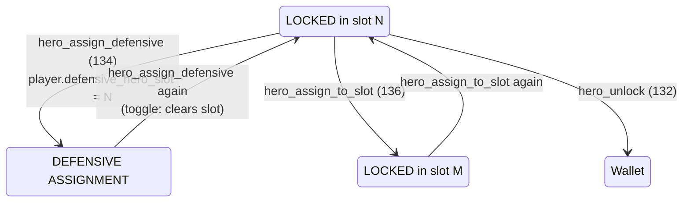
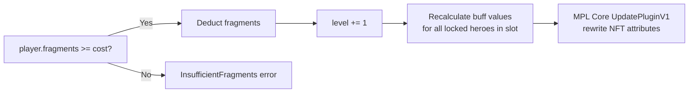
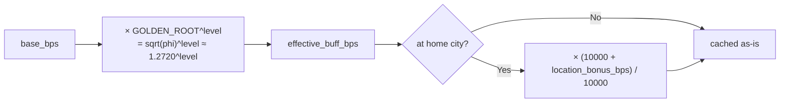

# Hero System State Machine

> Formal state transitions, account structures, invariants, and instruction dispatch for
> the Hero NFT system.  Heroes are MPL Core AssetV1 NFTs; all game state is stored in
> their Attributes plugin, not in separate program accounts.

---

## 1. Instruction Table

| Discriminant | Instruction | Notes |
|---|---|---|
| 130 | `hero_mint` | Mint hero NFT to player wallet |
| 131 | `hero_lock` | Transfer hero from wallet into player PDA (active slot) |
| 132 | `hero_unlock` | Return hero from player PDA to wallet |
| 133 | `hero_level_up` | Consume fragments; increment hero level by 1 |
| 134 | `hero_assign_defensive` | Move locked hero to the defensive assignment slot |
| 135 | `hero_set_synchrony` | Enable/disable synchrony mode for a hero |
| 136 | `hero_assign_to_slot` | Move hero between active slots 0–2 |
| 310 | `hero_burn` | Burn NFT; receive locked NOVI reward; close mint receipt |

Sanctuary instructions (137–139) are in the Sanctuary system and are out of scope here;
see the Sanctuary doc for meditation mechanics.

[Source: programs/novus_mundus/src/lib.rs](../../programs/novus_mundus/src/lib.rs)

---

## 2. NFT Ownership State Machine

```mermaid
stateDiagram-v2
    [*] --> NotMinted : no HeroMintReceipt PDA
    NotMinted --> Wallet : hero_mint (130)<br/>SOL paid; AssetV1 created<br/>HeroMintReceipt PDA created
    Wallet --> Locked : hero_lock (131)<br/>TransferV1 wallet → PlayerPDA<br/>buffs applied to PlayerCore
    Locked --> Wallet : hero_unlock (132)<br/>TransferV1 PlayerPDA → wallet<br/>buffs removed from PlayerCore
    Wallet --> Burned : hero_burn (310)<br/>BurnV1; locked NOVI credited<br/>HeroMintReceipt closed (re-mint allowed)
    Burned --> NotMinted : receipt closed; supply decremented
```

### States (ASCII reference)

```
         ┌───────────────────────────────────────────────────┐
         │          NOT MINTED                               │
         │  HeroMintReceipt PDA: does not exist              │
         └──────────────┬────────────────────────────────────┘
                        │  hero_mint (130)
                        ▼
         ┌───────────────────────────────────────────────────┐
         │          MINTED (in wallet)                       │
         │  AssetV1 owner = player wallet                    │
         │  HeroMintReceipt PDA: exists (gates re-mint)      │
         │  Buffs applied: None (hero not locked)            │
         └──────┬──────────────────────────┬─────────────────┘
                │  hero_lock (131)          │  hero_burn (310)
                ▼                          ▼
         ┌──────────────────┐     ┌────────────────────────────┐
         │  LOCKED          │     │  BURNED                    │
         │  AssetV1 owner   │     │  NFT destroyed via BurnV1  │
         │  = PlayerCore PDA│     │  Locked NOVI reward paid   │
         │  Active slot 0–2 │     │  HeroMintReceipt CLOSED    │
         │  Buffs applied   │     │  minted_count decremented  │
         │  to PlayerCore   │     │  (allows re-mint)          │
         └──────┬───────────┘     └────────────────────────────┘
                │  hero_unlock (132)
                ▼
         ┌───────────────────────────────────────────────────┐
         │          MINTED (in wallet)                       │
         │  Buffs removed from PlayerCore                    │
         └───────────────────────────────────────────────────┘
```

---

## 3. Locked Hero Assignment Sub-States



### Sub-States (ASCII reference)

```
         LOCKED in slot N (active)
              │
              ├──── hero_assign_defensive (134) ──────────────┐
              │                                               ▼
              │                                   DEFENSIVE ASSIGNMENT
              │                                   (player.defensive_hero_slot = N)
              │                                   Same NFT, still locked in slot N
              │                                   Contributes armor/defense buffs
              │                                   to defenders in PvP
              │◄──── hero_assign_defensive again ─────────────┘
              │      (toggle: clears defensive_hero_slot)
              │
              ├──── hero_assign_to_slot (136) ────────────────┐
              │                                               ▼
              │                                   LOCKED in slot M (0–2)
              │                                   Buffs from slot M apply
              │
              └──── hero_unlock (132) ──────────────────────► MINTED (wallet)
```

---

## 4. `hero_mint` (discriminant 130)

**Trigger / Data:**

```
Instruction 130 (hero_mint)
  Data: [template_id: u16 LE]   (2 bytes)
```

**Guards:**

| Guard | Condition |
|---|---|
| `HeroMintReceipt` PDA does not exist | Prevents duplicate mints per player per template |
| `template.enabled == true` | Template is open for minting |
| `template.supply_cap == 0 OR template.minted_count < supply_cap` | Supply not exhausted |
| `player.level >= template.required_player_level` | Level requirement met |
| Player has enough SOL | `mint_cost_sol` lamports |

**Actions:**

1. Create `HeroMintReceipt` PDA: `[HERO_MINT_RECEIPT_SEED, game_engine, player, template_id_le2]`.
2. Create MPL Core AssetV1 with Attributes plugin encoding up to 9 attributes:
   - `Level = 1`, `XP = 0`, `Template = template_id`, `Serial = minted_count + 1`,
     `Origin = player.current_city`,
   - Up to 4 buff attributes: key = buff stat name (e.g. `"Attack"`), value = `base_bps`.
3. Increment `template.minted_count`.
4. If Sanctuary level ≥ 5: credit `calculate_mint_bonus(mint_cost_sol, sanctuary_level)`
   to `player.locked_novi`.
   ```
   bonus = mint_cost_lamports / 10_000 × bonus_bps / 10_000
   bonus_bps: 500/1000/1500/2000 for Sanctuary 5+/10+/15+/20+
   ```

[Source: programs/novus_mundus/src/processor/hero/mint.rs](../../programs/novus_mundus/src/processor/hero/mint.rs)

---

## 5. `hero_lock` (discriminant 131)

**Trigger:** No instruction data (slot_index: u8 provided as data).

**Guards:**

| Guard | Condition |
|---|---|
| `player.extensions & EXT_RALLY != 0` | EXT_RALLY required (grants EXT_HEROES) |
| Estate Sanctuary level ≥ 1 | Required for hero locking |
| Target active slot is empty | `player.active_heroes[slot_index] == NULL_PUBKEY` |
| NFT is in player wallet (not already locked) | AssetV1 owner check |
| `template_id` from parsed NFT attributes matches `HeroTemplate` PDA | Validates buff authenticity |

**Actions:**

1. Parse NFT Attributes plugin from raw MPL Core account bytes:
   - Extract level, meditation_xp, template_id, serial_number, origin_city, buffs[4].
2. Verify `HeroTemplate` PDA from `template_id`; validate buff byte layout before
   trusting parsed buff values.
3. MPL Core `TransferV1`: owner changes from player wallet → `PlayerCore` PDA.
4. Set `player.active_heroes[slot_index] = hero_nft_address`.
5. Call `add_hero_buffs_to_player_with_location`:
   - For each buff: `effective_value = base_bps × GOLDEN_ROOT^level`
   - Apply location synergy: `effective_value × (10000 + location_bonus_bps) / 10000`
   - `location_bonus_bps` = 0 if not at home; 200/400/600/800/1000 bps by tier.
   - Write result to matching `hero_<stat>_bps` field in `HeroesSection`.

[Source: programs/novus_mundus/src/processor/hero/lock.rs](../../programs/novus_mundus/src/processor/hero/lock.rs)

---

## 6. `hero_level_up` (discriminant 133)

**Trigger:** No instruction data.

**Guards:**

| Guard | Condition |
|---|---|
| Hero is locked (in an active slot) | Cannot level up wallet-held heroes |
| `player.fragments >= calculate_fragment_cost(current_level)` | Sufficient fragments |
| `hero.level < sanctuary_level_cap` | Level cap enforced by Sanctuary level |

**Level caps by Sanctuary level:**

| Sanctuary level | Hero level cap |
|---|---|
| 1–9 | 10 |
| 10–24 | 25 |
| 25–49 | 50 |
| 50+ | 100 |

**Fragment cost formula:**

```
fragment_cost = 10 × 1.5^current_level
              = exp_growth(10, 3, 2, current_level)   // u64, no u128
```

Fragments deducted **before** level incremented.  After incrementing, hero buffs in
`HeroesSection` are recalculated (since `GOLDEN_ROOT^level` changes).



[Source: programs/novus_mundus/src/processor/hero/level_up.rs](../../programs/novus_mundus/src/processor/hero/level_up.rs)

---

## 7. `hero_burn` (discriminant 310)

**Trigger / Data:**

```
Instruction 310 (hero_burn)
  Data: [template_id: u16 LE]   (2 bytes)
```

**Guards:**

| Guard | Condition |
|---|---|
| Hero is in player **wallet** (not locked) | Cannot burn a locked hero |
| Template ID matches parsed NFT attributes | Validates template PDA lookup |

**Actions:**

1. Parse hero level and template_id from NFT Attributes plugin.
2. Compute `tier = tier_from_mint_cost(template.mint_cost_sol)`.
3. Compute burn reward:
   ```
   // level.max(1) used — a level-0 hero burns as if level 1
   reward = tier_base × level.max(1)²

   tier_base: Common=500, Rare=5000, Epic=20000, Legendary=100000, Mythic=250000
   ```
4. Credit reward to `player.locked_novi`.
5. MPL Core `BurnV1`: destroy the NFT.
6. Decrement `template.minted_count`.
7. Close `HeroMintReceipt` PDA (allows player to re-mint same template).

[Source: programs/novus_mundus/src/processor/hero/burn.rs](../../programs/novus_mundus/src/processor/hero/burn.rs)

---

## 8. HeroTemplate Account Structure

```rust
#[repr(C)]
pub struct HeroTemplate {
    pub account_key:          u8,         // AccountKey::HeroTemplate
    pub template_id:          u16,        // 0–65535
    pub name:                 [u8; 32],
    pub hero_type:            u8,         // HeroType: 0=Offensive, 1=Defensive, 2=Economic, 3=Hybrid
    pub category:             u8,         // HeroCategory: 0=Historical, 1=Mythological, 2=CryptoIcons, 3=Gaming, 4=Original
    pub mint_cost_sol:        u64,        // lamports
    pub supply_cap:           u32,        // 0 = unlimited
    pub minted_count:         u32,
    pub enabled:              bool,
    pub event_exclusive:      bool,
    pub required_player_level: u8,
    pub meditation_city_id:   u16,        // 0 = any city
    pub buffs:                [BuffConfig; 4],
    pub bump:                 u8,
}

pub struct BuffConfig {
    pub stat:     u8,    // BuffStat discriminant (0 = None)
    pub base_bps: u16,   // Base buff at level 1 (basis points)
}
```

PDA seeds: `[HERO_TEMPLATE_SEED, template_id_le2]`

[Source: programs/novus_mundus/src/state/hero.rs](../../programs/novus_mundus/src/state/hero.rs)

---

## 9. HeroesSection Fields (PlayerCore extension)

```rust
pub struct HeroesSection {
    pub active_heroes:          [Address; 3],   // slot 0–2 (NULL = empty)
    pub defensive_hero_slot:    u8,             // which slot is defensive (0–2)
    pub meditating_hero_slot:   u8,             // 255 = none meditating

    // Aggregated buff totals from all locked heroes (refreshed on lock/unlock/level_up)
    pub hero_attack_bps:                u16,
    pub hero_defense_bps:               u16,
    pub hero_economy_bps:               u16,
    pub hero_xp_gain_bps:               u16,
    pub hero_training_cost_reduction_bps: u16,
    pub hero_collection_rate_bps:       u16,
    pub hero_rally_capacity_bps:        u16,
    pub hero_stamina_regen_bps:         u16,
    pub hero_produce_generation_bps:    u16,
    pub hero_weapon_efficiency_bps:     u16,
    pub hero_armor_efficiency_bps:      u16,
    pub hero_crit_chance_bps:           u16,
    pub hero_encounter_damage_bps:      u16,
    pub hero_loot_bonus_bps:            u16,
    pub hero_synchrony_bonus_bps:       u16,
    pub hero_resource_capacity_bps:     u16,
    pub hero_unit_capacity_bps:         u16,
    pub blessed_hero_bonus_bps:         u16,

    pub slot_location_bonus:    [u16; 3],   // per-slot location synergy bonus (bps)
    pub meditation_started_at:  i64,
}
```

MiningAffinity (stat 17) and FishingAffinity (stat 18) are **not** stored in the
hero buff cache; they are applied on-demand during expedition resolution.

[Source: programs/novus_mundus/src/state/player.rs](../../programs/novus_mundus/src/state/player.rs)

---

## 10. NFT Attributes Layout

Heroes are MPL Core AssetV1 NFTs.  All game state is stored as Attributes plugin
key/value pairs (both key and value are UTF-8 strings):

| Attribute key | Content | Example |
|---|---|---|
| `Level` | Hero level (1–100) | `"1"` |
| `XP` | Meditation XP accumulated | `"0"` |
| `Template` | `template_id` (u16) | `"42"` |
| `Serial` | Mint serial number | `"17"` |
| `Origin` | Origin city ID | `"3"` |
| `<buff_stat_name>` | Buff base_bps at level 1 | `"500"` |

Buff attribute keys match `get_buff_stat_name(stat)`:
`Attack`, `Defense`, `Economy`, `XPGain`, `Training`, `Rally`, `Crit`, `Synchrony`,
`Storage`, `Weapon`, `Stamina`, `Produce`, `Units`, `Encounter`, `Loot`, `Armor`.

For stats 17 (MiningAffinity) and 18 (FishingAffinity), `get_buff_stat_name()` returns
`"Unknown"`. These buffs are **never applied to player buff fields** and do not appear as
named attributes. They affect expedition outcomes directly at expedition claim time.

Up to 4 buff attributes per hero.  Total attribute count: 5 fixed + up to 4 buff = up to 9.

[Source: programs/novus_mundus/src/helpers/nft_parser.rs](../../programs/novus_mundus/src/helpers/nft_parser.rs)
[Source: programs/novus_mundus/src/state/hero.rs](../../programs/novus_mundus/src/state/hero.rs)

---

## 11. Buff Scaling Formula



```
effective_buff_bps = base_bps × GOLDEN_ROOT^level

GOLDEN_ROOT = sqrt(phi) = sqrt(1.618...) ≈ 1.2720196495140689
```

For integer-safe computation this is approximated using rational arithmetic.
All buff calculations are deterministic — there is no RNG.

With location synergy:

```
effective_buff_bps_with_location = effective_buff_bps × (10000 + location_bonus_bps) / 10000
```

Location bonus applies when `hero.meditation_city_id == 0 OR == player.current_city`:

| Hero tier | `location_bonus_bps` |
|---|---|
| Common | 200 (2 %) |
| Rare | 400 (4 %) |
| Epic | 600 (6 %) |
| Legendary | 800 (8 %) |
| Mythic | 1000 (10 %) |

---

## 12. Tier Thresholds (from `tier_from_mint_cost`)

| Tier | Name | Mint cost threshold | Location bonus |
|---|---|---|---|
| 0 | Common | < 0.25 SOL | 200 bp (2 %) |
| 1 | Rare | ≥ 0.25 SOL | 400 bp (4 %) |
| 2 | Epic | ≥ 1.0 SOL | 600 bp (6 %) |
| 3 | Legendary | ≥ 5.0 SOL | 800 bp (8 %) |
| 4 | Mythic | ≥ 10.0 SOL | 1000 bp (10 %) |

There is no "Uncommon" tier.

[Source: programs/novus_mundus/src/state/hero.rs:400–418](../../programs/novus_mundus/src/state/hero.rs)

---

## 13. Invariants

| ID | Invariant |
|---|---|
| H-01 | `HeroMintReceipt` PDA gates one mint per player per template; burn closes the receipt, re-enabling future minting. |
| H-02 | `hero_lock` requires `EXT_RALLY` (which implies `EXT_HEROES`) and Sanctuary ≥ 1. |
| H-03 | Heroes can only be burned from the player **wallet** (not while locked in a slot). |
| H-04 | Fragment cost is deducted before the level increment. |
| H-05 | Hero level is capped by Sanctuary level (10/25/50/100). |
| H-06 | MiningAffinity and FishingAffinity (stats 17 & 18) are **not** cached in `HeroesSection`; they are applied on-demand during expedition resolution. |
| H-07 | Template PDA is verified from the parsed `template_id` before trusting any buff bytes — prevents forged attribute attacks. |
| H-08 | Meditation is part of the Sanctuary system (discriminants 137–139), not the hero system; see Sanctuary docs. |
| H-09 | Heroes with `meditation_city_id == 0` (typically CryptoIcons category) always receive the location synergy bonus regardless of player city. |
| H-10 | Burn reward = `tier_base × level.max(1)²`; tier_base values: 500/5000/20000/100000/250000 for Common/Rare/Epic/Legendary/Mythic. A level-0 hero burns as if level 1. |
