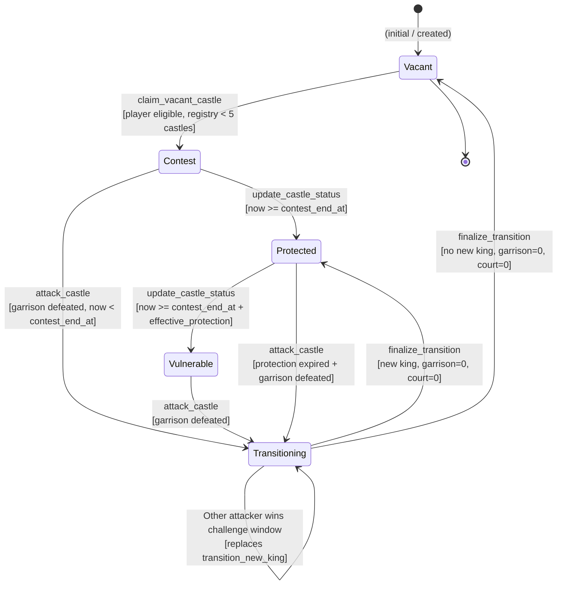
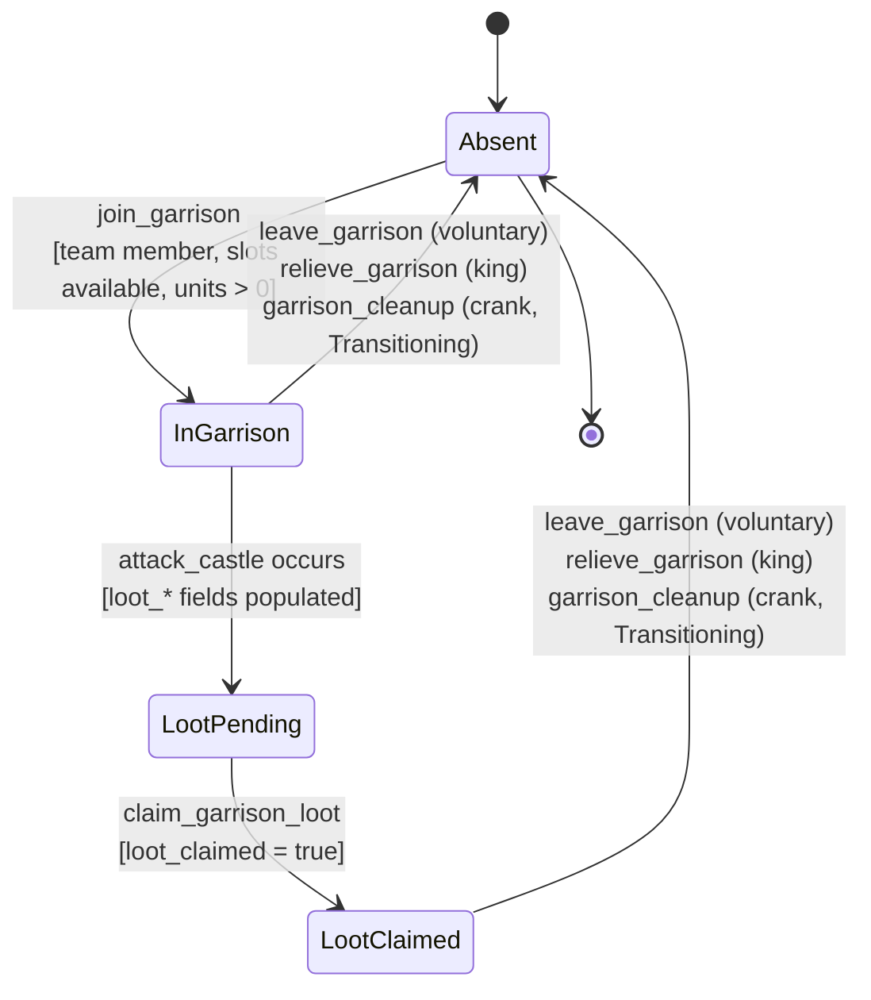
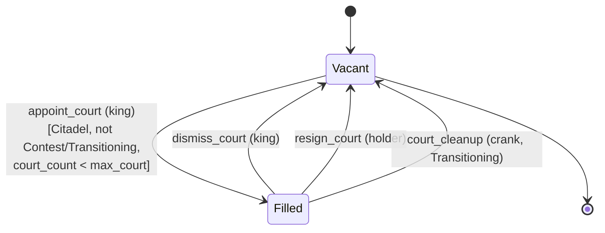
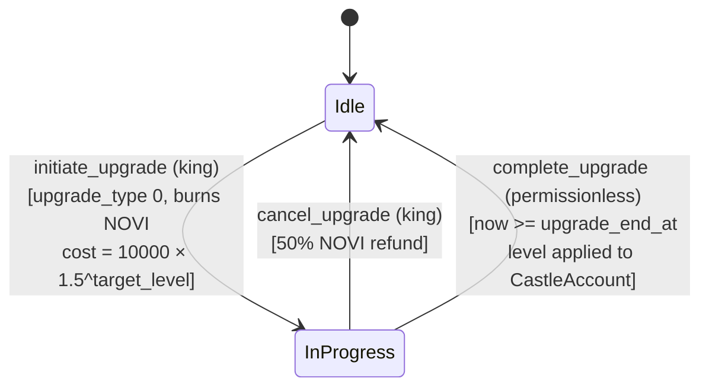
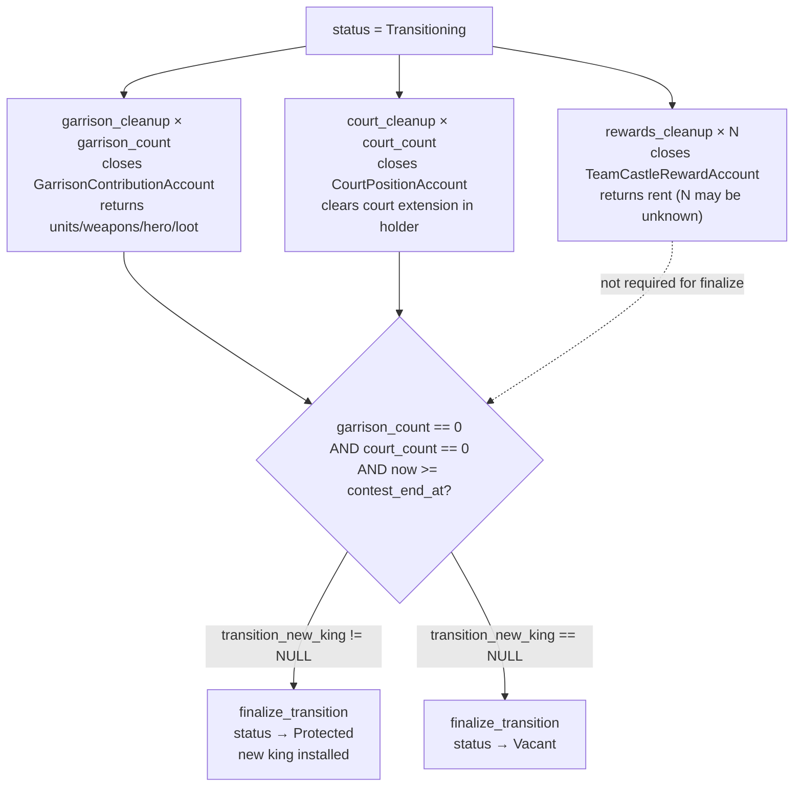
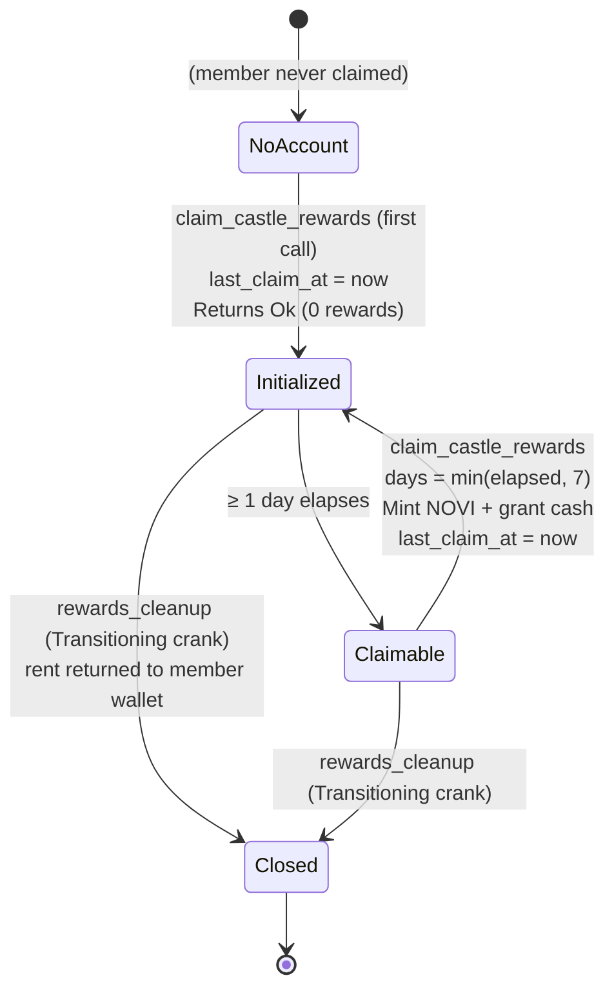

# King's Castle State Machine

## Overview

The King's Castle system maintains five overlapping state machines: the **castle status lifecycle**, the **garrison membership** lifecycle, the **court position** lifecycle, the **upgrade** lifecycle, and the **transition cleanup** sequence. All state is stored in on-chain accounts with `#[repr(C)]` `no_std` layout (Pinocchio, no Anchor). Discriminants are 2-byte u16 LE at the front of each instruction.

This document covers every transition, guard, and action derived directly from the Rust processor code.

---

## 1. Castle Status Lifecycle

### States

| State | Value | Description |
|-------|-------|-------------|
| `Vacant` | 0 | No king; claimable via `claim_vacant_castle` |
| `Contest` | 1 | 2-hour window after claim; castle is attackable |
| `Protected` | 2 | Protection window active; attackable only if watchtower-adjusted period expired |
| `Vulnerable` | 3 | Protection expired; freely attackable |
| `Transitioning` | 4 | Ownership transfer in progress; cleanup cranks running |

### State Diagram



ASCII reference:

```
┌──────────┐  claim_vacant_castle  ┌──────────────┐
│          │ ─────────────────────>│   Contest    │
│  Vacant  │                       │    (1)       │
│  (0)     │<──────────┐           └──────┬───────┘
└──────────┘           │                  │
        ▲              │    update_castle_status (now >= contest_end_at)
        │              │                  │
        │    finalize_ │                  ▼
        │    transition│           ┌──────────────┐
        │    (no king) │           │  Protected   │
        │              │           │    (2)       │
        │              │           └──────┬───────┘
        │              │                  │
        │              │    update_castle_status (now >= contest_end_at + effective_protection)
        │              │                  │
        │              │                  ▼
        │              │           ┌──────────────┐
        │              │           │  Vulnerable  │
        │              │           │    (3)       │
        │              │           └──────┬───────┘
        │              │                  │
        │              │    attack_castle (garrison defeated)
        │              │    — or —
        │              │    Contest attack (garrison defeated)
        │              │                  │
        │              │                  ▼
        │              │           ┌──────────────┐
        │              │           │ Transitioning│
        │              └───────────┤    (4)       │
        │                          └──────┬───────┘
        │                                 │
        └─────────────────────────────────┘
              finalize_transition (new king → Protected)
```

---

### Transitions

#### `Vacant` → `Contest`

```
Trigger: claim_vacant_castle (instruction 271)
Guards:
  - castle.status == Vacant (0)
  - castle.king == NULL_PUBKEY
  - castle.garrison_count == 0 && castle.court_count == 0
    (previous cleanup must be complete before re-claiming)
  - Player wallet is signer
  - Player is on a team (player.team_address() != NULL_PUBKEY)
  - Player meets eligibility: level >= min_level,
    networth/1_000_000 >= min_networth_millions,
    (total_defensive_units / 1000) >= min_troops_thousands
  - King registry: castle_count < max_castles (5)
Actions:
  - If KingRegistryAccount does not exist: create it (seeds: [KING_REGISTRY_SEED, player_account])
  - registry.add_castle(city_id, castle_id, tier, now)
  - castle.king = player_account.address()
  - castle.team = player.team_address()
  - castle.claimed_at = now
  - castle.contest_end_at = now + CASTLE_CONTEST_DURATION  (7200 s = 2 hours)
  - castle.status = Contest (1)
  - castle.max_garrison = GARRISON_CAP_BY_TIER[player.subscription_tier]
    (0 for Outpost tier regardless)
  - castle.times_claimed += 1
  - Emit CastleClaimed
```

#### `Contest` → `Protected`

```
Trigger: update_castle_status (instruction 289) — permissionless
Guards:
  - castle.status == Contest
  - now >= castle.contest_end_at
Actions:
  - castle.status = Protected (2)
  - contest_end_at unchanged (protection is measured from contest_end_at)
  - Emit CastleStatusChanged { old=1, new=2 }
```

#### `Protected` → `Vulnerable`

```
Trigger: update_castle_status (instruction 289) — permissionless
Guards:
  - castle.status == Protected
  - now >= castle.contest_end_at + castle.effective_protection_duration()
    where: effective = protection_duration × (10000 + watchtower_level×1000) / 10000
Actions:
  - castle.status = Vulnerable (3)
  - Emit CastleStatusChanged { old=2, new=3 }
```

#### `Contest` or `Vulnerable` → `Transitioning` (via attack)

```
Trigger: attack_castle (instruction 288)
Guards:
  - castle.can_be_attacked(now):
      Contest:       now < castle.contest_end_at
      Vulnerable:    always true
      Protected:     now >= contest_end_at + effective_protection_duration
      Transitioning: now < contest_end_at  (challenge window)
  - Attacker is at castle location: distance <= 50.0 m
  - Attacker is not traveling, not in active rally
  - Attacker has defensive units > 0
  - Garrison is defeated (remaining < 10% of original, or garrison was empty)
Actions:
  - castle.status = Transitioning (4)
  - castle.transition_new_king = attacker PlayerAccount PDA
  - castle.contest_end_at = now + CASTLE_CONTEST_DURATION  (fresh 2-hour challenge window)
  - castle.failed_defenses += 1
  - Update garrison contribution accounts with proportional casualties and loot
  - Emit CastleConquered, CastleAttacked
```

#### `Transitioning` → `Protected` (new king)

```
Trigger: finalize_transition (instruction 285) — permissionless
Guards:
  - castle.status == Transitioning
  - now >= castle.contest_end_at  (2-hour challenge window passed)
  - castle.garrison_count == 0   (all garrison cleaned)
  - castle.court_count == 0      (all court positions cleaned)
  - castle.transition_new_king != NULL_PUBKEY
  - new_king_registry.can_claim_castle()
Actions:
  - new_king_registry.add_castle(city_id, castle_id, tier, now)
  - old_king_registry.remove_castle(city_id, castle_id)  [if old registry provided]
  - castle.king = castle.transition_new_king
  - castle.team = new_king.team_address()
  - castle.transition_new_king = NULL_PUBKEY
  - castle.status = Protected (2)
  - castle.claimed_at = now
  - castle.contest_end_at = now   (protection starts from now)
  - castle.times_claimed += 1
  - Reset: transition_garrison_cleaned=0, transition_court_cleaned=false, transition_rewards_cleaned=0
  - Emit CastleClaimed
```

> **Note:** The new king is set directly to **Protected** (not Contest). `contest_end_at = now` means `effective_protection_duration` is measured from the finalization timestamp, giving a full protection window immediately.

#### `Transitioning` → `Vacant` (no new king)

```
Trigger: finalize_transition (instruction 285) — permissionless
Guards:
  - castle.status == Transitioning
  - now >= castle.contest_end_at
  - castle.garrison_count == 0
  - castle.court_count == 0
  - castle.transition_new_king == NULL_PUBKEY
    (set by force_remove_king, or all challengers failed to complete)
Actions:
  - castle.king = NULL_PUBKEY
  - castle.team = NULL_PUBKEY
  - castle.transition_new_king = NULL_PUBKEY
  - castle.status = Vacant (0)
  - castle.claimed_at = 0
  - castle.contest_end_at = 0
  - old_king_registry.remove_castle(city_id, castle_id)  [if provided]
  - Reset transition counters
  - No event emitted (next CastleClaimed will come from claim_vacant_castle)
```

#### DAO → `Transitioning` (force_remove_king)

```
Trigger: force_remove_king (instruction 287) — DAO only
Guards:
  - dao_authority is signer and == game_engine.authority
  - castle.king != NULL_PUBKEY
  - king_account.address() == castle.king
Actions:
  - king_registry.remove_castle(city_id, castle_id)
  - castle.status = Transitioning (4)
  - castle.king = NULL_PUBKEY
  - castle.team = NULL_PUBKEY
  - castle.transition_new_king = NULL_PUBKEY  (routes to Vacant on finalize)
  - Emit KingForceRemoved
```

---

## 2. Garrison Membership Lifecycle

### States

| State | Description |
|-------|-------------|
| `Absent` | No GarrisonContributionAccount exists for (castle, player) |
| `InGarrison` | Account exists; units/weapons/hero committed |
| `LootPending` | Combat occurred; loot_* fields populated; loot_claimed == false |
| `LootClaimed` | Loot claimed; loot_claimed == true; player can still leave voluntarily |

### State Diagram



ASCII reference:

```
┌────────┐  join_garrison  ┌──────────────┐
│        │ ──────────────> │ InGarrison   │
│ Absent │                 │              │<──────────────────┐
└────────┘                 └──────┬───────┘                   │
    ▲                             │ (attack occurs)            │
    │                             ▼                           │
    │                      ┌──────────────┐                   │
    │                      │ LootPending  │                   │
    │                      │              │                   │
    │                      └──────┬───────┘                   │
    │                             │ claim_garrison_loot        │
    │                             ▼                           │
    │                      ┌──────────────┐                   │
    │                      │ LootClaimed  │                   │
    │                      │              │                   │
    │                      └──────┬───────┘                   │
    │   leave_garrison (voluntary)│                           │
    │   relieve_garrison (king)   │                           │
    │   garrison_cleanup (crank)  │                           │
    └─────────────────────────────┘                           │
               (account closed)                               │
                                                              │
           Note: garrison_cleanup restores assets and         │
           increments transition_garrison_cleaned; next        │
           join_garrison can start the cycle again ───────────┘
```

### Transitions

#### `Absent` → `InGarrison`

```
Trigger: join_garrison (instruction 277)
Guards:
  - castle.max_garrison > 0  (not Outpost tier)
  - castle.garrison_count < castle.max_garrison
  - player.team_address() == castle.team
  - GarrisonContributionAccount does not exist (require_empty)
  - units_1 <= player.defensive_unit_1, units_2 <= player.defensive_unit_2,
    units_3 <= player.defensive_unit_3
  - melee <= player.melee_weapons, ranged <= player.ranged_weapons,
    siege <= player.siege_weapons
  - total_units + total_weapons > 0  OR  hero_slot < 3
    (at least some contribution)
Actions:
  - If hero_slot < 3:
    - Parse hero NFT: cache hero_defense_bps (stat 2), hero_weapon_eff_bps (stat 10)
    - Subtract hero buffs from player (add_hero_buffs_to_player reversed)
    - Clear player.active_heroes[hero_slot] = NULL_PUBKEY
    - Reset defensive_hero_slot if needed
    - Transfer hero NFT: player_pda → garrison_pda (MPL Core TransferV1, player signs)
  - Deduct units_1/2/3 from player.defensive_unit_*
  - Deduct melee/ranged/siege from player.melee/ranged/siege_weapons
  - Create GarrisonContributionAccount PDA: [GARRISON_SEED, castle, player_account]
  - Initialize account fields; loot_* = 0; loot_claimed = false
  - castle.garrison_count += 1
  - Emit GarrisonJoined
```

#### `InGarrison` / `LootPending` → `LootClaimed`

```
Trigger: claim_garrison_loot (instruction 281)
Guards:
  - GarrisonContributionAccount exists (require_initialized)
  - garrison.contributor == player_account.address()
  - garrison.loot_melee + loot_ranged + loot_siege > 0
  - garrison.loot_claimed == false
Actions:
  - player.melee_weapons += garrison.loot_melee
  - player.ranged_weapons += garrison.loot_ranged
  - player.siege_weapons += garrison.loot_siege
  - garrison.loot_melee = 0; loot_ranged = 0; loot_siege = 0
  - garrison.loot_claimed = true
  - Emit GarrisonLootClaimed
```

#### `InGarrison` / `LootClaimed` → `Absent` (voluntary)

```
Trigger: leave_garrison (instruction 278)
Guards:
  - player_wallet is signer
  - player_account.owner == player_wallet.address()
  - GarrisonContributionAccount exists and garrison.contributor == player_account
Actions:
  - player.defensive_unit_1 += garrison.units_1 (etc.)
  - player.melee_weapons += garrison.melee_weapons (etc.)
  - If garrison has hero:
    - Find first empty active_heroes slot
    - If slot found: transfer hero back to player_pda; re-add hero buffs
    - If all slots full: transfer hero to player wallet (unlocked)
  - Close GarrisonContributionAccount (rent → player wallet)
  - castle.garrison_count -= 1
  - Emit GarrisonLeft { relieved: false }
```

#### `InGarrison` / `LootClaimed` → `Absent` (king-forced)

```
Trigger: relieve_garrison (instruction 279)
Guards:
  - king_wallet is signer
  - castle.king == king_account.address()
  - garrison.contributor == relieved_account.address()
Actions:
  - Same as leave_garrison actions on relieved player's account
  - Emit GarrisonLeft { relieved: true }
```

#### `InGarrison` / `LootClaimed` → `Absent` (transition crank)

```
Trigger: garrison_cleanup (instruction 282) — permissionless
Guards:
  - castle.status == Transitioning
  - castle.garrison_count > 0
  - garrison.contributor == contributor_account.address()
  - rent_recipient.address() == contributor.owner  (must be contributor's wallet)
Actions:
  - contributor.defensive_unit_* += garrison.units_*
  - contributor.melee/ranged/siege_weapons += garrison.melee/ranged/siege_weapons
  - contributor.melee/ranged/siege_weapons += garrison.loot_*  (loot also returned)
  - If garrison has hero: return to contributor (same slot/wallet logic as leave_garrison)
  - Close GarrisonContributionAccount (rent → contributor wallet)
  - castle.transition_garrison_cleaned += 1
  - castle.garrison_count -= 1
  - Emit CastleTransitionProgress { phase: 0 }
```

---

## 3. Court Position Lifecycle

### States

| State | Description |
|-------|-------------|
| `Vacant` | CourtPositionAccount does not exist |
| `Filled` | Account exists; holder receives buffs and daily rewards |

### Diagram



ASCII reference:

```
┌────────┐  appoint_court  ┌────────┐
│        │ ──────────────> │        │
│ Vacant │                 │ Filled │
│        │<── ────────── ──│        │
└────────┘                 └────────┘
   (account      dismiss_court (king)
    created)     resign_court (holder)
                 court_cleanup (crank, during Transitioning)
```

### Transitions

#### `Vacant` → `Filled`

```
Trigger: appoint_court (instruction 272)
Guards:
  - king_wallet is signer
  - castle.king == king_account.address()
  - castle.status != Contest && castle.status != Transitioning
  - castle.max_court > 0  (Citadel tier)
  - castle.court_count < castle.max_court
  - CourtPositionAccount does not exist (require_empty)
  - CourtPosition::from_u8(position_type).is_some()  (0–4 valid)
  - appointee is on castle.team && appointee != king_account
Guards enforced for security:
  - king_account re-derived PDA matches [PLAYER_SEED, castle.game_engine, king_wallet]
Actions:
  - Create CourtPositionAccount PDA: [COURT_SEED, castle, position_type]
  - court.holder = appointee_account.address()
  - court.appointed_at = now
  - If appointee has EXT_COURT extension: set court section to (castle, position_type)
  - castle.court_count += 1
  - Emit CourtAppointed
```

#### `Filled` → `Vacant` (king dismisses)

```
Trigger: dismiss_court (instruction 273)
Guards:
  - king_wallet is signer
  - castle.king == king_account.address()
  - CourtPositionAccount exists (require_initialized)
  - court.holder == dismissed_account.address()
  - rent_recipient.address() == dismissed.owner  (dismissed player's wallet, not king's)
Actions:
  - Clear dismissed player's court extension section (if EXT_COURT present)
  - Close CourtPositionAccount (rent → dismissed player's wallet)
  - castle.court_count -= 1
  - Emit CourtDismissed { resigned: false }
```

#### `Filled` → `Vacant` (holder resigns)

```
Trigger: resign_court (instruction 274)
Guards:
  - player_wallet is signer
  - court.holder == player_account.address()
  - court.castle == castle_account.address()
Actions:
  - Clear player's court extension section (if EXT_COURT present)
  - Close CourtPositionAccount (rent → player wallet)
  - castle.court_count -= 1
  - Emit CourtDismissed { resigned: true, dismissed_by: NULL_PUBKEY }
```

#### `Filled` → `Vacant` (transition crank)

```
Trigger: court_cleanup (instruction 283) — permissionless
Guards:
  - castle.status == Transitioning
  - CourtPositionAccount exists (require_initialized) at derived PDA
  - court.holder == holder_account.address()
  - rent_recipient.address() == holder.owner  (holder's wallet)
Actions:
  - Clear holder's court extension section (if EXT_COURT present)
  - castle.court_count -= 1
  - If castle.court_count == 0: castle.transition_court_cleaned = true
  - Close CourtPositionAccount (rent → holder's wallet)
  - Emit CastleTransitionProgress { phase: 1 }
```

---

## 4. Upgrade Lifecycle

### States

| State | Description |
|-------|-------------|
| `Idle` | No upgrade in progress: `castle.upgrade_type == 0` |
| `InProgress` | Upgrade underway: `castle.upgrade_type ∈ {1..5}`, `upgrade_end_at` set |

### Diagram



ASCII reference:

```
┌──────┐  initiate_upgrade  ┌────────────┐
│      │ ─────────────────> │            │
│ Idle │                    │ InProgress │
│      │<── ────────────────│            │
└──────┘                    └────────────┘
                  cancel_upgrade (50% refund)
                  complete_upgrade (permissionless, after timer)
```

### Transitions

#### `Idle` → `InProgress`

```
Trigger: initiate_upgrade (instruction 275)
Guards:
  - king_wallet is signer
  - castle.king == king_account.address()
  - castle.upgrade_type == 0  (no upgrade in progress)
  - upgrade_type ∈ {1,2,3,4,5}
  - current_level < max_level for upgrade_type
  - king.locked_novi >= cost  where cost = 10000 × 1.5^target_level
Actions:
  - Burn NOVI from king's locked token account (PlayerAccount PDA is authority)
  - king.locked_novi -= cost
  - castle.upgrade_type = upgrade_type
  - castle.upgrade_target_level = current_level + 1
  - castle.upgrade_end_at = now + 259200 × target_level
  - Emit CastleUpgradeStarted
```

#### `InProgress` → `Idle` (cancel)

```
Trigger: cancel_upgrade (instruction 276)
Guards:
  - king_wallet is signer
  - castle.king == king_account.address()
  - castle.upgrade_type != 0
Actions:
  - refund = original_cost × 5000 / 10000  (50% of cost at target_level)
  - Mint refund to king's locked token account (GameEngine PDA signs)
  - king.locked_novi += refund
  - castle.upgrade_type = 0
  - castle.upgrade_target_level = 0
  - castle.upgrade_end_at = 0
  - Emit CastleUpgradeCancelled
```

#### `InProgress` → `Idle` (complete)

```
Trigger: complete_upgrade (instruction 290) — permissionless
Guards:
  - castle.upgrade_type != 0
  - now >= castle.upgrade_end_at
Actions:
  - Apply upgrade:
    Fortification (1): castle.fortification_level = target_level
    Treasury (2):      castle.treasury_level = target_level
    Chambers (3):      castle.chambers_level = target_level
                       castle.max_court = target_level
    Watchtower (4):    castle.watchtower_level = target_level
    Armory (5):        castle.armory_level = target_level
  - castle.upgrade_type = 0
  - castle.upgrade_target_level = 0
  - castle.upgrade_end_at = 0
  - Emit CastleUpgradeCompleted
```

**Upgrade level caps and bonuses:**

| Upgrade | Max Level | Bonus Formula |
|---------|-----------|---------------|
| Fortification | 255 (uncapped) | `fortification_level × 500` bps damage reduction |
| Treasury | 20 | `treasury_level × 1000` bps reward bonus |
| Chambers | 5 | `chambers_level` court slots |
| Watchtower | 15 | `watchtower_level × 1000` bps protection extension |
| Armory | 255 (uncapped) | `armory_level × 300` bps garrison damage boost |

---

## 5. Transition Cleanup Sequence

During Transitioning, three families of cleanup run in **any order** (all permissionless):



```
Transitioning state
│
├── garrison_cleanup × garrison_count
│     (closes GarrisonContributionAccount, returns assets to each member)
│     castle.garrison_count decrements to 0
│
├── court_cleanup × court_count
│     (closes CourtPositionAccount, clears court extension in each holder)
│     castle.court_count decrements to 0
│
├── rewards_cleanup × N  (N = number of TeamCastleRewardAccounts)
│     (closes TeamCastleRewardAccount, returns rent to each member wallet)
│     castle.transition_rewards_cleaned increments
│     Note: total count unknown ahead of time; cleanup continues until all known accounts are closed
│
└── finalize_transition (after garrison_count==0 && court_count==0 && now>=contest_end_at)
      → Protected (new king) or Vacant (no king)
```

`finalize_transition` does **not** require `transition_rewards_cleaned` to be fully drained — it only checks `garrison_count == 0 && court_count == 0`. Orphaned `TeamCastleRewardAccount` PDAs from prior ownership can be cleaned up after finalization via `rewards_cleanup` if still Transitioning, but once the castle is Protected the accounts can accumulate rewards again for the new team.

---

## 6. Reward Claim State

### Per-member claim tracking

```
TeamCastleRewardAccount:
  last_claim_at:        i64   // Initialised to `now` on first creation
  total_claimed_novi:   u64   // Running total

Claimable if: (now - last_claim_at) / 86400 >= 1  (at least 1 day)
Days awarded: min((now - last_claim_at) / 86400, 7)
```

### State Diagram



ASCII reference:

```
          ┌─────────────────────────────────────┐
          │                                     │
          │ [No TeamCastleRewardAccount]         │
          │                                     │
          └─────────┬───────────────────────────┘
                    │ claim_castle_rewards (first call)
                    │
                    ▼
          ┌─────────────────────────────────────┐
          │ TeamCastleRewardAccount created      │
          │ last_claim_at = now                  │
          │ Returns Ok() immediately (0 days)    │
          └─────────┬───────────────────────────┘
                    │
                    │  ≥ 1 day later
                    ▼
          ┌─────────────────────────────────────┐
          │ claim_castle_rewards (subsequent)    │
          │ days = min(elapsed_days, 7)          │
          │ Mint NOVI, grant cash                │
          │ last_claim_at = now                  │
          └─────────┬───────────────────────────┘
                    │
                    └─────────────────────> (repeat)
```

### Claim Guards

```
Guards:
  - player_wallet is signer
  - player.owner == player_wallet.address()
  - castle has a king if tier.has_king() (Citadel)
  - player.team_address() == castle.team  OR  castle.king == player_account (king)
  - TeamCastleRewardAccount PDA validated
  - elapsed_days >= 1  (or brand-new account returns Ok without minting)
```

### Token Routing

```
If castle.tier in {Fortress, Citadel}:
  → Mint to UserAccount.reserved_token_account  (reserved_novi, withdrawable)
  → user.reserved_novi += novi_reward
Else (Outpost, Keep, Stronghold):
  → Mint to PlayerAccount.locked_token_account  (locked_novi, NOT withdrawable)
  → player.locked_novi += novi_reward
```

---

## 7. Account Structure (all five accounts)

### CastleAccount

```rust
#[repr(C)]
pub struct CastleAccount {
    pub account_key: u8,                    // AccountKey::Castle
    pub game_engine: Address,               // 32 — kingdom scope
    pub castle_id: u16,
    pub city_id: u16,
    pub tier: u8,                           // 0–4
    pub status: u8,                         // 0=Vacant, 1=Contest, 2=Protected, 3=Vulnerable, 4=Transitioning
    pub bump: u8,
    pub _padding1: u8,
    pub name: [u8; 32],
    pub name_len: u8,
    pub _padding2: [u8; 3],
    pub latitude: i32,                      // degrees × 1_000_000 (fixed-point, NOT f64)
    pub longitude: i32,                     // degrees × 1_000_000 (fixed-point, NOT f64)
    pub _padding_loc: [u8; 8],
    pub king: Address,                      // 32 — PlayerAccount PDA (NULL if vacant)
    pub team: Address,                      // 32 — Team PDA (NULL if vacant)
    pub claimed_at: i64,
    pub contest_end_at: i64,                // end of contest window / protection reference
    pub garrison_count: u8,
    pub max_garrison: u8,
    pub _padding3: [u8; 2],
    pub court_count: u8,
    pub max_court: u8,                      // set per tier in create_castle; only meaningful for Citadel
    pub court_appointment_cooldown: u16,
    pub fortification_level: u8,
    pub treasury_level: u8,
    pub chambers_level: u8,
    pub watchtower_level: u8,
    pub armory_level: u8,
    pub _padding4: [u8; 3],
    pub upgrade_type: u8,                   // 0=none, 1–5 active
    pub upgrade_target_level: u8,
    pub _padding5: [u8; 6],
    pub upgrade_end_at: i64,
    pub min_level: u8,
    pub min_networth_millions: u8,
    pub min_troops_thousands: u8,
    pub _padding6: [u8; 5],
    pub protection_duration: i64,
    pub tier_multiplier_bps: u16,
    pub king_loot_cut_bps: u16,
    pub _padding7: [u8; 4],
    pub king_novi_per_day: u64,
    pub king_cash_per_day: u64,
    pub court_novi_per_day: u64,
    pub court_cash_per_day: u64,
    pub member_novi_per_day: u64,
    pub member_cash_per_day: u64,
    pub times_claimed: u32,
    pub successful_defenses: u32,
    pub failed_defenses: u32,
    pub _padding8: [u8; 4],
    pub total_rewards_distributed: u64,
    pub transition_garrison_cleaned: u8,
    pub transition_court_cleaned: bool,
    pub transition_rewards_cleaned: u8,
    pub _transition_padding: [u8; 5],
    pub transition_new_king: Address,       // 32 — NULL = route to Vacant on finalize
    pub _transition_reserved: [u8; 8],
    pub activates_at: i64,
    pub _activation_padding: [u8; 8],
    pub _reserved: [u8; 16],
}
// PDA: [b"castle", game_engine, city_id:u16 LE, castle_id:u16 LE]
```

[Source: state/castle.rs](../../programs/novus_mundus/src/state/castle.rs)

---

### KingRegistryAccount

```rust
#[repr(C)]
pub struct KingRegistryAccount {
    pub account_key: u8,                    // AccountKey::KingRegistry
    pub king: Address,                      // 32 — PlayerAccount PDA
    pub bump: u8,
    pub castle_count: u8,
    pub max_castles: u8,                    // Always 5 (MAX_CASTLES_PER_KING)
    pub _padding1: [u8; 5],
    pub castles: [CastleReference; 5],      // 160 bytes (32 each)
}

#[repr(C)]
pub struct CastleReference {
    pub city_id: u16,
    pub castle_id: u16,
    pub claimed_at: i64,
    pub tier: u8,
    pub _padding: [u8; 19],                 // Aligns to 32 bytes
}
// PDA: [b"king_registry", king_player_account]
// Never closed — persists across all ownership changes
```

[Source: state/castle.rs](../../programs/novus_mundus/src/state/castle.rs)

---

### CourtPositionAccount

```rust
#[repr(C)]
pub struct CourtPositionAccount {
    pub account_key: u8,                    // AccountKey::CourtPosition
    pub castle: Address,                    // 32 — Parent castle PDA
    pub position_type: u8,                  // 0=Advisor, 1=Scholar, 2=Guardian, 3=Treasurer, 4=Marshal
    pub bump: u8,
    pub _padding1: [u8; 6],
    pub holder: Address,                    // 32 — Appointed player's PlayerAccount PDA
    pub appointed_at: i64,
}
// PDA: [b"court", castle, position_type:u8]
// Created by appoint_court; closed by dismiss_court, resign_court, or court_cleanup
```

[Source: state/castle.rs](../../programs/novus_mundus/src/state/castle.rs)

---

### GarrisonContributionAccount

```rust
#[repr(C)]
pub struct GarrisonContributionAccount {
    pub account_key: u8,                    // AccountKey::CastleGarrison
    pub castle: Address,                    // 32 — Parent castle PDA
    pub contributor: Address,               // 32 — PlayerAccount PDA
    pub bump: u8,
    pub is_king: bool,
    pub _padding1: [u8; 6],
    pub contributed_at: i64,
    pub units_1: u64,
    pub units_2: u64,
    pub units_3: u64,
    pub melee_weapons: u64,
    pub ranged_weapons: u64,
    pub siege_weapons: u64,
    pub hero_mint: Address,                 // 32 — NULL if no hero
    pub hero_defense_bps: u16,             // Cached: hero stat 2 (DefensePower)
    pub hero_weapon_eff_bps: u16,          // Cached: hero stat 10 (WeaponEfficiency)
    pub _padding2: [u8; 4],
    pub loot_melee: u64,                   // Accumulated from successful defenses
    pub loot_ranged: u64,
    pub loot_siege: u64,
    pub loot_claimed: bool,
    pub _padding3: [u8; 7],
}
// PDA: [b"garrison", castle, contributor_player_account]
// Created by join_garrison; closed by leave_garrison, relieve_garrison, or garrison_cleanup
```

[Source: state/castle.rs](../../programs/novus_mundus/src/state/castle.rs)

---

### TeamCastleRewardAccount

```rust
#[repr(C)]
pub struct TeamCastleRewardAccount {
    pub account_key: u8,                    // AccountKey::TeamCastleReward
    pub castle: Address,                    // 32 — Parent castle PDA
    pub member: Address,                    // 32 — Member's PlayerAccount PDA
    pub bump: u8,
    pub _padding1: [u8; 7],
    pub last_claim_at: i64,                // Set to `now` on first creation (prevents retroactive rewards)
    pub total_claimed_novi: u64,
}
// PDA: [b"team_castle_reward", castle, member_player_account]
// Created lazily by claim_castle_rewards; closed by rewards_cleanup during Transitioning
```

[Source: state/castle.rs](../../programs/novus_mundus/src/state/castle.rs)

---

## 8. Invariants

The following invariants are enforced by program logic and should hold at all times:

```
 1. castle.status ∈ {0, 1, 2, 3, 4}

 2. castle.king == NULL_PUBKEY  ↔  castle.status == Vacant
    Exception: force_remove_king sets king=NULL but status=Transitioning (transient state)

 3. castle.garrison_count <= castle.max_garrison

 4. castle.court_count <= castle.max_court

 5. castle.upgrade_type == 0  XOR  castle.upgrade_end_at > 0

 6. A GarrisonContributionAccount at [GARRISON_SEED, castle, contributor]
    exists  ↔  castle.garrison_count accounts listed (tracked via PDA existence,
    not an array — count is an approximation during cleanup)

 7. A CourtPositionAccount at [COURT_SEED, castle, position_type]
    exists  ↔  position_type slot is filled

 8. KingRegistryAccount.castle_count <= KingRegistryAccount.max_castles (5)

 9. finalize_transition can only succeed when garrison_count == 0 && court_count == 0
    (prevents orphaned rent-bearing PDAs)

10. TeamCastleRewardAccount.last_claim_at is always initialised to `now` at creation,
    never to castle.claimed_at — this prevents retroactive reward collection by
    late-joining team members

11. Upgrade levels (fortification, treasury, chambers, watchtower, armory) survive
    ownership transitions — they are properties of the castle, not the king

12. castle.latitude and castle.longitude are i32 fixed-point (degrees × 1_000_000),
    not f64 — the attack range check converts to float before comparing against
    CASTLE_ATTACK_RANGE_METERS = 50.0
```

**Reward constants:** `CastleAccount` reward fields are initialized by `create_castle` from `constants.rs` — `KING_CASH_PER_DAY = 10_000_000`, `COURT_CASH_PER_DAY = 1_000_000`, `MEMBER_CASH_PER_DAY = 500_000`. `CastleConfig::default()` in `game_engine.rs` is the DAO-governed template for new kingdoms and is **not** what individual castle accounts receive at creation. Per-castle rates are stored on `CastleAccount` fields and can be updated via `update_castle_config`.
