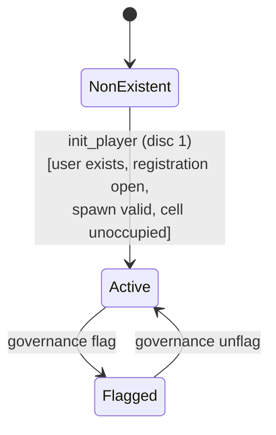
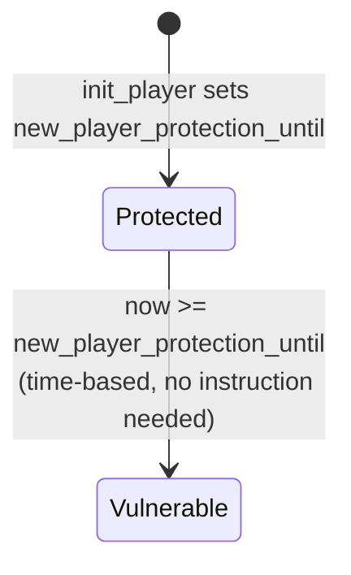
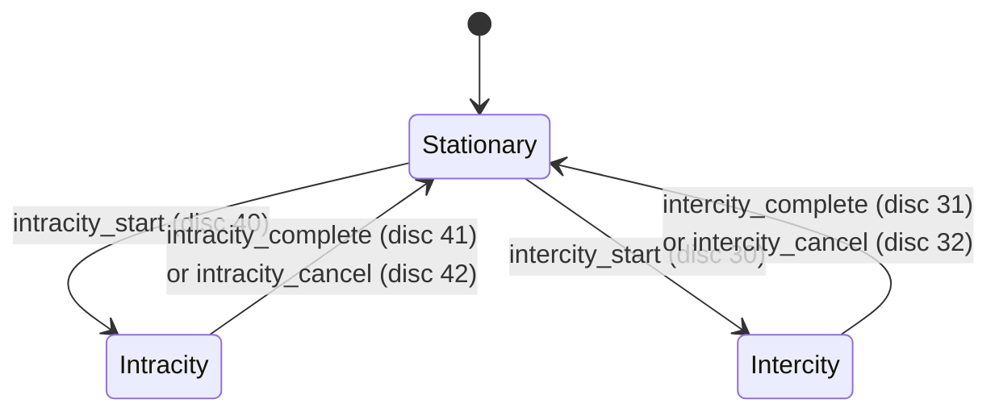
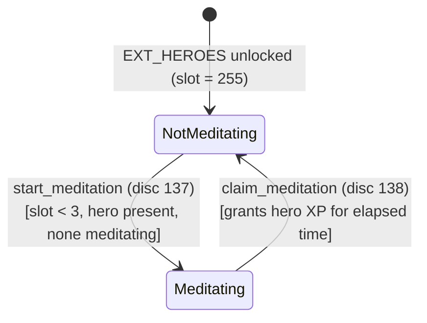

# Player State Machine

## Overview

`PlayerAccount` (type alias `PlayerCore`) is the central on-chain record for every kingdom citizen. It is a variable-length `#[repr(C)]` struct built on Pinocchio (`#![no_std]`), beginning with a fixed `PlayerCore` section and growing by appending extension sections on demand.

**PDA:** `[b"player", game_engine_pubkey, owner_pubkey]`

**Program ID:** `J4DxMg1RfwRzjpZ3N6D1ULNjuwLHuhe6qLNeX9rYNz3V`

**Instruction discriminants** are 2-byte u16 little-endian values in the first two bytes of every instruction.

[Source: state/player.rs](../../programs/novus_mundus/src/state/player.rs)

---

## 1. Account Lifecycle

### States

| State | Description |
|-------|-------------|
| `NonExistent` | No `PlayerAccount` for this (game_engine, owner) pair |
| `Active` | Account exists and all instructions are available |
| `Flagged` | `flagged_by_governance == true`; certain actions restricted |

### State Diagram



```
┌────────────────┐  init_player (1)  ┌────────────────┐
│                │ ────────────────> │                │
│  NonExistent   │                   │     Active     │
│                │                   │                │
└────────────────┘                   └───────┬────────┘
                                             │
                                             │ governance flag
                                             ▼
                                     ┌────────────────┐
                                     │    Flagged     │
                                     │  (bool=true)   │
                                     └───────┬────────┘
                                             │ governance unflag
                                             ▼
                                     ┌────────────────┐
                                     │     Active     │
                                     └────────────────┘
```

### Transitions

#### `NonExistent` → `Active`
```
Trigger:  init_player (discriminant 1)
Guards:
  - UserAccount PDA must already exist (GameError::UserAccountNotCreated otherwise)
  - Kingdom registration must be open
  - max_players limit not exceeded (0 = unlimited)
  - Spawn coordinates within city radius
  - Spawn cell terrain is passable
  - Spawn location cell is unoccupied
Actions:
  - Create PlayerAccount PDA: [b"player", game_engine, owner]
  - Initialize via PlayerCore::init_with_city — starter resources:
      locked_novi            = 1,000,000
      defensive_unit_1/2/3   = 10,000 / 4,000 / 2,000
      operative_unit_1/2/3   = 10,000 / 4,000 / 1,000
      melee_weapons          = 8,000
      ranged_weapons         = 4,000
      siege_weapons          = 2,000
      armor_pieces           = 8,000
      produce                = 50,000
      vehicles               = 500
      cash_on_hand           = 130,000,000
      gems                   = 10,000
      level                  = 1
      encounter_stamina      = 100
  - Mint 1,000,000 NOVI tokens to player ATA
  - Set new_player_protection_until = now + gameplay_config.new_player_protection_duration
  - Increment game_engine.total_players
  - Emit PlayerJoinedKingdom
```

---

## 2. Extension System

### States (Per Extension)

| State | Description |
|-------|-------------|
| `Locked` | Extension bit is 0; section memory does not exist |
| `Unlocked` | Extension bit is 1; section memory is initialized and accessible |

### Extension Flags (from `state/player.rs`)

```rust
pub const EXT_RESEARCH: u32   = 1 << 0;  // 0x01
pub const EXT_HEROES: u32     = 1 << 1;  // 0x02
pub const EXT_INVENTORY: u32  = 1 << 2;  // 0x04
pub const EXT_RALLY: u32      = 1 << 3;  // 0x08
pub const EXT_TEAM: u32       = 1 << 4;  // 0x10
pub const EXT_COSMETICS: u32  = 1 << 5;  // 0x20
pub const EXT_COURT: u32      = 1 << 6;  // 0x40
```

### Unlock Chain and Account Growth

Sections are allocated in this fixed order. Each unlock requires the prior one:

```mermaid
stateDiagram-v2
    [*] --> "CORE 528B"
    "CORE 528B" --> "RESEARCH 576B" : create_progress (disc 121)
    "RESEARCH 576B" --> "INVENTORY 720B" : unlock_extension_if_eligible<br/>[prereq: EXT_RESEARCH]
    "INVENTORY 720B" --> "TEAM 832B" : unlock_extension_if_eligible<br/>[prereq: EXT_INVENTORY]
    "TEAM 832B" --> "RALLY 912B" : unlock_extension_if_eligible<br/>[prereq: EXT_TEAM]
    "RALLY 912B" --> "HEROES 1080B" : unlock_extension_if_eligible<br/>[prereq: EXT_RALLY]
    "HEROES 1080B" --> "COSMETICS 1160B" : unlock_extension_if_eligible<br/>[prereq: EXT_HEROES]
    "COSMETICS 1160B" --> "COURT 1208B" : unlock_extension_if_eligible<br/>[prereq: EXT_COSMETICS]
```

```
PlayerCore (528B, always present)
  └─ RESEARCH  (+48B)  — prereq: none           → total 576B
       └─ INVENTORY (+144B) — prereq: EXT_RESEARCH  → total 720B
            └─ TEAM     (+112B) — prereq: EXT_INVENTORY → total 832B
                 └─ RALLY    (+80B)  — prereq: EXT_TEAM     → total 912B
                      └─ HEROES   (+168B) — prereq: EXT_RALLY    → total 1,080B
                           └─ COSMETICS (+80B) — prereq: EXT_HEROES  → total 1,160B
                                └─ COURT    (+48B)  — prereq: EXT_COSMETICS → total 1,208B (MAX_SIZE)
```

### Transition: `Locked` → `Unlocked`
```
Trigger:  unlock_extension_if_eligible (called inside various instructions)
Guards:
  - prerequisite_for_extension(ext) is already set in player.extensions
  - extension bit is not already set
Actions:
  - new_size = size_for_extensions(player.extensions | ext)
  - Transfer additional rent lamports from payer
  - account.resize(new_size)
  - Zero-initialize section bytes via write_section_init
  - player.extensions |= ext
```

---

## 3. Subscription State

### States

| State | Description |
|-------|-------------|
| `Free` | `subscription_tier == 0` OR `subscription_end <= now` |
| `Active(tier)` | `subscription_tier ∈ {1,2,3}` AND `subscription_end > now` |
| `Expired` | `subscription_tier > 0` AND `subscription_end <= now` |

`get_effective_tier(now)` returns `subscription_tier.min(3)` if active, or `0` otherwise.

### State Diagram

```mermaid
stateDiagram-v2
    [*] --> Free
    Free --> "Active(1-3)" : purchase_subscription (disc 100)
    "Active(1-3)" --> Expired : now >= subscription_end
    Expired --> "Active(1-3)" : purchase_subscription (renew)
    Expired --> Free : downgrade_expired (disc 102)
```

```
┌──────────┐  purchase_subscription (100)  ┌────────────────┐
│  Free    │ ─────────────────────────────> │  Active(1-3)  │
│ (tier=0) │                                │               │
└──────────┘                                └───────┬───────┘
     ▲                                              │
     │                                              │ now >= subscription_end
     │ downgrade_expired (102)                      ▼
     │                                      ┌───────────────┐
     └──────────────────────────────────────│   Expired     │
                                            └───────┬───────┘
                                                    │ purchase (renew)
                                                    ▼
                                            ┌───────────────┐
                                            │  Active(1-3)  │
                                            └───────────────┘
```

#### `Free` → `Active`
```
Trigger:  purchase_subscription (discriminant 100)
Actions:
  - player.subscription_tier = tier (1–3)
  - player.subscription_end  = now + duration
  - update_max_stamina_for_tier(player)
  - Emit SubscriptionPurchased
```

#### `Expired` → `Free`
```
Trigger:  downgrade_expired (discriminant 102)
Actions:
  - player.subscription_tier = 0
  - update_max_stamina_for_tier(player)  // cap stamina to tier-0 max (100)
  - Emit SubscriptionExpired
```

---

## 4. New-Player Protection

`new_player_protection_until` is a Unix timestamp. The program checks this field before allowing PvP attacks on the player. No explicit state change instruction exists — the transition is purely time-based.



```
┌───────────┐  now >= new_player_protection_until  ┌─────────────┐
│ Protected │ ────────────────────────────────────> │ Vulnerable  │
└───────────┘                                       └─────────────┘
```

---

## 5. Travel State

`travel_type: u8` encodes the current travel mode:

| Value | State | Description |
|-------|-------|-------------|
| 0 | `Stationary` | Not traveling; `arrival_time == -1` |
| 1 | `Intracity` | Moving within the same city |
| 2 | `Intercity` | Moving between cities |



```
                    ┌──────────────────────────────────┐
                    │                                  │
                    ▼                                  │
┌────────────┐  intracity_start (40)  ┌─────────────┐ │
│ Stationary │ ─────────────────────> │  Intracity  │ │
│            │ <───────────────────── │ (type=1)    │ │
└────┬───────┘  intracity_complete/   └─────────────┘ │
     │          cancel (41/42)                        │
     │                                                │
     │ intercity_start (30)                           │
     ▼                                                │
┌────────────┐  intercity_complete/cancel (31/32)     │
│ Intercity  │ ──────────────────────────────────────┘
│ (type=2)   │
└────────────┘
```

See [travel.md](./travel.md) for full travel state machine.

---

## 6. Meditation State

Tracked via `HeroesSection` fields (requires `EXT_HEROES`):

| Field | Idle | Meditating |
|-------|------|-----------|
| `meditating_hero_slot` | 255 | 0–2 |
| `meditation_started_at` | 0 | Unix timestamp |



```
┌───────────────┐  start_meditation (137)  ┌─────────────────┐
│ NotMeditating │ ────────────────────────> │   Meditating    │
│ (slot = 255)  │ <──────────────────────── │ (slot = 0–2)    │
└───────────────┘  claim_meditation (138)   └─────────────────┘
```

#### `NotMeditating` → `Meditating`
```
Trigger:  start_meditation (discriminant 137)
Guards:
  - EXT_HEROES unlocked
  - hero_slot < 3
  - active_heroes[slot] != NULL_PUBKEY
  - No hero currently meditating
Actions:
  - heroes.meditating_hero_slot = slot
  - heroes.meditation_started_at = now
```

#### `Meditating` → `NotMeditating`
```
Trigger:  claim_meditation (discriminant 138)
Actions:
  - elapsed = min(now - meditation_started_at, max_duration_seconds)
  - Grant hero XP proportional to elapsed
  - heroes.meditating_hero_slot = 255
  - heroes.meditation_started_at = 0
```

---

## 7. Level Progression

Level is stored in `PlayerCore.level: u8` (range 1–255). XP formula (from `logic/progression.rs`):

```
xp_required_for_level(1) = 0
xp_required_for_level(2) = 100
xp_required_for_level(N) = 100 × 2.5^(N − 2)   for N ≥ 2
```

Level-up is handled inside `grant_xp` — the loop continues until `current_xp < xp_required_for_next`, potentially gaining multiple levels in a single call.

```mermaid
stateDiagram-v2
    [*] --> "Level 1"
    "Level 1" --> "Level N+1" : any XP-granting action<br/>[current_xp >= xp_required]
    "Level N+1" --> "Level N+2" : any XP-granting action<br/>[current_xp >= xp_required]
    note right of "Level N+1"
        update_max_stamina_for_tier called on each level-up
    end note
```

```
┌──────────┐  any XP-granting action  ┌──────────┐
│ Level N  │ ────────────────────────> │ Level N+1│
└──────────┘  current_xp ≥ required    └──────────┘
```

**Level-up side effect:** `update_max_stamina_for_tier(player)` is called to update stamina cap.

XP sources:

| Source | Amount |
|--------|--------|
| Defeat player at level L | `50 + L × 10` |
| Defeat Common encounter | 10 |
| Defeat Uncommon encounter | 25 |
| Defeat Rare encounter | 50 |
| Defeat Epic encounter | 100 |
| Defeat Legendary encounter | 250 |
| Defeat World Event encounter | 500 |
| Complete travel (distance D km) | `D` |
| Collect resources (amount A) | `A / 1000` |
| Daily reward XP | `gameplay_config.daily_xp_base × tier_multiplier × research_bonus` |

Time-of-day XP multipliers (`grant_xp_with_time_bonus`): DeepNight = √φ ≈ 1.272×; Evening = √φ ≈ 1.272×; all other periods (Dawn, Dusk, Morning, Midday, Afternoon) = 1.0× (no bonus).

---

## Account Structure

```rust
// CORE — always present, 528 bytes
#[repr(C)]
pub struct PlayerCore {
    // Identity (80 bytes)
    pub account_key: u8,           // discriminator = AccountKey::Player
    pub game_engine: Address,      // 32 — kingdom PDA
    pub owner: Address,            // 32 — wallet pubkey
    pub bump: u8,
    pub version: u8,
    pub _pad1: [u8; 5],
    pub created_at: i64,

    // Name (56 bytes)
    pub name: [u8; 48],
    pub name_len: u8,
    pub _pad_name: [u8; 7],

    // Extension bitmap (8 bytes)
    pub extensions: u32,
    pub _pad_ext: [u8; 4],

    // Locked NOVI (16 bytes)
    pub locked_novi: u64,
    pub last_updated_tokens_at: i64,

    // Units (48 bytes) — defensive and operative tiers 1–3
    pub defensive_unit_1/2/3: u64,
    pub operative_unit_1/2/3:  u64,

    // Equipment (48 bytes)
    pub melee_weapons: u64,
    pub ranged_weapons: u64,
    pub siege_weapons: u64,
    pub armor_pieces: u64,
    pub produce: u64,
    pub vehicles: u64,

    // Cash (16 bytes)
    pub cash_on_hand: u64,
    pub cash_in_vault: u64,

    // Happiness (8 bytes)
    pub happiness_defensive: f32,
    pub happiness_operative: f32,

    // Location (72 bytes)
    pub current_lat: f64, pub current_long: f64,
    pub traveling_to_lat: f64, pub traveling_to_long: f64,
    pub arrival_time: i64,          // -1 = not traveling
    pub current_city: u16,
    pub travel_type: u8,            // 0=none, 1=intracity, 2=intercity
    pub _pad_loc: [u8; 5],
    pub origin_city: u16,
    pub destination_city: u16,
    pub _pad_loc2: [u8; 4],
    pub departure_time: i64,
    pub travel_speed_locked: f32,
    pub _pad_loc3: [u8; 4],

    // Subscription (16 bytes)
    pub subscription_tier: u8,      // 0=Rookie, 1=Expert, 2=Epic, 3=Legendary
    pub _pad_sub: [u8; 7],
    pub subscription_end: i64,

    // Progression (32 bytes)
    pub level: u8,
    pub _pad_lvl: [u8; 7],
    pub current_xp: u64,
    pub reputation: u64,
    pub networth: u64,

    // Stamina (24 bytes)
    pub encounter_stamina: u64,
    pub max_encounter_stamina: u64,
    pub last_stamina_update: i64,

    // Event (8 bytes)
    pub current_event: u64,

    // Resources (16 bytes)
    pub gems: u64,
    pub fragments: u64,

    // Lifetime stats (56 bytes)
    pub total_attacks: u64,
    pub total_defenses: u64,
    pub total_attack_power: u64,
    pub total_encounter_attacks: u64,
    pub total_locked_novi_acquired: u64,
    pub total_sent: u64,
    pub total_received: u64,

    // Protection & flags (16 bytes)
    pub new_player_protection_until: i64,
    pub flagged_by_governance: bool,
    pub _pad_end: [u8; 7],

    // Loot counter (8 bytes)
    pub loot_counter: u64,
}
// CORE_SIZE = 528 bytes (compile-time verified)

// RESEARCH section — offset 528, size 48 bytes
pub struct ResearchSection {
    // Battle buffs (12 bytes, 6 × u16)
    pub attack_bps: u16,
    pub defense_bps: u16,
    pub crit_chance_bps: u16,
    pub crit_damage_bps: u16,
    pub loot_bonus_bps: u16,
    pub encounter_success_bps: u16,
    // Growth buffs (12 bytes, 6 × u16)
    pub synchrony_bonus_bps: u16,
    pub reputation_bonus_bps: u16,
    pub stamina_bonus_bps: u16,
    pub collection_bonus_bps: u16,
    pub loot_magnetism_bps: u16,
    pub daily_reward_bps: u16,
    // Unlock flags (8 bytes)
    pub has_daily_rewards: bool,    // gates claim_daily_reward (disc 90)
    pub has_mining: bool,           // gates mining expedition
    pub has_fishing: bool,          // gates fishing expedition
    pub has_fragment_drops: bool,
    pub has_gem_drops: bool,
    pub _reserved_flags: [u8; 3],
    // State (16 bytes)
    pub buff_version: u32,
    pub _pad_state: [u8; 4],
    pub last_daily_claim: i64,
}
// RESEARCH_SIZE = 48 bytes

// INVENTORY section — offset 576, size 144 bytes
// (consumable counts, crafting materials, shop state, transfer tracking)
// INVENTORY_SIZE = 144 bytes

// TEAM section — offset 720, size 112 bytes
// (team pubkey, slot_index, reinforcement unit/weapon aggregates, hero contribution bps)
// TEAM_SIZE = 112 bytes

// RALLY section — offset 832, size 80 bytes
// (PlayerRallyCaps + RallyStats lifetime counters)
// RALLY_SIZE = 80 bytes

// HEROES section — offset 912, size 168 bytes
// (active_heroes[3 × Pubkey], defensive/meditating slot, 18 hero buff bps fields,
//  slot_location_bonus[3], meditation_started_at)
// HEROES_SIZE = 168 bytes

// COSMETICS section — offset 1080, size 80 bytes
// (6 equipped IDs, 6 owned bitfields)
// COSMETICS_SIZE = 80 bytes

// COURT section — offset 1160, size 48 bytes
// (castle pubkey, position_type, court_attack/research_speed/defense/economy bps)
// COURT_SIZE = 48 bytes

// MAX_SIZE = 1208 bytes (all sections present)
```

> **Note:** The inline cumulative byte-offset comments inside `HeroesSection` in the source reach 160 bytes before the `_reserved: [u8; 4]` field, giving 160 bytes total by field count. However, `HEROES_SIZE = 168` is set in constants and verified at compile time by `const _: [(); HEROES_SIZE] = [(); core::mem::size_of::<HeroesSection>()]`. The compiler inserts 8 bytes of padding somewhere in the struct (likely after `_pad_bonus: [u8; 2]` to align the i64 `meditation_started_at`). The constant `168` is authoritative.

---

## Invariants

```
1. account.owner == program_id (IllegalOwner otherwise)
2. PlayerCore.account_key == AccountKey::Player
3. PDA: [b"player", player.game_engine, player.owner] matches bump
4. player.game_engine references a valid GameEngine
5. extensions bits unlock sequentially per prerequisite_for_extension chain
6. subscription_tier ∈ {0, 1, 2, 3}
7. level ∈ [1, 255]
8. travel_type ∈ {0, 1, 2}
9. meditating_hero_slot == 255  OR  meditating_hero_slot < 3
10. locked_novi == token account balance (enforced by mint_tokens / burn CPIs)
11. new_player_protection_until is a Unix timestamp; protection checked by comparison, no explicit clear
12. flagged_by_governance == false for normal gameplay instructions
13. encounter_stamina <= max_encounter_stamina
```
