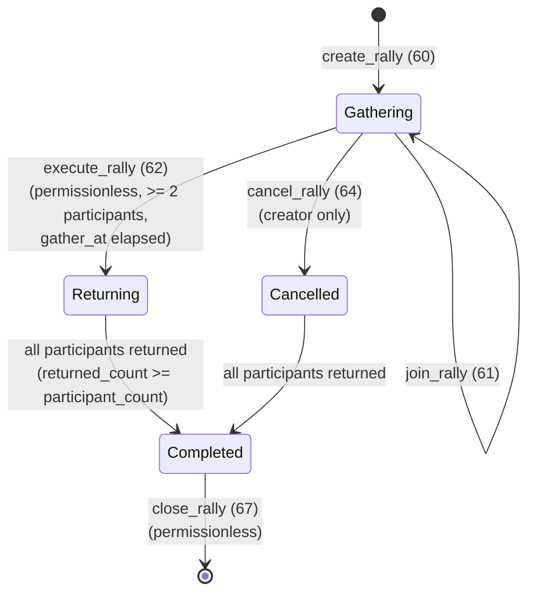

# Rally State Machine

## Overview

The Rally system coordinates team-based attacks on players, encounters, and castles. State is split across two account types: `RallyAccount` (the central record) and `RallyParticipant` (one per joiner). The `RallyParticipant` is created at join time and closed at `process_return`; the `RallyAccount` is closed at `close_rally`.

---

## 1. Rally Lifecycle

### States

| Value | Variant | Description |
|-------|---------|-------------|
| 0 | `Gathering` | Participants joining and traveling to rally point |
| 1 | `Marching` | Army marching to target (reserved for future two-phase march) |
| 2 | `Combat` | Combat being resolved (reserved; execute completes atomically) |
| 3 | `Returning` | Execute completed; each participant returning home |
| 4 | `Completed` | All participants returned; rally account closable |
| 5 | `Cancelled` | Creator cancelled during Gathering; participants returning |

### State Diagram



```
                    create_rally
 ┌─────────────┐ ──────────────> ┌───────────────┐
 │             │                 │               │
 │ NonExistent │                 │   Gathering   │ <── join_rally
 │             │                 │               │
 └─────────────┘                 └───────┬───────┘
                                         │
                     ┌───────────────────┼───────────────────┐
                     │                   │                   │
              cancel_rally        execute_rally         leave_rally
              (creator only)   (permissionless,       (participant)
                     │          gather_at elapsed,         │
                     │          ≥ 2 participants)          │
                     ▼                   │                   │
              ┌───────────┐             │                   ▼
              │           │             │          ┌────────────────┐
              │ Cancelled │             │          │ Participant    │
              │           │             │          │ returning      │
              └─────┬─────┘             │          │ (early leaver) │
                    │                   ▼          └────────────────┘
                    │          ┌─────────────┐
                    │          │  Returning  │
                    │          └──────┬──────┘
                    │                 │
                    │         all returned
                    │                 │
                    └────────┬────────┘
                             │
                             ▼
                      ┌───────────┐
                      │ Completed │
                      └─────┬─────┘
                             │ close_rally (permissionless)
                             ▼
                      ┌───────────┐
                      │  Closed   │
                      │ (account  │
                      │  gone)    │
                      └───────────┘
```

---

## 2. Gathering Phase Transitions

### `NonExistent` → `Gathering` (create_rally)

```
Trigger: create_rally (ID 60)
Guards:
  - EXT_TEAM extension present on creator
  - creator.team_address != NULL_PUBKEY (on a team)
  - team is not disbanded
  - Citadel building level >= 1 (from estate account)
  - total_units > 0
  - creator has sufficient units and weapons
  - creator not traveling (is_traveling_any() == false)
Actions:
  - Deduct units/weapons from creator.PlayerAccount
  - If hero_slot_index < 255: remove hero from slot, snapshot hero power
  - Snapshot leader buff fields from creator:
      leader_research_attack_bps, leader_research_crit_chance_bps,
      leader_research_crit_damage_bps, leader_hero_attack_bps,
      leader_hero_weapon_efficiency_bps, leader_hero_crit_chance_bps,
      leader_equipped_weapon_bonus_bps
  - Compute max_participants from tier + hero buff + Citadel bonus
  - Create RallyAccount [RALLY_SEED, game_engine, creator_wallet, rally_id LE]
  - Create leader's RallyParticipant [RALLY_PARTICIPANT_SEED, game_engine, creator_wallet, rally_id, creator_wallet]
  - status = Gathering
  - gather_at = execute_at = now + gather_duration (default 3600s if invalid)
  - Emit RallyCreated
```

### `Gathering` → `Gathering` (join_rally)

```
Trigger: join_rally (ID 61)
Guards:
  - status == Gathering
  - now < rally.gather_at (recruiting still open)
  - participant_count < max_participants
  - Caller != rally creator (already joined)
  - EXT_TEAM extension on caller
  - caller.team_address == rally.team (same team)
  - team is not disbanded
  - caller has sufficient units and weapons
  - caller not traveling
Actions:
  - Deduct units/weapons from caller.PlayerAccount
  - If hero: remove from slot, snapshot hero power
  - Snapshot caller's buff fields into RallyParticipant
  - Calculate travel time to rally_city (intracity walking or intercity theme speed)
  - Create RallyParticipant PDA
  - rally.participant_count += 1
  - rally.total_units/weapons updated
  - Emit RallyJoined
```

### `Gathering` → `Cancelled` (cancel_rally)

```
Trigger: cancel_rally (ID 64)
Guards:
  - status == Gathering
  - Caller == rally.creator (wallet match)
  - now < rally.gather_at
Actions:
  - status = Cancelled
  - Start creator's return journey (calculate intracity return duration)
  - creator.rally_stats.current_rallies_joined -= 1
  - Emit RallyCancelled
Note: Other participants must call process_return to get units back.
```

### Participant: `Gathering` → Early Return (leave_rally)

```
Trigger: leave_rally (ID 63)
Guards:
  - status == Gathering
  - Caller is a participant (RallyParticipant exists)
Actions:
  - Calculate return travel time (from current position to home)
  - participant.return_started_at = now
  - participant.included_in_march = false
  - Decrement rally.participant_count, total_units, total_weapons
  - Caller's rally_stats.current_rallies_joined -= 1
  - Emit RallyLeft
```

---

## 3. Execute Transition

### `Gathering` / `Marching` → `Returning` (execute_rally)

```
Trigger: execute_rally (ID 62) — permissionless
Guards:
  - status ∈ {Gathering, Marching}
  - participant_count >= MIN_RALLY_PARTICIPANTS (= 2)
  - now >= rally.execute_at
Actions:
  1. Aggregate: For each RallyParticipant where now >= arrives_at_rally:
       - Mark included_in_march = true
       - Add units/weapons to totals
       - contribution_power = units + melee + ranged + siege
  2. Compute contribution_bps[i] = contribution_power[i] × 10000 / total_contribution
  3. Apply Citadel damage bonus:
       total_damage = base_damage × (10000 + citadel_bonus_bps) / 10000
  4. Resolve combat based on target_type (0=PvP, 1=Encounter, 2=Castle)
  5. Distribute casualties proportionally by contribution:
       participant.casualties_k = casualties × (units_k / total_units) capped at committed
  6. Distribute loot: participant.loot_X = total_loot_X × contribution_bps / 10000
  7. Set return journey for each marcher:
       return_started_at = now
       return_duration = travel_duration (same as outbound)
  8. rally.status = Returning
  9. Emit RallyExecuted
```

---

## 4. Return Phase

### Participant: `Returning` → `Completed` (process_return)

`process_return` (ID 65) is **permissionless**. It handles three participant types:

| Participant Type | Condition | Units Returned | Weapons | Loot |
|-----------------|-----------|---------------|---------|------|
| Marcher | `included_in_march == true` | surviving = committed − casualties | melee+ranged survival-scaled; siege = 0 | proportional share (if won) |
| Early leaver | `included_in_march == false`, `return_started_at > 0` | 100% committed | 100% committed | none |
| Late joiner / cancelled | all others | 100% committed | 100% committed | none |

```
Trigger: process_return (ID 65)
Guards (marcher/early leaver):
  - status ∈ {Returning, Completed, Cancelled}
  - return_started_at > 0
  - now >= return_started_at + return_duration
Guards (late joiner / cancelled participant):
  - status == Gathering or Cancelled (late joiner starting return)
  - OR status ∈ {Returning, Completed, Cancelled}
Actions:
  - Return units/weapons/hero to participant.PlayerAccount
  - Casualties → estate Infirmary wounded pool (if Infirmary built)
  - Rally stats: current_rallies_joined -= 1
  - participant.returned = true
  - rally.returned_count += 1
  - If rally.status == Returning AND all returned → status = Completed
  - Close RallyParticipant (rent → participant wallet)
  - Emit RallyParticipantReturned
```

**Weapon return formula for marchers:**

```
survival_ratio_bps = total_surviving_units × 10000 / total_units_committed
melee_returned  = melee_committed  × survival_ratio_bps / 10000
ranged_returned = ranged_committed × survival_ratio_bps / 10000
siege_returned  = 0   // siege always consumed in execute
```

### `Returning` / `Cancelled` → `Completed`

```
Automatic: when returned_count >= participant_count in process_return
```

### `Completed` / `Cancelled` → `NonExistent` (close_rally)

```
Trigger: close_rally (ID 67) — permissionless
Guards:
  - status ∈ {Completed, Cancelled}
  - returned_count >= participant_count (all have processed returns)
  - Caller must pass creator's wallet as leader_owner (receives rent)
Actions:
  - Close RallyAccount (rent → rally.creator wallet)
  - Emit RallyClosed
```

---

## 5. Speedup

```
Trigger: speedup_rally (ID 66)
Guards:
  - Speedup type 0 (Gather): status == Gathering, participant not yet arrived
  - Speedup type 1 (March):  status == Marching, now < arrive_at
  - Speedup type 2 (Return): participant.return_started_at > 0, not yet returned
  - Payer has sufficient gems
Actions (tier 1 → 50% remains; tier 2 → 25% remains):
  gem_cost = ceil(remaining_seconds / 60) × gem_cost_per_minute × tier_multiplier
  Deduct gems from payer.PlayerAccount
  Adjust arrives_at_rally / arrive_at / return_duration accordingly
  Emit RallySpeedup
```

---

## Account Structure

### RallyAccount

```rust
pub struct RallyAccount {
    pub account_key: u8,
    pub game_engine: Address,
    pub id: u64,
    pub creator: Address,                   // creator's WALLET pubkey
    pub team: Address,
    pub rally_city: u16,
    pub target_city: u16,
    pub target_type: u8,                   // 0=player, 1=encounter, 2=castle
    pub _padding1: [u8; 3],
    pub target: Address,
    pub created_at: i64,
    pub gather_at: i64,
    pub execute_at: i64,                   // == gather_at (legacy compatibility)
    pub march_started_at: i64,
    pub arrive_at: i64,
    pub march_duration: i32,
    pub _padding2: [u8; 4],
    // Leader buff snapshots (7 × u16):
    pub leader_research_attack_bps: u16,
    pub leader_research_crit_chance_bps: u16,
    pub leader_research_crit_damage_bps: u16,
    pub leader_hero_attack_bps: u16,
    pub leader_hero_weapon_efficiency_bps: u16,
    pub leader_hero_crit_chance_bps: u16,
    pub leader_equipped_weapon_bonus_bps: u16,
    pub _padding3: [u8; 2],
    pub min_participants: u8,
    pub max_participants: u8,
    pub participant_count: u8,
    pub arrived_count: u8,
    pub marched_count: u8,
    pub returned_count: u8,
    pub _padding4: [u8; 2],
    pub total_units: u64,
    pub total_melee_weapons: u64,
    pub total_ranged_weapons: u64,
    pub total_siege_weapons: u64,
    pub total_power: u64,
    pub total_casualties: u64,
    pub attack_damage_dealt: u64,
    pub defense_damage_received: u64,
    pub total_loot_cash: u64,
    pub total_loot_locked_novi: u64,
    pub total_loot_melee: u64,
    pub total_loot_ranged: u64,
    pub total_loot_siege: u64,
    pub total_loot_produce: u64,
    pub total_loot_vehicles: u64,
    pub total_loot_fragments: u64,
    pub total_loot_gems: u64,
    pub status: u8,                        // RallyStatus as u8
    pub fallback_triggered: bool,
    pub attacker_won: bool,
    pub bump: u8,
    pub _padding5: [u8; 4],
}
```

**PDA seeds:** `[b"rally", game_engine, creator_wallet, rally_id:u64 LE]`

### RallyParticipant

```rust
pub struct RallyParticipant {
    pub account_key: u8,
    pub rally_id: u64,
    pub rally_creator: Address,            // creator's wallet (PDA seed)
    pub participant: Address,              // this participant's wallet
    pub home_city: u16,
    pub _padding1: [u8; 2],
    pub units_committed_1: u64,
    pub units_committed_2: u64,
    pub units_committed_3: u64,
    pub melee_weapons_committed: u64,
    pub ranged_weapons_committed: u64,
    pub siege_weapons_committed: u64,
    // Buff snapshots (7 × u16):
    pub research_attack_bps: u16,
    pub research_crit_chance_bps: u16,
    pub research_crit_damage_bps: u16,
    pub hero_attack_bps: u16,
    pub hero_weapon_efficiency_bps: u16,
    pub hero_crit_chance_bps: u16,
    pub equipped_weapon_bonus_bps: u16,
    pub _padding2: [u8; 2],
    pub hero: Address,
    pub hero_power_contribution: u64,
    pub travel_started_at: i64,
    pub arrives_at_rally: i64,
    pub travel_duration: i32,
    pub _padding3: [u8; 4],
    pub arrived_at_rally: bool,
    pub included_in_march: bool,
    pub returned: bool,
    pub is_leader: bool,
    pub _padding4: [u8; 4],
    pub casualties_1: u64,
    pub casualties_2: u64,
    pub casualties_3: u64,
    pub loot_cash: u64,
    pub loot_locked_novi: u64,
    pub loot_melee: u64,
    pub loot_ranged: u64,
    pub loot_siege: u64,
    pub loot_produce: u64,
    pub loot_vehicles: u64,
    pub loot_fragments: u64,
    pub loot_gems: u64,
    pub return_started_at: i64,
    pub return_duration: i32,
    pub _padding5: [u8; 4],
    pub contribution_power: u64,
    pub contribution_bps: u16,
    pub bump: u8,
    pub _padding6: [u8; 5],
}
```

**PDA seeds:** `[b"rally_participant", game_engine, rally_creator_wallet, rally_id:u64 LE, participant_wallet]`

---

## Invariants

```
1. rally.game_engine matches all participant players' game_engine (kingdom-scoped)
2. rally.creator stores the WALLET pubkey, not the player account PDA
3. MIN_RALLY_PARTICIPANTS = 2 enforced at execute_rally
4. DEFAULT_RALLY_RECRUITING_DURATION = 3600s (1 hour) used when gather_duration <= 0
5. execute_at == gather_at (set equal at create for current implementation)
6. Leader's participant PDA uses creator_wallet as both rally_creator and participant seed
7. Siege weapons committed are never returned (siege_returned = 0 in weapons_returned())
8. contribution_bps values must sum to ≈ 10000 across all included_in_march participants
9. returned_count increments only in process_return; Cancelled rallies do not auto-complete
10. close_rally requires returned_count >= participant_count AND status ∈ {Completed, Cancelled}
11. Citadel capacity bonus = 500 bps × citadel_level (5%/level)
12. Citadel damage bonus  = 50 bps × citadel_level (0.5%/level)
```
