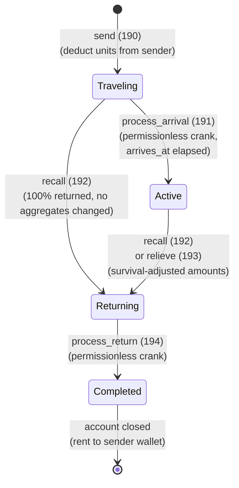

# Reinforcement State Machine

## Overview

The Reinforcement system tracks a bundle of defensive units, weapons, and an optional hero sent from one team member to another (or to a castle). A single `ReinforcementAccount` PDA captures the full lifecycle from send through return. The destination's `PlayerAccount` maintains aggregate totals that defense calculations read directly; individual senders retain proportional stakes for recovery.

---

## 1. Reinforcement Lifecycle

### States

| Value | Variant | Description |
|-------|---------|-------------|
| 0 | `Traveling` | Units en route to destination |
| 1 | `Active` | Units at destination, contributing to defense |
| 2 | `Returning` | Units traveling back to sender |
| 3 | `Completed` | Return complete, account closable |

### State Diagram



```
                 send (ID 190)
 ┌─────────────┐ ──────────────> ┌───────────────┐
 │             │                 │               │
 │ NonExistent │                 │   Traveling   │
 │             │                 │               │
 └─────────────┘                 └───────┬───────┘
                                         │
                  ┌──────────────────────┤
                  │                      │
           recall while                 process_arrival (191)
           Traveling                    (crank)
           (ID 192)                      │
                  │                      ▼
                  │               ┌──────────────┐
                  │               │              │
                  │               │    Active    │
                  │               │              │
                  │               └──────┬───────┘
                  │                      │
                  │        ┌─────────────┼──────────────┐
                  │        │             │              │
                  │      recall       relieve       (combat
                  │      (192)        (193)         happens
                  │        │             │          externally)
                  │        │             │
                  ▼        ▼             ▼
              ┌─────────────────────────────┐
              │          Returning          │
              └──────────────┬──────────────┘
                             │ process_return (194) crank
                             ▼
                      ┌───────────────┐
                      │   Completed   │
                      │ (account gone)│
                      └───────────────┘
```

---

## 2. State Transitions

### `NonExistent` → `Traveling` (send)

```
Trigger: send (ID 190)
Guards:
  - sender not traveling (is_traveling_any() == false)
  - total_units > 0
  - total_weapons <= total_units (weapon ratio constraint)
  - sender has sufficient units and weapons
  - sender and destination on same team (team not disbanded)
  - sender != destination (cannot reinforce self)
  - destination must have "Military Logistics" research
  - destination capacity: total_reinforcement_units + total_units <= MAX_REINFORCEMENT_RECEIVE × hero_multiplier
  - No existing ReinforcementAccount for (sender_wallet, destination_wallet) pair
Actions:
  - Deduct units/weapons from sender.PlayerAccount
  - If hero_slot < 3: clear hero from slot, read buff snapshots from NFT
  - Create ReinforcementAccount PDA
  - Calculate travel_duration (0 if same city, intercity otherwise)
  - arrives_at = now + travel_duration
  - status = Traveling
  - Emit ReinforcementSent
```

**PDA derivation:**
- Player target: `[b"reinforcement", game_engine, sender_wallet, destination_wallet]`
- Castle target:  `[b"garrison",      game_engine, sender_wallet, castle_pubkey]`

---

### `Traveling` → `Active` (process_arrival)

```
Trigger: process_arrival (ID 191) — permissionless
Guards:
  - status == Traveling
  - now >= arrives_at
  - destination_type == Player (castle garrison handled separately)
  - destination.owner == reinf.destination (account match)
Actions:
  - Increment destination.team_section aggregates:
      reinforcement_def_1   += units_def_1
      reinforcement_def_2   += units_def_2
      reinforcement_def_3   += units_def_3
      reinforcement_melee   += melee_weapons
      reinforcement_ranged  += ranged_weapons
      reinforcement_siege   += siege_weapons
      reinforcement_original_units   += total_units
      reinforcement_original_weapons += total_weapons
      reinforcement_source_count     += 1
  - Hero buffs (best-hero-wins, not sum):
      reinforcement_hero_defense_bps    = max(current, hero_defense_bps)
      reinforcement_hero_weapon_eff_bps = max(current, hero_weapon_eff_bps)
      reinforcement_hero_armor_eff_bps  = max(current, hero_armor_eff_bps)
  - status = Active
  - Emit ReinforcementArrived
```

---

### `Traveling` → `Returning` (recall while traveling)

```
Trigger: recall (ID 192)
Guards:
  - status == Traveling
  - &reinf.sender == sender_owner (signer)
Actions:
  - No aggregate changes (aggregates were never updated)
  - 100% of original amounts will be returned (fields unchanged)
  - Calculate return_duration (same as outbound but reversed direction)
  - status = Returning
  - return_started_at = now
  - relieved_by_destination = false
  - Emit ReinforcementRecalled
```

---

### `Active` → `Returning` (recall or relieve)

The survival ratio is computed and the `ReinforcementAccount` fields are updated **in place** at recall/relieve time. `process_return` reads these adjusted values.

#### Survival Ratio

```
unit_survival_bps   = reinforcement_current_total_units × 10000
                      / reinforcement_original_units
weapon_survival_bps = reinforcement_current_total_weapons × 10000
                      / reinforcement_original_weapons
```

#### Return Amount Calculation

```
return_def_1 = units_def_1 × unit_survival_bps / 10000
return_def_2 = units_def_2 × unit_survival_bps / 10000
return_def_3 = units_def_3 × unit_survival_bps / 10000
return_melee = melee_weapons × weapon_survival_bps / 10000
return_ranged = ranged_weapons × weapon_survival_bps / 10000
return_siege = siege_weapons × weapon_survival_bps / 10000
```

> **Note:** Unlike rally sieges (always consumed), **reinforcement siege weapons use survival scaling** — a surviving fraction of siege weapons returns to the sender.

#### Recall (ID 192, sender-initiated)

```
Trigger: recall
Guards:
  - status == Active
  - &reinf.sender == sender_owner (signer)
Actions:
  - Compute survival ratio from destination aggregates
  - Subtract survival-adjusted amounts from destination.team_section aggregates
  - Store wounded counts: wounded_def_k = units_def_k - return_def_k
  - Overwrite reinf.units_def_k with return_def_k
  - Overwrite reinf.melee/ranged/siege with return amounts
  - reinforcement_source_count -= 1
  - Calculate return_duration (dest city → sender city)
  - status = Returning; return_started_at = now; relieved_by_destination = false
  - Emit ReinforcementRecalled
```

#### Relieve (ID 193, destination-initiated)

```
Trigger: relieve
Guards:
  - status == Active
  - destination.owner == destination_owner (signer)
  - reinf.destination == dest.owner
Actions:
  - Same survival calculation and aggregate subtraction as recall
  - Overwrite reinf fields with return amounts (wounded stored in wounded_def_k)
  - Calculate return_duration (dest city → sender city)
  - status = Returning; return_started_at = now; relieved_by_destination = true
  - Emit ReinforcementRelieved
```

---

### `Returning` → `Completed` (process_return)

```
Trigger: process_return (ID 194) — permissionless
Guards:
  - status ∈ {Returning, Completed}
  - if Returning: now >= return_started_at + return_duration
  - &reinf.sender == sender_owner.address() (rent refund destination)
Actions:
  - sender.defensive_unit_1 += return_units_1
  - sender.defensive_unit_2 += return_units_2
  - sender.defensive_unit_3 += return_units_3
  - sender.melee_weapons    += return_melee
  - sender.ranged_weapons   += return_ranged
  - sender.siege_weapons    += return_siege
  - If hero != NULL_PUBKEY:
      Place in first empty hero slot (buffs restored)
      If all slots occupied: hero stays unlocked but not slotted
  - If wounded > 0 AND Infirmary built:
      estate.wounded_def_k += wounded_def_k
  - Zero account data, transfer lamports to sender_owner (close account)
  - Emit ReinforcementReturned
```

---

## 3. Speedup

```
Trigger: speedup (ID 195)
Guards:
  - &reinf.sender == sender_owner (only sender can speed up)
  - status ∈ {Traveling, Returning}
  - Remaining time > 0
  - sender has sufficient gems
  - speedup_tier ∈ {1, 2}
Actions:
  gem_cost = ceil(remaining_seconds / 60) × gem_cost_per_minute × tier_multiplier
  Tier 1: 50% of time remains, 1× gem cost
  Tier 2: 25% of time remains, 2× gem cost
  Deduct gems from sender.PlayerAccount
  If Traveling:  adjust arrives_at and travel_duration
  If Returning:  adjust return_duration (elapsed + new_remaining)
  Emit ReinforcementSpeedup
```

Instruction data: single byte `speedup_tier:u8`.

---

## Account Structure

### ReinforcementAccount

Size computed at compile time via `core::mem::size_of::<ReinforcementAccount>()`.

```rust
pub struct ReinforcementAccount {
    pub account_key: u8,
    pub game_engine: Address,               // kingdom reference
    pub sender: Address,                    // sender's WALLET pubkey
    pub destination: Address,               // destination wallet (Player) or castle pubkey
    pub destination_type: u8,              // 0=Player, 1=Castle
    pub bump: u8,
    pub sender_city: u16,
    pub destination_city: u16,
    pub _padding_loc: [u8; 2],
    // Original amounts (overwritten to survival-adjusted on recall/relieve):
    pub units_def_1: u64,
    pub units_def_2: u64,
    pub units_def_3: u64,
    pub melee_weapons: u64,
    pub ranged_weapons: u64,
    pub siege_weapons: u64,
    pub hero: Address,                      // NULL_PUBKEY if no hero
    pub hero_defense_bps: u16,
    pub hero_weapon_eff_bps: u16,
    pub hero_armor_eff_bps: u16,
    pub _padding_hero: [u8; 2],
    pub sent_at: i64,
    pub travel_duration: i32,
    pub wounded_def_1: u32,                // casualties stored during recall/relieve
    pub arrives_at: i64,
    pub return_started_at: i64,
    pub return_duration: i32,
    pub wounded_def_2: u32,
    pub status: u8,                        // ReinforcementStatus as u8
    pub relieved_by_destination: bool,
    pub _padding_status: [u8; 2],
    pub wounded_def_3: u32,
    pub combats_participated: u64,
}
```

**Player PDA seeds:** `[b"reinforcement", game_engine, sender_wallet, destination_wallet]`

**Castle PDA seeds:** `[b"garrison", game_engine, sender_wallet, castle_pubkey]`

### Status Enum

```rust
pub enum ReinforcementStatus {
    Traveling  = 0,
    Active     = 1,
    Returning  = 2,
    Completed  = 3,
}
```

### Target Enum

```rust
pub enum ReinforcementTarget {
    Player = 0,
    Castle = 1,
}
```

---

## Invariants

```
1. game_engine field enforced at load time (kingdom-scoped)
2. sender stores the WALLET pubkey, not the player account PDA
3. Only one ReinforcementAccount per (sender_wallet, destination) pair
4. total_weapons <= total_units at send time (weapon ratio constraint)
5. MAX_REINFORCEMENT_RECEIVE = 10_000 base units; hero multiplier applies
6. On recall/relieve from Active state, reinf.units_def_k is overwritten
   with survival-adjusted return amounts — original amounts are irrecoverable
7. wounded_def_k = original_k - return_k (set during recall/relieve, not at process_return)
8. Hero buffs use best-hero-wins (MAX) aggregation, not summation
9. Siege weapon survival is proportional to unit_survival_bps (unlike rally siege = 0)
10. Same-city reinforcements have travel_duration = 0 (instant process_arrival eligible)
11. process_arrival and process_return are permissionless (anyone can crank)
12. Recall during Traveling: 100% of originals returned (aggregates never modified)
13. Recall/Relieve during Active: survival-adjusted amounts; source_count decremented
```
