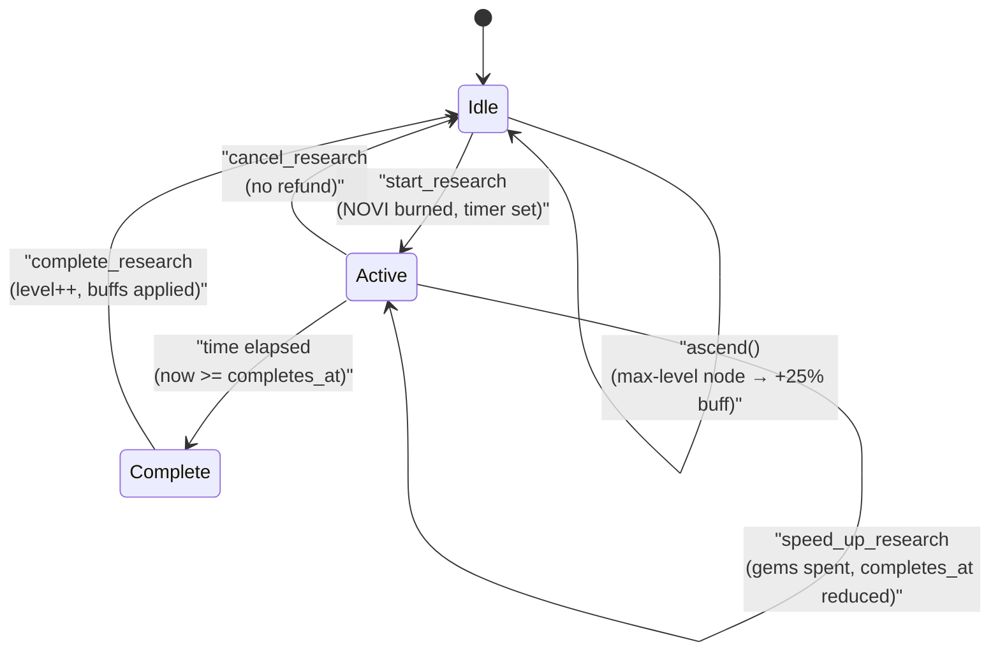
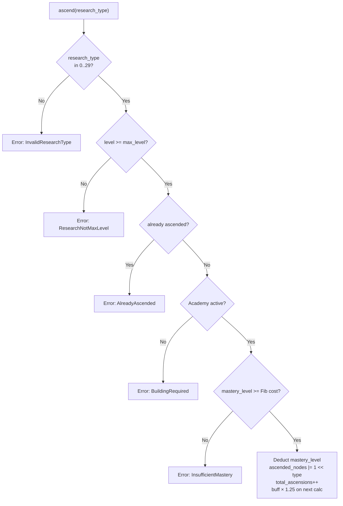

# Research State Machine

## Overview

The Research system drives tech-tree progression. Players spend NOVI to unlock permanent buffs and gameplay features across Battle, Economy, and Growth categories. One research can be active at a time. Ascension provides a +25% endgame prestige to maxed nodes.



---

## 1. Research Progress Lifecycle

### States

| State | Description |
|-------|-------------|
| `Idle` | No active research (`current_research == 255`) |
| `Active` | Research in progress, NOVI spent |
| `Complete` | `now >= completes_at`; ready to collect |

### State Diagram (ASCII reference)

```
┌──────────┐  start_research   ┌──────────┐
│          │ ────────────────> │          │
│   Idle   │                   │  Active  │
│          │ <──────────────── │          │
└──────────┘  cancel_research  └────┬─────┘
                                    │ time elapsed
                                    ▼
                              ┌──────────┐
                              │          │
                              │ Complete │
                              │          │
                              └────┬─────┘
                                   │ complete_research
                                   ▼
                              ┌──────────┐
                              │   Idle   │ (buffs applied, level incremented)
                              └──────────┘
```

### Transitions

#### `Idle` → `Active`
```
Trigger: start_research(research_type)
Guards:
  - player has EXT_RESEARCH extension
  - ResearchTemplate.is_active == true
  - Academy building ≥ required_academy_level_for_research(category)
    - Battle:  Academy Lv 1+
    - Economy: Academy Lv 2+
    - Growth:  Academy Lv 3+
  - progress.check_prerequisites(template) == true
    - prerequisite_research == 255  OR
    - completed_levels[prereq] >= prerequisite_level
  - completed_levels[research_type] < template.max_level
  - player.locked_novi >= novi_cost (after mastery discount)
Actions:
  - Burn NOVI from player token account
  - player.locked_novi -= novi_cost
  - progress.current_research = research_type
  - progress.current_level = next_level
  - progress.started_at = now
  - progress.completes_at = now + research_time
    (adjusted for time-of-day, Academy speed, Academy mastery speed; min 60s)
  - progress.total_novi_spent += novi_cost
  - Emit ResearchStarted
```

#### `Active` → `Complete` (Automatic)
```
Trigger: Time passage
Guards:
  - now >= progress.completes_at
Actions:
  - Research becomes claimable (no state field change)
```

#### `Complete` → `Idle`
```
Trigger: complete_research (callable by anyone — gas-less)
Guards:
  - progress.is_researching() == true
  - template.research_type == progress.current_research
  - now >= progress.completes_at
Actions:
  - progress.completed_levels[research_type] = current_level
  - Apply buff to appropriate account (see Buff Application)
  - progress.current_research = 255
  - progress.current_level = 0
  - progress.started_at = 0
  - progress.completes_at = 0
  - progress.buff_cache_version++
  - player.research_buff_version++
  - Emit ResearchCompleted
```

#### `Active` → `Idle` (Cancel)
```
Trigger: cancel_research
Guards:
  - progress.is_researching() == true
  - template matches current research
Actions:
  - progress.current_research = 255
  - progress.current_level = 0
  - progress.started_at = 0
  - progress.completes_at = 0
  - NO REFUND (NOVI is burned permanently)
  - Emit ResearchCancelled
```

---

## 2. Speedup

```
Trigger: speed_up_research
Guards:
  - progress.is_researching() == true
  - template matches current research
  - player.gems >= gem_cost
Actions:
  - actual_speedup = speed_up_seconds (or all remaining if 0)
  - gem_cost = calculate_gem_cost(remaining_seconds, current_level)
  - player.gems -= gem_cost
  - progress.completes_at -= actual_speedup
  - progress.total_gems_spent += gem_cost
  - Emit ResearchSpeedup
```

### Gem Cost Tiers

| Level Range | Gems/Minute |
|-------------|-------------|
| 1–5 | 1 |
| 6–10 | 2 |
| 11–15 | 5 |
| 16–20 | 10 |
| 21–25 | 20 |

```
gem_cost = ceil(remaining_seconds / 60) × gems_per_minute
```

---

## 3. Ascension



```
Trigger: ascend(research_type)
Guards:
  - research_type in [0, 29]
  - progress.get_level(research_type) >= template.max_level
  - NOT already ascended: progress.is_ascended(research_type) == false
  - Academy building exists and is active
  - academy.mastery_level >= mastery_cost
    mastery_cost is Fibonacci-sequence based on total_ascensions:
      1st: 5, 2nd: 8, 3rd: 13, 4th: 21, 5th: 34, 6th: 55 ...
Actions:
  - academy.mastery_level -= mastery_cost
  - academy.mastery_xp = 0
  - progress.ascended_nodes |= (1 << research_type)
  - progress.total_ascensions++
  - progress.buff_cache_version++
  - Emit ResearchAscended
```

> **Note:** Only the target node needs to be at max level. Prerequisites do **not** need to be maxed. The on-chain code at [`ascend.rs`](../../programs/novus_mundus/src/processor/research/ascend.rs) checks only `progress.can_ascend(research_type, template.max_level)`.

### Ascension Buff

```
ascended_buff = base_buff × 1.25   (2500 bps bonus on top of base)
```

---

## 4. Buff Application

Battle buffs are applied directly to `PlayerAccount` for fast combat resolution. Economy and some Growth buffs are stored on `ResearchProgress`.

| buff_type | Storage | Field |
|-----------|---------|-------|
| 0 AttackPower | PlayerAccount | `research_attack_bps` |
| 1 DefensePower | PlayerAccount | `research_defense_bps` |
| 2 UnitCapacity | (runtime) | Handled in unit hiring |
| 3 CriticalHitChance | PlayerAccount | `research_crit_chance_bps` |
| 4 CriticalHitDamage | PlayerAccount | `research_crit_damage_bps` |
| 5 RallyCapacity | (runtime) | Handled in rally creation |
| 6 EncounterSuccess | PlayerAccount | `research_encounter_success_bps` |
| 7 LootBonus | PlayerAccount | `research_loot_bonus_bps` |
| 8 UnitTrainingSpeed | (runtime) | Handled in unit hiring |
| 9 AmbushDamage | (runtime) | Handled in combat |
| 10 ProductionEfficiency | ResearchProgress | `production_efficiency_bps` |
| 11 ResourceCapacity | ResearchProgress | `resource_capacity_bps` |
| 12 MarketTaxReduction | ResearchProgress | `market_tax_reduction_bps` |
| 13 TradeSpeed | ResearchProgress | `trade_speed_bps` |
| 14 MiningOutput | ResearchProgress | `mining_output_bps` |
| 15 CashGeneration | ResearchProgress | `cash_generation_bps` |
| 16 ConstructionSpeed | ResearchProgress | `construction_speed_bps` |
| 17 UpkeepReduction | ResearchProgress | `upkeep_reduction_bps` |
| 18 BlackMarketAccess | ResearchProgress | `black_market_level` |
| 19 TaxCollection | ResearchProgress | `tax_collection_bps` |
| 20 DailyRewardsSystem | PlayerAccount | sets `has_daily_rewards` flag at Lv 1 |
| 21 MiningOperations | PlayerAccount | sets `has_mining` flag at Lv 1 |
| 22 FishingIndustry | PlayerAccount | sets `has_fishing` flag at Lv 1 + `fishing_efficiency_bps` |
| 23 LootMagnetism | PlayerAccount | `research_loot_magnetism_bps` |
| 24 ReputationMastery | PlayerAccount | `research_reputation_bonus_bps` |
| 25 StaminaVitality | PlayerAccount | `research_stamina_bonus_bps` |
| 26 SynchronyyStreak | PlayerAccount | `research_synchrony_bonus_bps` |
| 27 FragmentDiscovery | PlayerAccount | sets `has_fragment_drops` at Lv 1; `fragment_drop_rate_bps` |
| 28 GemProspecting | PlayerAccount | sets `has_gem_drops` at Lv 1; `gem_drop_rate_bps` |
| 29 CollectionMastery | PlayerAccount | `research_collection_bonus_bps` |
| 30 TravelSpeed | (runtime) | *(enum-only — not a tracked node; no template account)* |

Buff formula (at level N, with optional ascension):
```rust
base_buff = buff_per_level_bps × N
if ascended:
    total_buff = base_buff × (10000 + 2500) / 10000  // × 1.25
else:
    total_buff = base_buff
```

---

## 5. Account Structure

### ResearchTemplate

```rust
#[repr(C)]
pub struct ResearchTemplate {
    pub account_key: u8,              // AccountKey::ResearchTemplate = 17
    pub research_type: u8,            // 0-29
    pub category: u8,                 // 0=Battle, 1=Economy, 2=Growth
    pub max_level: u8,                // 5-25
    pub base_time_seconds: u32,       // base time for level 1
    pub base_novi_cost: u64,          // NOVI cost for level 1
    pub buff_type: u8,                // ResearchBuffType (0-30)
    pub buff_per_level_bps: u16,      // basis points per level
    pub prerequisite_research: u8,    // 255 = none
    pub prerequisite_level: u8,       // required level of prereq
    pub gem_cost_per_minute: u16,     // note: actual cost uses calculate_gem_cost()
    pub is_active: bool,
    pub _padding: [u8; 5],
}
// Seeds: ["research_template", research_type: u8]
// AccountKey = 17
```

### ResearchProgress

```rust
#[repr(C)]
pub struct ResearchProgress {
    pub account_key: u8,              // AccountKey::ResearchProgress = 18
    pub player: Address,              // 32 — owner wallet
    pub current_research: u8,         // 255 = idle
    pub current_level: u8,            // level being researched
    pub started_at: i64,
    pub completes_at: i64,
    pub completed_levels: [u8; 30],   // level per node (nodes 0-29)
    pub total_gems_spent: u64,
    pub total_novi_spent: u64,
    pub buff_cache_version: u32,

    // Economy buffs (indices 10-19)
    pub production_efficiency_bps: u16,
    pub resource_capacity_bps: u16,
    pub market_tax_reduction_bps: u16,
    pub trade_speed_bps: u16,
    pub mining_output_bps: u16,
    pub cash_generation_bps: u16,
    pub construction_speed_bps: u16,
    pub upkeep_reduction_bps: u16,
    pub black_market_level: u16,
    pub tax_collection_bps: u16,

    // Growth buffs stored here
    pub fishing_efficiency_bps: u16,
    pub fragment_drop_rate_bps: u16,
    pub gem_drop_rate_bps: u16,

    // Ascension
    pub ascended_nodes: u32,          // bitfield: bit N = node N ascended
    pub total_ascensions: u8,

    pub bump: u8,
    pub _padding: [u8; 1],
}
// Seeds: ["research", player_wallet]
// AccountKey = 18
```

[Source: state/research.rs](../../programs/novus_mundus/src/state/research.rs)

---

## 6. Cost Formulas

```
novi_cost(level) = base_novi_cost × (18/10)^level      // 1.8^level
time_seconds(level) = base_time_seconds × (3/2)^level  // 1.5^level
```

Both computed via `exp_growth(base, numerator, denominator, level)` to avoid overflow (no u128).

Academy speed bonus (applied after time-of-day):
```
total_speed_bps = (building_speed_bps + mastery_speed_bps).min(9000)
research_time = time_adjusted × (10000 - total_speed_bps) / 10000
research_time = max(research_time, 60)  // minimum 60 seconds
```

---

## 7. Invariants

```
1. At most one research active at a time (current_research == 255 when idle)
2. completed_levels[i] <= ResearchTemplate[i].max_level
3. research_type in [0, 29]
4. NOVI is burned on start — no refund on cancel
5. Ascension is irreversible (bit in ascended_nodes is never cleared)
6. ascended_nodes has at most 30 meaningful bits (nodes 0-29)
7. total_ascensions == popcount(ascended_nodes)
8. buff_cache_version increments monotonically on completion and ascension
```
