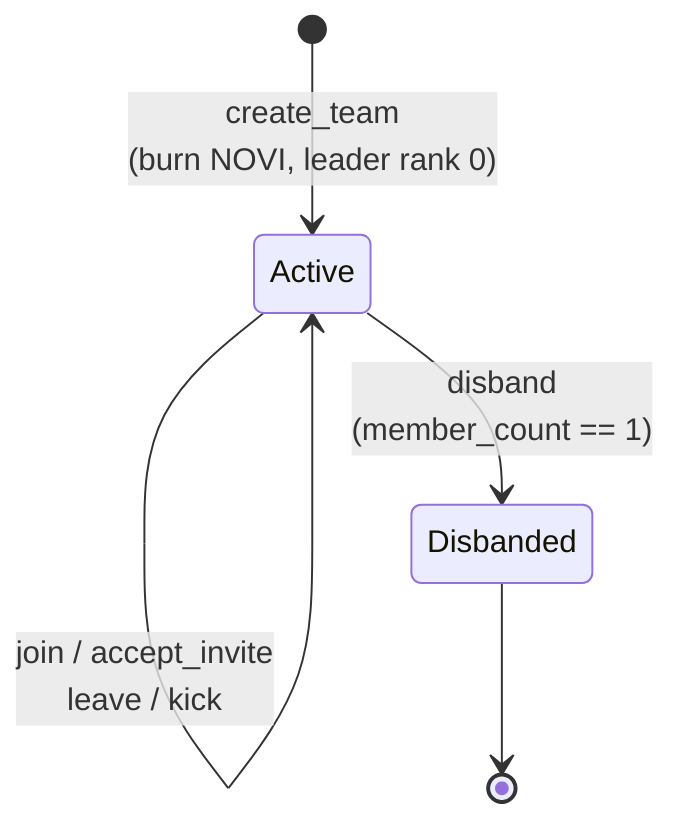
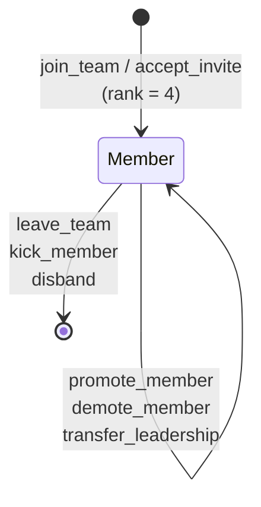
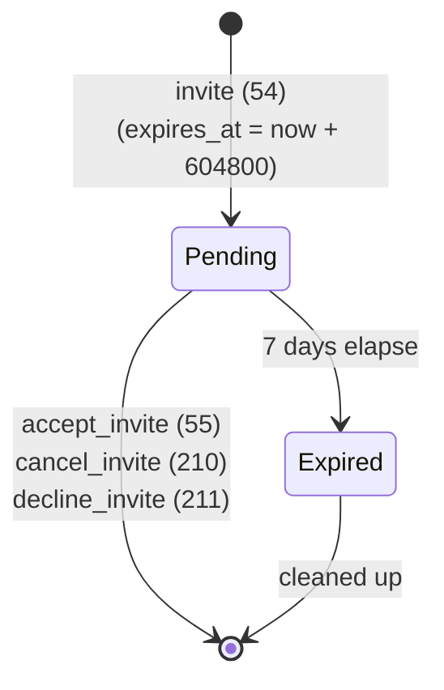
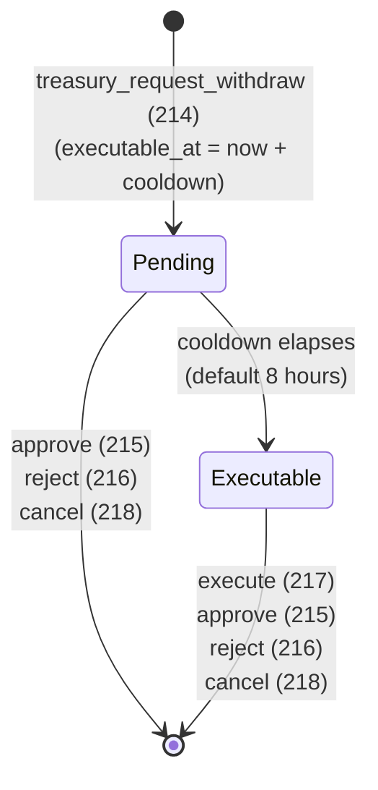

# Team State Machine

## Overview

The Team system manages kingdom-scoped guilds. Team state is distributed across three account types: `TeamAccount` (team metadata), `TeamMemberSlot` (per-member state), and `TeamInviteAccount` (pending invites). A fourth account, `TreasuryRequest`, models the multi-sig withdrawal flow.

There is no explicit `status` enum on `TeamAccount`. Team state is inferred from the `disbanded: bool` flag and the existence of member slot accounts.

---

## 1. Team Lifecycle

### States

| State | Condition |
|-------|-----------|
| `Active` | `disbanded == false`, `leader != NULL_PUBKEY` |
| `Disbanded` | `disbanded == true` |

### State Diagram



```
                  create_team
┌─────────────┐ ──────────────────> ┌─────────────┐
│             │                     │             │
│ NonExistent │                     │   Active    │ <─── join / accept_invite
│             │                     │             │ ──── leave / kick ────>
└─────────────┘                     └──────┬──────┘
                                           │
                                           │ disband
                                           │ (member_count == 1)
                                           ▼
                                    ┌─────────────┐
                                    │  Disbanded  │
                                    │             │
                                    └─────────────┘
```

### `NonExistent` → `Active`

```
Trigger: create_team
Guards:
  - EXT_INVENTORY extension present on player
  - player.team_address() == NULL_PUBKEY (not already in a team)
  - name length 3–32 bytes, valid UTF-8
  - team_id provided by client; PDA [TEAM_SEED, game_engine, team_id LE] must not exist
Actions:
  - Burn NOVI = team_creation_cost × cost_multiplier
  - Create TeamAccount (max_members=5, member_count=1, leader=player_pda)
  - Create TeamMemberSlot [TEAM_SLOT_SEED, team, slot_index=0] at rank=0
  - player.team_address = team_pda
  - player.team_slot_index = 0
  - Unlock EXT_TEAM extension if eligible
  - Emit TeamCreated
```

### `Active` → `Disbanded`

```
Trigger: disband (ID 58)
Guards:
  - Caller is the team leader (team.leader == caller_player_pda)
  - team.member_count == 1 (only the leader remains)
  - team.disbanded == false
Actions:
  - team.treasury → leader.cash_on_hand (all remaining funds)
  - team.treasury = 0
  - team.disbanded = true
  - team.member_count = 0
  - team.leader = NULL_PUBKEY
  - leader.team_address = NULL_PUBKEY
  - Emit TeamDisbanded
Note: Individual TeamMemberSlot accounts remain. Members discover
      the disbanded flag when they next interact and can clear their
      own team_address reference.
```

---

## 2. Membership Lifecycle

### States

| State | Condition |
|-------|-----------|
| `NonMember` | No `TeamMemberSlot` PDA for this player+team |
| `Member` | `TeamMemberSlot` exists, `rank` 0–4 |

### State Diagram



```
                   join / accept_invite
┌───────────┐ ──────────────────────> ┌──────────┐
│           │                         │          │
│ NonMember │                         │  Member  │
│           │ <────────────────────── │  (Rank   │
└───────────┘  leave / kick / disband │   0–4)   │
                                      └──────────┘
                                            │
                                     promote/demote
                                     transfer_leadership
                                            │
                                      ┌─────▼────┐
                                      │  Member  │
                                      │ (new rank)│
                                      └──────────┘
```

### `NonMember` → `Member` (via `join_team`, ID 51)

```
Trigger: join_team
Guards:
  - team.is_public() == true (SETTING_PUBLIC bit set)
  - team.is_disbanded() == false
  - player.team_address() == NULL_PUBKEY
  - team.member_count < team.max_members
  - slot_index < team.max_members
  - slot PDA must not exist (account empty)
  - player.level >= team.min_level_to_join
  - Same kingdom (player.game_engine == team.game_engine)
Actions:
  - Create TeamMemberSlot at rank=4 (lowest join rank)
  - team.member_count += 1
  - team.last_activity = now
  - player.team_address = team_pda
  - player.team_slot_index = slot_index
  - Emit TeamJoined
```

### `NonMember` → `Member` (via `accept_invite`, ID 55)

Same actions as `join_team` but requires a valid `TeamInviteAccount` PDA (not expired). The invite account is closed and rent returned.

### `Member` → `NonMember` (via `leave_team`, ID 52)

```
Trigger: leave_team
Guards:
  - Caller's slot.rank != 0 (leader cannot leave; must transfer leadership first)
  - team is not disbanded (or disbanded and player is clearing their reference)
Actions:
  - Close TeamMemberSlot (rent → member wallet)
  - team.member_count -= 1
  - player.team_address = NULL_PUBKEY
  - Emit TeamLeft
```

### `Member` → `NonMember` (via `kick_member`, ID 57)

```
Trigger: kick_member
Guards:
  - actor slot has PERM_KICK permission
  - actor_rank < target_rank (actor outranks target)
  - target is not the leader (rank 0 cannot be kicked)
Actions:
  - Close target's TeamMemberSlot (rent → target wallet or team wallet)
  - team.member_count -= 1
  - target.team_address = NULL_PUBKEY
  - Emit TeamMemberKicked
```

### Rank Transitions (`promote_member` / `demote_member`)

```
Trigger: promote_member (ID 220) or demote_member (ID 221)
Guards:
  - actor has PERM_PROMOTE
  - actor_rank < target_rank (outranks target)
  - For promote: target.rank > 1 (cannot promote to leader via this path)
Actions:
  - slot.rank -= 1 (promote) or slot.rank += 1 (demote)
  - Emit MemberPromoted / MemberDemoted
```

### `transfer_leadership` (ID 56)

```
Trigger: transfer_leadership
Guards:
  - Caller has rank == 0 (is the leader)
  - Target is an existing member (slot exists)
Actions:
  - target_slot.rank = 0
  - leader_slot.rank = 1
  - team.leader = target_player_pda
  - Emit LeadershipTransferred
```

---

## 3. Invite Lifecycle

### States

| State | Condition |
|-------|-----------|
| `NonExistent` | No `TeamInviteAccount` PDA for (team, invitee) |
| `Pending` | PDA exists, `now < expires_at` |
| `Expired` | PDA exists, `now >= expires_at` |

### State Diagram



```
                invite (ID 54)
┌────────────┐ ──────────────> ┌─────────┐
│            │                 │         │
│ NonExistent│                 │ Pending │
│            │ <────────────── │         │
└────────────┘ cancel (210)    └────┬────┘
                decline (211)       │
                accept  (55)        │ time passes
                                    ▼
                              ┌──────────┐
                              │ Expired  │
                              │ (can be  │
                              │ cleaned  │
                              │  up)     │
                              └──────────┘
```

### Transitions

#### `NonExistent` → `Pending`

```
Trigger: invite (ID 54)
Guards:
  - Caller has PERM_INVITE
  - Invitee is not already a member
  - Team has space (member_count < max_members)
  - No existing invite PDA for (team, invitee)
Actions:
  - Create TeamInviteAccount [TEAM_INVITE_SEED, team, invitee_player_pda]
  - expires_at = now + 604800 (7 days)
```

#### `Pending` → `NonExistent` (accepted)

```
Trigger: accept_invite (ID 55)
Guards:
  - invite.invitee == caller_player_pda
  - !invite.is_expired(now)
  - Team has space, player not already a member
Actions:
  - Close TeamInviteAccount (rent returned)
  - Create TeamMemberSlot at rank=4
  - team.member_count += 1
  - player.team_address = team_pda
```

#### `Pending` → `NonExistent` (declined / cancelled)

```
Trigger: decline_invite (ID 211) by invitee
         cancel_invite (ID 210) by inviter or leader with PERM_INVITE
Actions:
  - Close TeamInviteAccount (rent returned)
```

---

## 4. Treasury Request Lifecycle

### States

| State | Condition |
|-------|-----------|
| `NonExistent` | No `TreasuryRequest` PDA for (team, requester) |
| `Pending` | PDA exists, `now < executable_at` |
| `Executable` | PDA exists, `now >= executable_at` |

### State Diagram



```
                   treasury_request_withdraw (214)
┌────────────┐ ───────────────────────────────────> ┌──────────┐
│            │                                      │          │
│ NonExistent│                                      │ Pending  │
│            │ <──────────────────────────────────┐ │          │
└────────────┘   approve (215) / reject (216)     │ └──────┬───┘
                 cancel  (218) / execute (217)     │        │
                                                   │        │ cooldown elapses
                                                   │        ▼
                                                   │ ┌────────────┐
                                                   └─│ Executable │
                                                     └────────────┘
```

### Transitions

#### `NonExistent` → `Pending`

```
Trigger: treasury_request_withdraw (ID 214)
Guards:
  - rank has PERM_TREASURY
  - treasury.balance >= amount
  - No existing TreasuryRequest for this member
Actions:
  - Create TreasuryRequest PDA [TREASURY_REQUEST_SEED, team, requester_player_pda]
  - executable_at = now + (team.treasury_cooldown_hours × 3600)
```

#### `Pending` / `Executable` → `NonExistent`

```
Trigger: treasury_approve_request (ID 215)
Guards:  approver_rank < requester_rank (outranks), treasury has funds
Actions: Transfer amount to requester.cash_on_hand; close TreasuryRequest

Trigger: treasury_reject_request (ID 216)
Guards:  approver_rank < requester_rank
Actions: Close TreasuryRequest (no funds)

Trigger: treasury_execute_request (ID 217)
Guards:  caller == requester; now >= executable_at; treasury has funds
Actions: Transfer amount to requester.cash_on_hand; close TreasuryRequest

Trigger: treasury_cancel_request (ID 218)
Guards:  caller == requester
Actions: Close TreasuryRequest (no funds)
```

---

## Account Structure

### TeamAccount (280 bytes)

```rust
pub struct TeamAccount {
    pub account_key: u8,
    pub game_engine: Address,               // kingdom reference
    pub id: u64,
    pub leader: Address,                    // leader's PLAYER ACCOUNT pubkey
    pub bump: u8,
    pub disbanded: bool,
    pub _padding0: [u8; 6],
    pub name: [u8; 32],
    pub name_len: u8,
    pub _padding1: [u8; 7],
    pub member_count: u16,
    pub max_members: u16,
    pub _padding2: [u8; 4],
    pub created_at: i64,
    pub last_activity: i64,
    pub treasury: u64,
    pub settings: u8,
    pub min_level_to_join: u8,
    pub role_permissions: [u8; 5],         // index = rank 0..4
    pub _padding3: u8,
    pub motd: [u8; 32],
    pub motd_len: u8,
    pub _padding4: [u8; 7],
    pub treasury_instant_limit: [u64; 4],
    pub treasury_daily_cap: [u64; 4],
    pub treasury_cooldown_hours: u8,
    pub _treasury_reserved: [u8; 7],
}
// Compile-time assertion: size_of::<TeamAccount>() == 280
```

**PDA seeds:** `[b"team", game_engine, team_id:u64 LE]`

### TeamMemberSlot (104 bytes)

```rust
pub struct TeamMemberSlot {
    pub account_key: u8,
    pub team: Address,
    pub player: Address,                    // player ACCOUNT pubkey
    pub joined_at: i64,
    pub slot_index: u16,
    pub bump: u8,
    pub rank: u8,
    pub _reserved: [u8; 4],
    pub treasury_withdrawn_today: u64,
    pub last_treasury_day: u16,
    pub _treasury_padding: [u8; 6],
}
// Compile-time assertion: size_of::<TeamMemberSlot>() == 104
```

**PDA seeds:** `[b"team_slot", team_pubkey, slot_index:u16 LE]`

### TeamInviteAccount (136 bytes)

```rust
pub struct TeamInviteAccount {
    pub account_key: u8,
    pub team: Address,
    pub invitee: Address,
    pub bump: u8,
    pub _padding0: [u8; 7],
    pub inviter: Address,
    pub created_at: i64,
    pub expires_at: i64,
    pub _reserved: [u8; 8],
}
// Compile-time assertion: size_of::<TeamInviteAccount>() == 136
```

**PDA seeds:** `[b"team_invite", team_pubkey, invitee_player_pubkey]`

### TreasuryRequest (112 bytes)

```rust
pub struct TreasuryRequest {
    pub account_key: u8,
    pub team: Address,
    pub requester: Address,                 // requester's player account pubkey
    pub amount: u64,
    pub created_at: i64,
    pub executable_at: i64,
    pub bump: u8,
    pub _reserved: [u8; 15],
}
// Compile-time assertion: size_of::<TreasuryRequest>() == 112
```

**PDA seeds:** `[b"treasury_request", team_pubkey, requester_player_pubkey]`

---

## Invariants

```
1. team.game_engine matches all members' player.game_engine (kingdom-scoped)
2. team.leader stores a PLAYER ACCOUNT pubkey, not a wallet address
3. team.member_count == number of live TeamMemberSlot PDAs
4. Exactly one rank-0 slot exists while team is active
5. slot.player stores the player ACCOUNT pubkey, not the wallet
6. leader (rank 0) cannot be kicked; can only leave after transfer_leadership
7. disband requires member_count == 1 (leader must kick/wait for all members to leave)
8. Only one TreasuryRequest per member (team, requester) at any time
9. Invite expires_at = created_at + 604800 (7 days) — set at invite creation
10. treasury_instant_limit and treasury_daily_cap arrays are indexed [rank-1] for ranks 1–4
11. Rank 0 always has u64::MAX for both instant_limit and daily_cap (not in array)
12. treasury_cooldown_hours is clamped to [1, 72] in get_cooldown_seconds()
```
