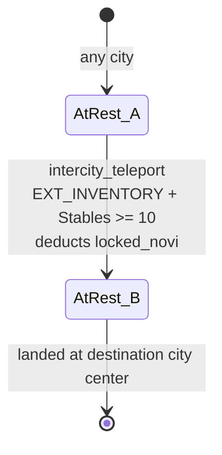
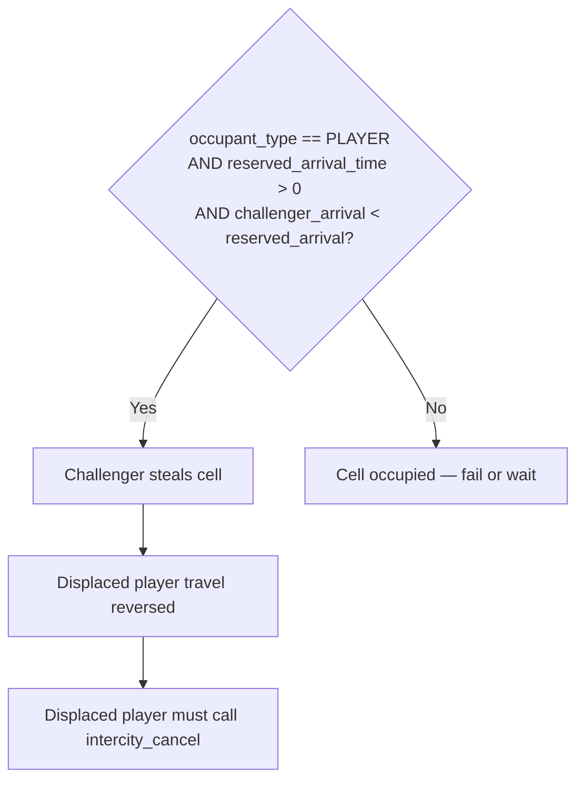

# Travel System State Machine

> Formal state transitions, account structures, invariants, and instruction dispatch for
> intercity and intracity travel subsystems.

---

## 1. Instruction Table

| Discriminant | Instruction | System |
|---|---|---|
| 30 | `intercity_start` | Intercity travel |
| 31 | `intercity_complete` | Intercity travel |
| 32 | `intercity_cancel` | Intercity travel |
| 33 | `intercity_teleport` | Intercity travel |
| 34 | `intercity_speedup` | Intercity travel |
| 40 | `intracity_start` | Intracity travel |
| 41 | `intracity_complete` | Intracity travel |
| 42 | `intracity_cancel` | Intracity travel |

[Source: programs/novus_mundus/src/lib.rs](../../programs/novus_mundus/src/lib.rs)

---

## 2. Intercity Travel State Machine

```mermaid
stateDiagram-v2
    [*] --> AtRest : player in city
    AtRest --> Traveling : intercity_start (30)<br/>reserve dest cell; vacate origin
    Traveling --> AtRest : intercity_complete (31)<br/>now >= arrival_time; city updated
    Traveling --> Returning : intercity_cancel (32)<br/>returns to origin city CENTER
    Returning --> AtRest : intercity_complete (31)
    AtRest --> AtRest : intercity_teleport (33)<br/>instant; deducts locked_novi
    Traveling --> Traveling : intercity_speedup (34)<br/>reduces arrival_time only
```



### 2.1 States (ASCII reference)

```
        ┌─────────────────────────────────────────────────────────┐
        │                 AT REST (City A)                        │
        │  player.travel_type == 0                                │
        │  player.arrival_time == 0                               │
        │  LocationAccount at current cell: occupied (player)     │
        └───────────────┬─────────────────────────────────────────┘
                        │  intercity_start (30)
                        ▼
        ┌─────────────────────────────────────────────────────────┐
        │                 TRAVELING                               │
        │  player.travel_type = intercity                         │
        │  player.current_city = origin_city (unchanged until     │
        │    complete)                                            │
        │  player.arrival_time set                                │
        │  player.traveling_to_lat/long = dest grid coords        │
        │  player.departure_time set                              │
        │  player.travel_speed_locked set                         │
        │  Destination LocationAccount: reserved (arrival_time)   │
        │  Origin LocationAccount: vacated (occupant = NULL)      │
        └──────┬──────────────────────────────────┬───────────────┘
               │                                  │
               │  intercity_cancel (32)            │  now >= arrival_time
               ▼                                  ▼
        ┌──────────────────────┐         ┌──────────────────────────┐
        │  CANCELED            │         │  intercity_complete (31) │
        │  Returns to origin   │         │  player.current_city =   │
        │  city CENTER         │         │    destination_city       │
        │  (not pre-departure  │         │  player.travel_type = 0   │
        │   position)          │         │  LocationAccount at dest  │
        │  Return travel time  │         │  marked occupied          │
        │  ∝ elapsed progress  │         │  Hero location synergy    │
        └──────────────────────┘         │  recalculated             │
                                         └──────────────────────────┘
```

### 2.2 `intercity_start` (discriminant 30)

**Trigger / Data layout:**

```
Instruction 30 (intercity_start)
  Data: [dest_city_id: u16 LE, dest_grid_lat: i32 LE, dest_grid_long: i32 LE]
        (10 bytes total)
```

**Guards:**

| Guard | Condition |
|---|---|
| Stables building level ≥ 1 | Required for intercity travel |
| Player not already traveling | `player.travel_type == 0` |
| Destination cell terrain passable | Grid cell can be occupied |
| Destination cell unoccupied (or stealable) | `LocationAccount` check |

**Actions:**

1. Compute base speed from `gameplay_config.theme_travel_speeds_kmh[kingdom_theme]`.
2. Apply subscription speed bonus: `effective_speed = base × (1 + travel_speed_bonus_bps / 10000)`.
3. Apply Stables level time reduction (time-of-day also applied at this layer).
4. Compute `arrival_time = now + travel_duration`.
5. **Reserve-first, vacate-second protocol:**
   - Create / update destination `LocationAccount`: set `occupant = player_pda`,
     `reserved_arrival_time = arrival_time`, `occupant_type = OCCUPANT_PLAYER`.
   - If destination is occupied by another traveler AND `arrival_time < reserved_arrival_time`:
     steal the cell (overwrite reservation); bumped player's travel fields are set to
     "reversed" so their `intercity_cancel` returns them to their origin.
   - Vacate origin `LocationAccount`: `occupant = NULL`, `reserved_arrival_time = 0`.
6. Write `player.traveling_to_lat`, `player.traveling_to_long` (grid-centered coords,
   used for cancel re-derivation).
7. Set `player.destination_city`, `player.origin_city`, `player.departure_time`,
   `player.travel_speed_locked`.

[Source: programs/novus_mundus/src/processor/travel/intercity_start.rs](../../programs/novus_mundus/src/processor/travel/intercity_start.rs)

### 2.3 `intercity_complete` (discriminant 31)

**Guards:**

| Guard | Condition |
|---|---|
| `now >= player.arrival_time` | Travel time has elapsed |
| Player is in intercity travel state | `player.travel_type == intercity` |

**Actions:**

1. Set `player.current_city = destination_city`.
2. Set `player.current_lat/long` to destination cell center.
3. Clear travel fields (`arrival_time = 0`, `travel_type = 0`).
4. Update `LocationAccount` at destination: clear `reserved_arrival_time`, keep `occupant`.
5. Recalculate hero location synergy buffs (home-city bonus may change).

### 2.4 `intercity_cancel` (discriminant 32)

**Key behavior:**

- Player returns to **origin city center** (not their pre-departure position).
- Return travel time is proportional to elapsed progress:
  ```
  elapsed    = now − departure_time
  total_time = arrival_time − departure_time
  remaining  = total_time − elapsed
  return_time = remaining   // symmetric proportional return
  ```
- The destination `LocationAccount` PDA is re-derived from
  `player.traveling_to_lat/long` (not city center coordinates).

**Actions:**

1. Re-derive destination `LocationAccount` from stored grid coords.
2. Vacate destination `LocationAccount` (clear occupant).
3. Reserve origin-city-center `LocationAccount` with `reserved_arrival_time = now + remaining`.
4. Update player travel fields to point back to origin city center.

[Source: programs/novus_mundus/src/processor/travel/intercity_cancel.rs](../../programs/novus_mundus/src/processor/travel/intercity_cancel.rs)

### 2.5 `intercity_teleport` (discriminant 33)



**Guards:**

| Guard | Condition |
|---|---|
| `player.extensions & EXT_INVENTORY != 0` | Inventory extension required |
| Estate Stables level ≥ 10 | High-tier Stables required |
| Sufficient locked NOVI | Cost deducted from `locked_novi` (NOT gems) |

**Cost formula:**

```
distance_km = haversine(origin, destination) / 1000.0
cost = (teleport_base_cost
        + teleport_cost_per_100km × ceil(distance_km / 100))
       × dao_cost_multiplier / 10000
```

Cost is deducted from `player.locked_novi`.  
Player lands at destination **city center** (not a specific cell).

> No time-based cooldown is enforced on teleport; the processor comment
> acknowledges this finding.

[Source: programs/novus_mundus/src/processor/travel/intercity_teleport.rs](../../programs/novus_mundus/src/processor/travel/intercity_teleport.rs)

### 2.6 `intercity_speedup` (discriminant 34)

**Behavior:**

Only two tiers exist:

| Tier | Remaining travel reduced to | Gem cost |
|---|---|---|
| T1 | 50 % of remaining | 1× base gem cost |
| T2 | 25 % of remaining | 2× base gem cost |

- Gem cost = `gem_cost_per_minute_speedup × minutes_remaining` (for each tier).
- Updates `player.arrival_time`.
- Does **NOT** update `LocationAccount.reserved_arrival_time`.

[Source: programs/novus_mundus/src/processor/travel/speedup.rs](../../programs/novus_mundus/src/processor/travel/speedup.rs)

---

## 3. Intracity Travel State Machine

```mermaid
stateDiagram-v2
    [*] --> AtRest : within city
    AtRest --> Walking : intracity_start (40)<br/>reserve dest cell; vacate origin
    Walking --> AtRest : intracity_complete (41)<br/>now >= arrival_time
    Walking --> AtRest : intracity_cancel (42)<br/>returns to origin position
    Walking --> Walking : speedup (34)<br/>reduces arrival_time
```



### 3.1 States (ASCII reference)

```
        ┌─────────────────────────────────────────────────────────┐
        │           AT REST (within city)                         │
        │  player.travel_type == 0                                │
        └───────────────┬─────────────────────────────────────────┘
                        │  intracity_start (40)
                        ▼
        ┌─────────────────────────────────────────────────────────┐
        │           WALKING                                       │
        │  player.travel_type = intracity                         │
        │  player.arrival_time set                                │
        │  player.traveling_to_lat/long = dest degrees (f64)      │
        │  Destination LocationAccount reserved                   │
        │  Origin LocationAccount vacated                         │
        └──────┬───────────────────────────────────┬──────────────┘
               │                                   │
               │  intracity_cancel (42)             │  now >= arrival_time
               ▼                                   ▼
        ┌──────────────────────┐        ┌───────────────────────────┐
        │  CANCELED            │        │  intracity_complete (41)  │
        │  Returns to origin   │        │  player.current_lat/long  │
        │  (within same city)  │        │    updated to dest         │
        └──────────────────────┘        │  travel_type = 0          │
                                        └───────────────────────────┘
```

### 3.2 `intracity_start` (discriminant 40)

**Trigger / Data layout:**

```
Instruction 40 (intracity_start)
  Data: [dest_lat: f64 LE, dest_long: f64 LE]   (16 bytes — full float degrees)
```

Note: Unlike intercity travel (which encodes i32 grid coordinates), intracity start
uses raw f64 degree coordinates.

**Speed source:**

```
speed = gameplay_config.intracity_travel_speed_kmh   // DAO-controlled (e.g. 5.0 km/h)
// NOT the compile-time constant INTRACITY_WALKING_SPEED_KMH
```

**Actions:**

1. Convert `dest_lat/long` (f64 degrees) to grid coordinates for `LocationAccount` PDA.
2. Check destination cell occupancy and terrain passability.
3. Compute `travel_duration = distance / speed`.
4. Reserve destination `LocationAccount`; vacate origin `LocationAccount`.
5. Set `player.arrival_time`, `player.traveling_to_lat/long`.

[Source: programs/novus_mundus/src/processor/travel/intracity_start.rs](../../programs/novus_mundus/src/processor/travel/intracity_start.rs)

---

## 4. LocationAccount Structure

```rust
pub struct LocationAccount {                       // 92 bytes fixed
    pub account_key:          u8,                 // AccountKey::Location
    pub game_engine:          Address,            // 32 — kingdom
    pub grid_lat:             i32,                // coordinate × 10000, rounded
    pub grid_long:            i32,                // coordinate × 10000, rounded
    pub city_id:              u16,
    pub bump:                 u8,
    pub occupant_type:        u8,                 // 0=none, 1=player, 2=encounter
    pub occupant:             Address,            // 32 — NULL if empty
    pub occupied_since:       i64,
    pub location_creator:     Address,            // 32 — receives rent refund on close
    pub reserved_arrival_time: i64,               // >0 while traveling, 0 when arrived
}

impl LocationAccount {
    pub const LEN: usize = 92;
    pub const GRID_PRECISION: f64 = 10000.0;      // 4 decimal places ≈ 11 m/cell
}
```

**PDA seeds:** `[LOCATION_SEED, game_engine, city_id_le2, grid_lat_le4, grid_long_le4]`

**Grid conversion:**

```
grid_coord = round(degrees × 10000)    // to_grid()
degrees    = grid_coord / 10000.0      // from_grid()
```

One grid cell ≈ 11 m × 11 m.  Only one entity may occupy a cell at a time.

[Source: programs/novus_mundus/src/state/location.rs](../../programs/novus_mundus/src/state/location.rs)

---

## 5. PlayerCore Travel Fields

The following fields in `PlayerCore` drive all travel state:

| Field | Type | Role |
|---|---|---|
| `current_lat` | f64 | Current position (degrees) |
| `current_long` | f64 | Current position (degrees) |
| `traveling_to_lat` | f64 | Destination grid-center lat (used for cancel PDA re-derivation) |
| `traveling_to_long` | f64 | Destination grid-center long |
| `arrival_time` | i64 | Unix timestamp of expected arrival |
| `current_city` | u16 | City player belongs to (updated only on complete) |
| `travel_type` | u8 | 0=idle, 1=intercity, 2=intracity |
| `origin_city` | u16 | City at departure (for cancel return) |
| `destination_city` | u16 | City being traveled to |
| `departure_time` | i64 | Unix timestamp when travel started |
| `travel_speed_locked` | f32 | Speed locked at departure (km/h) |

[Source: programs/novus_mundus/src/state/player.rs](../../programs/novus_mundus/src/state/player.rs)

---

## 6. Speed-Based Cell Stealing



When a new traveler targets a `LocationAccount` that is already reserved by an
in-flight traveler:

```
can_steal = occupant_type == OCCUPANT_PLAYER
            AND reserved_arrival_time > 0
            AND challenger_arrival_time < reserved_arrival_time
```

If `can_steal` is true:
- The new traveler overwrites the reservation.
- The displaced player's travel fields are set to the reversed state: their
  `intercity_cancel` will return them to their origin city.
- The displaced player must call `intercity_cancel` to finalize; there is no automatic
  reversal.

---

## 7. Distance Calculation

All distance checks use the Haversine formula implemented in `logic/location.rs`.
The function returns **kilometers × 1000** (i.e., meters as a floating-point km value):

```rust
// Returns km × 1000 (i.e., metres)
pub fn calculate_distance_meters(lat1: f64, lon1: f64, lat2: f64, lon2: f64) -> f64
```

This result is compared against the meter thresholds:
- PvE attack: `ENCOUNTER_ATTACK_RANGE_METERS = 10.0`
- PvP attack: `PVP_ATTACK_RANGE_METERS = 15.0`

[Source: programs/novus_mundus/src/logic/location.rs](../../programs/novus_mundus/src/logic/location.rs)

---

## 8. Invariants

| ID | Invariant |
|---|---|
| T-01 | Intercity travel requires Stables ≥ 1; teleport requires Stables ≥ 10. |
| T-02 | `intercity_cancel` always returns to **origin city center**, not the pre-departure cell. |
| T-03 | `intracity_start` encodes destination as f64 degrees (16 bytes); intercity encodes as i32 grid (10 bytes). |
| T-04 | `player.traveling_to_lat/long` stores the destination **grid-center** coords (converted from i32 grid), not the raw requested coords. These are used by `intercity_cancel` to re-derive the destination `LocationAccount` PDA. |
| T-05 | Teleport cost is deducted from `locked_novi` (NOT gems). |
| T-06 | Speedup does NOT update `LocationAccount.reserved_arrival_time`; only `player.arrival_time` changes. |
| T-07 | One `LocationAccount` per grid cell; only one entity (player or encounter) occupies a cell at a time. |
| T-08 | Speed-based stealing is only possible against a **traveling player**, never against a stationary player or an encounter. |
| T-09 | Intracity speed comes from `gameplay_config.intracity_travel_speed_kmh` (runtime config), not from the compile-time constant `INTRACITY_WALKING_SPEED_KMH`. |
| T-10 | There is no time-based cooldown on `intercity_teleport` (audit finding). |
